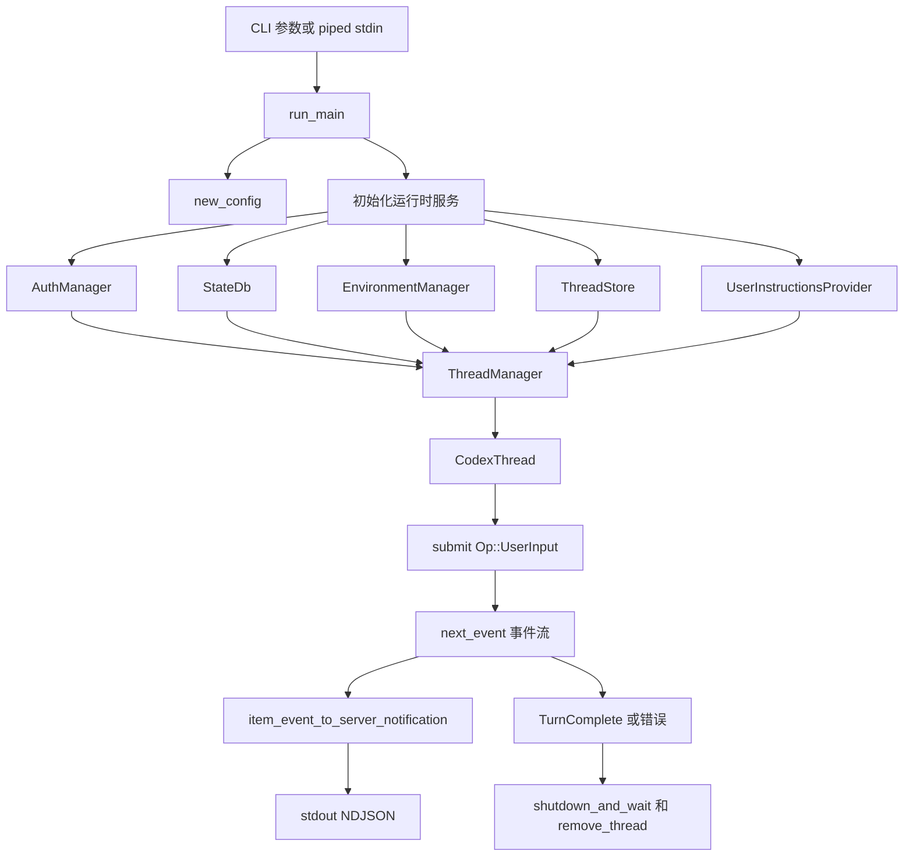
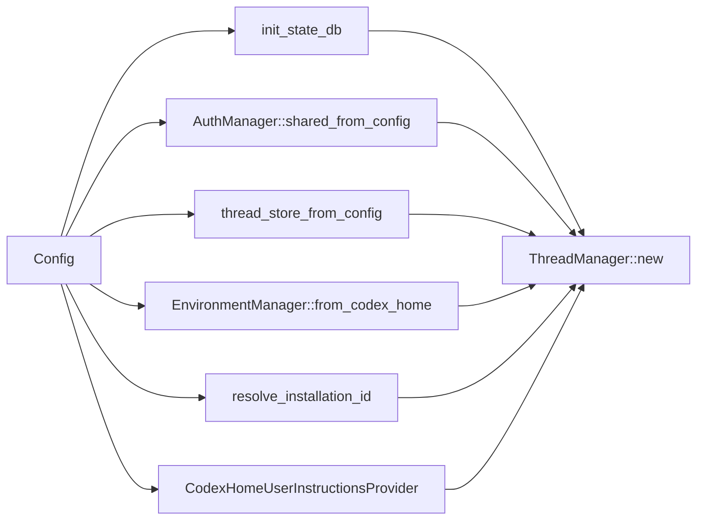
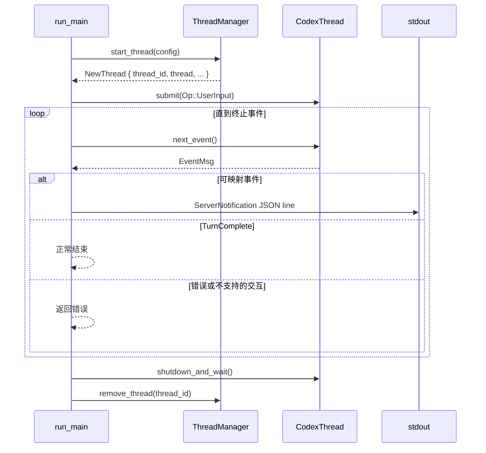
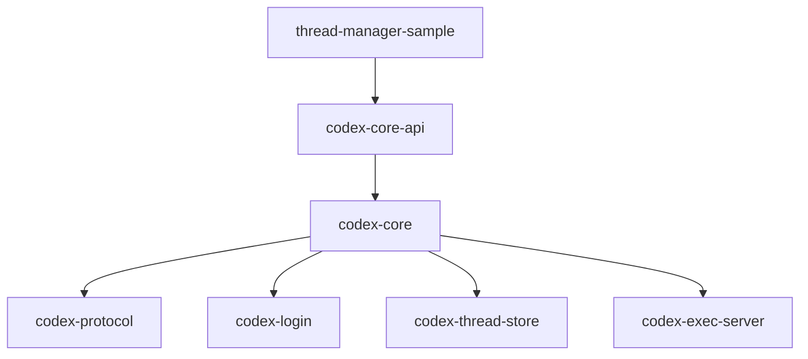

# ThreadManager Sample 架构说明

`codex-thread-manager-sample` 是一个最小化的一次性 CLI 示例，用来演示调用方如何通过公共门面 `codex-core-api` 驱动 Codex。它会启动一个 `CodexThread`，提交一次用户 turn，把部分事件流转换成 app-server notification 输出，最后关闭 thread。

这个 sample 有意保持很小。它不是完整的 TUI、CLI 或 app-server 客户端，也没有实现交互式审批、用户追问或动态工具调度。

## 目录结构

```text
codex-rs/thread-manager-sample/
├── Cargo.toml
├── BUILD.bazel
├── README.md
├── ARCHITECTURE.md
└── src/main.rs
```

这个 crate 依赖 `codex-core-api`，而不是直接依赖 `codex-core` 以及一组内部支撑 crate。这样可以让示例聚焦在嵌入式调用方应该使用的公共 API 面上。

## 总体流程



主业务流程是：

1. 从命令行参数或 piped stdin 解析 prompt。
2. 构造一个适合一次性只读 thread 的最小 `Config`。
3. 初始化 `ThreadManager` 需要的运行时服务。
4. 启动一个新的 thread。
5. 提交一次 `Op::UserInput`。
6. 持续消费事件，直到 turn 完成或失败。
7. 把选中的 item、tool、agent 事件映射成 app-server notifications。
8. 每个 notification 作为一行 JSON 写到 stdout。
9. 关闭并从 manager 中移除 thread。

## 调用链

这一节按源码函数追踪一次完整运行。左侧是调用方向，右侧说明这一步承担的职责。

### 1. Sample 入口调用链

```text
main
└── arg0_dispatch_or_else(run_main)
    └── run_main
        ├── Args::parse
        ├── 读取 prompt
        ├── new_config
        ├── init_state_db
        ├── AuthManager::shared_from_config
        ├── ExecServerRuntimePaths::from_optional_paths
        ├── thread_store_from_config
        ├── EnvironmentManager::from_codex_home
        ├── resolve_installation_id
        ├── CodexHomeUserInstructionsProvider::new
        ├── ThreadManager::new
        ├── ThreadManager::start_thread
        ├── run_turn
        ├── CodexThread::shutdown_and_wait
        └── ThreadManager::remove_thread
```

对应职责：

| 调用点 | 职责 |
| --- | --- |
| `main` | 程序入口，只负责进入 Codex arg0 dispatch。 |
| `run_main` | sample 的业务编排函数，负责读输入、装配依赖、启动 thread、执行 turn、清理资源。 |
| `new_config` | 构造一次性只读运行所需的完整 `Config`。 |
| `ThreadManager::new` | 把认证、环境、存储、插件、MCP、skills 等服务挂到 manager 状态中。 |
| `ThreadManager::start_thread` | 创建新的 `CodexThread`，返回 `NewThread`。 |
| `run_turn` | 提交用户输入，消费事件流，输出 notification。 |
| `shutdown_and_wait` / `remove_thread` | 停止底层 session loop，并从 manager 的内存 map 中移除 thread。 |

### 2. 启动 thread 的 core 调用链

sample 调用的是 `ThreadManager::start_thread(config)`，进入 `codex-core` 后会继续展开：

```text
ThreadManager::start_thread
└── ThreadManager::start_thread_with_tools
    ├── default_thread_environment_selections
    └── ThreadManager::start_thread_with_options
        └── start_thread_with_options_and_fork_source
            ├── agent_control_for_config
            └── ThreadManagerState::spawn_thread_with_source
                ├── user_instructions_for_spawn
                ├── parent_rollout_thread_trace_for_source
                ├── initial_multi_agent_version_for_spawn
                ├── effective_originator
                ├── Codex::spawn
                ├── CodexThread::new
                ├── threads.insert(thread_id, thread)
                └── NewThread { thread_id, thread, session_configured }
```

这条链路的核心含义是：

- `start_thread` 是便利入口，默认没有 dynamic tools。
- `start_thread_with_tools` 会补齐默认 environment selections。
- `start_thread_with_options` 统一进入带完整参数的启动路径。
- `spawn_thread_with_source` 是真正创建 session/thread 的核心位置。
- `Codex::spawn` 创建底层 `Codex`，它内部是一个 submission/event queue pair。
- `CodexThread::new` 把底层 `Codex` 包装成 thread 级别的 API。
- `ThreadManagerState` 把新 thread 放入内存 `threads` map，后续可按 `thread_id` 查找或移除。

### 3. 单次 turn 调用链

`run_turn` 中提交用户输入和消费事件的链路如下：

```text
run_turn
├── CodexThread::submit(Op::UserInput)
│   └── Codex::submit
│       └── Codex::submit_with_id
│           └── tx_sub.send(Submission)
│
└── loop
    ├── CodexThread::next_event
    │   └── Codex::next_event
    │       └── rx_event.recv()
    │
    ├── EventMsg::TurnStarted
    │   └── 记录 current_turn_id
    │
    ├── 可映射 EventMsg
    │   ├── item_event_to_server_notification
    │   ├── serde_json::to_writer(stdout, notification)
    │   └── stdout.write_all("\n")
    │
    ├── EventMsg::TurnComplete
    │   └── return Ok(())
    │
    └── Error / approval / request-user-input / dynamic-tool-request
        └── bail
```

这里最重要的是 `Codex` 的抽象：它是一个双队列接口，调用方通过 submission queue 发送 `Op`，再通过 event queue 接收 `EventMsg`。sample 只发送一次 `Op::UserInput`，之后不断从 event queue 读取事件。

### 4. 清理调用链

`run_main` 不会在 `run_turn` 失败后立刻返回，而是先执行清理：

```text
let turn_output = run_turn(...).await;
let shutdown_result = thread.shutdown_and_wait().await;
let _ = thread_manager.remove_thread(&thread_id).await;

turn_output?;
shutdown_result?;
```

对应调用链：

```text
CodexThread::shutdown_and_wait
└── Codex::shutdown_and_wait
    ├── submit(Op::Shutdown)
    └── 等待 session_loop_termination

ThreadManager::remove_thread
└── ThreadManagerState.threads.write().await.remove(thread_id)
```

这个顺序保证：即使 turn 因审批请求、权限请求或动态工具请求失败，sample 也会尽量停止底层 session，并把 thread 从 manager 的内存管理中移除。

## 入口逻辑

`main` 调用 `arg0_dispatch_or_else(run_main)`。这个 dispatch 包装保留了 Codex 基于 arg0 的二进制分发行为，同时让 sample 自己的业务逻辑落在 async 入口 `run_main` 中。

`Args` 支持：

- `--model MODEL`：覆盖本次运行使用的模型。
- 尾随 prompt 参数。
- 如果没有 prompt 参数，则从 piped stdin 读取 prompt。

prompt 读取逻辑比较严格：

- 没有 prompt 参数且 stdin 是 terminal 时，直接退出。
- piped stdin 会被完整读成字符串。
- CRLF 和 CR 换行会统一归一化成 LF。
- stdin 内容为空或只有空白字符时，直接退出。

## 运行时装配

`run_main` 会组装启动 Codex thread 所需的最小服务：



关键服务：

| 服务 | 作用 |
| --- | --- |
| `AuthManager` | 解析凭据和认证模式。 |
| `StateDb` | 提供本地状态存储。 |
| `ThreadStore` | 持久化 thread 和 rollout 数据。 |
| `EnvironmentManager` | 管理执行环境。 |
| `CodexHomeUserInstructionsProvider` | 从 Codex home 加载用户指令。 |
| `ThreadManager` | 创建、追踪、移除活跃的 `CodexThread`。 |

sample 对可选的 analytics、attestation、external time provider 都传 `None`，并使用空的 extension registry。

## Config 配置画像

`new_config` 会手工构造完整的 `Config`。比较关键的选择如下：

| 配置项 | 值 | 含义 |
| --- | --- | --- |
| Model provider | OpenAI built-in provider | 使用内置 OpenAI provider 配置。 |
| Model | `--model` 或 `None` | 省略时交给下游默认配置决定。 |
| 工作目录 | 当前目录 | 当前目录也是唯一 workspace root。 |
| 审批策略 | `AskForApproval::Never` | sample 不提示审批。 |
| 权限 profile | `read_only` | thread 不应执行写操作。 |
| Thread store | `ThreadStoreConfig::Local` | 使用本地 thread store。 |
| Web search | Disabled | 不启用 web search 上下文。 |
| 额外上下文 | 基本关闭 | app、skill、collaboration、environment context 注入都关闭。 |
| Analytics 和 feedback | Disabled | 避免 sample 触发产品遥测行为。 |
| Ephemeral | `true` | 把本次运行视为短生命周期 sample session。 |

这套配置可以理解成“最小、只读、单轮执行”。

## Thread 生命周期



清理顺序是有意设计的。`run_main` 会先保存 `run_turn` 的结果，然后关闭 thread 并从 manager 移除，最后才返回 turn 的结果。这样即使 turn 失败，也会尽量执行清理。

## Turn 执行逻辑

`run_turn` 只发送一次 `Op::UserInput`：

```text
Op::UserInput
└── items
    └── UserInput::Text
```

sample 不设置：

- `final_output_json_schema`
- `responsesapi_client_metadata`
- `additional_context`
- 单次 turn 的 `thread_settings`

提交之后，它会循环读取 `thread.next_event()`。

`EventMsg::TurnStarted` 用来记录当前 `turn_id`。后续被映射出来的 notification 需要同时带上 `thread_id` 和这个 `turn_id`。

## 事件映射

sample 使用 `item_event_to_server_notification` 把选中的 core event 转成 app-server notification，并把每个 notification 作为 newline-delimited JSON 输出到 stdout。

会被映射的事件类型包括：

- assistant 内容增量。
- plan 和 reasoning 增量。
- item started/completed 事件。
- exec command begin/output/end 事件。
- patch apply 进度事件。
- MCP tool begin/end 事件。
- dynamic tool response。
- collaboration 和 sub-agent activity 事件。
- terminal interaction 事件。

其他事件会被忽略，除非它们代表 turn 终止或阻塞。

## 终止事件与未支持交互

以下事件表示 turn 成功：

- `EventMsg::TurnComplete`

以下事件会让 turn 失败：

- `EventMsg::Error`
- `EventMsg::TurnAborted`
- `EventMsg::ExecApprovalRequest`
- `EventMsg::ApplyPatchApprovalRequest`
- `EventMsg::RequestPermissions`
- `EventMsg::RequestUserInput`
- `EventMsg::DynamicToolCallRequest`

这些失败分支体现了 sample 的边界。真正的生产客户端需要展示审批 UI、收集用户输入、处理权限请求或调度动态工具，然后提交对应的后续 `Op`。

## 与 core 的关系



`codex-core-api` 会重新导出这个 sample 需要的集成类型，包括：

- `ThreadManager`
- `CodexThread`
- `NewThread`
- `Config`
- `Op`
- `EventMsg`
- `UserInput`
- `AuthManager`
- `EnvironmentManager`
- `thread_store_from_config`
- `item_event_to_server_notification`

这个 facade 让 sample 可以演示受支持的嵌入路径，而不需要直接耦合内部 crate 结构。

## 小结

`thread-manager-sample` 展示的是最小可用的 Codex thread 生命周期：

```text
prompt -> Config -> ThreadManager -> CodexThread -> UserInput turn
       -> event stream -> app-server notifications -> cleanup
```

它适合用来理解如何嵌入 Codex thread 执行，以及如何消费 Codex 的事件流。更完整的客户端职责，例如审批、动态工具调度、用户追问处理，则被有意留给真正的前端或服务端实现。
