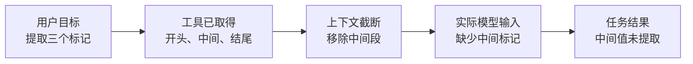
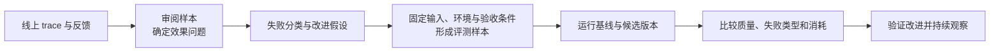

# Agent Trace 构建方案：面向算法效果诊断与迭代

[返回任务索引](README.md)

**目标：**为云端自研 Agent 建立可用于算法效果分析的执行轨迹。算法同学能从任务结果出发，查看各步模型实际获得的信息、采取的行动和产生的结果，定位质量问题，并通过实验验证改进。

方案主线是：**定义任务成功标准 → 记录决策与信息流 → 在 Langfuse 查看与标注 → 汇总失败类型 → 构建评测样本 → 比较算法版本。** Session rollout 提供历史事实，服务端自动转换并导入 Langfuse。Codex 用于说明现有实践及其证据边界。

本文为方案设计，质量维度和验收标准需结合业务任务细化；自研 Agent 的采集、自动导入和效果评测尚未完成上线验收。

## 1. 从任务效果出发，定义 trace 要解释的问题

同样是“任务失败”，改进方向可能完全不同：Agent 理解错目标、选择了错误工具、检索未找到证据、上下文丢失关键信息，或在已有证据下生成了错误结论。Trace 应支持沿这些环节查证。

| 效果问题 | Trace 中需要的证据 | 支持的算法改进 |
| --- | --- | --- |
| 是否完成用户任务？ | 原始请求、必要验收条件、最终回答或实际产物 | 明确任务边界，调整完成与停止条件 |
| 是否理解了目标和约束？ | 用户要求、显式任务拆解、各步行动 | 改进指令、任务拆解和约束保持 |
| 是否选择了合适的行动？ | 模型可用工具、选中的工具、参数、此前可见结果 | 改进工具描述、行动选择与参数生成 |
| 是否获得了有效信息？ | 检索查询、返回内容、筛选结果、工具输出 | 改进检索、工具能力与证据选择 |
| 关键信息是否进入后续决策？ | 工具原返回、有效模型输入、截断或压缩变化 | 改进上下文预算、压缩、记忆和信息传递 |
| 结论是否正确且有依据？ | 生成时可见证据、最终结论、引用或验证结果 | 改进综合推理、校验和回答策略 |
| 下一轮或子 Agent 是否延续了目标？ | 历史要求、委派输入、子任务结果、汇总时的上下文 | 改进多轮状态与协作策略 |
| 质量是否值得其消耗？ | 任务评分、模型/工具次数、token、完成耗时 | 在质量约束下比较模型与执行策略 |

执行状态与任务效果分别记录。工具返回成功，只能说明该次操作的运行状态；任务是否成功，取决于产物是否满足验收条件。用户中断、执行失败、答案错误、尚未评价也应分别呈现。

## 2. Session 内容：保留分析任务所需的连续历史

### 2.1 Session、Turn、Step 的含义

| 层级 | 算法视角 | 典型内容 |
| --- | --- | --- |
| Session | 一段持续对话或任务背景 | 历史要求、用户修正、跨轮结果、长期状态 |
| Turn | 一次用户请求及其执行结果 | 本轮目标、输入、最终回答或产物、任务评价 |
| Step | 一次模型决策及它触发的处理 | 当时可见信息、模型输出、工具选择、返回与后续动作 |
| 模型调用 | 一次实际生成交互 | 指令、有效上下文、可用工具、参数、响应、用量 |
| 工具或子任务 | 一次获取信息或执行行动 | 输入、结果、状态、与后续决策的关联 |

例如，用户要求“读取 values.txt，输出三个整数的和”：第一步模型选择读取文件，工具返回 `3 5 8`；第二步模型基于该结果回答 `16`。一次 turn 含两个模型调用和一次工具调用。多轮追问共享 Session；子 Agent 有自己的执行历史，并关联原任务。

### 2.2 Session rollout 保存什么

Session rollout 是按时间持续记录的会话与执行历史。以下内容共同构成分析一个任务的事实来源：

| 内容 | 应保留的信息 | 与算法效果的关系 |
| --- | --- | --- |
| 用户任务 | 原始请求、附件、历史要求和修正 | 确定需要完成什么，避免用错误目标评价结果 |
| 指令与配置 | 基础指令、动态注入、模型参数、Agent/prompt/tool 版本 | 识别产生当前行为的策略与版本 |
| 模型交互 | 每次实际输入、可用工具、响应文本与工具调用 | 判断当时的信息和选择是否支持正确行动 |
| 工具结果 | 参数、原始返回、供后续模型使用的返回 | 判断信息是否正确获取并传递 |
| 上下文变化 | 历史保留、截断、压缩、记忆读取与写回 | 解释多轮遗忘和信息丢失 |
| 协作过程 | 子任务输入、结果、父任务汇总时可见内容 | 判断委派是否明确，结果是否被正确使用 |
| 任务结果 | 最终回答、实际产物、终结原因、反馈与评分 | 将过程证据与结果质量关联 |

Codex 的 session rollout 包含会话元信息、本轮配置、消息、工具调用与返回、用量/生命周期事件及压缩记录。Langfuse 插件将这些历史转换为 Agent、模型和工具 observations，并把同一会话的多轮分组。各版本的保留与转换规则会影响证据完整性。

云端服务如果已有 Session 历史，可以将其作为基础数据源；还需要补充每次模型调用的有效输入和上下文变化。历史中存在某段文本，不等于模型在某次决策时获得了它。

## 3. 构建 trace：连接输入、行动、证据与结果

### 3.1 组织结构

一次用户 turn 对应一条 trace，多条 turn traces 按 Session 分组。模型与其触发的工具属于同一个 step，以调用关系连接。Langfuse 支持用 Session 分组对话，并用 AGENT、GENERATION、TOOL 等 observation 类型表达执行过程。[Session 与节点组织](https://langfuse.com/docs/observability/best-practices)

```text
Session：持续对话
└── Turn trace：读取文件并求和
    └── Agent                         输入任务 → 最终结果
        ├── Step 1                    获取求和所需的数据
        │   ├── 模型调用              选择读取 values.txt
        │   └── read_file             返回 3 5 8
        └── Step 2                    使用证据形成答案
            └── 模型调用              有效输入含 3 5 8 → 回答 16
```

Step 是展示模型决策的组织边界；其用途由实际行动与输入输出说明。有独立规划、检索、压缩或子 Agent 执行时再增加相应节点。每次模型调用都可展开，工具节点通过调用 ID 关联产生它的模型输出，结果再关联使用它的后续调用。

### 3.2 每个节点保留的效果证据

| 节点 | 默认阅读内容 | 分析时展开的证据 |
| --- | --- | --- |
| 根 Agent / Turn | 用户任务、最终回答/产物、任务评价 | 任务类型、必要条件、版本、终结状态 |
| 模型调用 | 按角色展示的有效输入、模型响应、请求的工具 | 完整指令和工具定义、模型参数、请求响应引用、用量 |
| 工具 | 名称、参数、返回、运行状态 | 原返回与模型可见返回差异、调用来源、工具版本 |
| 检索（若发生） | 查询、返回与选用的证据 | 文档/片段身份、排序、过滤，以及后续输入中的证据 |
| 上下文变化 | 保留/移除/压缩了什么 | 变化原因、预算、处理前后内容、影响的模型调用 |
| 子 Agent（若发生） | 委派目标、结果、汇总关系 | 子任务内部轨迹、父任务使用结果时的输入 |

行为摘要只能由可观测内容生成，并标明来源；人工诊断意见附在标注中。模型返回的可读 reasoning 可作为辅助材料，标明 summary/content 来源。不能把事后生成的解释或未返回的隐藏推理作为当时的决策证据。

### 3.3 内容完整性是诊断前提

模型输入首先记录实际交互，另生成便于阅读的展示视图；历史重建结果标为“重建输入”。使用增量请求时，保留增量与前序响应关系，并提供可恢复的完整逻辑上下文；恢复不完整时显示缺失范围。

每份内容显示来源、是否截断、是否脱敏和缺失原因。展示预览截断与模型上下文截断分别标记，前者影响读者查看，后者影响模型决策。大内容可按容量上限保留正文与完整内容引用，引用应能定位到当次记录的版本。

Trace 只能支持对已记录事实的分析。缺少实际输入时，对“模型忽略了证据”的诊断应标为待核验；工具结果进入请求，也不能单凭 trace 证明模型正确使用了它。

## 4. 用 Codex 案例说明效果诊断方法

### 4.1 用户问题：为什么 Agent 没找到中间的值？

已有真实 Codex 实验要求读取长文件中的开头、中间和结尾三个标记。工具获得了完整内容，最终回答却显示中间值 `not visible`。

| 观察位置 | 中间标记 `MIDDLE_RECORD=bravo` | 能支持的判断 |
| --- | --- | --- |
| 工具返回 | 有 | 工具已经取得目标信息 |
| Session 保存的工具返回 | 有 | 持久化历史保留了这段信息 |
| 下一次实际模型请求 | **无** | 该次请求中的工具文本缺少目标信息 |
| 插件从历史重建的输入 | 有 | 重建视图与该次实际输入存在差异 |
| 最终回答 | `not visible` | 任务未完整提取要求的三个值 |

该实验记录了历史预算截断：完整工具返回约 110 KB，下一次请求中的返回约 48 KB，中间段被移除。第二次请求使用增量传输，比较针对新增工具文本；目标值此前没有出现在请求或响应中。[实验摘要](../assets/rollout-comparison.real.json)



### 4.2 从证据形成改进假设

这条轨迹支持优先检查“长输出如何进入模型上下文”。可能的改进包括：按用户目标定向提取、分段读取、对截断结果再次检索，或调整历史保留策略。增加上下文预算也是可测试选项，需要同时检查信息覆盖与消耗。

它还提示评价应拆开：任务完整性未达标，但回答没有编造中间值。这两项行为分别记录，才能比较改进是否同时提高完成度和结论可靠性。

方案有效性仍需实验验证：固定文件快照和任务，在基线与候选策略上重复运行；检查三个值是否全部正确、是否有无依据内容，并比较调用和 token 消耗。Trace 用于提出并检验解释，单个案例不足以证明某项策略能普遍提升效果。

## 5. 将任务质量与过程问题关联

### 5.1 建议的评价维度

下表是按任务选择的候选维度，尚未配置评测器。先从业务成功条件与实际失败样本确定少量核心指标，再扩展过程评价。[评价维度的选择](https://langfuse.com/academy/evaluate/choosing-what-to-evaluate)

| 维度 | 评价对象与证据 | 评价方式 | 指导什么决定 |
| --- | --- | --- | --- |
| 任务完成 | Turn 产物是否满足必要验收条件 | 确定性检查、业务结果或人工验收 | 是否调整任务策略与停止条件 |
| 正确性与完整性 | 答案/产物与参考事实、必要项对照 | 精确比对、测试执行或人工评分 | 是否改进生成、验证与补充动作 |
| 证据支持 | 结论与生成时可见证据的对应 | 引用校验、事实检查、人工标注 | 是否改进证据使用与回答策略 |
| 约束遵循 | 输出/行为是否满足用户要求 | 格式/条件检查，复杂要求人工评价 | 是否改进指令和跨步约束保持 |
| 行动适切性 | 工具/检索选择与参数是否支持目标 | 任务事实、返回质量及人工审阅 | 是否改进工具描述与行动策略 |
| 信息覆盖 | 必要证据是否获取并进入相关模型调用 | 有参考证据时检查覆盖，结合输入核验 | 是否改进检索、筛选与上下文处理 |
| 协作质量 | 子任务目标、结果和最终汇总 | 子任务与整体产物分别评价 | 是否改进委派粒度和结果整合 |
| 消耗与效率 | 质量达到要求时的调用/token/耗时 | 实际计数与用量 | 比较满足质量要求的策略成本 |

工具运行状态、上下文长度和调用次数是过程事实；是否“工具选错”“上下文不足”“调用冗余”需要结合任务评价。成功路径可以有多种，不用唯一动作序列限制所有正确解法。

可确定验证的结果优先用规则或业务结果；开放式判断先用人工样本明确标准，必要时使用经过人工校准的模型评审。用户点赞、改写或重复追问作为反馈信号保留，不能直接等同于答案正确或错误。

### 5.2 评分、标签与证据的连接

任务质量评分关联 Turn，跨轮目标评价关联 Session；局部工具、检索或模型决策评价关联对应 observation。Langfuse 支持在这些层级附加 Scores，评分可在任务结束后写入。[Scores 的关联方式](https://langfuse.com/docs/evaluation/evaluation-methods/scores-via-sdk)

每次评价保留评分标准版本、评价来源、参考答案/验收条件、证据节点和评价时间。失败分类如“信息未获取”“上下文丢失”“证据误用”由审阅或评测后产生，作为诊断标注或分类评分保存。无法判定时显示“未评价”或“证据不足”，不填成零分。

统计时同时展示评价覆盖率、任务类型和样本范围；不同任务类型分别比较。只挑 bad case 得到的失败分布可用于诊断重点，不能代替总体任务成功率。版本比较使用一致的验收口径，并报告样本数、失败类别变化与消耗。

## 6. 在 Langfuse 中形成算法工作流

以下是希望支持的阅读与分析流程，具体展示由 Langfuse 的轨迹、分组、评分与标注能力承载，业务效果摘要需要采集和评价流程提供。

| 查看范围 | 算法同学关注的内容 | 后续动作 |
| --- | --- | --- |
| 样本集合 | 任务类型、版本、任务评价、失败类别、反馈、消耗 | 找到退化场景与代表性样本 |
| 单个 Turn | 用户目标、验收条件、最终产物与评分、执行路径 | 确认具体未达标项 |
| 模型决策 | 当时有效输入、可用行动、模型输出、关联工具 | 核验选择或结论是否有依据 |
| 信息流 | 工具/检索结果、筛选与上下文变化、后续输入 | 找到信息首次缺失或被误用的位置 |
| 多轮/协作 | 要求如何延续、子任务如何交付、最终如何汇总 | 分析目标遗忘与协作损失 |

先从结果定位问题，再沿相关决策向前检查证据，记录“已观察事实—待验证假设—候选改进”。证据不足的环节单独标明，便于补齐采集或重新运行验证。

算法同学能够比较两条 trace 的输入、行动、输出与评分；若现有界面无法直接并排比较，先通过同一评测样本与版本标识建立对应关系。耗时与 token 用于辅助判断策略代价，跨服务性能问题再关联工程 trace。

## 7. 从 Session rollout 自动导入 Langfuse

不同自研 Agent 的 Session 格式需要服务端适配组件。其具体实现见独立文档[云端 Agent Session 自动导入 Langfuse：组件实现方案](session-langfuse-bridge-design.md)，包含统一事件契约、节点聚合、持久化 Outbox、OTLP 接口与完整上报样例、异常恢复和入库对账。

### 7.1 服务端数据流程


采集发生在服务端任务执行过程中：保存用户输入与最终产物，每次模型发送时记录有效输入，响应与工具完成时记录结果，上下文处理时记录变化。首期在任务终结且历史完整到达后聚合并导出整轮；长任务可扩展为已完成子节点持续上报，根节点在任务结束后一次发送，评价结果到达后单独关联评分。Langfuse v4 接收完整且不可变的节点，不能通过重复上报同一 ID 来补齐已入库内容。[导出约束](https://langfuse.com/integrations/native/opentelemetry/migration-to-v4#export-complete-immutable-spans)

已有历史可以由相同转换流程回补。仅能重建的输入标明来源，缺失的真实交互保持缺失状态，不能通过拼接历史补成“已确认的模型输入”。Codex 插件的自动转换可作为基础案例：会话历史映射为 AGENT、GENERATION、TOOL，再导入 Langfuse；云端还需补齐实际输入、业务产物与质量评价。

### 7.2 内容到 Langfuse 的映射

| Session 内容 | Langfuse 承载方式 | 算法用途 |
| --- | --- | --- |
| 持续对话身份 | Session 分组 | 多轮目标与历史追踪 |
| 单轮任务输入与最终产物 | Turn trace 的根 AGENT 输入/输出 | 任务结果与评价 |
| 模型实际交互 | GENERATION 输入/输出、模型、参数、usage | 决策与模型版本分析 |
| 工具/检索/子 Agent | TOOL / RETRIEVER / AGENT 等 observations | 证据获取与协作过程 |
| 上下文处理 | 过程节点及处理前后内容关联 | 信息丢失诊断 |
| 配置、版本、来源与完整性 | 查询属性与 metadata | 筛选同类问题、判断证据范围 |
| 质量评价 | Scores 与诊断标注 | bad case 汇总与版本比较 |

自动导入保留业务任务、step、调用与内容身份。组件通过事件唯一约束和持久化导出状态防止重复消费；Langfuse v4 不能保证对重发的相同 span ID 去重，投递回执丢失时先对账，再按已确认状态处理。迟到的执行结果独立记录并关联原任务，评分通过 Score API 关联。内容上报与质量评价分别执行，导入成功不等于任务已经完成评分。[重复投递与恢复方案](session-langfuse-bridge-design.md#7-投递可靠性重复消费重试与结果未知)

## 8. 用 trace 驱动改进与回归验证



从 bad case 提取用户输入、必要历史、文件/知识库/工具状态快照与期望行为。评测任务输入、参考答案/验收条件和诊断元信息分别保存，诊断意见不混入 Agent 输入。需要验证完整策略时重新执行完整任务；固定工具返回适合隔离某个环节，两种实验的结论范围分别说明。[评测样本设计](https://langfuse.com/academy/datasets)

实验记录 Agent、prompt、模型、工具、上下文策略、数据集和评分标准版本。基线与候选版本在同一批样本上运行，对随机性显著的任务重复评测；除目标 bad case 外保留代表性成功与边界样本，检查质量退化和消耗变化。

在线总体效果需要代表性样本与明确分母；离线修复集用于验证特定问题。一次任务的改善、离线效果与线上总体变化分别报告，避免从单个 trace 直接推广结论。

## 9. 第一阶段范围与验收

第一阶段打通一个“获取信息—模型使用—任务产出—结果评价”闭环，包含真实模型输入输出、工具结果、关键上下文变化、版本身份、自动导入和任务评价。优先覆盖读文件或检索这类结果可核验的任务，再扩展多轮、压缩和子 Agent。

| 验收场景 | 应能完成的效果分析 |
| --- | --- |
| 简单任务成功 | 从用户要求到最终产物可查，必要信息进入实际模型输入，结果有明确验收依据 |
| 工具成功但答案错误 | 区分信息获取、传递、使用和结果验证环节，标注失败事实与待验证解释 |
| 必要信息未进入上下文 | 对照原返回与实际输入，找到截断、压缩或筛选的位置 |
| 信息已进入但结论错误 | 核对相关输入、响应和输出依据，形成生成/校验改进假设 |
| 多轮或子 Agent 丢失目标 | 找到要求/结果首次遗漏的交互，关联整体任务评价 |
| 比较两版算法 | 同一评测样本和标准下比较质量、失败类型与消耗，定位差异步骤 |
| 采集不完整或重复上报 | 缺失证据明确可见，任务、调用与评价关联稳定，不重复计算节点和用量 |

完成标准是：算法同学能根据轨迹与评分提出有证据的改进假设，并用可比较实验检验；同时能识别当前证据不足以解释的问题。数据导入与效果评价的覆盖率作为验收项单独报告。

## 参考与案例依据

Codex 案例采用已核对的 Langfuse 插件 `0.4.0`；长文件实验使用 Codex CLI `0.156.1`。此前已查询插件入库样本并验证历史转换与导出，范围见[案例验证摘要](assets/agent-trace-verification.json)。这些证据说明案例的采集和展示行为，自研服务的方案与质量评测仍需按本文验收。

Langfuse 的节点组织、评分与数据集能力分别依据文中的官方资料；本文的质量维度、诊断流程和云端映射是拟议业务方案。
