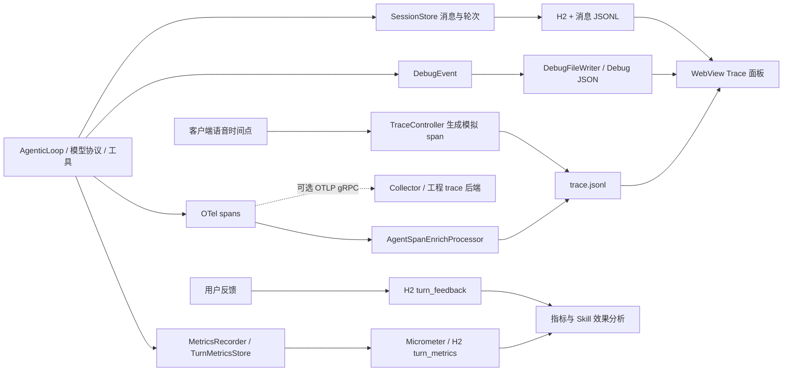

# Demo 观测清单：OTel Trace 与 Agent 算法 Trace 如何承载

[返回专题索引](README.md)

核对日期：2026-09-30。源码：`/home/goulei1/code/cloud-native-agentic-loop-demo`，commit `98742947adc8a3425ca78085ea720dd86d5c021d`，核对时工作区无修改。本文是源码分析，未启动服务、调用真实模型或完成 Hera/Langfuse 摄取验收。文中的执行树为结构示意。

**Demo 已同时记录执行过程和部分算法证据，但它们分散在 OTel spans、Debug JSON、会话消息、H2 指标/反馈和日志中。WebView Trace 面板通过关联键拼接这些数据。只导出 OTel spans，不能获得面板里的全部内容。**

本文沿用本专题的定义：OTel 工程视图回答“执行到哪里、哪里慢、怎样失败”；Agent 算法视图回答“模型当时看到了什么、选择了什么行动、结果是否满足任务”。算法视图可以用 OTel 作为传输格式，二者并不要求两种互斥的存储协议。

## 1. 当前数据出口与默认配置



默认配置开启 `otel.traces.enabled` 和 `debug.enabled`，关闭 `otel.exporter.otlp.enabled`。因此配置中的默认行为是本地记录，不向远端 trace 后端推送。Trace 写入 `${user.dir}/trace.jsonl`，快照写入 `~/.agenticloop/debug`，会话消息默认写入 `~/.agenticloop/messages`。Prometheus 端点通过 Actuator 暴露。配置见 [application.yml](/home/goulei1/code/cloud-native-agentic-loop-demo/java-webview-demo/src/main/resources/application.yml:917)。

[TracingConfig](/home/goulei1/code/cloud-native-agentic-loop-demo/java-webview-demo/src/main/java/com/xiaomi/xiaoaiplus/agenticloop/webview/config/TracingConfig.java:34) 手工创建 OTel SDK、注入 `service.name`，安装本地处理器；打开远端开关后，另装 `OtlpGrpcSpanExporter` 和 `SimpleSpanProcessor`。没有看到 demo 自己设置 W3C propagator 或在下游请求中 inject/extract trace context；跨服务完整性还需检查部署时的自动插桩。

## 2. 逐项观测与两套视图的承载位置

“已采集”表示存在实现，不表示所有分支都有完整数据；“建议”表示需要接入或补充，尚未在 demo 中实现。

| 观测对象 | Demo 实际记录 | OTel 工程 trace 当前承载 | Agent 算法 trace 应承载 | 覆盖与边界 |
| --- | --- | --- | --- | --- |
| 请求与会话身份 | session、turn、request、agent、部分用户身份 | span attributes、trace/span ID | Session 分组、Turn 入口、关联 metadata | 已有；字段命名不统一，request 与 turn 存在注入导致的一对多关系 |
| Turn 生命周期 | 起止、耗时、初始/最终模型、fallback 次数、退出原因、错误详情 | `session_run`、`agentic_loop.turn` | Agent 节点的任务输入、最终输出、执行状态 | 执行过程已有；任务完成质量需单独评价 |
| Step 决策边界 | step index、普通/注入触发、是否 fallback、是否请求工具 | `agentic_loop.step` | Step 节点组织模型输入、行动、返回 | 已有；step 包含工具执行时间，不能当作纯模型耗时 |
| 模型调用 | model alias/ID、provider、protocol、endpoint host | `llm_provider.stream` | Generation 节点、模型/参数、输入/输出、usage | 调用骨架已有；正文在 Debug/消息中，span 中没有完整输入输出 |
| System prompt 与历史 | 每步最终组装的 system prompt、history、工具数量 | 没有作为完整正文写入 span | Generation input；查看指令与上下文变化 | `ContextSnapshot` 已有；只记录工具数量，完整工具定义需看原始请求 |
| 实际请求体 | 协议序列化后的请求 JSON、model、protocol | 未随 span 导出 | Generation 的实际输入与参数；原始请求可下钻 | `LlmRequestRecord` 已有；这是协议请求，不应只靠历史重建代替 |
| 响应与可读 thinking | assistant 文本、thinking、签名、tool calls；调试响应预览 | 主要只有调用时间与模型标签 | Generation output；明确文本/thinking 的来源与完整性 | 消息与流事件已有；调试响应文本最多 2000 字符，thinking-only 分支提前继续，不写普通 assistant 消息 |
| Token 与缓存用量 | input/output/cache read；Debug 还有 cache write | 常规路径主要在 step attributes；TSS 有独立字段 | Generation usage，按调用统计消耗 | 部分；模型不支持计数时记“模型不支持”，不能计为真实 0 |
| 流式体验 | TTFT、文本输出阶段时长、thinking 时长、100ms 输出分桶 | step/TSS 等 attributes | Generation timing、效果与消耗对照 | 已有但口径需修正：分桶累计字符数，不是真实 token 数 |
| 重试与切模型 | 同模型重试事件、模型变更、fallback step、最终 fallback 次数 | 多个 stream span、`is_fallback`、Turn 汇总 | 每次尝试的输入、输出/错误，及采取 fallback 的事实 | 部分；没有独立 attempt ID，调试快照会被同一步后续尝试覆盖 |
| 工具调用 | 名称、call ID、参数 hash/预览、输出预览/大小、执行耗时、业务成功/错误、并发批次 | `tool.batch`、`tool.execute` | Tool 节点的参数、完整结果，连接产生调用与消费结果的模型 | 已有；span 预览约 200 字符，完整参数/结果需读取会话消息 |
| Skill 加载 | 名称、版本、lifecycle、cache hit，轮次内 skill loads | `skill.load` | 工具动作、Skill 内容/版本及后续模型输入 | 部分；版本和调用有记录，实际内容需看对应请求/上下文 |
| Memory | 写入 key/category，查询长度/limit/result count，删除；上下文注入模式/数量 | `memory_store.*` 与当前 span attributes | 检索/记忆节点、注入的内容及其后续使用 | 操作观测已有；数量不足以证明模型看到了哪些记忆，需联合请求快照 |
| 历史压缩 | strategy、压缩轮数、压缩消息/摘要与后续上下文 | `compaction.execute`、session store spans | Context 变化节点；压缩前后内容和影响范围 | 部分；压缩 span 没有 turn ID，直接模型调用也未走普通 stream 插桩 |
| 持久化与后台处理 | 创建会话/轮次、加载上下文、追加消息、finalize、plugin hook | `session_store.*`、`plugin.hook` | 按需展示会改变上下文/结果的处理 | 操作已有；部分后台 span 缺少 turn ID，按 turn 筛选时可能不可见 |
| 语音预处理与纠错 | transcript、short circuit/rewritten/pass through、tone/emotion、纠错前后文本/是否应用、用量/时间 | `pre_step`、`tss`、`correction` 及其模型调用 | 预处理节点；解释用户输入如何改写、是否直接回答 | 已有；纠错模型调用使用保留的 `step.index=-2`，不能仅按普通 step 排序解释 |
| 客户端端到端时序 | 录音开始、发送、HTTP 发出、首 SSE、首 thinking/tool/text | 当前为本地 JSONL 模拟 `agentic_loop.client` | Turn 的体验 metadata，与服务端时间线关联 | 部分；当前 WebView 在有音频时间戳时上报，不是通用请求覆盖，不走 OTLP |
| 用户反馈与 Skill 效果 | good/bad、issueType、note；按 Skill 版本关联调用/退出状态/耗时/反馈 | 不在现有 spans 中 | Turn/相关节点的人工评价与质量分析 | 已有 H2 数据与分析接口；没有看到已接入 Langfuse Scores/数据集实验 |
| 聚合指标与日志 | turn/tool 耗时、token 分布、fallback/compaction/后台错误计数；请求/错误/客户端日志 | 独立 metrics/logs，需关联键跳转 | 质量/消耗统计，以及诊断证据引用 | 已有独立出口；不应把聚合计数复制成每个算法节点的结果 |

核心定义见 [DebugEvent](/home/goulei1/code/cloud-native-agentic-loop-demo/java-core-sdk/src/main/java/com/xiaomi/xiaoaiplus/agenticloop/sdk/debug/DebugEvent.java:13)、[SessionEvent](/home/goulei1/code/cloud-native-agentic-loop-demo/java-core-sdk/src/main/java/com/xiaomi/xiaoaiplus/agenticloop/sdk/event/SessionEvent.java:11)、[TurnMetricsEntry](/home/goulei1/code/cloud-native-agentic-loop-demo/java-core-sdk/src/main/java/com/xiaomi/xiaoaiplus/agenticloop/sdk/metrics/TurnMetricsEntry.java:15) 和 [MicrometerMetricsRecorder](/home/goulei1/code/cloud-native-agentic-loop-demo/java-webview-demo/src/main/java/com/xiaomi/xiaoaiplus/agenticloop/webview/metrics/MicrometerMetricsRecorder.java:34)。

## 3. OTel Trace 的执行骨架

普通文本轮次的主要结构如下；存储操作会出现在实际执行位置，示意中只保留核心分支。

```text
session_run                         一次 run 的包装，不是整个多轮 Session
└── agentic_loop.turn
    ├── agentic_loop.pre_step        语音路径可含 tss / correction / 模型调用
    ├── agentic_loop.step [0]
    │   ├── session_store.load_context
    │   ├── llm_provider.stream      重试时可有多个同级调用
    │   ├── session_store.append_message
    │   └── tool.batch
    │       ├── tool.execute A       可并发
    │       └── tool.execute B
    ├── agentic_loop.step [1]
    │   └── llm_provider.stream
    └── session_store.finalize_turn
```

`AgenticLoop.startStepSpan()` 显式把 step 挂到 turn context；模型调用传入 step context，工具批量操作也使用 step context。`SpanRunner` 从显式 parent 或 Reactor Context 取父级，向下传递 context，并在成功、异常、取消时结束 span。它解决的是异步执行中的父子关系与生命周期。

有两个独立入口容易误读。`ChatRequestSpan.startAndEnd()` 创建的 `http.request` 只等待查询 session 状态，记录 queued/processing 后即结束，不代表完整 HTTP/SSE 请求时长。它使用 `session_key`，而 `TraceLogWriter` 提取的是 `session.key`，不能假设这个 span 会自动出现在按 session/turn 查询的面板中。客户端 `agentic_loop.client` 则只是控制器手工写出的展示对象。

[TraceLogWriter.toJsonLine()](/home/goulei1/code/cloud-native-agentic-loop-demo/java-webview-demo/src/main/java/com/xiaomi/xiaoaiplus/agenticloop/webview/trace/TraceLogWriter.java:98) 只保存 `traceId/spanId/parentSpanId/name/sessionKey/startTimeMs/durationMs/status/attributes`。完整 OTel `SpanData` 中的 events、exception events、links、resource 等未写入这份本地 JSONL。OTLP exporter 能从原始 SpanData 导出，不能把本地 JSONL 当成无损 OTLP 备份。[OTel 的 span 数据结构](https://opentelemetry.io/docs/concepts/signals/traces/)

## 4. Agent 算法 Trace 的证据从哪里来

### 4.1 Demo 现有视图如何拼接

面板按 Session 选 Turn，读取该 Turn 的 spans，再按 span 的 `session.key + turn.id + step.index` 查询调试文件：

```text
debug/{sessionKey}/{turnId}-{stepIndex}-ctx.json       逻辑上下文
debug/{sessionKey}/{turnId}-{stepIndex}-llm-req.json   调用前的协议请求
debug/{sessionKey}/{turnId}-{stepIndex}-llm.json       调用后的用量、错误、响应预览
```

[DebugFileWriter](/home/goulei1/code/cloud-native-agentic-loop-demo/java-webview-demo/src/main/java/com/xiaomi/xiaoaiplus/agenticloop/webview/debug/DebugFileWriter.java:46) 定义文件内容与命名。[trace.js 的 openDrawer()](/home/goulei1/code/cloud-native-agentic-loop-demo/java-webview-demo/src/main/resources/static/js/trace.js:530) 在 step 节点读取当前/前一步 Context，展示 History diff；在模型节点读取请求与调用记录，展示 Formal/Raw LLM。这里的 History diff 比较的是已记录的上下文，不是额外采集的上下文处理事件。

[TraceController.turns()](/home/goulei1/code/cloud-native-agentic-loop-demo/java-webview-demo/src/main/java/com/xiaomi/xiaoaiplus/agenticloop/webview/api/TraceController.java:172) 还从 H2 获取 `simplified/client_partial`，从消息 JSONL 读取用户请求预览。正常模型步骤把 assistant 文本、可读 thinking、tool calls 写入消息，工具结果按 `tool_call_id` 写回，见 [dispatchToolsOrFinish()](/home/goulei1/code/cloud-native-agentic-loop-demo/java-core-sdk/src/main/java/com/xiaomi/xiaoaiplus/agenticloop/sdk/loop/AgenticLoop.java:1140)。

`simplified` 是后续模型上下文使用的轮次简化表示，粒度可选回复、工具列表、工具详情、thinking 计数。`client_partial` 是客户端上报的已收到文本。二者与完整执行历史有不同语义，不能相互替代。可读 thinking 也只代表模型实际返回的内容，不能解释成未暴露的完整内部推理。

离线导出的 HTML 会打包 spans、请求预览、simplified、clientPartial；[TraceExportController](/home/goulei1/code/cloud-native-agentic-loop-demo/java-webview-demo/src/main/java/com/xiaomi/xiaoaiplus/agenticloop/webview/api/TraceExportController.java:131) 没有将全部 Debug 文件和消息正文打包，因此“可离线浏览”不等于“全部算法证据可离线复核”。

### 4.2 承载到算法平台时的建议映射

下面是承载建议，不是 demo 已实现的 Langfuse 接入。Langfuse 用 Session 分组多条 trace，每条 trace 包含模型、工具等 observations；这些节点可嵌套。[Langfuse 数据模型](https://langfuse.com/docs/observability/data-model)

| Demo 数据 | 算法视图目标 | 内容与证据 |
| --- | --- | --- |
| `session.key` | Session | 连续多轮背景，保留业务原始 ID |
| `agentic_loop.turn` + 用户消息/最终输出 | Agent 根节点，按 Turn 组织 trace | input 为任务，output 为最终回复/产物；exitReason 单独记录 |
| `agentic_loop.step` | Step 组织节点 | 含模型调用及其触发的工具；保留 step index/trigger |
| `llm_provider.stream` + 每次请求/响应记录 | Generation | 按角色展示实际输入、工具定义、模型参数、响应、stop reason、usage |
| `tool.execute` + tool_calls/tool 消息 | Tool | 参数和完整返回；call ID 连接来源模型与下一步输入 |
| skill/memory/compaction/TSS/纠错 | 对应动作或上下文变更节点 | 名称、版本、改写前后内容、返回与影响范围；无证据时标明缺失 |
| H2 feedback | 人工评价/Score | good/bad、问题类型与备注，绑定 Turn；不要用 NORMAL 自动生成质量满分 |
| 耗时/token/fallback | 节点 timing/usage/metadata | 与质量一起分析；保留单位、计数支持情况和来源 |

两种接入方式都可行：在现有实时 spans 中补充算法字段和正文；或由 Session/Debug 适配器构建独立算法 observations。对这个 demo，先把分散证据按稳定调用 ID 聚合，再导入算法平台，更容易保留来源和缺失信息。若使用独立算法 trace ID，必须保留原工程 `trace_id/span_id` 的映射。

Langfuse 的 OTel 接入提供 `langfuse.observation.type`（如 `agent/generation/tool`）、`langfuse.observation.input/output`、`langfuse.observation.model.name`、`langfuse.observation.usage_details`、`langfuse.session.id` 等映射字段。Demo 的 `model.alias`、`input_tokens`、`session.key` 是自定义字段，不能假设直接发送后就得到相同的模型、用量和 Session 展示。该字段映射需与目标部署版本核对。[官方 OTel 接入映射](https://langfuse.com/integrations/native/opentelemetry)

Demo 当前 exporter 使用 gRPC；Langfuse 官方接收端当前支持 OTLP HTTP，不能仅替换 URL 就直接接入。可以由 Collector 接收 gRPC 再用 OTLP HTTP 转发，或调整应用 exporter；正文拼接、字段映射和关联仍需另外完成。[官方传输协议说明](https://langfuse.com/integrations/native/opentelemetry)

## 5. 关联契约：已有 ID 与需要补齐的 ID

| 层级/ID | 当前含义 | 使用方式与缺口 |
| --- | --- | --- |
| `traceId + spanId` | 工程执行链路/操作实例 | 保留为 Hera 或其他工程后端定位键；span 父子树用 parentSpanId |
| `session.key` | 多轮业务 Session | 算法侧分组键；不等于 OTel traceId |
| `turn.id` | 一次 Agent 轮次 | 消息、调试、指标、反馈的共同键；同一 Session 有多个 Turn |
| `request_id` | 客户端/入口请求 | 新输入可能注入正在运行的 Turn；还要保留 injected_request_ids |
| `step.index` | Turn 内模型决策序号/辅助调用保留索引 | 当前以 session/turn/index 联合定位快照，没有独立 step UUID |
| `tool.call.id` / `tool_call_id` | 一次工具调用 | 联合模型输出中的 tool_calls 和工具结果，不能用名称或数组位置代替 |
| attempt/call ID | 独立模型尝试 | 当前缺失；同一步重试多个 spans 却共用调试文件名 |
| `skill.version` | Skill 内容版本 | 分析 Skill 版本变化与反馈；没有等价的全套 Agent/prompt/tool 配置快照 |

最小双向跳转契约建议在两侧都保存 `session_id/turn_id/step_id/call_id/attempt_id`，算法 observations 再保存对应工程 `trace_id/span_id`。若直接复用工程 spans，平台观察节点可沿用原 ID；若另建算法图，就维护显式的一对多关系，不能用 Turn UUID 冒充 OTel trace ID。

对异步压缩和插件，补充触发 Turn、操作 ID、影响的后续 Turn/模型调用；无需强行延长已结束的用户轮次。当前 `compaction.execute` 和 `plugin.hook` 只有 session 等字段，按 `turn.id` 查询 spans 时可能漏掉这些操作。

## 6. 对分析结论有影响的实现边界

1. **同一步尝试的正文不可完整回溯。** `consumeWithRetry()` 每次尝试生成模型调用 span，但 Debug 文件命名没有 attempt 标识，后续写入覆盖前一次。应补齐独立调用/attempt ID，并将快照绑定到准确 span。
2. **Span OK 不代表任务成功，也未必代表工具业务成功。** 工具异常经 `onErrorResume` 转成 `ToolResult.error` 后，可能正常结束并设置 OTel OK；应同时看 `tool.success/is_error/tool.error_message`。模型协议错误也可能转成正常返回的 `StreamResult`。Turn 的 `exit_reason` 与任务质量、用户评价要分别展示。
3. **速率与 thinking 数量存在估算。** `token_rate_buckets/thinking_rate_buckets` 是 100ms 内字符串长度，普通 thinking 计数用 `length()/4`；这些不能与 provider usage 混为同一口径。TTFT 从流开始到首 thinking/text；`tfot_ms` 在这里是首文本到流结束的持续时间。[StreamConsumer](/home/goulei1/code/cloud-native-agentic-loop-demo/java-core-sdk/src/main/java/com/xiaomi/xiaoaiplus/agenticloop/sdk/loop/StreamConsumer.java:213)
4. **常规 step 的计时字段有采集分支限制。** `recordUsageMetrics()` 把时序属性也放在 usage 分支内，并在模型不支持计数时提前 return；可能连 timing 都缺失。无 token 用量不应据此推断没有耗时。[recordUsageMetrics()](/home/goulei1/code/cloud-native-agentic-loop-demo/java-core-sdk/src/main/java/com/xiaomi/xiaoaiplus/agenticloop/sdk/loop/AgenticLoop.java:695)
5. **客户端模拟 span 不能直接作为规范 OTel span 使用。** `buildClientSpanMap()` 没有 traceId，spanId 是 16 字符片段再追加 `cc`，共 18 字符；它直接落盘、不经 SDK/exporter。端到端图是业务 ID 拼接的结果，不能当作已完成分布式传播。[TraceController](/home/goulei1/code/cloud-native-agentic-loop-demo/java-webview-demo/src/main/java/com/xiaomi/xiaoaiplus/agenticloop/webview/api/TraceController.java:92)
6. **压缩的内部模型证据不完整。** `LlmCompactionHandler.compact()` 直接 `provider.complete()`，没有走 `StreamConsumer`；使用的 `forSingleCall()` 上下文也没有该次 session/turn 调试身份。压缩操作的耗时/轮数与其内部 LLM 请求证据需要分别补齐。
7. **Turn 结束回写不能代替显式关联。** `AgentSpanEnrichProcessor.activeSpans` 每个 session 只保存一个活跃 span，嵌套 span 会覆盖、结束时会移除。不能保证 TurnCompleted 的回写总命中 turn span；主循环已经显式写出的 turn 字段才是重要证据。[AgentSpanEnrichProcessor](/home/goulei1/code/cloud-native-agentic-loop-demo/java-webview-demo/src/main/java/com/xiaomi/xiaoaiplus/agenticloop/webview/trace/AgentSpanEnrichProcessor.java:45)
8. **面板时间轴经过展示加工。** `trace.js` 合并连续 append_message、折叠部分父子节点，并计算视觉宽度；分析真实耗时应回到 startTimeMs/durationMs，不能从像素宽度直接测量。

目前没有看到完整的业务验收标准、产物验证、自动质量 evaluator/实验流程、多 Agent 委派轨迹，以及检索证据被哪一步实际使用的显式关系。反馈与 Skill 版本分析是已有基础，但不足以证明算法效果闭环已经完成。

## 7. 源码阅读路线与后续样本验收

先打开 `AgenticLoop.java`，从 `run()`、`runInternal()` 读到 `executeStepLoop()`，确认一个 Turn 如何包含多个 Step；再读 `handleLlmResult()`、`dispatchToolsOrFinish()` 和 `finalizeTurn()`，看到 assistant/tool 消息、退出状态与指标的保存位置即可停下，不必先进入所有业务工具。

随后打开 `StreamConsumer.java`，对照 `consumeWithRetry()`、`attemptOnce()`、`buildLlmSpan()`，区分调用尝试、流事件和结果汇总。进入 `ToolOrchestrator.java` 的 `executeBatched()` 与 `executeSingle()`，核对工具 call ID、并发批次和业务错误的承载。

接着沿 `DebugEvent → DebugFileWriter → DebugController → trace.js.openDrawer()` 跟读，确认完整上下文与原始请求为何需要独立文件。最后沿 `TracingConfig → AgentSpanEnrichProcessor → TraceLogWriter → TraceController` 核对导出范围和本地筛选条件；到这里即可解释当前面板的来源与边界。

源码中已有 `AgenticLoopSpanRegressionTest`、`StreamConsumerRetryTest`、`CorrectionSpanE2ETest`、`DebugFileWriterTest` 等相关测试，本次仅阅读，未执行。后续验收至少需要普通工具轮次、同模型重试/fallback、语音改写/纠错、异步压缩四类真实记录，对账 spans、每次调用正文、消息、反馈和双方 ID，并核验从算法节点到工程 span 的跳转。`docs/bugs/trace.jsonl` 是 bug 登记文件，不能作为执行 trace 样本。
