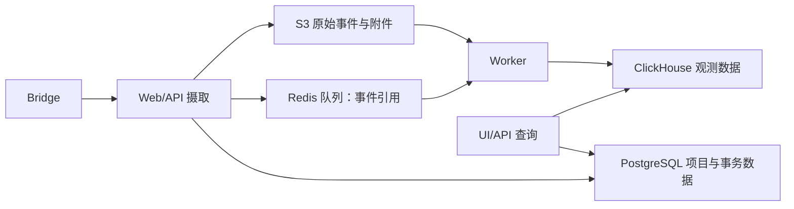

# Agent Trace 信息展示调研：文字稿

> 本稿是最终 HTML 的内容底稿。研究对象是规划中的自研 Agent；Codex 是已有实现的参考样本。工程侧在 Hera 一类 OTel 后端查看，算法侧拟在 Langfuse 查看。文中凡涉及自研 Agent 的 Span 树、记录契约和接入链路，均为设计建议，尚未完成目标环境验收。

## 1. 为什么需要两类 trace

假设用户要求 Agent“读取 `values.txt`，输出三个整数的和”。Agent 第一次调用模型，模型要求读取文件；工具返回 `3 5 8`；第二次调用模型，模型回答 `16`。这是一轮用户任务，却包含两次模型调用、一次工具执行，以及可能发生的重试、上下文处理和下游请求。

工程同学问的是“这轮任务慢在哪里、哪次请求失败、重试是否成功”。算法同学问的是“模型当时看到了什么、为什么选择这个工具、工具结果有没有进入下一次模型输入、答案是否满足要求”。前一组问题由**运行时 OTel trace** 回答，后一组问题由**Session 历史转换出的 Agent trace** 回答。两者记录同一次执行的不同证据，靠业务身份互查；执行成功也不等于任务质量达标。[工程侧方案](../otel-trace-design.md)和[算法侧方案](../agent-trace-design.md)分别给出了两个视角的边界。

下文的 `values.txt` 链路是**合成的设计示例**，用于说明拟建系统应呈现什么。它不是自研 Agent 已产生的真实 trace。

## 2. 工程侧：一轮执行由哪些 OTel Span 组成

### 2.1 先看整条 Span 树

自研 Agent 的普通“模型—工具—模型”轮次，建议形成下面的骨架。每个缩进表示父子关系；树上相邻节点不一定串行，标注“按需”的节点只在真实操作发生时出现。

```text
POST /agent/turns                 SERVER    接收本轮入口请求
└── invoke_agent cloud-agent     INTERNAL  从开始执行到产出本轮结果
    ├── app.agent.load_context   INTERNAL  组装上下文（按需）
    │   └── DB SELECT session    CLIENT    读取历史（按需）
    ├── app.agent.step           INTERNAL  第一次决策及其后续行动
    │   ├── chat model-A         CLIENT    逻辑模型调用：决定读取文件
    │   │   ├── HTTP POST /model CLIENT   请求尝试 1
    │   │   └── HTTP POST /model CLIENT   请求尝试 2（仅重试时）
    │   └── execute_tool read_file INTERNAL 读取 values.txt，得到 3 5 8
    └── app.agent.step           INTERNAL  第二次决策
        └── chat model-A         CLIENT    带工具结果生成答案 16
            └── HTTP POST /model CLIENT   请求尝试 1
```

这棵树首先回答“**由哪些 Span 组成**”。入口 Span 只覆盖入口请求的生命周期；若接口异步受理，不能用它的耗时冒充整轮执行耗时。`invoke_agent` 覆盖 Agent 的本轮执行。Step 把一次模型决策和它触发的动作放在一起；`app.agent.step` 是本项目拟定的循环边界，**不是** GenAI 语义约定定义的操作。模型和工具是 Step 下的兄弟节点，工具耗时不计入模型调用。模型重试在同一个逻辑模型 Span 下保留各次请求尝试；逻辑调用最终成功时，其内部某次失败尝试仍应可见。[工程 Trace 设计的目标链路](../otel-trace-design.md#案例-a普通模型工具循环与重试)

成功案例只有每次调用的 attempt 1。首次超时、重试成功时，第一步的模型分支展开如下；其余任务与工具节点沿用上图：

```text
chat model-A，M1                  逻辑调用最终成功，retry_count=1
├── HTTP POST /model，attempt 1   status=ERROR，error.type=timeout
└── HTTP POST /model，attempt 2   收到成功响应，模型要求 read_file
```

HTTP 节点名称在图中是阅读用示意；实际名称由 HTTP 约定与埋点库决定。成功 HTTP Span 的 status 按 HTTP 约定保持 UNSET，失败尝试设置 ERROR；逻辑模型调用的最终状态独立判定。

### 2.2 树上每类 Span 记录什么

下表以**一轮执行实际可能出现的节点**为顺序，说明边界与用途；第 2.3 节逐字段区分规范要求和本项目的采集要求。

| Span 与位置 | 何时开始、结束 | 关键属性与工程用途 |
| --- | --- | --- |
| `POST /agent/turns`，入口 SERVER | 接收请求至响应或流结束 | `http.route`、HTTP 状态、`app.agent.session_id`、`app.agent.turn_id`；定位入口失败和请求归属。 |
| `invoke_agent {name}`，Agent INTERNAL | 本轮 Agent 真正开始执行至完成、失败或取消 | `gen_ai.operation.name=invoke_agent`、`gen_ai.agent.name`、`app.agent.task_id`、`app.agent.outcome`；观察整轮耗时和终结状态。 |
| `app.agent.step`，自定义 INTERNAL | 准备本次模型输入至相关工具处理完成 | `app.agent.step_index`、`app.agent.turn_id`；把决策与行动放到同一可阅读层级。 |
| `chat {model}`，模型 CLIENT | 一次逻辑模型操作开始至得到结果或最终失败 | `gen_ai.operation.name=chat`、`gen_ai.provider.name`、`gen_ai.request.model`、`gen_ai.response.model`、用量、结束原因、`app.agent.model_call_id`、`app.agent.retry_count`；区分模型耗时、用量及结果。多模态或嵌入操作按实际 API 使用对应操作名。 |
| 模型 HTTP/RPC CLIENT | 每次真实传输尝试开始至结束 | 目标地址、状态、`error.type`、`app.agent.model_call_id`、`app.agent.attempt_id`；精确定位超时与重试。模型用量不在此节点重复汇总。 |
| `execute_tool {name}`，本地工具 INTERNAL | 实际执行工具至完成或失败 | `gen_ai.operation.name=execute_tool`、`gen_ai.tool.name`、`gen_ai.tool.call.id`、`app.agent.execution_id`；定位具体工具执行与业务错误。 |
| HTTP、DB 或消息队列 CLIENT/SERVER | 每次实际依赖操作的边界 | 对应通用 OTel 语义属性与错误；说明耗时究竟落在存储、网络还是服务端。 |

当 Agent 具备更多能力时，在上述主链路的实际执行位置增加分支：长期记忆的 `search_memory` / `upsert_memory`，知识检索的 `retrieval`，MCP 的 `tools/call` CLIENT 与服务端 SERVER，独立子 Agent 的 `invoke_agent`，以及确实存在独立编排入口时的 `invoke_workflow`。独立规划阶段才使用 `plan`；创建远端托管 Agent 资源才使用 `create_agent`。这些操作不会因为规范中有名字就自动出现在每轮 trace 中。MCP 工具调用的同一个 CLIENT Span 可同时承载 `mcp.method.name=tools/call` 与 `gen_ai.operation.name=execute_tool`，无需再套一层同义的工具 Span。[目标链路的可选场景](../otel-trace-design.md#2-目标-trace-案例)、[OTel GenAI Agent Span 约定](https://github.com/open-telemetry/semantic-conventions-genai/blob/e57c543b4889619eb2a05702471937db5119165d/docs/gen-ai/gen-ai-agent-spans.md)

会话上下文组装、上下文压缩等操作若有独立且值得定位的耗时，可以用 `app.agent.*` 自定义 Span。`gen_ai.html` 还列出 skill 加载、模型调用取消、子 Agent 结果回报等规范空白项；这些属于自研 Agent 的建模选择，不能写成已有的标准 Span。[本地 GenAI Span 定义](../gen_ai.html)

### 2.3 属性和语义约定对照

本稿以 OTel GenAI 仓库快照 **`e57c543b4889619eb2a05702471937db5119165d`** 为基线，GenAI 与 MCP 字段处于 *development* 状态。下表的“规范要求”来自该快照；“项目要求”是自研 Agent 的设计建议。字段按所在节点解释，不能把某类 Span 的要求套到所有节点。HTTP、DB 等依赖继续使用对应通用约定。[GenAI 模型与工具约定](https://github.com/open-telemetry/semantic-conventions-genai/blob/e57c543b4889619eb2a05702471937db5119165d/docs/gen-ai/gen-ai-spans.md)、[Agent 约定](https://github.com/open-telemetry/semantic-conventions-genai/blob/e57c543b4889619eb2a05702471937db5119165d/docs/gen-ai/gen-ai-agent-spans.md)、[MCP 约定](https://github.com/open-telemetry/semantic-conventions-genai/blob/e57c543b4889619eb2a05702471937db5119165d/docs/gen-ai/mcp.md)

| 节点与字段 | 标准或自定义 | 规范要求 | 项目要求及缺失影响 |
| --- | --- | --- | --- |
| GenAI 节点：`gen_ai.operation.name` | GenAI 标准 | Agent、模型、本地工具、检索和记忆操作必填；MCP 上推荐按操作映射 | 对应操作发生时必填；缺失则难以区分调用类型。自定义 Step 不设置此字段。 |
| Agent、本地工具：`gen_ai.agent.name` | GenAI 标准 | Agent 上可得时条件必填；工具上适用时条件必填 | 服务知道 Agent 名称时保存；缺失影响按 Agent 策略归类。 |
| 模型：`gen_ai.provider.name` | GenAI 标准 | 必填 | 必填；缺失影响提供方区分与字段解释。远端 Agent CLIENT 也要求；本轮 INTERNAL Agent 无须照搬。 |
| 模型：`gen_ai.request.model` | GenAI 标准 | 可得时条件必填 | 请求已指定模型时必填；缺失无法核对调用配置。 |
| 模型：`gen_ai.response.model` | GenAI 标准 | 推荐 | 提供方返回时保存；缺失无法核对实际服务模型与配置是否一致。 |
| 模型：`gen_ai.response.id` | GenAI 标准 | 推荐 | 返回时保存，绑定具体 attempt；缺失影响响应与用量对账。逻辑 Span 保存最终响应身份，各尝试身份另留历史。 |
| 模型：`gen_ai.usage.input_tokens` | GenAI 标准 | 推荐 | 有可信用量时保存；缺失显示未知，不能当作零。 |
| 模型：`gen_ai.usage.output_tokens` | GenAI 标准 | 推荐 | 有可信用量时保存；缺失影响消耗统计。逻辑 Span 汇总有依据的尝试用量，HTTP 子节点不重复计数。 |
| 模型：`gen_ai.response.finish_reasons` | GenAI 标准 | 推荐，字符串数组 | 保存最终结果的结束原因；缺失影响正常停止、长度限制与工具调用等状态的区分。 |
| 本地工具、MCP：`gen_ai.tool.name` | GenAI 标准 | 本地 execute_tool 必填；MCP 涉及具体工具时条件必填 | 工具执行必填；缺失无法辨认操作。 |
| 工具：`gen_ai.tool.call.id` | GenAI 标准 | 可得时推荐 | 由模型发起且有 call ID 时项目必填；缺失会断开模型输出与工具执行的关联。 |
| 失败操作：`error.type` | 通用标准，stable | GenAI 操作失败时条件必填；MCP 当且仅当失败时条件必填 | 失败时必填，配合 Span status；缺失影响超时、协议错误和工具业务错误的分类。 |
| MCP：`mcp.method.name` | MCP 标准 | 必填 | MCP 节点必填；缺失无法区分 tools/call 与其他协议操作。 |
| MCP：`jsonrpc.request.id` | JSON-RPC 标准 | 执行 request 时条件必填 | 有请求 ID 时保存；用于 MCP 请求与响应配对，其值不能直接替代模型 call ID。 |
| MCP：`mcp.session.id` | MCP 标准 | 推荐，适用时记录 | 使用 MCP session 时保存；缺失影响协议会话排查。 |
| 检索：`gen_ai.data_source.id` | GenAI 标准 | 适用时条件必填 | 有数据源身份时保存；缺失影响按知识源定位问题。 |
| 记忆：`gen_ai.memory.store.id` | GenAI 标准 | 适用时条件必填 | 有记忆库身份时保存；缺失影响读写归属核对。 |
| 压缩后的模型调用：`gen_ai.conversation.compacted` | GenAI 标准 | 可得时推荐 | 确认使用压缩视图时设为 true；未知时不设，不能用 false 表示未知。 |
| 入口/HTTP 尝试：`http.request.method` | 通用 HTTP 标准，stable | 必填 | 必填；缺失无法确定请求方法。 |
| 入口：`http.route` | 通用 HTTP 标准，stable | 服务端有可用路由时条件必填 | 有匹配路由时保存；缺失影响入口聚合，不用原始 URL 路径冒充路由模板。 |
| 入口/HTTP 尝试：`http.response.status_code` | 通用 HTTP 标准，stable | 当且仅当收到或发送状态码时条件必填 | 保存实际状态码；无响应时保留缺失，不能编造。 |
| HTTP CLIENT：`server.address`、`server.port`、`url.full` | 通用 HTTP 标准，stable | 必填 | 保存目标主机、端口和按规范脱敏的 URL；缺失影响目标定位。 |
| 全部相关节点：`app.agent.session_id`、`app.agent.turn_id` | 自定义 | 无标准要求 | 项目必填；缺失影响会话分组及整轮互查。 |
| Agent 及调用节点：`app.agent.task_id` | 自定义 | 无标准要求 | 项目必填；缺失难以区分主 Agent 与子 Agent 的执行实例。 |
| Step：`app.agent.step_index` | 自定义 | 无标准要求 | 项目必填，在 task 内从 1 开始；缺失影响循环排序。 |
| 模型及尝试：`app.agent.model_call_id` | 自定义 | 无标准要求 | 项目必填，等于历史中的 invocation ID；缺失无法聚合重试与精确互查。 |
| 模型尝试：`app.agent.attempt_id` | 自定义 | 无标准要求 | 项目必填，在 invocation 内唯一；缺失会合并不同尝试。 |
| 逻辑模型：`app.agent.retry_count` | 自定义 | 无标准要求 | 结束时必填，额外尝试次数，首次成功为 0；缺失影响重试汇总。 |
| 工具：`app.agent.execution_id` | 自定义 | 无标准要求 | 每次实际执行必填；缺失无法区分同一 call 的执行重试。 |
| Agent：`app.agent.outcome` | 自定义 | 无标准要求 | 终结时必填，completed/failed/cancelled；缺失无法确定任务状态。质量评分独立保存。 |
| 压缩：`app.agent.compaction.reason`、`app.agent.compaction.method` | 自定义 | 无标准要求 | 压缩发生时必填；缺失无法解释触发与处理方式。 |
| 压缩：`app.agent.compaction.input_tokens_before`、`app.agent.compaction.input_tokens_after` | 自定义 | 无标准要求 | 可测时保存；缺失影响压缩效果比较，未知值不能填零。 |

HTTP 字段要求依据通用语义约定 v1.44.0；HTTP Span 的错误判定遵循其 client/server 规则，主动取消请求不自动当作传输失败。[HTTP Span 约定](https://github.com/open-telemetry/semantic-conventions/blob/v1.44.0/docs/http/http-spans.md)

Span 的 `trace_id/span_id/parent`、开始/结束时间和 status 是 OTel 数据模型字段，`service.name` 等属于 Resource；它们与上表的业务属性分别采集。DB、消息队列及其他可选依赖的具体字段随采用的埋点库与协议确认，首期表覆盖主链路及所列能力的关键诊断字段。

在 Hera 中打开这条 trace，首先应能看到入口、Agent、各 Step、模型与工具的时序；选择失败尝试时，应看到它的错误类别与所属逻辑模型调用；选择工具时，应看到它属于哪个模型输出中的 `call_id`。这要求所有相关节点传播 `turn_id`，调用节点再保存更细的调用身份。OTel 的 `trace_id`、`span_id` 和父 ID 决定工程树的位置；业务 ID 决定与 Session 历史的关系。[互查字段契约](../trace-cross-lookup-design.md#3-两侧如何拿到同一个业务键)

正文采集也需控制边界：工程 Span 首期保存低体积的身份、状态、时间与用量；模型实际输入、工具原返回和大内容由算法侧历史保存。若工程侧确需记录内容类 `gen_ai.*` 属性，应另定截断、脱敏和容量规则。跨语言、异步及跨服务时，要分别传播 OTel context 和业务键，才能同时保持父子关系与任务归属。[工程侧传播方案](../otel-trace-design.md#5-跨语言传播与验收)

### 2.4 Span 定义：分类与完整属性

最终 HTML 在本节内展开 [gen_ai.html 的「Span 定义」](../gen_ai.html)，覆盖模型操作 6 项、Agent 操作 5 项、MCP 2 项和 provider 特化 5 项，共 18 项定义、247 条按 Span 分列的属性定义（同名属性可能重复出现）。每项列出用途、SpanKind、命名规则和属性；属性保留类型、稳定度、必填条件、枚举、示例与完整说明，支持按分类、要求等级和关键词查找。

provider 特化继承基础 Span 的 kind 与属性，列出的字段是补充或覆盖，不表示额外创建一个 Span；普通 Step 与规范空白操作仍属于项目建模。正文内容属性的“需显式开启”要求保留，收录字段不表示首期全量采集。内容结构的 8 项 JSON Schema 入口和 5 项规范空白说明也随本节展示；参考实现与埋点建议独立标注，不视为标准要求。

<!-- span-definitions -->

## 3. 算法侧：从 Session 历史到 Langfuse

### 3.1 Session 历史由哪些 item 组成

自研方案中，Session 是持续对话与任务背景，Turn 是一次用户请求及其执行结果，Step 是一次模型决策及它触发的处理。一个 Turn 可以有多个 Step，一个 Step 的逻辑模型调用可以有多次尝试。子 Agent 有自己的 task/turn 身份，并记录 parent task 与 root turn；Session 是多轮分组，不额外创建覆盖整段对话的长时间 Span。

先区分三个容易混淆的来源。Codex 的**持久化会话 rollout JSONL**保存会话与执行历史，现有 Langfuse 插件读取的是这份 transcript；显式开启的**诊断 Rollout Trace bundle**另存运行时原始证据并离线归约；**原生 OTel spans**直接来自埋点。它们可以描述同一次执行，但格式、保留规则和标识不同。自研 Agent 应借鉴“历史事实与工程埋点分开采集、再用身份关联”的方法。[Codex 三种数据的对照](../../rollout-to-langfuse-tutorial.md#1-先辨认你手里的文件)

按当前仓库中的 Codex `RolloutItem` 与 JSONL wire 定义，外层 item 主要如下。每行都有时间与类型；`payload.type` 还可进一步区分消息、工具调用或事件。下表是**Codex 源码事实**，不是要求自研 Agent 逐项复制的协议。[RolloutItem 定义](../../../../codex-rs/history/src/lib.rs)、[JSONL wire 类型](../../../../codex-rs/history/src/rollout_payload.rs)

| 外层 item | 关键字段或子类型 | 对 Agent trace 的作用 |
| --- | --- | --- |
| `session_meta` | thread `id`、根 `session_id`、创建时间、来源、模型提供方及历史模式 | 确定会话与线程身份；子 Agent 的 thread ID 与根 session ID 可能不同。 |
| `turn_context` | `turn_id`、`root_turn_id`、模型、effort、工作目录及执行策略 | 确定本轮配置及子任务归属。 |
| `event_msg` | `task_started`、`task_complete`、中断、用量等 `payload.type` | 划定 turn 生命周期，记录状态和部分统计。 |
| `response_item` | 用户/助手消息、reasoning 摘要、`function_call` / `custom_tool_call` 及相应 output；工具 `call_id`、名称、参数、结果 | 重建对话视图，按 `call_id` 配对工具请求与返回；是否属于某次实际输入需另有请求证据。 |
| `compacted` | 压缩消息、替换历史、上下文窗口与相关记录 | 说明上下文被重置或压缩的边界。 |
| `inter_agent_communication`、`inter_agent_communication_metadata` | 发送方、接收方、内容、是否触发 turn 等 | 还原多 Agent 消息与任务触发关系。 |
| `token_usage_record` | thread/turn/session、response ID、当次及累计用量 | 对齐响应与用量，避免只凭相邻位置归属。 |
| `world_state`、`retained_context` | 状态快照或增量、保留内容事件 | 补充模型可见状态和跨轮保留信息。 |
| `security_risk_score`、`realtime_item` | 风险或实时展示相关信息 | 按产品能力选择展示或留作辅助证据。 |

Codex 插件的已核对版本并未完整消费所有外层 item，不能因为 JSONL 中存在一条压缩或用量记录，就认为 Langfuse 已经完整展示它。更关键的是：**历史里有某段文本，不证明模型在某次请求中实际看到了它**。Codex 的长文件实验中，工具原返回保留了中间标记，但下一次实际模型请求因历史预算截断而缺少它；仅用历史拼出的“模型输入”会误导诊断。模型返回的可读 reasoning 或摘要只能按其实际来源展示，不能推断未返回的内部推理。[插件解析范围](../../rollout-to-langfuse-tutorial.md#6-jsonl-怎样变成-langfuse-trace)、[长文件实验](../agent-trace-design.md#4-用-codex-案例说明效果诊断方法)

自研 Agent 因此需要比“保存消息列表”更明确的最小契约：入口记录 session/turn 身份和用户目标；每次模型请求发出前记录调用与尝试 ID、实际发送内容、模型参数和工具定义；响应结束时记录响应 ID、输出、用量及终结状态；工具执行记录模型给出的 `call_id`、自身 execution ID、参数和原返回；任务结束记录最终产物与终结原因。下一次请求还要保留实际送入模型的工具内容，才能发现原返回和模型可见内容之间的截断或改写。大内容可用不可变对象引用保存，同时标明来源、脱敏、截断和缺失原因。[最小采集契约](../session-langfuse-bridge-design.md#31-最小采集契约)

“实际发送内容”在增量协议下可能只有新增消息。每次调用应分别保留以下视图，才能判断模型获得的信息范围：

| 内容视图 | 采集或恢复位置 | 能支持的判断 |
| --- | --- | --- |
| 实际传输请求 | 请求发出前；保留 delta、previous_response_id 等前序状态身份、模型参数与工具定义 | 证明本次向服务发送了什么；单独不能证明服务端保留的完整上下文。 |
| 有效上下文快照 | 预算、截断、压缩完成后，记录进入生成的完整逻辑上下文及采集点 | 有此证据才可确认该边界的完整上下文；服务端不可观测部分仍标为未知。 |
| 历史重建视图 | Bridge 根据请求、响应与前序状态关系恢复 | 方便阅读，标为 reconstructed，并标明缺失范围；不能冒充实际传输记录或已确认快照。 |

原始请求、有效上下文和展示预览各自标明来源与完整性；预览截断与模型上下文截断分别记录。前序状态无法恢复时，完整输入显示未知。工具内容出现在一次增量请求中，可以证明这次回填包含它，但不证明模型正确使用了它。[增量输入与内容来源契约](../session-langfuse-bridge-design.md#31-最小采集契约)

### 3.2 Session item 如何形成可读的 Agent trace

原始 item 是事实流；算法 trace 是按任务、调用和信息流组织的图。转换组件先按源格式读取记录，再规范化为统一事件；读取检查点使用可靠序号或文件完整行偏移，源内顺序使用 sequence，时间戳用于展示。用 `turn_id` 归入一轮，用 `invocation_id + attempt_id` 配对模型请求与响应，用 `call_id` 配对模型要求的工具调用与回填结果，用 `execution_id` 区分同一工具调用的实际执行尝试。这些字段在租户、服务与任务作用域内解释；Codex 历史不保证提供自研契约中的全部字段，缺失时由适配器标为未知或派生来源。并行场景不能靠“上一条消息”或时间邻近推断关系。[Bridge 事件与配对规则](../session-langfuse-bridge-design.md#4-不同-session-格式怎样统一)

对贯穿示例，转换后的阅读结构是：一个根 Agent 节点表示 Turn，第一步包含“选择读取文件”的模型节点和 `read_file` 工具节点，第二步包含“看过 `3 5 8` 后回答 `16`”的模型节点。工具原返回与下一次模型实际输入分开保留；两者若不一致，就能定位信息在哪个边界丢失。重试保留 attempt 列表，不用最终成功的一次覆盖失败尝试；子 Agent 保留自己的任务身份与父任务关系。没有实际输入时，节点显示“缺失”或“根据历史重建”，不能冒充已确认的请求。[算法 trace 的节点结构](../agent-trace-design.md#3-构建-trace连接输入行动证据与结果)

下面将成功示例固定为 `session_id=S7, turn_id=T123, task_id=A1`。事件编号 E1–E8 是本稿合成的建议记录，字段语义沿用 Bridge 契约；它们尚未由自研服务实际产生。

| 源记录与证据 | 归并身份 | 算法节点及内容 | 拟建工程节点 |
| --- | --- | --- | --- |
| E1 turn.started；E8 turn.finished | T123、A1 | 根 Agent：用户请求 → 最终回答 16 | invoke_agent cloud-agent |
| E2 model.requested；E3 model.completed | M1、attempt 1；响应 resp_A | Generation：实际请求引用 → read_file 工具调用，call_id=C1 | Step 1 下的逻辑 chat M1；HTTP attempt 1 |
| E4 tool.started；E5 tool.completed | C1、execution X1；originating=M1/1 | Tool：path=values.txt → 原返回 3 5 8 | Step 1 下的 execute_tool read_file |
| E6 model.requested；E7 model.completed | M2、attempt 1；前序 resp_A；回填 C1/X1 | Generation：实际回填 3 5 8 → 回答 16；完整逻辑输入另标来源 | Step 2 下的逻辑 chat M2；HTTP attempt 1 |

Step 的范围由其模型及关联工具确定，没有原生 Step 记录时标为派生。每个节点保留源事件身份和内容引用；合成示例的事件身份与业务 execution ID 属于不同字段。若 M1 首次超时，追加失败结束记录与 attempt 2 的请求/响应，成功响应及工具来源改为 M1/2；失败 attempt 1 保留错误和已记录的部分响应，不能覆盖。子 Agent 独立配对自己的记录；跨 Turn 的异步结果作为新的关联记录保存。缺少终结或正文的节点标明不完整，不用上传时间补造执行时间。

首期建议等 Turn 终结、相关历史完整到达后冻结节点并导出。这个时点易于核对完整输入、结果和父子关系。长任务若需要边运行边看，可以以后扩展为已完成子节点先上报；其查询和展示效果还需在目标 Langfuse 实例验证。转换组件应保存稳定的源事件 ID、节点 ID 与导出状态，处理重读、迟到记录和不确定的投递回执。[Bridge 导出与恢复方案](../session-langfuse-bridge-design.md#7-投递可靠性重复消费重试与结果未知)

### 3.3 如何导入并在 Langfuse 阅读

设计上，一次用户 Turn 形成一条 Langfuse trace，同一 Session 的多轮 trace 用 `sessionId` 分组。根节点采用 Agent observation，输入是本轮任务，输出是最终回答或产物；模型调用映射为 Generation，工具映射为 Tool，检索和子 Agent 用各自适合的 observation 类型。每个节点保留开始/结束时间、输入/输出、版本、用量、状态和证据来源。评价分数关联 Turn 或具体节点，执行状态与任务质量分别展示。[Langfuse 数据模型与节点类型](https://langfuse.com/docs/observability/features/observation-types)

本方案明确采用 **每次模型尝试一个 Generation**，Step 使用普通 span observation；相同 invocation ID 将重试组织为一个逻辑调用。成功案例共 6 个 observations；若 M1 首次失败、第二次成功，则多一个 Generation，共 7 个：

```text
Session S7（分组）
└── Turn T123（同一 traceId）
    └── agent：A1，任务 → 回答 16
        ├── span：Step 1
        │   ├── generation：M1 / attempt 1（重试场景中超时）
        │   ├── generation：M1 / attempt 2（仅重试时出现，返回 C1）
        │   └── tool：C1 / execution X1，返回 3 5 8
        └── span：Step 2
            └── generation：M2 / attempt 1，回填 C1/X1 → 回答 16
```

成功场景中 M1/1 直接返回 C1，工具与该尝试关联。工具和 Generation 同属 Step，调用因果由 originating invocation/attempt 与 call ID 保存；父子树本身不表达全部信息流。工程侧一个逻辑 chat Span 对应算法侧一到多个 Generation；其 HTTP 尝试对应相应 Generation。算法侧只在 Generation 记录当次可信用量，Agent/Step 不复制该用量再参与求和。未知用量保留缺失，缓存和 reasoning 等子集不能与总用量重复相加。

| 内部节点或内容 | OTLP 字段或 Langfuse 属性 | 映射规则 |
| --- | --- | --- |
| 节点与父节点身份 | traceId、spanId、parentSpanId | 同 Turn 共用 traceId，各节点有唯一 spanId；根无 parent。Turn 是 trace 分组，根 Agent 是 observation。 |
| 节点类型 | langfuse.observation.type | 根与子 Agent=agent，Step=span，模型尝试=generation，工具=tool，检索=retriever。 |
| 输入、输出 | langfuse.observation.input / langfuse.observation.output | 结构化内容序列化为 JSON 字符串；根保存任务与产物，每个子节点保存自身交互。 |
| 模型、参数、用量 | langfuse.observation.model.name / langfuse.observation.model.parameters / langfuse.observation.usage_details | 绑定具体模型尝试，parameters 与 usage_details 使用 JSON 字符串；只填有来源的值。 |
| Session 与配置版本 | langfuse.session.id、langfuse.version、langfuse.release | 复制到每个需要筛选的节点；租户/服务范围编码规则固定后再确定 sessionId。 |
| 业务身份与证据来源 | langfuse.observation.metadata.<key> | 顶层键保存 turn_id、task_id、invocation_id、attempt_id、call_id、execution_id、input_source 和完整性；调用键按适用节点设置。 |
| 错误与终结状态 | OTLP status、langfuse.observation.level / langfuse.observation.status_message、metadata.outcome | 记录运行错误和终结原因；任务质量另通过 Score API 关联根 Agent 或具体 observation。 |

大内容可导入正文，也可导出预览与不可变对象身份；后者需业务内容服务提供阅读入口，Langfuse 不会自动读取任意业务对象引用。完整性状态随内容一起导出。[Bridge 内容保存方式](../session-langfuse-bridge-design.md#32-内容的保存方式)、[Langfuse 属性映射](https://langfuse.com/integrations/native/opentelemetry)

服务端 Bridge 将冻结节点编码为 OTLP ExportTraceServiceRequest，经 HTTP/JSON 或 HTTP/protobuf 发送。直接发送 trace 的请求如下；密钥来自服务端配置：

```http
POST {LANGFUSE_BASE_URL}/api/public/otel/v1/traces
Authorization: Basic <base64(public_key:secret_key)>
x-langfuse-ingestion-version: 4
Content-Type: application/json
```

通用 exporter 的 OTEL_EXPORTER_OTLP_ENDPOINT 可配置为 `{LANGFUSE_BASE_URL}/api/public/otel`，由 exporter 追加 signal 路径；专用 OTEL_EXPORTER_OTLP_TRACES_ENDPOINT 使用完整 `/api/public/otel/v1/traces`。JSON 请求体按 resourceSpans → scopeSpans → spans 编码，traceId 为 32 位十六进制，spanId/parentSpanId 为 16 位十六进制，时间使用 Unix 纳秒。v4 整体任务输入输出放在**根 observation**，每个 Span 完整且不可变；接收后重发相同 ID 不能当作可靠更新或去重。项目需要按目标实例版本核对鉴权、映射与查询行为。[Langfuse OTLP 接入](https://langfuse.com/integrations/native/opentelemetry)、[v4 接入约束](https://langfuse.com/integrations/native/opentelemetry/migration-to-v4)

算法同学的阅读顺序应是“任务结果与评分 → 出问题的模型决策 → 当时有效输入 → 选用的工具及返回 → 后续模型是否收到这些信息”。例如答案错误，先检查是否取得了 `3 5 8`，再检查它是否真的进入第二次模型请求，最后判断模型是否在已有证据下计算错误。由此记录失败类型和改进假设，把典型样本固定为评测任务，再用同一验收条件比较基线与候选版本的质量、失败类别和消耗。平台接收成功只证明上报请求被处理；还要核对节点类型、关系、内容、用量和可见性，才能说这条 trace 可用于算法诊断。[算法效果闭环](../agent-trace-design.md#8-用-trace-驱动改进与回归验证)

## 4. 工程与算法 trace 如何互查

两套 trace 不必共用平台 trace ID。`turn_id` 标识同一轮业务任务，可作为整轮互查主键；`invocation_id + attempt_id` 定位某次模型尝试；`call_id + execution_id` 定位某次工具执行。工程侧的 `trace_id/span_id` 和 Langfuse 的 `traceId/observationId` 用于打开各自平台上的记录。[互查设计](../trace-cross-lookup-design.md)

| 业务含义 | 工程属性 | Langfuse 字段 |
| --- | --- | --- |
| Session / Turn / Agent 执行 | app.agent.session_id / app.agent.turn_id / app.agent.task_id | sessionId / metadata.turn_id / metadata.task_id |
| 逻辑模型调用 | app.agent.model_call_id | metadata.invocation_id |
| 模型尝试 | app.agent.attempt_id | metadata.attempt_id |
| 模型工具调用 / 实际执行 | gen_ai.tool.call.id / app.agent.execution_id | metadata.call_id / metadata.execution_id |

**model_call_id 与 invocation_id 是同一业务身份的两种字段名，保存同一个值。**Agent 在模型调用前分配一次，工程埋点和 Session 记录共用；Bridge 不能另生成不相关的值。attempt ID 在 invocation 内唯一，两侧查询还需限定租户、服务与任务范围。Langfuse sessionId 若编码租户/服务前缀，应另外保留原始 session_id 的 metadata 以便互查。

从 Langfuse 看到答案错误时，读取 `turn_id`，在 Hera 查本轮执行，查看模型请求是否重试、工具是否超时。从 Hera 发现慢调用时，用同一 `turn_id` 找到算法轨迹，查看那次调用的实际输入、输出和任务结果。若一次 turn 产生多条工程 trace，查询结果应列出全部候选并保留任务/调用关系；不能只取时间最近的一条。两侧业务字段需要可检索，Langfuse 的自定义字段应映射到可筛选的 observation metadata；仅保留在根节点或嵌套的原始属性里，可能无法完成预期筛选。[Langfuse 属性映射与传播](https://langfuse.com/integrations/native/opentelemetry)

对 T123 的重试案例，算法 → 工程以 metadata.turn_id=T123、metadata.invocation_id=M1、metadata.attempt_id=1 查询对应的失败 HTTP Span；工程 → 算法以 app.agent.turn_id=T123、app.agent.model_call_id=M1、app.agent.attempt_id=2 查询成功 Generation。按 M1 查询会得到两个尝试，不能将它们压成一个结果；Hera 和 Langfuse 各自的查询语法与索引在目标部署验证。

互查失败也有明确状态：算法侧还没导入、工程 Span 被采样、保留期已过、关联键缺失，以及原因未知。这些状态不能被解释为“操作没有发生”。首期以按业务键手动双向查询为验收目标；深链按钮和映射服务在字段索引、目标 URL 与一对多关系核验后再做。[互查验收项](../trace-cross-lookup-design.md#8-怎样证明互查已打通)

## 5. Langfuse 为什么具备承载大量 Agent trace 的架构条件

Langfuse 官方架构把 Web/API、异步 Worker、Redis 队列、S3/对象存储、ClickHouse 和 PostgreSQL 分开：API 接收数据并持久化原始事件，队列传递事件引用，Worker 异步处理后写入 ClickHouse；ClickHouse 保存 trace、observation 和 score，PostgreSQL 保存项目等事务数据。分析查询主要落在 ClickHouse。这样的分工使 Agent 不必等待分析数据库写入完成，也使摄取、处理和查询能够分别扩容。[Langfuse 架构说明](https://langfuse.com/handbook/product-engineering/architecture)



这是官方主要数据路径的简图，具体队列、批处理和数据库设置以目标部署版本为准。

“支持大量”必须换算成节点和字节，而不能只看请求数。假设压力场景为**每天 1,000 万次 Turn**，平均约 116 次/秒；每次 20 个 observation 就是 2 亿节点/日；每节点未压缩导出 30 KB，就是约 6 TB/日、30 天约 180 TB 的未压缩导出数据量。这个计算是**容量示例，不是自研 Agent 已确认的业务目标或采购磁盘数**。真实规划还需测峰值、节点长尾、重复 context、工具大输出、导出批次、压缩率和保留期。[容量模型与假设](../langfuse-agent-trace-capacity.md#3-每天千万请求的容量模型)

这一架构的承载能力有边界。队列能缓冲高峰，但 Worker 若长期慢于输入，积压仍会增长；对象存储写并发、大正文处理、ClickHouse 写入与查询、浏览器打开超大 trace 都可能成为瓶颈。官方扩容指南也分别讨论 Worker、摄取与 UI 分离、对象存储并发以及带时间过滤的 ClickHouse 查询。完整正文全部导入 Langfuse 与“平台保存可检索节点、预览和不可变原文引用”是两种不同的容量与阅读方案，需按诊断需求选择。[Langfuse 扩容指南](https://langfuse.com/self-hosting/configuration/scaling)、[正文保存方案](../langfuse-agent-trace-capacity.md#4-完整正文怎样保存两种方案的能力与成本)

因此目前能作出的结论是：**Langfuse v4 的架构提供了规模化接入的条件，目标部署是否足够尚未验证。**验收要同时测持续写入、真实峰值、大正文长尾、保留期存量上的列表和单条查询、故障恢复、可见延迟与成本。API 返回成功不等于节点已经可见，也不证明内容完整。[容量验收方案](../langfuse-agent-trace-capacity.md#7-用什么证据确认当前部署能承载)

## 6. 贯穿案例、验证结果与首期边界

### 6.1 同一案例的三种表示

values.txt 示例已经在第 3.2 节按源事件映射到节点。下表汇总阅读时的对应位置；工程与自研算法节点都是设计示意，各次操作的耗时尚无实测值。

| 同一执行事实 | Session 事实流 | 工程视图 | 算法视图 |
| --- | --- | --- | --- |
| 用户要求求和，最终回答 16 | E1/E8 的目标与产物 | T123 的入口与根 Agent Span | T123 根 Agent 的输入输出及后续评分 |
| 第一次模型选择读文件 | E2/E3 的 M1/1 请求、响应和 C1 | Step 1 的 chat M1 及 HTTP 尝试 | Step 1 的 Generation M1/1；输入来源与工具定义 |
| 工具取得 3 5 8 | E4/E5 的 C1、execution X1 与原返回 | execute_tool read_file 的状态和耗时 | Tool 的参数、原返回及发起尝试 |
| 后续模型使用回填并回答 | E6/E7 的 M2/1、前序 resp_A 与回填 C1/X1 | Step 2 的 chat M2 及传输尝试 | Generation 的实际回填、有效上下文或重建视图、回答 16 |
| 若首次请求超时后重试 | M1 的 attempt 1 失败、attempt 2 成功记录 | 同一 chat 下失败与成功两个尝试 Span | 同 invocation ID 的两个 Generations，各自保留状态与证据 |

最终 HTML 可以沿这张表连接三个视图：选择调用时按业务键同步定位，实际请求与重建内容分别显示来源。本文给出内容与映射契约，页面交互尚未实现。

### 6.2 已取得的验证证据

以下是已有资料的验证结果，本次文字更新未重新上报数据或执行容量测试。两个插件样本的节点直接挂在根 Agent 下，没有本方案新增的 Step observations。

| 证据与版本 | 已核对结果 | 可以支持的结论与边界 |
| --- | --- | --- |
| [合成 Codex JSONL](../../assets/rollout-to-langfuse.synthetic.jsonl)，插件 0.4.0，2026-09-30 验证 | 4 个 observations：1 Agent、2 Generation、1 Tool；共同 trace ID，子节点指向根，第二个 Generation 含工具结果；发送到本地模拟 HTTP 接收器，带 v4 标头 | 验证该插件的转换与本地投递，未证明此合成样本进入真实 Langfuse 项目；input 由历史重建。 |
| 已有真实 Langfuse trace bcbcd917bfbfa99a965d33cd0af1d08c，项目 codex-session-plugin | 查询返回 34 个 observations：1 Agent、15 Generation、18 Tool；分页游标为空，Generation/Tool 的父 ID 均为根 | 证明已有样本在平台可查询及其节点结构；本次资料整理未上传该样本，也未核验它的每次实际模型输入或与 Hera 的对应。 |
| [六节点 Bridge OTLP 样例](../assets/session-bridge-example.otlp.json) | 1 Agent、2 Step spans、2 Generations、1 Tool 的完整合成请求体 | 是自研映射协议示例，不能把它记为上述插件的 4 节点验证，也未完成目标实例导入验收。 |
| [真实长文件实验](../agent-trace-design.md#4-用-codex-案例说明效果诊断方法) | 原工具返回约 110 KB，下一次增量请求中约 48 KB；中间标记留在历史、未进入新增工具文本，最终显示 not visible | 支持检查历史截断边界；证明重建输入可能与实际请求不同，未验证某种改进策略能普遍提升质量。 |
| 本稿第 2.3 节的 OTel 快照与 Langfuse 官方文档 | 已核对命名、关键字段要求、OTLP 入口及平台架构 | 提供设计依据，目标埋点库、后端索引、实际吞吐和成本仍需验证。 |

样本身份、时间窗和限制见[验证摘要](../assets/agent-trace-verification.json)。其核对基线为插件源码提交 f4be3a47ac2c9c43721223a8f2e5d13f12e676c7、Codex 源码提交 1a222927b4b640de4b76f5ed9f7020447fb0db13；真实 trace 记录的 Codex 版本为 0.155.0-alpha.16.3。源码核对、旧运行样本和本稿设计分别有自己的版本，不能据此声称当前 Codex 或自研 Agent 已输出本稿所有节点。

### 6.3 首期采集、接入与验收

首期建议实现入口、Agent、Step、模型逻辑调用及尝试、工具的主链路；按实际功能增加上下文与依赖节点。工程侧保留身份、时间、状态与用量，Session 保存实际交互、有效上下文及内容来源；Bridge 在 Turn 终结且历史完整到达后导出，Langfuse 提供节点阅读与评分关联。先支持业务键手动双向查询，再验证深链和长任务持续展示。

自研 Agent 的验收顺序是：

1. 用真实 Session 样本确认最小契约，分别核验原始请求、有效上下文和重建视图，明确无法观测的部分。
2. 用一条含工具和模型重试的真实任务，导出工程 Span 树，核对属性、父子关系、状态与身份传播。
3. 将同一任务导入 Langfuse：依次取得导出请求与回执、平台接收结果、observations 查询与页面可见证据，再按源内容核对节点关系、输入输出和用量；完成整轮及指定尝试的双向互查。
4. 用目标吞吐、峰值和内容分布压测摄取、查询、恢复、可见延迟及保留成本，并对照业务指标判定是否达标。

目前可以确认插件历史转换的基本路径和相关规范依据；自研 Agent 的实现、同一次任务的两侧联查以及目标容量均待以上验收。
