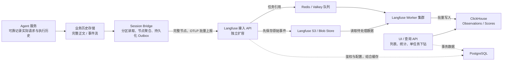

# 每天千万 Agent 请求：Langfuse 架构与大内容 Trace 容量分析

[返回任务索引](README.md) · [算法 Trace 设计](agent-trace-design.md) · [Session Bridge 实现方案](session-langfuse-bridge-design.md)

**负载前提：每天 1,000 万次 Agent 业务请求。**每次请求包含模型 context、工具输入输出、模型实际返回的 reasoning、执行关系、用量和评价信息。本文以全量采集为基线，讨论为什么架构能够扩展，以及完整正文带来的吞吐、存储和查询成本。

**结论：Langfuse v4 具备承载这一量级的架构条件，但部署容量必须按节点数和字节数核定。**每天千万请求平均约 116 次/秒；若每次生成 20 个节点，就是每天 2 亿条 observation。每节点平均 30 KB 时，未压缩导出内容约 6 TB/日，保留 30 天约 180 TB。长 Agent、长 context 会继续放大这个数字，因此需要生产级部署、容量预算和混合负载压测。

本文依据 2026-09-30 核对的官方资料，按 **Langfuse v4 原生 OTLP 接入**分析。文中明确区分官方架构事实、假设计算和本项目设计建议；尚未对目标部署开展吞吐或查询压测。

## 1. 大量 Agent Trace 到底是什么负载

业务请求、trace、observation 和上报 HTTP 请求是四个不同口径：

| 口径 | 本文定义 | 容量意义 |
| --- | --- | --- |
| Agent 请求 | 用户发起的一次任务或 Turn | 固定为 1,000 万/日；多轮 Session 可以包含多次请求 |
| Trace | 用同一 trace ID 关联的一组执行节点 | 本文假设一请求一 trace，子 Agent 通常形成子节点 |
| Observation | 根节点、模型调用、工具执行、检索、子 Agent 等 | 数据库行数、处理吞吐的主要计量单位 |
| 上报请求 | 一次 OTLP HTTP 批次 | 可以包含多个节点；受批次字节数、并发和 API 配额限制 |

重试、并行工具和子 Agent 都要计入节点数。流式 token/chunk 在源历史中的数量也应单独测量；最终按完整模型节点导出时，不必把每个 chunk 再变成一条 observation。评分和评价执行是额外数据，不能遗漏在容量预算之外。

不同内容的负载特征也不一样：

| 内容 | 保存目的 | 容量放大来源 |
| --- | --- | --- |
| Context | 证明当次模型实际收到的指令、历史、工具定义与证据 | 同一段历史在多轮模型输入中重复出现 |
| 工具输入 | 解释行动选择与调用参数 | 大查询、代码、文件内容或结构化参数 |
| 工具输出 | 核对检索、读取和执行结果 | 大文件、搜索结果、日志；随后可能再次进入 context |
| Reasoning | 保存供应商或运行时实际返回的可读内容及其来源 | 长文本、流式片段、summary/content 的重复保存 |
| Metadata / usage / score | 筛选、统计与版本对照 | 查询维度传播、评分次数、高基数标识 |

Reasoning 以实际可获得的数据为准。可读内容、摘要、不透明协议字段和 reasoning token 用量分别记录；只有 token 数时不能推导出 reasoning 正文。详细证据口径见[算法 Trace 设计](agent-trace-design.md)。

## 2. 架构怎样分担写入、存储和查询

Langfuse 当前由 Web、Worker、PostgreSQL、ClickHouse、Redis/Valkey 和对象存储组成。Web 提供接入和查询接口，Worker 执行异步处理，trace 分析数据主要由 ClickHouse 承载。[官方架构](https://langfuse.com/self-hosting)



图中的业务历史存储和 Bridge 是本项目的接入设计，Langfuse 自身的队列与原始事件存储是另一层。直接在 Agent 运行时用 SDK 埋点时可以省去格式转换，但仍要明确源数据可靠性和退出时的导出行为。

### 2.1 Agent 不等待分析数据库完成写入

本项目让 Agent 请求路径只负责可靠记录业务历史，Bridge 在后台导出。Langfuse 接入端先将事件保存到对象存储，再将任务引用放入 Redis；Worker 之后处理入库。数据库暂时变慢时，压力首先表现为积压和可见延迟。S3 中的原始事件提供恢复依据，但源端崩溃、队列故障和重放操作仍需各自的恢复机制，不能据此宣称端到端永不丢失。[Langfuse 接入与恢复设计](https://langfuse.com/self-hosting)

异步导出减少请求路径等待，但采集、序列化、落源历史仍消耗 CPU、内存和 I/O。SDK 的后台批量发送也不等于持久化 Outbox；短生命周期进程退出前需要 flush/shutdown。[SDK 排队与批量导出](https://langfuse.com/docs/observability/features/queuing-batching)

### 2.2 大正文不会全部堆进 Redis

队列主要保存原始事件的引用，完整批次保存在对象存储，因而积压的正文体积不直接等于 Redis 内存占用。对象存储承担持久化字节量，Redis 承担任务调度、缓存及其开销。Worker 和 API 处理批次时仍会把内容读入内存，必须限制批次大小与并发。[原始事件对象存储](https://langfuse.com/self-hosting/deployment/infrastructure/blobstorage)

### 2.3 ClickHouse 批量写入适合持续高吞吐

大量 observation 是持续追加的分析数据。批量插入能够摊薄网络、解析和创建数据 part 的固定成本；过多小批次则会加重后台 merge。Bridge 到接入 API 的批次和 Worker 到 ClickHouse 的批次是不同层级，需要分别观测。不能把“增大 SDK 批次”当作数据库写入已经最优的证明。[ClickHouse 插入策略](https://clickhouse.com/docs/concepts/best-practices/selecting-an-insert-strategy)

### 2.4 查询统计字段时，不必读取全部 context 和工具正文

ClickHouse 按列存储。统计模型费用、延迟或错误率时，查询主要读取筛选与聚合需要的列；完整输入输出的读取可以留到具体节点下钻。这使大正文和常规统计可以采用不同的访问成本。[Langfuse 的 ClickHouse 读路径](https://langfuse.com/resources/engineering/clickhouse-at-agent-scale)

官方工程资料还描述了按项目和时间组织数据，以及用截断正文的派生表示服务列表和仪表盘。这些优化减少不相关数据与大正文的读取；它们是 Langfuse 管理的内部存储实现，不应作为业务侧直接依赖的稳定表结构。[查询布局与派生表示](https://langfuse.com/resources/engineering/clickhouse-at-agent-scale)

因此，应用界面应先展示节点树、状态、耗时和预览，再按需读取完整内容。数据库能容纳数千个节点，并不保证一次返回整棵树及所有正文时，网络和浏览器也足够快。

### 2.5 v4 减少更新、JOIN 和查询去重的成本

早期模型将 traces 和 observations 分开，并支持开始、结束及后续更新。v4 将查询重点转到宽表和基本不可变的 observation，把常用 trace 维度放到相关节点中，减少分析时的 JOIN 与去重工作。[v4 数据模型演进](https://langfuse.com/blog/2026-03-10-simplify-langfuse-for-scale)

Bridge 应在节点完成后导出完整记录，将 session、user、版本等查询维度传播到相关节点。已经接收的节点不再通过重发同一 ID 补字段；v4 不能依赖读路径可靠去重，重复投递可能放大统计。原生接入需按指南设置 `x-langfuse-ingestion-version: 4` 并完成属性映射。[v4 接入契约](https://langfuse.com/integrations/native/opentelemetry/migration-to-v4)

### 2.6 接入、处理和查询可以分别扩容

接入 API 实例承担 HTTP 和对象写入，Worker 实例承担处理和数据库写入，UI/API 查询服务承担读取。高负载时可以分离接入和 UI 部署；具备计算分离能力的 ClickHouse Cloud/BYOC 可通过 `CLICKHOUSE_READ_ONLY_URL` 使用独立读计算组。指向同一台数据库的两个 URL 不会产生资源隔离。[扩容与读写隔离](https://langfuse.com/self-hosting/configuration/scaling)

PostgreSQL 主要承担事务状态，并非数亿条算法节点的主分析库。这降低了 trace 写入对事务库的直接冲击，但项目管理、媒体记录等相关操作仍可能使用它，不能完全忽略容量。[PostgreSQL 的职责](https://langfuse.com/self-hosting/deployment/infrastructure/postgres)

**这些机制共同提供扩展能力：写入可以排队、正文可以持久化、处理可以增加消费者、分析可以批量追加、查询可以少读列并隔离计算。**增加 Worker 仍需下游有剩余能力；队列、网络和数据库都可能成为下一处瓶颈。

## 3. 每天千万请求的容量模型

### 3.1 行数、字节数和峰值要分别计算

定义以下参数：

| 参数 | 含义 | 本文取值或测量要求 |
| --- | --- | --- |
| N | 每天 Agent 请求数 | 10,000,000 |
| K | 每请求平均导出节点数，含重试和根节点 | 示例为 20、100、1,000；需实测分布 |
| B | 全部导出节点的平均未压缩字节数 | 按节点统计，含输入输出、reasoning、属性和编码开销 |
| F | 导出峰值与全天均值的比值 | 示例为 10；需测任务完成时的实际峰值 |
| R | 保留天数 | 示例为 30；各存储层可分别设置 |

全量采集、每个完成节点导出一次时：

```text
每日节点数          = N × K
平均节点速率        = N × K / 86,400
示例峰值节点速率    = 平均节点速率 × F
每日未压缩导出内容量 = N × K × B
示例峰值内容吞吐    = N × K × B / 86,400 × F
单份内容保留量      = N × K × B × R
```

历史回补、评分、重复投递和迁移任务应额外计量。源历史流式事件数也可能远大于最终导出节点数。若 Bridge 在 Turn 结束时集中发送，Agent 入口请求峰值和 trace 导出峰值会发生偏移，不能只用入口 QPS 设计接入容量。

### 3.2 节点数与内容体积的敏感性

以下使用十进制单位：1 KB = 1,000 B，1 TB = 10¹² B；峰值按均值 10 倍。所有场景都是估算，**没有将某种 Agent 的平均内容量认定为 30 KB**。

| 场景 | 节点/请求 | 平均字节/节点 | 节点/日 | 平均节点/秒 | 峰值节点/秒 | 内容量/日 | 单份内容保留 30 天 |
| --- | ---: | ---: | ---: | ---: | ---: | ---: | ---: |
| 小内容对照 | 20 | 3 KB | 2 亿 | 2,315 | 23,148 | 0.6 TB | 18 TB |
| 含较多正文的示例 | 20 | 30 KB | 2 亿 | 2,315 | 23,148 | 6 TB | 180 TB |
| 较长正文 | 20 | 100 KB | 2 亿 | 2,315 | 23,148 | 20 TB | 600 TB |
| 多步骤任务 | 100 | 30 KB | 10 亿 | 11,574 | 115,741 | 30 TB | 900 TB |
| 多步骤且长正文 | 100 | 100 KB | 10 亿 | 11,574 | 115,741 | 100 TB | 3 PB |
| 很长的 Agent 任务 | 1,000 | 30 KB | 100 亿 | 115,741 | 1,157,407 | 300 TB | 9 PB |

同样每天千万请求，内容量可以从 TB/日上升到数百 TB/日。20 节点、30 KB 场景的平均内容吞吐约 69 MB/秒，10 倍峰值约 694 MB/秒；100 节点、100 KB 场景的峰值约 11.6 GB/秒。这是单段导出内容的逻辑吞吐，多次写入和读取还会消耗更多内部带宽。

表中假设峰值时节点大小分布与全天相同。若长任务同时结束，大节点和高节点速率可能一起出现；实际峰值字节速率需要直接测量，不能只乘一个请求峰值系数。

**每天千万请求具有架构可行性，不等于以上所有场景都适合相同集群、相同保留期和相同预算。**3 KB 的小内容对照不能作为完整 context、工具正文和 reasoning 的默认规划基线。

### 3.3 Context 重复保存可能比节点增长更快

简化假设：任务有 m 次模型调用，基础 context 为 C₀ 字节，每轮增加 d 字节，之后的请求继续携带此前历史；没有压缩、截断或增量传输时，累计模型输入约为：

```text
累计输入字节 = m × C₀ + d × m × (m - 1) / 2
```

例如 m = 40、C₀ = 10 KB、d = 2 KB，累计输入约 1.96 MB；最后一次输入仅约 88 KB。只按最终 context 大小估算，会明显低估整条 trace 的内容量。工具输出还可能同时出现在 TOOL 输出和后续 GENERATION 输入中。

这是假设下的数据放大分析；真实增量协议、截断和压缩会改变结果。缓存命中是否减少记录字节取决于传输和采集方式，费用降低不能直接换算成 trace 变小。需同时测量实际传输原文和展示用的重建视图，不能把重建完整输入重复导出后，仍只按传输 delta 预算。

原文归档可以用内容哈希、不可变块引用和快照/delta 降低重复，但完整证据必须能恢复。若仍将每轮展开后的 context 全量发送到 Langfuse，这部分导出和分析存储成本依然存在。文本压缩可降低物理字节数，压缩比要用真实样本测量，不能预设为固定 10 倍。[ClickHouse 压缩说明](https://clickhouse.com/docs/guides/clickhouse/data-modelling/compression/compression-in-clickhouse)

### 3.4 180 TB 不是直接采购的磁盘数

真实部署可能同时存在业务原文、Bridge Outbox、Langfuse 原始事件、ClickHouse 正文与派生结构、媒体和备份。各层保留期、压缩率与冗余策略不同，应分别预算：

```text
各存储层容量 ≈ 该层每日逻辑字节 × 保留天数 × 实测压缩系数 × 冗余/结构放大系数
总容量       ≈ 各存储层容量之和 + 迁移/merge/故障恢复所需余量
```

压缩系数定义为物理字节/逻辑字节；结构放大包含相关索引和派生表示。托管对象存储按提供商计费口径核算，不能机械地再乘一遍其内部冗余副本。ClickHouse 的实际压缩字节、复制策略和后台工作空间则需独立测量。

## 4. 完整正文怎样保存：两种方案的能力与成本

### 4.1 全量正文进入 Langfuse

模型节点保存实际输入、输出及已返回的 reasoning，工具节点保存参数与原始结果。内容通过支持的字段进入 Langfuse；原始接入事件在对象存储持久化，查询数据在 ClickHouse 中。适合希望主要在 Langfuse 内完成正文查看、搜索和评价的场景。

**S3-first 接入不表示长文本自动从 ClickHouse 移走。**完整文本仍是导出、处理和分析存储负载；Langfuse 的对象存储同时服务原始事件、媒体和导出等用途。[对象存储配置](https://langfuse.com/self-hosting/deployment/infrastructure/blobstorage)、[ClickHouse 存储职责](https://langfuse.com/self-hosting/deployment/infrastructure/clickhouse)

该方案保留完整算法证据，代价是按全量正文预算带宽、存储、读取和评价成本。列表与统计应采用紧凑字段，完整正文按节点下钻读取；大文本全文搜索和全量下载需单独做性能验收。

### 4.2 全量原文归档，Langfuse 保存节点、预览和引用

业务对象存储保存完整 context、工具原结果和可获得的 reasoning。Langfuse 接收完整节点关系、用量、维度、受控预览，以及不可变原文定位信息：`object_key + version/hash + bytes + content_type`。这是本项目可选择的成本控制方案，不是 Langfuse 自动提供的通用文本分层功能。

方案仍保留全量任务与节点，正文由业务内容服务按需打开。展示预览截断必须明确标注，工具原返回和模型实际收到的内容使用不同引用。不能用随时被覆盖的对象或短期签名 URL 作为永久证据。[Bridge 内容保存契约](session-langfuse-bridge-design.md)

| 能力 | 完整正文进入 Langfuse | 原文归档＋预览/引用 |
| --- | --- | --- |
| 节点树、耗时、用量、版本统计 | Langfuse 内完成 | Langfuse 内完成 |
| 完整正文查看 | 使用已入库正文 | 需要业务内容服务或受支持的媒体接入 |
| 全文搜索 | 对已入库内容使用支持的搜索能力 | 默认只覆盖已导入的预览；归档正文另建搜索能力 |
| 内容评价 | 按评价器能获取的节点字段执行 | 需要先读取原文，再通过评价服务提交分数 |
| 导出与 ClickHouse 正文字节 | 较大 | 较小；业务原文存储仍承担完整内容量 |
| 原文证据完整性 | 验证接入字段和内容无损 | 验证引用、权限、版本、恢复与保留期 |

用引用减小导出正文时，模型实际输入的完整性仍由归档证明。只保留预览会失去证据，不能称为全量保存。若需求是“在 Langfuse 内原生查到全部正文”，就应选择 4.1 并承担相应容量。

## 5. 千万/日部署需要处理哪些瓶颈

### 5.1 队列缓冲不等于无限处理能力

用 λ 表示节点输入速率、μ 表示节点处理速率。长期需要 μ 大于平均 λ，并预留故障恢复和突发的处理能力：

```text
突发新增积压 ≈ max(λ峰值 - μ, 0) × 突发持续时间
恢复时间     ≈ 新增积压 / (μ - λ恢复期)，仅在 μ > λ恢复期 时成立
```

以 20 节点/请求为例，平均 λ 约 2,315/秒。假设 μ = 5,000/秒，10 倍峰值持续 10 分钟，会积压约 1,089 万个节点；恢复到平均输入后，约需 68 分钟清空。每节点 30 KB 时，这些待处理内容约 327 GB。这里按节点计算，实际 Redis 队列 job 数取决于批次组织。

所以“API 接收成功率高”仍可能同时伴随较长可见延迟。自动扩容应关注输入/消费速率、待处理字节、最老任务年龄和队列深度；仅看 CPU 或 job 个数不足以反映大内容积压。

### 5.2 各层瓶颈与扩容条件

| 环节 | 大内容可能造成的问题 | 本项目应采取的措施 |
| --- | --- | --- |
| 源历史 / Bridge | 大 Session 反复解析、未完成节点占内存、Outbox 增长 | 增量读取、按任务分区、持久化状态、有界缓冲；已 ACK 正文按恢复策略清理 |
| 接入 API | 大正文解析和对象写入导致内存、连接、带宽饱和 | 按节点数与字节数限制批次；接入部署独立扩容；测量全链路请求大小限制 |
| 对象存储 | PUT/GET 次数、连接并发、吞吐或成本达到预算 | 批次对象、并发控制、连接复用、写入限速，监控读写延迟及费用 |
| Redis | 调度吞吐、缓存和队列开销增长 | 根据实际队列负载规划高可用和容量；分片仅按目标版本支持的方式实施 |
| Worker | 序列化、内容处理、网络和写入等待降低消费速率 | 按最老任务年龄及消费速率扩容，区分实时、回补和评价负载 |
| ClickHouse | 小 parts 过多、merge、磁盘、内存和网络竞争 | 保持批量写入；监控 merge/parts、写入耗时及磁盘余量，验证集群拓扑 |
| 查询 / UI | 长时间聚合、高基数分组、整树正文下载 | 项目/时间过滤、选择字段、分页、按节点下钻，限制查询并发与结果体积 |

Langfuse 官方指南明确覆盖接入/UI 分离、S3 写并发以及队列监测等扩容机制，具体参数应随目标版本确认。[部署扩容指南](https://langfuse.com/self-hosting/configuration/scaling)

### 5.3 查询、正文搜索和保留期分别设计

常规查询先以项目、时间范围、版本和状态缩小集合，再下钻具体任务。月份级数据聚合、按大量 session/user 分组、按 trace 读取正文的成本不同，应分别定义延迟目标。公开数据 API 优先选择字段并使用 cursor，避免把全部正文用于对账或统计。

当前全文搜索使用分词与短语匹配，不能将它理解为对所有长文本进行任意子串扫描都能快速完成；中文、代码、JSON 和 reasoning 的检索效果需用真实内容验证。[全文搜索语义](https://langfuse.com/docs/observability/features/full-text-search)

本项目可先规划 30 天在线正文、较长时间的业务原文归档和独立统计数据保留，具体期限由业务需要决定。已入库节点、原始接入事件和媒体的清理应协调，避免引用仍在而正文已删除；保留策略会产生后台删除负载。相关功能的可用范围也需按自建版本或套餐核实。[数据保留机制](https://langfuse.com/docs/administration/data-retention)

### 5.4 Cloud 配额与批次设计

按当前官方 API 限制，Pro/Team/Enterprise 的标准 Tracing 配额为 20,000 次 HTTP 请求/分钟，Enterprise 可申请定制；同组织共享配额。General API 标准高阶配额为 1,000 次/分钟，包含 Observations API v2；自建实例没有同样的产品硬配额，仍受实际设施限制。[API 限制](https://langfuse.com/faq/all/api-limits)

在 23,148 节点/秒的示例峰值下：

| 每批平均节点数 | 所需上报请求/秒 | 30 KB/节点时的平均批次正文 |
| --- | ---: | ---: |
| 20 | 1,157 | 约 0.6 MB |
| 100 | 231 | 约 3 MB |

第一行超过标准 Tracing 配额；第二行只是请求次数层面符合，仍需核对请求大小、网络、流量分布与节点吞吐。每批 100 节点不是推荐常量，长正文会让它变成过大的请求。

若每个业务请求都查一次入库，每天千万意味着平均约 6,944 次查询/分钟，超过上述 General API 配额。Bridge 正常投递以接收回执推进，未知结果进入专项对账，正常链路做抽样与总量核验；异常比例升高时也要限制对账并发，避免读负载反过来压垮摄取。

### 5.5 评价与采样是独立选择

全量采集不等于全量运行 LLM Judge。每次任务若跑 3 个 Judge，就额外需要 3,000 万次评价/日，还会产生评价记录和模型费用。规则评价、业务验收与 LLM Judge 应分别设置覆盖率和处理预算。

本文的容量结论没有依赖采样。若以后允许抽样降低成本，应按完整 trace 做决定，并保留采样率与选择规则。Langfuse SDK 提供客户端 trace 级采样；“异常全保留＋正常抽样”需要在结果已知后由 Bridge 或其他受控管道决策。统计总体质量与消耗时仍需全量依据，不能直接用偏向异常的样本替代。[采样机制](https://langfuse.com/docs/observability/features/sampling)

## 6. 与 Session Bridge 方案怎样衔接

继续使用[组件实现方案](session-langfuse-bridge-design.md)中的 Reader → Adapter → Node Builder → Outbox → Sender → Reconciler，按以下原则扩展：

1. **源历史可靠、增量可读。**按租户/任务等稳定标识分区，源记录有版本与游标，避免每新增一次工具结果就扫描整个 Session。
2. **任务状态分区管理。**同一任务的节点聚合由一个有租约的处理方负责；未完成节点状态持久化，不能把所有长任务保留在进程内存中。
3. **完成节点冻结后批量导出。**批次同时限制节点数和序列化字节数，Sender 并发与目标吞吐联动；长任务可以在验证父子展示语义后持续导出已完成子节点。
4. **Outbox 保留任务引用与恢复依据。**大请求体可放不可变对象中，事务记录保存引用、校验和、状态与租约；该设计需要处理孤立对象和事务边界。
5. **实时、历史回补、对账、评价分别限速。**回补仍使用原执行时间，避免掩盖实时摄取积压；未知投递按原方案对账，重复风险要计入计数准确性验收。
6. **内容服务保持证据可达。**采用正文引用方案时，读取完整 context、工具原返回、有效模型输入和 reasoning 都能定位到当次版本，权限与保留期一致。

本方案无需先重写 Langfuse 内部组件。应先测量源历史和导出数据的实际分布，再判断瓶颈属于 Bridge、Langfuse Worker、对象存储还是 ClickHouse。

## 7. 用什么证据确认“当前部署能承载”

官方披露 Langfuse 平台每月处理 900 亿以上 observations，表明其架构已用于大规模数据处理。这是厂商平台总量，不能证明某个套餐或某套自建集群在我们的正文大小、查询并发下达到相同服务水平。[官方规模说明](https://langfuse.com/self-hosting)

官方最小资源表用于说明启动要求，不能当作千万/日的配置建议。部署基线应使用 Langfuse v4 原生接入；当前 v4 基础设施文档要求 ClickHouse 至少 25.12、推荐 26.4，不能沿用 v3 的最低版本。最终验收记录要写明服务器、SDK/Exporter、数据库和配置的确切版本。[ClickHouse 部署要求](https://langfuse.com/self-hosting/deployment/infrastructure/clickhouse)、[版本兼容性](https://langfuse.com/docs/compatibility)

### 7.1 从实际样本取得负载参数

样本覆盖短任务、长任务、并行工具、重试、长 context、reasoning 和大工具输出，分别统计：

- 每请求节点数的平均值、P95/P99、最大值，以及按任务类型的占比。
- 每节点和每任务未压缩导出字节数；context、工具、reasoning 各自占比。
- 源历史流式事件量、上下文重复率、传输原文与重建视图的大小差异。
- 每分钟导出峰值、同步结束的任务数量、历史回补量。
- 各存储层的实际压缩、对象请求次数、复制开销和保留量。
- UI 用户数、查询并发、常用时间窗口、正文查看与下载频率。

采样测量需要保持任务类型和长尾比例，不能只用六节点协议样例或大量重复的小字符串测出“最大 QPS”。

### 7.2 在保留期存量上进行写入与查询混合压测

| 场景 | 需要验证的结果 |
| --- | --- |
| 目标持续写入，建议覆盖至少一个完整业务周期 | 消费跟上输入，积压和内存没有持续增长 |
| 真实峰值及大正文长尾 | 接收成功率、可见延迟和批次内存满足目标 |
| 达到目标 30 天存量后同时查询 | 常用聚合、列表和单任务下钻的 P95/P99 满足目标 |
| 查询数千节点及大正文 | API 返回体积、下载耗时、浏览器内存和交互可用 |
| Worker/数据库短暂不可用及恢复 | 源记录、接收记录、可见记录可对账，积压按预算时间清空 |
| ACK 丢失、超时、重复与部分拒绝 | 不把接收回执等同于完整可见；缺失和重复均可识别 |
| 实时摄取与历史回补、评价、清理并行 | 实时负载仍满足服务目标；后台工作不持续抢占资源 |

压测前明确接收错误率、接收后可见延迟、查询 P95/P99、最大恢复时间及月度成本目标；这些是本项目的验收指标，本文不编造官方保证值。

监控至少包含源水位、Outbox 最老年龄、未知投递数、Langfuse 队列最老年龄、输入/消费节点与字节速率、ClickHouse 写入/merge/查询耗时、对象存储错误，以及缺失与重复比例。单看 API 的 2xx 和 CPU 使用率无法证明完整承载。

## 8. 本项目的容量结论与待验证项

**可作架构决策的结论：**采用 Langfuse v4 作为每天千万 Agent 请求的算法观测平台有依据。异步接入、对象持久化、引用队列、Worker 扩容、ClickHouse 批量追加与列式分析，使大量 context、工具输入输出和已返回 reasoning 可以被持续采集与按需分析。

**正文能力的选择：**如果要求在 Langfuse 内原生查看和搜索全部正文，按完整导出量规划；如果允许业务内容服务提供完整原文，可保留全量节点与归档证据，只导入预览和引用，降低分析平台的正文负载。第二种方案需要补齐正文查看、搜索和评价能力。

**尚未得到的结论：**当前部署所需机器数、节点吞吐上限、正文大小上限、查询延迟和成本。每天千万请求必须进一步落实为真实 K、B、F 和保留期，并完成第 7 节验收，才能宣布某套部署已达标。

下一步先从自研 Agent 历史中测得节点与内容分布，确定完整正文的保存方式，再用目标存量和峰值同时验证摄取、查询、恢复及成本。
