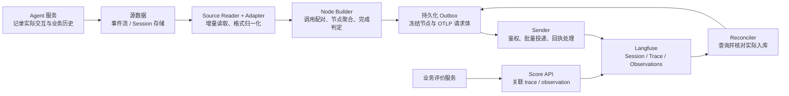

# 云端 Agent Session 自动导入 Langfuse：组件实现方案

[返回任务索引](README.md) · [算法效果与 Trace 设计](agent-trace-design.md)

**本文解决的问题：**不同自研 Agent 的 Session 格式如何自动转换成可分析的轨迹，转换组件如何实现，数据具体通过什么接口进入 Langfuse。

**结论：通常需要自研一个 Session Trace Bridge。**它负责识别业务历史、恢复调用关系、组织算法证据、维护导出状态；Langfuse 接收标准 observation 并提供展示、查询与评价能力。每种 Session 格式编写适配器，后面的节点构建与投递流程共用。

本文是可供开发评审的设计，包含协议样例，尚未实现或完成云端接入验收。接口依据 2026-09-30 核对的官方文档，按 **Langfuse v4 ingestion** 设计；部署前应核对目标实例能力，旧实例需先完成兼容性验证。

## 1. 为什么需要组件，需要自研到哪一层

Langfuse 能理解 Agent、模型、工具等 observations，无法自动知道某个自研历史中的 `action` 是模型输出还是工具执行，也无法从任意消息列表确定当次模型实际看到了什么。Session JSON 不能直接作为 OTLP 请求体上传。

| 能力 | 自研组件负责 | 可复用能力 |
| --- | --- | --- |
| 识别历史格式 | 各服务的版本化适配器、字段语义、增量读取 | 业务数据库、对象存储、事件流 |
| 还原算法过程 | Turn/Step 边界、模型与工具调用关系、输入来源 | Agent 服务提供的调用 ID 和请求记录 |
| 维护导出状态 | 完成判定、持久化节点、重复消费处理、回补与对账 | 数据库事务、任务队列、分布式租约 |
| 形成观测数据 | 节点树、Langfuse 属性映射、内容完整性 | Langfuse SDK 或标准 OTLP 协议 |
| 查看与评价 | 提供业务验收结果、评分关联 ID | Langfuse 轨迹、Session 分组、Scores、实验 |

两种接入路径可以共存：

- **已有历史、格式多样：**采用本文 Bridge，从持久化 Session 自动读取并转换。
- **可直接改造 Agent 运行时：**在模型、工具和任务边界用 Langfuse SDK 记录完整节点，省去历史解析；仍补齐业务 ID、真实输入、完成状态与评价。若同时保留 Bridge 回补，应指定同一批节点只有一个导出方。

本文选择 **归一化事件 → 持久化完整节点 → OTLP HTTP/JSON 导出**。历史节点的时间和 ID 已由源数据确定，需要保存确切请求体并管理每次投递回执，因此使用受控 Sender。它需要实现 OTLP 编码与响应处理，不能仅把任意 JSON 发给端点。运行时直接埋点优先用 SDK；TypeScript 路径的核对基线为 `@langfuse/tracing@5.11.1`、`@langfuse/otel@5.11.1`。[原生 OTLP 集成与 SDK 建议](https://langfuse.com/integrations/native/opentelemetry)

## 2. 架构与运行方式



首期部署为独立后台 Worker，依赖一套事务数据库存检查点、事件、节点与 Outbox。Reader、Builder 和 Sender 可以在一个进程中运行，接口保持独立，后续按源分区或 turn 分片扩容。Agent 请求路径只负责可靠记录历史，不等待 Langfuse 响应。

首期在 **Turn 终结且源数据完整到达后** 冻结整条 trace 并导出，适合离线诊断与短任务。长任务可在第二阶段导出已完成子节点，根节点到任务结束才发送；父 ID 提前分配，子节点先到时的查询/展示行为必须在目标实例验证。运行中的状态由业务任务系统承载。

源事件与业务状态最好同事务落库，或用业务 Outbox/CDC 可靠转发。Bridge 的可靠消费不能弥补 Agent 只把请求写到内存、崩溃后历史消失的问题。

## 3. Agent 侧先提供哪些历史

### 3.1 最小采集契约

| 记录位置 | 必须保存 | 缺少时的后果 |
| --- | --- | --- |
| 用户请求进入 | session/thread/turn ID、原始任务、配置版本、开始时间 | 无法稳定分组或确定评价目标 |
| 模型请求发送前 | invocation/attempt ID、实际发送内容、模型/参数/工具定义、上下文处理结果 | 只能重建输入，不能确认为真实输入 |
| 模型响应结束 | invocation/attempt ID、模型返回的 response ID、响应、工具 call ID、实际用量、结束状态/时间 | 无法准确配对、计算消耗或区分重试 |
| 工具执行边界 | execution ID、模型 call ID、发起 invocation/attempt ID、参数、原返回、状态与时间 | 并行工具易错配，证据流断开 |
| 下一次模型请求 | 实际进入请求的工具内容及前序响应引用 | 无法判断原返回是否被截断或遗漏 |
| 任务结束 | turn ID、最终回答/产物、终结原因、结束时间、终结序号 | 无法安全冻结根节点 |

模型的调用尝试与工具的执行尝试分别有唯一身份：网络重试产生独立 `attempt_id`，业务重试产生独立 execution ID。模型返回的工具 `call_id` 与一次实际工具执行不能混作同一层 ID。

这些字段的来源与配对规则见第 5 节：`invocation_id/attempt_id/execution_id` 是 Agent 服务的记录字段，模型响应 ID 和工具 call ID 来自具体模型协议。

模型使用增量协议时，保存实际请求的 delta、`previous_response_id` 等关系及可恢复的状态；另生成完整逻辑输入视图，标为 `reconstructed`。若服务能记录预算、截断和压缩之后的完整逻辑上下文，可增加 `effective_context` 快照，并标明采集点。两种视图分别保留，不能把恢复出的文本标成实际传输内容。

### 3.2 内容的保存方式

结构化小内容直接入历史；长文本、图片或附件用不可变对象引用：`object_key + version/hash + bytes + content_type`。引用指向当次内容，不能指向随时变化的“最新文件”。Bridge 的访问权限应能取到这些对象。

每份内容带 `source`、`truncated`、`redacted`、`missing_reason`。例如 `request_boundary` 表示实际发送边界，`reconstructed` 表示历史重建，`unavailable` 表示缺失。工具原返回、模型实际收到的返回、界面预览是三个独立视图。

按业务配置单节点字节上限、预览长度及对象保留期；大内容以预览和受控引用导出。Langfuse 不会自动解引用任意业务对象：完整内容需要另行导入受支持的媒体，或通过业务内容服务查看。引用保存对象身份，不保存短期签名 URL 作为永久证据。

## 4. 不同 Session 格式怎样统一

### 4.1 Reader 与 Adapter 的职责

Reader 只处理存储与增量读取，Adapter 只处理源格式语义，禁止在适配器里直接调用 Langfuse。

```text
SourceReader.read(checkpoint, limit)
  → records、下一检查点、完成水位

SessionAdapter.normalize(record, source_version)
  → CanonicalEvent[] 或明确的解析错误

NodeBuilder.apply(event)
  → 更新节点状态，满足冻结条件时产生完整 NodeRecord

LangfuseMapper.encode(frozen_nodes)
  → 不可变 OTLP ExportTraceServiceRequest
```

事件流用分区/offset，数据库用可靠变更序号或 CDC cursor；JSONL 用对象版本和完整行的偏移。时间戳用于计算时序，不能作为唯一读取检查点，避免同时间事件或迟到写入被漏掉。

若源是不断覆盖的 Session 快照，Reader 用 `session_id + revision` 识别更新，Adapter 对稳定 message/call ID 做差分。**只有消息数组、没有稳定 ID 和 revision 时，不能保证跨快照去重与调用配对。**应先补采集契约；一次性历史快照可按冻结版本和数组位置导入，但不能宣称支持任意历史重写后的增量恢复。

快照中未变化的调用不能因 revision 变化就产生新的事件身份；按调用 ID、事件 kind 和真实变更身份生成 event ID。JSONL 文件末尾尚未写完的一行暂缓读取，检查点停在最后完整行；确认封存后仍损坏的行才进入隔离。

格式由 `source_type + source_version` 选择适配器。未知版本、非法 JSON 和必需字段缺失进入隔离队列，记录位置及原因；不能跳过后仍报告整条 Session 完整。游标可在错误记录已持久化隔离后继续推进，修复适配器后单独重放。

### 4.2 统一事件示例

下面是建议的内部契约，字段名属于本方案；各业务格式都转换到它：

```json
{
  "schema_version": "1",
  "event_id": "svc-a:s-42:revision-7:record-19",
  "source": {"type": "svc-a", "version": "2", "cursor": "p0:19"},
  "tenant_id": "tenant-a",
  "session_id": "s-42",
  "thread_id": "thread-42",
  "turn_id": "turn-3",
  "step_id": "step-0",
  "node_id": "model-invocation-9:attempt-1",
  "parent_node_id": "step-0",
  "kind": "model.completed",
  "occurred_at": "2026-09-30T08:00:01.000Z",
  "sequence": 19,
  "links": {"invocation_id": "model-invocation-9", "attempt_id": "1", "provider_response_id": "resp_009"},
  "payload": {"response": {"role": "assistant", "content": "16"}, "status": "ok"},
  "evidence": {"source": "response_boundary", "truncated": false, "redacted": false}
}
```

事件种类至少包含 `turn.started/finished`、`step.started/finished`、`model.requested/completed`、`tool.started/completed`。上下文处理、检索与子任务在扩展类型中定义。每种 kind 的 payload 单独校验，结束事件不必重复开始事件已经持久化的输入。

`event_id` 由稳定源身份生成，用于消费去重；`node_id` 标识调用/步骤，用于配对开始与结束；`sequence` 定义源内顺序。三者不能互相替代。没有显式 Step 时，适配器按模型调用及其触发的工具合成 Step，并记录 `step_source=derived`。

### 4.3 两种格式如何接到同一后半段

| 源格式示例（均为假设） | Adapter 输出 |
| --- | --- |
| A：`llm_start {request_id, messages, ts}`、`llm_end {request_id, response, usage, ts}` | 相同 node ID 的 `model.requested` 与 `model.completed` |
| B：`action {id, type: model, started_at, ended_at, request, result}` | 从一条记录展开上述两个事件，保留原时间和调用 ID |
| A：`tool_start/tool_end`，带 originating request 和 call ID | 配对工具节点，关联触发模型与后续使用结果的请求 |
| B：消息列表仅有“调用工具”和一条文本结果 | 有稳定 call ID 才配对；缺失则标为关系未知，并要求服务补采集 |

新增一种格式只实现 Reader/Adapter 并用该格式的样本验收。Node Builder、Langfuse Mapper、Outbox 与 Sender 不复制。并行场景不能仅凭“上一条模型消息”或时间邻近推断父子关系。

## 5. 从 Session 事件形成 Agent Trace：链路如何成立

这一环节把分散的历史记录组织成算法同学可以查看的执行过程：**先归并同一次调用的记录，再关联调用与任务，最后转换成 Langfuse 支持的节点。**第 4 节解决不同格式的统一，本节说明统一之后为什么能够构建 trace，第 6 节说明这些节点如何进入 Langfuse。

### 5.1 关联依据来自哪些协议字段

事件形成节点，需要明确的字段配对规则。这里以 **Responses API 的自定义 function calling** 为例：Session 保存模型协议原文，同时由 Agent 服务记录该次交互的业务归属与调用上下文。下面区分两类字段的来源；这些来源记录经过第 4 节适配后，再统一构建节点。

| 字段 | 谁提供 | 在关联中起什么作用 |
| --- | --- | --- |
| `session_id / turn_id` | Agent 服务记录 | 将请求、工具执行和最终回答归入对话与本轮任务 |
| `invocation_id + attempt_id` | Agent 服务在调用模型前分配，随调用上下文记录 | 将发送的请求与收到的响应配对，并区分重试尝试 |
| `response.id` | 模型响应协议 | 标识模型返回的响应；接收时绑定到上述 invocation/attempt |
| `output[].call_id` | 模型响应中的 `function_call` 项 | 标识模型要求执行的工具调用 |
| `execution_id` | Agent 服务在执行工具前分配 | 将工具开始与结束记录配对，区分同一 call 的不同执行尝试 |
| `input[].call_id` | 下一次请求中的 `function_call_output` 项，沿用模型给出的值 | 将回填结果对应到先前的工具调用 |
| `previous_response_id` | Agent 在下一次请求中填入模型返回的 response ID | 在采用该模式时，延续前一次响应的上下文 |

`invocation_id/attempt_id/execution_id` 属于本方案建议的 **Session 记录协议**，由服务或已有网关记录；它们通过记录封套保存，无需添加为模型 API 的请求体字段。模型请求发出时尚未取得该响应的 `response.id`，因此发送与接收两端需要保留调用上下文。

对于流式响应，同一调用的流处理器保留 invocation/attempt；`response.created` 与 `response.completed` 中的 `response.id` 标识该响应。中间输出项及增量结合流上下文和 item 身份归并，不要求每条增量事件都携带相同字段。[Responses 响应与流式事件](https://developers.openai.com/api/reference/typescript/resources/beta/subresources/responses/methods/create)

在此协议中，`function_call` 的 `call_id` 与回填项的 `call_id` 对应。该项自身的 `id` 用于标识输出 item；工具执行尝试另由 execution ID 标识。[Function calling 字段与回填方式](https://developers.openai.com/api/docs/guides/function-calling)

### 5.2 用一段协议记录说明如何形成 trace

以“读取 values.txt，输出三个整数的和”为例。以下是**合成的 Session 记录片段**：外层 `kind/links` 属于建议的记录协议，`payload.request/response` 中的字段来自 Responses 协议。所有记录共同归属 `session_id=s-42, turn_id=turn-3`；这里只展示关联字段和部分内容，省略时间、模型、工具定义等完整记录字段。

```json
[
  {
    "kind": "model.requested",
    "links": {"invocation_id": "inv_001", "attempt_id": "1"},
    "payload": {"request": {"input": [{"role": "user", "content": "读取 values.txt，输出三个整数的和。"}]}}
  },
  {
    "kind": "model.completed",
    "links": {"invocation_id": "inv_001", "attempt_id": "1"},
    "payload": {"response": {"id": "resp_A", "output": [{"type": "function_call", "id": "fc_A", "call_id": "call_A", "name": "read_file", "arguments": "{\"path\":\"values.txt\"}"}]}}
  },
  {
    "kind": "tool.started",
    "links": {"originating_invocation_id": "inv_001", "originating_attempt_id": "1", "call_id": "call_A", "execution_id": "exec_001"},
    "payload": {"arguments": {"path": "values.txt"}}
  },
  {
    "kind": "tool.completed",
    "links": {"originating_invocation_id": "inv_001", "originating_attempt_id": "1", "call_id": "call_A", "execution_id": "exec_001"},
    "payload": {"output": "3 5 8"}
  },
  {
    "kind": "model.requested",
    "links": {"invocation_id": "inv_002", "attempt_id": "1", "input_tool_results": [{"call_id": "call_A", "execution_id": "exec_001"}]},
    "payload": {"request": {"previous_response_id": "resp_A", "input": [{"type": "function_call_output", "call_id": "call_A", "output": "3 5 8"}]}}
  }
]
```

转换组件据此建立的关系是：

| 要恢复的关系 | 字段配对规则 | 形成的轨迹 |
| --- | --- | --- |
| 模型请求与响应 | 两条记录的 `invocation_id=inv_001` 且 `attempt_id=1` | 一个 GENERATION 节点，输入来自请求，输出来自响应 |
| 模型选择工具与实际执行 | 响应的 `output[].call_id=call_A`；执行记录保存相同 call ID 及 originating invocation/attempt | 将 TOOL 节点关联到发起它的模型输出 |
| 工具开始与结束 | 两条记录的 `execution_id=exec_001` | 一个 TOOL 节点，保留参数、原返回及执行时间 |
| 工具结果回到模型 | 下一次请求的 `function_call_output.call_id=call_A`，并记录实际发送的 `output` | 关联到 invocation `inv_002` 的输入，核对回填内容 |
| 响应链延续 | 下一次请求的 `previous_response_id=resp_A` 对应上一次响应的 `id` | 保留模型上下文的延续关系 |

这些配对均在租户、服务及任务作用域内进行。重试执行时 execution ID 分开保存；样例的 `links.input_tool_results` 是 Agent 补充的来源关系，记录此次回填选用了哪个 execution 的结果，便于比较原返回与实际回填内容。

采用 `previous_response_id` 的样例依赖模型服务支持响应状态延续；自行管理历史时，应记录实际发送的完整历史及工具回填项。`previous_response_id` 说明上下文连接，证据是否进入模型请求仍需检查实际 input 内容。[Responses 上下文延续](https://developers.openai.com/api/docs/guides/conversation-state)

据此生成的展示结构为：

```text
Session s-42
└── Turn trace（turn-3）
    └── AGENT：用户任务 → 最终回答
        ├── SPAN / Step 1：获取数据
        │   ├── GENERATION：inv_001 / attempt 1 → resp_A
        │   └── TOOL：exec_001，执行 call_A → 3 5 8
        └── SPAN / Step 2：形成答案
            └── GENERATION：inv_002 / attempt 1，输入回填 call_A
```

Session/Turn 身份决定分组和 trace 归属，invocation/attempt 与 execution 身份决定调用节点，`call_id` 决定模型输出与工具回填之间的关系。Step 根据这些调用关系组织阅读；树中的父关系与信息流关联分别保留，再映射到第 6 节的 Langfuse 字段。

其他模型接口按其协议建立对应映射。例如 Chat Completions 使用 `tool_calls[].id` 与工具消息的 `tool_call_id` 配对；适配器将这些字段映射到统一的工具调用身份。没有关联字段的自研协议需由 Agent 服务补充，并保存到 Session。

### 5.3 什么情况下可以导出

一个可以用于诊断的节点，应能说明 **这次调用的输入、结果或终结原因，以及内容的来源**。调用失败或取消也能形成节点，执行状态如实记录；缺少实际输入时，标明证据缺失或重建来源。

首期选择在一轮任务结束、相关历史确认已到齐后导出整条 trace。这使组件可以先组织完整执行过程，再提交给 Langfuse。Agent 服务需要提供“本轮历史已记录完成”的依据；任务显示结束但部分记录仍在异步写入时，应等待确认，或将轨迹标为不完整。

这个导出时点与 Langfuse v4 的完整、不可变 span 模型相匹配：先在组件内汇集内容，节点结束后上报一次；任务质量评分后续单独关联。迟到内容作为新的关联记录处理。[Langfuse 的完整节点要求](https://langfuse.com/integrations/native/opentelemetry/migration-to-v4#export-complete-immutable-spans)

对于长任务，可以进一步支持已完成子节点先导出、根节点在任务终结时导出。其展示时序需要单独验证；首期采用整轮导出即可验证 Session 到 Langfuse 的链路。

### 5.4 为什么这条链路在方案上可行

可行性依据来自输入、转换和接收三个环节：

| 环节 | 可行性依据 | 当前判断与前提 |
| --- | --- | --- |
| Session → 调用节点 | 请求、响应、工具执行和任务结果能够提供节点所需事实；分散记录可按调用身份归并 | 需确认自研 Session 具备这些内容；缺失信息应在 Agent 侧补采集 |
| 调用节点 → Agent Trace | 任务归属、调用关系与实际模型输入足以组织执行树及信息关联 | 需有稳定身份，才能支持并行与重试；节点事实与内容来源分别保留 |
| Agent Trace → Langfuse | Langfuse 支持 Agent、Generation、Tool 等节点、父子关联和 Session 分组，并提供标准 OTLP 接收接口 | 可映射到现有数据模型；具体协议与样例见第 6 节 |

Codex 案例已验证“Session 历史转换为 Agent、模型与工具 observations，并在 Langfuse 查询”的基本路径。它说明转换与接收之间存在已验证的连接；自研格式的适配、真实输入覆盖和云端异常恢复仍需用本服务样本验证。[案例验证摘要](assets/agent-trace-verification.json)

因此，本方案的可行性结论是：**当 Session 提供可关联的执行事实时，可以通过格式适配和节点组织，将其转换成 Langfuse 能接收的 Agent Trace。**各服务首先检查历史的数据条件，再用一条含模型与工具调用的真实任务核验节点、关系和内容。完成这项验证后，才扩大到多轮、并行和长任务场景。

## 6. 如何真正导入 Langfuse

### 6.1 入口、鉴权和协议

Bridge 的 Sender 向目标实例发送 **OTLP ExportTraceServiceRequest**：

```http
POST {LANGFUSE_BASE_URL}/api/public/otel/v1/traces
Authorization: Basic <base64(public_key:secret_key)>
x-langfuse-ingestion-version: 4
Content-Type: application/json
```

`LANGFUSE_BASE_URL` 是所属区域或自托管实例的基地址；密钥从服务端密钥配置读取，绑定目标项目，不进入 Session、Outbox 正文或日志。当前端点支持 OTLP HTTP/JSON 与 HTTP/protobuf，不使用 gRPC。本文选 JSON 方便保存与核对。[Langfuse OTLP 接收接口](https://langfuse.com/integrations/native/opentelemetry)

请求体的层级是 `resourceSpans → scopeSpans → spans`。`traceId` 为 32 位 hex，`spanId/parentSpanId` 为 16 位 hex；时间为 Unix 纳秒十进制字符串，JSON 字段用 lowerCamelCase，枚举值用整数。不要把 ID 编成 base64 或把毫秒数直接放到纳秒字段。[OTLP JSON 编码规则](https://opentelemetry.io/docs/specs/otlp/)

不需要先创建 Session 或调用独立 trace-create：带同一个 `traceId` 的 spans 形成 trace，`langfuse.session.id` 对这些 traces 分组。根 observation 自身记录用户输入和最终输出，供结果阅读与评价。[v4 根节点与输入输出要求](https://langfuse.com/integrations/native/opentelemetry/migration-to-v4)

### 6.2 执行节点到 OTLP 属性的映射

以下属性在 OTLP span 的 `attributes` 中编码。结构化值先 JSON 序列化，再作为 `stringValue`；标签用 `arrayValue`。属性名遵循 Langfuse 映射，不另造同义字段。[属性映射表](https://langfuse.com/integrations/native/opentelemetry#property-mapping)

| 内部数据 | OTLP 字段 / 属性 | 编码规则 |
| --- | --- | --- |
| trace/span/parent ID | `traceId/spanId/parentSpanId` | 直接字段，根无 parent |
| 名称、时间 | `name/startTimeUnixNano/endTimeUnixNano` | 源执行时间，均需提供 |
| 节点类型 | `langfuse.observation.type` | 小写 `agent/generation/tool/span/retriever` 等 |
| 输入与输出 | `langfuse.observation.input/output` | JSON string；模型输入优先角色消息数组 |
| 模型及参数 | `langfuse.observation.model.name/parameters` | 模型 string；参数 JSON string |
| 实际用量、费用 | `langfuse.observation.usage_details/cost_details` | JSON string，只填有依据的值 |
| 执行错误 | `status.code=2`、`langfuse.observation.level=ERROR` | `status_message` 说明错误；取消与答案错误分别记录 |
| 任务与会话 | `langfuse.trace.name`、`langfuse.session.id` | 每个相关 span 都复制 |
| 用户与版本 | `langfuse.user.id`、`langfuse.release`、`langfuse.version`、`langfuse.environment` | 每个需要筛选的 span 都复制 |
| 标签 | `langfuse.trace.tags` | 字符串数组；每个相关 span 都复制 |
| 业务与证据字段 | `langfuse.observation.metadata.<key>` | 如 `turn_id`、`step_id`、`input_source`、`agent_version` |

筛选所需的租户、任务类型、模型/Agent/prompt 版本、业务 ID、证据来源等用明确的 metadata 顶层键。仅在根节点设置公共维度，或全部塞入嵌套对象，可能无法筛选和汇总子 observations。当前文档要求查询维度传播到每个相关 span。[上下文传播与 metadata](https://langfuse.com/integrations/native/opentelemetry/migration-to-v4#make-metadata-filterable)

执行成功可用 OTLP `status.code=1`。`kind=1` 表示 INTERNAL，模型/远程工具通常可用 CLIENT（`kind=3`）；这些整数和业务任务评分没有对应关系。输入不完整用 metadata 和 WARNING 提示，不能因缺历史而把模型调用记成运行失败。

### 6.3 可直接对照的上报数据

完整合成请求体见 [六节点 OTLP JSON 样例](assets/session-bridge-example.otlp.json)。它表示“读 values.txt，返回 3 5 8，回答 16”，含 1 个 AGENT、2 个 SPAN、2 个 GENERATION、1 个 TOOL；所有节点时间已结束，未携带真实业务数据。

该 OTLP 样例将模型输入输出整理为角色消息展示视图，调用身份放在 metadata 中。第 5 节展示的是上游原始协议的关联方式；实际接入还应按第 3 节保存原始请求/响应及展示视图的来源。

样例中的 ID 是演示常量；实际转换按第 5.2 节的身份对应关系，为每个业务任务和节点分配稳定 ID。独立验证轮次使用不同 namespace，重跑投递测试时遵循第 7 节的状态与对账规则。

下面用简化输入展示一个模型节点的编码形式；完整请求上下文和公共 metadata 见样例文件：

```json
{
  "traceId": "11111111111111111111111111111111",
  "spanId": "0000000000000006",
  "parentSpanId": "0000000000000005",
  "name": "model.answer",
  "kind": 3,
  "startTimeUnixNano": "1790755202000000000",
  "endTimeUnixNano": "1790755204000000000",
  "attributes": [
    {"key": "langfuse.observation.type", "value": {"stringValue": "generation"}},
    {"key": "langfuse.observation.model.name", "value": {"stringValue": "tutorial-model"}},
    {"key": "langfuse.observation.input", "value": {"stringValue": "[{\"role\":\"tool\",\"tool_call_id\":\"call-0\",\"content\":\"3 5 8\"}]"}},
    {"key": "langfuse.observation.output", "value": {"stringValue": "{\"role\":\"assistant\",\"content\":\"16\"}"}},
    {"key": "langfuse.observation.usage_details", "value": {"stringValue": "{\"input\":160,\"output\":30,\"total\":190}"}},
    {"key": "langfuse.session.id", "value": {"stringValue": "tenant-a:demo:s-42"}}
  ],
  "status": {"code": 1}
}
```

收到这个请求并完成处理后，Langfuse 应呈现第 5.2 节的树。展开 TOOL 可见原始结果，展开第二个 GENERATION 可见含 `3 5 8` 的模型输入，根节点可见任务与 `16`。输入完整性仍由采集点证明；样例的 `synthetic_request_boundary` 只说明它是合成数据。

### 6.4 用量与后续评分

仅在 GENERATION 写该次实际 usage，根/Step 不重复写子节点总量。未知用量保持缺失，不能填 0；没有价格依据时不写费用。样例两次模型用量为 120 与 190，总计 310 tokens。

Langfuse 的平铺 usage 桶需互斥。例如供应商报告 input=100（含 cached=80）、output=20（含 reasoning=10），归一化为 `input=20, input_cached_tokens=80, output=10, output_reasoning_tokens=10, total=120`。`total` 是汇总字段，不再次加到各桶总和里；映射规则按供应商 usage 定义确定。[用量归一化规则](https://langfuse.com/docs/observability/features/token-and-cost-tracking)

质量评价走独立 Score SDK/API，不伪装成用于更新原节点的 OTLP span。评价服务从本地映射表取得 trace ID 或 observation/span ID，再提交评分值、名称与评价依据；在入库可见后关联。业务任务评分标准与覆盖率见[算法效果方案](agent-trace-design.md#5-将任务质量与过程问题关联)。[Scores 接入](https://langfuse.com/docs/evaluation/evaluation-methods/scores-via-sdk)

## 7. 投递可靠性：重复消费、重试与结果未知

### 7.1 先明确可靠性边界

事件唯一约束和 Outbox 能防止同一历史被重复转换、重复排队，但不能提供“Langfuse 恰好入库一次”的事务保证。HTTP 请求成功后进程可能在写回 ACK 前崩溃；同一 span ID 重发也不能依赖 Langfuse v4 自动去重。[v4 重复记录限制](https://langfuse.com/integrations/native/opentelemetry/migration-to-v4#export-complete-immutable-spans)

本方案默认 **对结果未知的投递先对账，无法确认的进入隔离，避免直接重复上报**。这会让少量未知批次延迟或等待处理。若业务选择默认 OTLP Exporter 的自动重试，应接受至少一次投递及重复统计风险，并纳入验收；不要把两种策略混用或同时启用不可见的中间层重试。

### 7.2 Sender 状态与处理

| 结果 | 状态与动作 |
| --- | --- |
| 尚未发送 | `READY`，按租约领取；发送前持久化 `SENDING` |
| 完整成功回执 | `ACKED`，解析 HTTP 与 OTLP 回执后提交状态；异步处理可见性仍需核验 |
| 200 但 `partialSuccess.rejectedSpans > 0` | `PARTIAL`，记录回执并对账；不重发整批，不把 200 当作全量成功 |
| 明确未被接收的临时错误 | `RETRYABLE`，指数退避、jitter、重试上限，冻结正文不变化 |
| 401/403、格式错误等永久错误 | `DEAD`，暂停对应目标或隔离批次；修复后受控重放 |
| 已发送后超时、连接中断、回执丢失 | `DELIVERY_UNKNOWN`，先查询核对，不立即重发 |
| 租约到期且上次停在 SENDING | 同样视为 `DELIVERY_UNKNOWN`，不能假定未发送 |

OTLP 指定可重试 HTTP 状态包括 429、502、503、504，并定义 `Retry-After`、退避和部分成功处理；没有 ACK 时，标准客户端通常重试。本方案对可能已转发后才出错的代理 5xx 或超时采取先对账策略，是为了控制 Langfuse 重复数据风险的业务选择。仅在接收端/网关契约确认“未接收”时自动重试；其他非重试状态按永久错误处理。[OTLP 失败与重试语义](https://opentelemetry.io/docs/specs/otlp/)

批量上限由序列化字节数和节点数共同约束；整轮过大可拆成多个批次，每个节点只属于一个批次，并分别跟踪。部分成功通常只有拒绝数量与错误信息，不能假定回执列出了所有失败 ID。

### 7.3 对账如何实现

Reconciler 使用同一项目的 Public API，查询 `GET /api/public/v2/observations`，限定 `traceId` 与节点开始时间窗口，指定所需字段并逐页消费 cursor。将返回的 observation ID、父关系、类型、时间和已保存的预期数据比较；v2 没有独立 get-by-id 路由，按 trace 查询后匹配即可。[Observations 查询接口](https://langfuse.com/docs/api-and-data-platform/features/public-api)

- 预期节点全部出现且核对通过：将未知批次记为 `RECONCILED`；发现重复也要记录，不能只检查“至少有一条”。
- 部分节点出现：保持已确认部分，缺失部分进入延迟核对；仅在确认未被接收后构建缺失节点的新批次。
- 查询为空：先考虑异步处理、时间过滤、权限和版本差异。空结果不足以证明未接收，按配置窗口重查。
- 窗口耗尽仍无法判断：进入隔离待处理，保留原请求体、checksum、尝试与查询证据。若最终选择重发，应记录可能重复的决定并单独核验。

`ACKED` 表示得到接收回执，`VISIBLE` 表示查询确认完整；监控分别统计。解析器升级造成的语义修复用独立 namespace 回补并标记 `parser_version/import_version`，分析集合应筛除历史重复导入版本。

## 8. Codex 案例怎样迁移到自研服务

Codex rollout 已提供元信息、消息、工具调用/返回和生命周期记录；已有插件把它们转换为 AGENT、GENERATION、TOOL。自研服务可以采用同样的自动转换思路，再为自身 Session 格式写 Adapter。

| 可借鉴部分 | 云端方案补充 |
| --- | --- |
| 会话历史转换为 observations | 版本化 Canonical Event 契约，多种格式共享 Builder |
| 按会话将多轮分组 | 租户/服务命名空间与稳定 turn/node 身份 |
| 从历史恢复模型输入 | 增加真实请求采集，分别保留重建视图和实际输入 |
| 工具调用与返回配对 | invocation、call、execution/attempt 身份覆盖并行与重试 |
| 自动触发历史导出 | 云端检查点、事务 Outbox、不可变节点、未知投递对账 |

已有长文件实验显示，Session 保存的工具文本与下一次实际模型请求不同；因此仅增加格式转换还不够。实际输入没有被源服务记录时，Bridge 无法凭空恢复它，必须在 Agent 的模型调用边界补采集。[Codex 信息丢失案例](agent-trace-design.md#4-用-codex-案例说明效果诊断方法)

## 9. 开发拆分与验收

### 9.1 建议交付顺序

1. **采集契约与一个 Adapter：**选一个服务，补齐 ID、实际输入和终结水位；覆盖正常、工具失败、重试历史。
2. **Builder + 事务存储：**生成完整节点树，支持乱序、重复消费、重启与增量恢复，冻结时校验。
3. **Mapper + Sender：**按完整 OTLP 样例实现编码、鉴权、受控投递和回执解析，接入专用验证项目。
4. **Reconciler + 质量关联：**区分接收与可见状态，核验节点与用量，接入任务验收结果和 Scores。
5. **第二种格式与线上试点：**只增加 Reader/Adapter，验证后半段复用，再评估长任务持续导出。

### 9.2 验收场景与可观察结果

| 场景 | 必须满足 |
| --- | --- |
| 两种 Session 格式表达同一任务 | 生成等价业务节点树、输入输出与调用关系，不依赖源字段名 |
| 六节点求和样例实际入库 | 1 AGENT + 2 SPAN + 2 GENERATION + 1 TOOL；父关系、Session 与所有类型正确，usage 总计 310 |
| 原工具内容被上下文截断 | 原返回与有效模型输入分别可查，来源及截断标记正确 |
| 并行工具、模型/工具重试 | 按调用身份配对，每次执行尝试独立，不能仅按时间排序关联 |
| 重复事件、Worker 重启 | 唯一约束阻止重复聚合/排队，cursor 和 Outbox 恢复一致 |
| 请求入库后 ACK 丢失 | 进入 DELIVERY_UNKNOWN；对账识别已入库节点，不盲目重发 |
| 200 部分失败、永久鉴权失败 | 解析部分拒绝；不重发整批；鉴权失败暂停目标并保留数据 |
| 迟到评分/工具结果 | 评分关联原任务；冻结节点不重发更新，迟到执行结果独立记录 |
| 未知格式、半行 JSON、历史缺记录 | 错误或等待状态可查，不静默标成完整；修复可受控回放 |
| 历史回补、版本修复 | 用原执行时间、新导入 namespace；时间窗口查询可核验，分析不混算 |

协议合法仍需检查入库语义：目标实例可能对不支持的类型或不完整时间做兼容处理，HTTP 成功不能代替类型、树、内容和用量核验。[v4 接入验收项](https://langfuse.com/integrations/native/opentelemetry/migration-to-v4)

上线监控至少包含源水位滞后、隔离记录数、未完成节点数、Outbox 积压/最老年龄、接收成功率、未知投递数、可见延迟、预期/实际节点差异和证据覆盖率。Langfuse 不可用时继续保存历史及 Outbox，在容量阈值触发告警，不能无声丢弃。

**交付完成的判断：**同一个组件能接入两种 Session 格式，自动构建有证据来源的轨迹，通过 OTLP 进入 Langfuse，并在异常恢复后核验节点、关系、内容和用量；算法同学能从任务结果追到实际模型输入及相关工具结果。

本文附带样例已检查 JSON 结构、ID 长度与唯一性、父关系、时间范围、公共属性、模型/工具关联和 usage 总计；文档本地链接已核验。本次未向 Langfuse 发送该样例，真实入库、异常恢复与云端试点属于开发后的验收工作。
