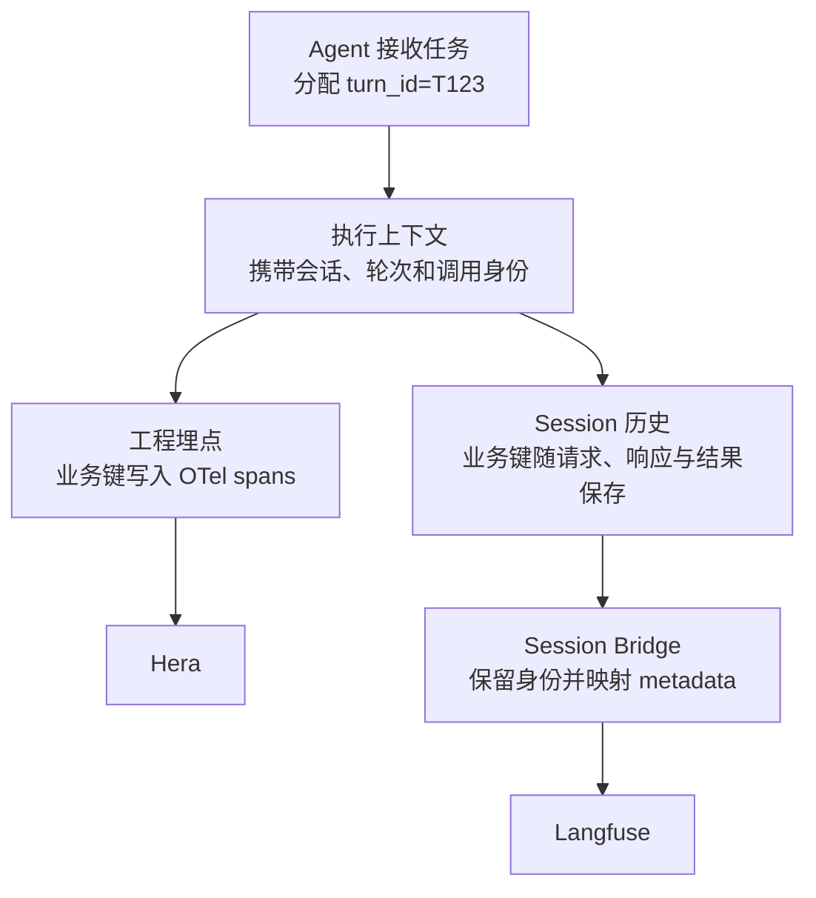

# 工程 Trace 与算法 Trace 如何互查

[返回任务索引](README.md) · [工程 Trace 设计](otel-trace-design.md) · [算法 Trace 设计](agent-trace-design.md)

**答案：用两侧都记录的业务键关联。首期用 `turn_id` 查同一轮任务，需要定位具体模型调用、工具执行或重试时，再增加对应调用 ID。** `trace_id/span_id` 用于打开平台中的执行证据；双向跳转按钮是业务键关联之上的便利功能。

本文中的两套 trace 指 **Hera 中的工程 OTel trace** 和 **Langfuse 中的算法 Agent trace**。前者回答耗时、错误与跨服务执行问题，后者回答模型输入输出、行动选择与任务质量问题。

状态：设计建议，尚未完成自研 Agent 与 Hera 的双向互查验收。示例均为合成数据；Langfuse 字段能力依据 2026-09-30 核对的官方文档，接入沿用 [Session Bridge 方案](session-langfuse-bridge-design.md)的 v4 ingestion 路径。

## 1. 先理解最简单的互查

用户要求“读取 values.txt，输出三个整数的和”，Agent 创建本轮 `turn_id=T123`。工程埋点和 Session 历史都保存这个值，Session Bridge 导入 Langfuse 时继续保留它。

```text
同一轮任务：turn_id = T123

Hera 工程 trace                     Langfuse 算法 trace
app.agent.turn_id = T123             metadata.turn_id = T123
查看耗时、错误、下游调用              查看模型输入输出、工具结果、评分
```

互查过程就是：

- 在 Langfuse 发现这次回答错误，读取 `turn_id=T123`，到 Hera 按这个值查询本轮执行。
- 在 Hera 发现这轮执行很慢，读取 `turn_id=T123`，到 Langfuse 按这个值查询当时的模型与工具交互。

两侧字段名可以不同，**值和含义必须相同**。工程侧使用 `app.agent.turn_id`，Langfuse 使用 metadata 的 `turn_id`，仍然可以关联。

这一步不要求两个平台使用相同 trace ID，也不要求先开发一套独立映射服务。前提是两侧字段已入库且可检索；Hera 的属性索引与查询能力需要在目标环境验证。

## 2. request_id 和 turn_id 应该选哪个

先明确 ID 标识的对象，再决定它能关联到哪一层。

| 业务键 | 标识对象 | 能回答的问题 |
| --- | --- | --- |
| `session_id` | 多轮会话 | 这个会话有哪些轮次？ |
| `turn_id` | 一轮 Agent 任务 | 这次回答对应哪些执行与交互？ |
| `request_id` | 必须明确是入口请求、模型请求还是 HTTP 请求 | 这个具体请求发生了什么？ |
| `task_id` | 一次主 Agent 或子 Agent 执行实例 | 这段过程由哪个 Agent 实例执行？ |
| `invocation_id` | 一次逻辑模型调用 | 这个模型决策对应哪次调用？ |
| `attempt_id` | 该模型调用的一次请求尝试 | 超时和成功分别发生在哪次尝试？ |
| `call_id` | 模型要求执行的一次工具调用 | 工具结果对应哪个模型输出？ |
| `execution_id` | 一次实际工具执行尝试 | 同一工具调用重跑后，哪次产生了这个结果？ |

**建议用 `turn_id` 作为整轮互查的主键。** 如果已有 `request_id` 明确表示一次用户任务，并且与 turn 一一对应，可以沿用它；无需只为命名再新增一个等价 ID。

需要避免把所有层级都叫作 `request_id`。入口请求和一次模型 HTTP 请求的范围不同，最好分别命名为 `entry_request_id` 和具体模型调用/尝试 ID。本文后续示例中的 `request_id` 专指入口请求。

一次用户任务可能经历模型重试、多个工具调用和异步子任务；同一个 turn 可以关联多个工程 trace。[Demo 对照](demo-observability-mapping.md)还记录了新入口请求注入正在运行的 turn 的情况，此时多个 `request_id` 对应同一个 `turn_id`，应保留入口请求与 turn 的归属关系。

业务 ID 的唯一性也要明确。若 `turn_id` 只在会话内唯一，完整查询键是 `session_id + turn_id`。查询始终限定租户与环境，Langfuse 还需限定实例与项目。时间范围用于缩小查询，不代替业务身份。

## 3. 两侧如何拿到同一个业务键

业务键应从同一个执行上下文产生，并分别写入工程 span 与 Session 记录。



Agent 在接收任务时分配 turn ID，在调用模型前分配 invocation/attempt ID，在实际执行工具前分配 execution ID。模型返回的工具 `call_id` 随响应保存，再传给工具执行与结果回填记录。Bridge 消费这些事实，不重新生成一套与运行时无关的业务键。

Java → Rust FFI、线程切换、异步任务和远端调用都要保留业务归属。业务键传播与 OTel trace context 传播是两件事：业务键帮助按任务互查，trace context 建立工程 span 的父子关系；跨语言边界需要分别处理，具体边界见[工程 Trace 设计](otel-trace-design.md)。

建议的字段映射如下。工程侧的 `model_call_id` 沿用已有设计，对应 Bridge 的 `invocation_id`；attempt 和 execution 属性属于本文建议补齐的字段。

| 共同含义 | Hera 中的 OTel 属性 | Langfuse 中的字段 |
| --- | --- | --- |
| 会话 | `app.agent.session_id` | `sessionId`，由 `langfuse.session.id` 映射 |
| 轮次 | `app.agent.turn_id` | `metadata.turn_id` |
| Agent 执行实例 | `app.agent.task_id` | `metadata.task_id` |
| 逻辑模型调用 | `app.agent.model_call_id` | `metadata.invocation_id` |
| 模型请求尝试 | `app.agent.attempt_id` | `metadata.attempt_id` |
| 模型工具调用 | `gen_ai.tool.call.id` | `metadata.call_id` |
| 实际工具执行 | `app.agent.execution_id` | `metadata.execution_id` |

Langfuse 的直接 OTLP 路径使用 `langfuse.observation.metadata.turn_id` 等属性，使业务键成为 observation metadata 的顶层字段。仅把工程属性 `app.agent.turn_id` 原样发过去，可能进入嵌套的 `metadata.attributes`，无法按预期筛选。[官方属性映射](https://langfuse.com/integrations/native/opentelemetry#property-mapping)

公共归属字段写到每个需要检索的相关节点；调用身份只写到对应调用及其尝试节点。Langfuse 的筛选与汇总越来越多地面向 observation，仅在根节点记录公共字段不足以支持子节点查询。[官方 metadata 与属性传播说明](https://langfuse.com/integrations/native/opentelemetry#propagating-trace-attributes-to-all-spans)

## 4. 如何从整轮定位到某次调用

下面用一轮模型重试、工具执行和最终回答说明两种粒度。`H1`、`L1` 和 span/observation 名称只是阅读用代号，不是实际平台 ID。

共同范围：`session_id=S7, turn_id=T123, task_id=A1`。

| 执行事实 | 进一步的业务身份 | Hera 工程证据 | Langfuse 算法证据 |
| --- | --- | --- | --- |
| 本轮任务 | `turn_id=T123` | H1 的 Agent span | L1 的 Turn 根节点 |
| 第一次模型尝试超时 | `invocation_id=M1, attempt_id=1` | 模型调用下的失败请求 span | M1 的 attempt 1 节点及错误 |
| 第二次尝试成功，要求读文件 | `invocation_id=M1, attempt_id=2` | 模型调用下的成功请求 span | M1 的 attempt 2 节点及输入输出 |
| 工具读取 values.txt | `call_id=C1, execution_id=E1` | 工具执行 span | 工具节点、参数与结果 `3 5 8` |
| 下一次模型调用回答 16 | `invocation_id=M2, attempt_id=1` | 第二次逻辑模型调用 span | 含工具结果的模型输入及最终回答 |

**按 turn 查：**用 `T123` 找到本轮工程 trace H1 与算法 trace L1，再展开它们。

**按调用查：**在同一轮、同一 Agent 实例下，用 `M1 + attempt_id=1` 精确定位失败尝试，查看工程错误与当次算法输入。工具使用 `C1 + E1` 定位实际执行；同名工具并行时也不会混淆。

若算法视图把模型的多次尝试合并成一个逻辑节点，这个节点对应多个工程尝试 span。查询应列出全部尝试，并保留各自状态；按 `turn_id` 找到整轮不代表已完成某次尝试的精确匹配。失败尝试没有保存正文时，要明确显示证据缺失。

`attempt_id=1` 这样的序号只在所属 invocation 内唯一，不能单独作为查询键。Step 序号同样需要所属 task/turn 范围；无需为了基本互查强制引入独立 Step UUID。

## 5. 业务键、平台 ID 和跳转按钮的关系

业务键回答“是不是同一轮、同一次调用”；平台 ID 回答“打开哪条记录”。

| 标识 | 使用方式 |
| --- | --- |
| 业务 `turn_id`、调用 ID | 在两侧按相同含义和值检索 |
| 工程 `trace_id + span_id` | 在 Hera 定位链路与操作 |
| Langfuse `traceId + observationId` | 在所属项目定位算法轨迹与节点 |

**先实现按键查询，再按需要增加跳转。** 可以按以下三个阶段落地：

1. **手动互查：**复制 turn ID，到另一平台按业务字段筛选。先核验两侧结果确实属于同一轮。
2. **直接定位工程证据：**在模型/工具 span 创建后，把真实的工程 trace/span ID 随业务身份写入 Session；Bridge 将这些定位键保留到对应算法 observation。不能从消息时间推算原 span ID。
3. **提供双向入口：**利用 Bridge 已有节点映射记录业务身份、Langfuse ID 与工程 ID。查询入口接收任一侧身份，返回另一侧链接；一对多时先展示相关执行列表。

如果两侧业务字段查询足够好，第一阶段即可满足基本互查，映射表不是必需前置条件。需要稳定深链、处理一对多或避免每次远端检索时，再扩展 Bridge 的映射能力。

Langfuse 可以通过 SDK 获取 trace URL。Hera 的 trace/span 深链格式、按钮扩展能力，以及 Langfuse observation 的具体定位方式，均需在目标部署核验；本文不假设已有可直接使用的按钮。[Langfuse 官方 Trace URLs](https://langfuse.com/docs/observability/features/url)

Session Bridge 在任务结束后才导入，工程 span 此时可能早已结束。反向入口可以按业务键查询最新映射；算法数据未到时显示“待导入”。这样无需回写已经结束的 span。映射存在也不等于目标节点已可见，状态应区分已分配 ID、待导入和已核验可见。

两套 trace 可以使用不同 trace ID。若同一批运行时 spans 分发到两个平台，可以保留原 ID；如果 Bridge 从 Session 组织独立算法节点树，则分别维护平台 ID，通过业务键关联即可。Turn UUID 和 trace ID 各有含义，不直接互相冒充。

## 6. 重试、异步与查不到结果时怎么解释

| 情况 | 关联规则与展示 |
| --- | --- |
| 一次模型调用多次重试 | invocation 不变，每次 attempt 独立；保留尝试列表，不能只显示最后成功的一次 |
| 同一工具 call 多次执行 | call ID 不变，每次 execution 独立；结果绑定实际产生它的 execution |
| 并行工具或子 Agent | 使用 call/execution/task 身份；不按工具名或时间邻近配对 |
| 子任务另起工程 trace | 保留 `root_turn_id`、task/parent task；在根 turn 查询中纳入这些关联字段，返回相关链路列表 |
| 跨轮异步操作 | 记录触发 turn 与受影响调用的显式关系；不把共享 session 的所有操作都认定为同一轮 |
| 算法数据尚未导入 | 显示待导入；可继续查询已到达的工程记录 |
| 工程数据未保留或已过期 | 显示已知的采样/保留原因；查不到且无证据时显示原因未知，不能解释成未执行 |
| 缺少调用身份 | 最多按 turn 定位候选记录，明确无法精确匹配 |

关联键能让记录对应起来，无法补回没有采集的内容，也不保证两侧采样范围和保留期相同。界面需要分别说明“关联关系已知”和“目标证据可查看”。

## 7. 当前材料已经支持什么，还需要补什么

[Demo 对照第 5 节](demo-observability-mapping.md#5-关联契约已有-id-与需要补齐的-id)已经识别会话、turn、入口 request、step 与工具 call 身份。它们可以作为基本互查的采集基础，但远端 Hera/Langfuse 摄取和属性检索尚未验收。

按该文档记录的源码核对结果，demo 缺少独立模型 attempt 身份，同一步重试的调试文件还可能被后续尝试覆盖。因此仅有 turn/step 关联时，不能保证回看某次失败尝试的准确正文。实现时应补齐 attempt ID，并将正文记录绑定到该次尝试及真实工程 span。

开发顺序建议：先确认 turn/request 的业务语义与唯一性，再让两侧保留 turn ID 并支持查询；随后补模型调用与工具执行身份；最后加入工程定位键和跳转入口。已有 Session 转换流程可继续阅读 [Bridge 方案第 3 节](session-langfuse-bridge-design.md#3-agent-侧先提供哪些历史)的采集契约与第 5 节的调用配对，不必先进入投递重试细节。

## 8. 怎样证明互查已打通

先用一条简单真实任务验收整轮查询，再用含模型重试、并行工具或异步子任务的样本验收精确关联。

| 验收项 | 通过标准 |
| --- | --- |
| 算法 → 工程 | 从 Langfuse 的 turn ID 找到正确工程执行，核对任务归属 |
| 工程 → 算法 | 从 Hera 的 turn ID 找到正确算法轨迹，核对输入与最终结果 |
| 多轮隔离 | 同一 session 的不同 turn 不混在一次查询结果中 |
| 精确调用 | 模型 attempt 与工具 execution 均能对应两侧记录 |
| 一对多 | 同一业务操作的重试与异步链路可枚举，并说明关系 |
| 可用性状态 | 待导入、缺字段、采样/过期及未知原因可区分，不误报未执行 |

验收记录保留业务键、两侧平台 ID、执行版本、查询范围与证据链接。本文完成的是互查设计说明；上述真实样本验证仍是后续接入工作的完成条件。
