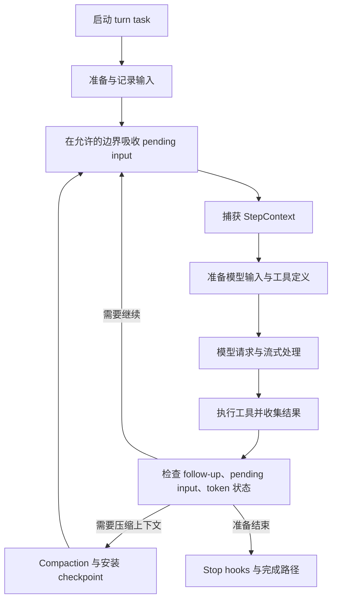

# Codex Harness：实现分析与可观测方案

[返回专项索引](README.md)

本文先分析当前 Codex harness 怎样管理一次执行，再提出围绕这些执行对象组织的观测方案。目标是让读者沿着一次请求理解：模型依据什么输入做出决定，harness 怎样执行、等待、重试和恢复，以及每个结论能够回到哪份原始证据。

推荐的查看入口是任务与执行过程：先选会话和 turn，再看模型请求、工具、进程、上下文变化和子 Agent。Langfuse 可以承担模型与 Agent 的分析视图；现有 Codex Trace Viewer 适合继续承接本地运行证据；通用 OTel 平台作为跨服务性能和日志的深入排障入口。

这是一份源码分析和拟议方案。本次仅新增文档及索引，没有启动服务、采集真实会话、修改 Codex 插桩、安装插件或上传内容。文中的流程图都是结构示意，不代表一次实测。

## 1. 阅读基线与判断范围

| 对象 | 本次基线 | 使用方式 |
| --- | --- | --- |
| Codex 源码 | `47d47812d51490934be5b0c34da3dfcf72d524e2`，核对日期 2026-09-29 | 本地分支的实现事实 |
| 可观测性专项 | [导读](observability-guide.md)、[Trace / GenAI / Rollout / Trajectory](trace-genai-rollout-trajectory.md) | 已有概念与数据边界 |
| 本地业务 Viewer | [工具说明](../../tools/codex-trace-viewer/README.md)、源码与需求 | 分别核对已实现能力和预期能力 |
| 本地 OTel 环境 | [Grafana LGTM](../../tools/observability/README.md) | 已有实验设施，尚未在本次启动 |
| Langfuse | [SDK](https://langfuse.com/docs/observability/sdk/overview)、[OTel 映射](https://langfuse.com/integrations/native/opentelemetry) | 外部平台的能力边界，实际部署版本待核对 |

本地 Viewer 属于当前工作分支的配套工具，不能把它当作所有 Codex 发行版的标准功能。Rollout Trace 也须按当前分支的实现分析。

本文使用三种证据等级：**源码事实**表示已经检查相关实现；**设计判断**表示根据实现推导出的取舍；**待验证**表示还需要真实执行或平台接入才能确认。读取测试用于理解契约，本次没有运行这些测试。

“优秀 harness”在这里具体指可检查的工程能力：执行有明确归属，模型请求与工具能力一致，失败和取消可解释，历史可以按契约恢复，诊断内容能追溯来源。本文不据此宣称 Codex 在所有维度都已经完整，也不做其他产品的优劣排名。

## 2. Harness 管理哪些事情

Harness 是围绕模型的执行系统。模型提供消息和工具调用；harness 管理上下文、工具目录、执行策略、并发、用户输入、历史、资源及对外事件。

在 Codex 中，一次操作需要同时考虑以下边界：

| 对象 | 当前职责 | 对观测的影响 |
| --- | --- | --- |
| App-server 请求 | 接收客户端请求、建立请求上下文 | RPC 返回可以早于 Agent 工作结束 |
| `Session` | 长生命周期状态、服务、输入队列、当前任务 | 会话状态与某一次模型请求的状态分开 |
| `TurnContext` | 一次运行 activation 的上下文和生命周期 | 适合作为运行归属，不能直接当作整个用户目标 |
| `StepContext` | 每次 sampling request 捕获的配置与能力 | 能解释这次模型使用的模型、工具和环境 |
| Sampling request / attempt | 模型请求编排、流式接收和重试 | 逻辑调用与具体请求尝试存在不同粒度 |
| Tool call | 工具分发、并发准入、执行、结果转换 | 工具执行与结果进入下一次模型输入分开 |
| Code cell / terminal | JS 执行、嵌套调用和存活进程 | 一个工具返回后仍可能存在运行资源 |
| 子 thread 与交互边 | Agent 创建、任务投递、结果和关闭 | 父子结构之外还需要信息流关系 |

从 [Session 定义](../../codex-rs/core/src/session/session.rs)读起，关注 `active_turn`、`input_queue`、`state` 和 `services`。类型注释明确一个 session 至多有一个 running task；这并不限制这个任务内部只能执行一个工具，也不限制子 thread 的工作。

[模型 ID 定义](../../codex-rs/rollout-trace/src/model/mod.rs)特别注明：`CodexTurnId` 是 runtime submission/activation ID，不等同于通用的聊天 turn 概念。后续实验和任务聚合应保留这个区别。

## 3. 执行主线：生命周期由 Harness 统一收口

### 3.1 Task 的开始、结束与取消

在 [tasks/mod.rs](../../codex-rs/core/src/tasks/mod.rs)中读 `SessionTask`、`spawn_task`、`start_task` 和 `on_task_finished`。不同工作流实现自己的 `run`，任务启动位置统一管理注册、cancellation token、运行 span 和完成路径。

`spawn_task` 会先以 `Replaced` 原因中止已有任务；`start_task` 注册 active turn 并启动后台 task。Task-owned span 覆盖任务运行，避免把很快结束的 submission 或 RPC 当作全部执行耗时。

继续读 [RegularTask::run](../../codex-rs/core/src/tasks/regular.rs)：普通任务先发出 `TurnStarted`，再进行准备和 `run_turn`。这样客户端可较早得知任务存在，用户也有机会中断启动阶段。

取消路径由 `abort_all_tasks`、`handle_task_abort` 等处理：先发出取消信号，允许任务观察取消，再进行 handle abort、资源清理和终态事件。用户中断还可能保存模型可见的中断标记，并在发布终态前尝试 flush。这里有短暂的 graceful 等待期限，不能解释为所有工具都保证优雅结束。

**设计判断：**可观测性应跟随真正的任务生命周期，覆盖启动、准备、运行、清理和终态。只包裹一次 HTTP 请求或模型 SDK 调用，会丢失 harness 中的大部分工作。

### 3.2 Agent loop 怎样决定继续

在 [turn.rs](../../codex-rs/core/src/session/turn.rs)中读 `run_turn`，重点跟到 sampling 之后的 `needs_follow_up` 判断，再停下来。



图压缩了许多分支；实际工具可以在模型流尚未结束时启动。它表达循环职责，不表达严格串行的时间线。

源码将模型需要 follow-up 与输入队列仍有待处理内容一起考虑，继续前还要检查 token 状态、上下文窗口和 compaction。准备结束时会经过 stop hook 处理。因此一次 sampling 的完成不等于 turn 完成，turn 完成也不自动证明用户目标已经达成。

**设计判断：**Viewer 需要能解释“为什么继续”和“为什么停止”，并把工具延续、用户 steering、上下文压缩、重试及正常结束分开。哪些原因已有明确事件、哪些只能从源码推断，应列为采集覆盖项。

## 4. 请求一致性：StepContext 值得重点学习

[StepContext](../../codex-rs/core/src/session/step_context.rs)保存一次请求捕获的 settings、model telemetry、环境、能力根、MCP binding、tool router 和 AGENTS.md 值。它的职责是固定这次 sampling 的视图，同时允许后续请求使用新的配置和能力。

`run_turn` 在准备请求前捕获 step；`build_prompt` 使用该 step 的 `model_visible_specs()` 生成工具定义。[ToolCallRuntime](../../codex-rs/core/src/tools/parallel.rs)继续保留这个 step，源码注释解释：工具可能延迟运行，所以要保留当初 advertised tool list 对应的上下文。

这建立了一条重要关系：

```text
本次捕获的配置、环境和能力
    → 模型看到的工具目录
    → 模型产生的工具调用
    → 实际执行时使用的 router 与 MCP binding
```

它减少了“模型依据旧工具定义发出调用，执行却误用新目录”的风险。它不意味着整个进程、仓库和外部服务都被冻结，也不能把所有指令读取都简单归为 `StepContext`：例如 `run_sampling_request` 还会另行读取 base instructions。

查看 [step_activation_tests.rs](../../codex-rs/core/src/session/step_activation_tests.rs)中的 `submitted_sparse_updates_preserve_captured_steps_and_ordering` 和 `delayed_activation_does_not_retarget_a_task`，可以进一步理解这些生命周期的测试意图。

**拟议展示：**每个模型调用展示当时的模型、reasoning 设置、环境与工具集合。另提供请求之间的配置和能力差异。缺乏显式来源的字段显示“未记录”，避免用会话最终配置反推之前的请求。

## 5. 工具执行：调用、准入、结果、资源是不同对象

### 5.1 并发控制和结果收集

读 [ToolCallRuntime::handle_tool_call_with_source](../../codex-rs/core/src/tools/parallel.rs)。工具根据 `tool_supports_parallel` 选择共享或独占执行锁；准入后才进入 handler。该路径还区分 dispatch 开始和 execution 开始，并在结果收集之前记录 result readiness。

因此下面的时间点可能不同：

```text
收到调用 → 等待 readiness / 并发准入 → 执行 handler
    → 结果已经就绪 → 调用方收集和编码结果 → 下次模型输入包含结果
```

应按实际计时覆盖范围解释等待，不能把整个工具 span 都称为命令运行时间。结果就绪也不证明模型已经读到它。

### 5.2 审批、sandbox 和重试

[ToolOrchestrator](../../codex-rs/core/src/tools/orchestrator.rs)集中处理适用工具 runtime 的审批、sandbox 选择、attempt 和拒绝后的重试策略。先看 `run` 的 approval requirement，再跟到 attempt 与后续错误分支，不必一开始进入各操作系统 sandbox 的内部实现。

**设计判断：**工具定义、策略判定、审批结果、执行 attempt 和模型可见结果应分别可定位。一次失败可能来自策略拒绝、启动失败、运行错误或结果转换；一个 `success=false` 不足以解释。

不能据此声称所有 MCP、远端服务和普通工具都走同一个 sandbox 分支；具体路径还要按工具实现核对。

### 5.3 Code mode 与后台进程

当前 [RolloutTrace 模型](../../codex-rs/rollout-trace/src/model/mod.rs)分别保存 `CodeCell`、`ToolCall`、`TerminalSession` 和 `TerminalOperation`。这些对象允许区分模型请求的 `exec`、JS 内部调用以及命令/write/poll 操作。

例如命令输出 100 KB，JS 只返回一句摘要时，应分别展示运行时原始输出、JS 结果和后续模型输入。模型实际收到的是哪一份，要由 inference payload 及其引用来证明。

后台进程可能跨多次 `exec_command` / `write_stdin` 操作存在；工具调用的终态不自动关闭这个资源。Viewer 应允许从工具跳到 terminal，再看到后续 poll、输出和退出记录。

## 6. 事件、恢复与诊断：同一次执行的不同投影

### 6.1 业务事件出口

在 [Session::send_event](../../codex-rs/core/src/session/mod.rs)中，业务事件会影响 turn error 状态、turn/tool 诊断记录、原始事件发送、父 Agent 通知等路径。再读 `send_event_raw_with_persistence`：这里处理事件持久化策略、protocol trace 观察和客户端投递。

这些动作有明确顺序，但不是一次跨所有出口的原子事务。持久化失败、诊断缺失或客户端 channel 关闭，需要分别分析，不能从“客户端显示了结果”推断所有诊断材料都已保存。

此外还有 legacy event 转换。做次数统计时需要识别同一个业务事实的不同表示，避免把 canonical 与兼容事件重复累计。

### 6.2 会话恢复

读 [reconstruct_history_from_rollout](../../codex-rs/core/src/session/rollout_reconstruction.rs)，先关注 `RolloutReconstruction` 返回的 history、settings、reference context、world-state baseline 和 window 信息。

`select_input_compaction` 检查最新 compaction 是否具有足够 metadata 来作为恢复边界；不满足条件时不会随意退回到一个更旧的 checkpoint 来假定当前状态。恢复需要结合保留的记录和版本契约，而不只是拼接聊天消息。

这条路径恢复的是继续会话所需的状态。它不恢复全部进程、外部服务或过去的文件系统，也不自动重新执行已有工具调用。

### 6.3 诊断证据记录与离线归约

[ThreadTraceContext](../../codex-rs/rollout-trace/src/thread.rs)提供可关闭的 producer。新建子 thread 可以共享根 writer；源码要求 resumed child 使用 disabled context，以避免重复 `ThreadStarted` 破坏 replay。这也是捕获范围可能不覆盖整段多 Agent 历史的一个实际边界。

[TraceWriter](../../codex-rs/rollout-trace/src/writer.rs)先写 payload 文件，再写引用该 payload 的 raw event，并分配 bundle 内的 `seq`。它不在执行主路径维护最终 `RolloutTrace` 图。

这里有两个需要同时理解的取舍：

- producer 的 startup/write 是 best-effort，诊断失败不应让会话失败；
- writer 使用同步文件 I/O、mutex，并在 append 后 flush。best-effort 不等于异步或零开销，真实成本仍需测量。

[replay_bundle](../../codex-rs/rollout-trace/src/reducer/mod.rs)之后读取 raw events 和 payload 构建语义图。Reducer 对缺失或矛盾证据可以报错；它不会为了让界面看起来完整而凭空补齐数据。

**设计判断：**原始证据与解释模型分开，是可借鉴的 harness 设计。解释逻辑可以迭代，并保留回到证据的路径；实时显示则需要额外处理正在写入、尚未完成和损坏记录之间的区别。

## 7. 模型可见内容必须有证据

### 7.1 逻辑输入与传输快照

[InferenceTraceAttempt::record_started](../../codex-rs/rollout-trace/src/inference.rs)允许记录逻辑请求：当 transport 省略已经发送的输入时，保存内容未必与网络上发送的 JSON 字节完全一致。

[reduce_inference_request](../../codex-rs/rollout-trace/src/reducer/conversation.rs)识别 `previous_response_id`，利用同 thread 的先前 request 和 response 重建逻辑输入。找不到对应前序 response 时会报错。

**拟议展示：**分别提供“模型逻辑输入”和“捕获的请求快照”，注明后者属于实际传输记录还是逻辑记录；缺乏标记时显示来源边界未知。不能只凭 UI 名字 `Wire View` 就承诺已经记录精确网络报文。

### 7.2 Compaction 是输入替换边界

同一 reducer 的 `reduce_compaction_checkpoint`记录旧输入、replacement history 和结构性 marker。Marker 与 summary 分开，后续完整请求对照已安装的新 baseline。

因此应区分“请求生成压缩结果”与“新历史已经安装”，并能查看下一次 inference 实际使用了哪些 item。仅展示一条“发生了 compaction”通知不足以解释上下文变化。

### 7.3 并行时先出现运行事件，后出现模型证据

在 [TraceReducer](../../codex-rs/rollout-trace/src/reducer/mod.rs)中，code-cell starts、生命周期事件和 Agent delivery edges 可能暂存为 pending。原因是工具已经开始执行，但证明其 model-visible 来源的 response payload 尚未记录完成。

归约器等待相应来源和接收方 item 后再连接关系，而不要求运行时为了诊断图改变执行顺序。

**设计判断：**观测序号表达 writer 观察顺序，调用 ID 和 producer/consumer 边表达关系。多 Agent 的因果解释还需要这些关系，不能只按墙钟排序。

Reasoning summary 和可读 reasoning 内容属于捕获到的输出，不证明已保存模型完整内部推理。上下文来源、缺失程度和显示推断也都应该能与内容本身区分。

## 8. 现有 Viewer 的能力与具体边界

本节针对当前分支源码，不用需求文档代替实现验收。

| 能力 | 当前实现依据 | 需要保留的边界 |
| --- | --- | --- |
| 业务视图 | [main.tsx](../../tools/codex-trace-viewer/web/src/main.tsx)包含 Timeline、Prompt、Agent、Payload、Stats | 未在本次用真实 bundle 验收完整性 |
| reduced graph 与 payload | [BundleStore](../../tools/codex-trace-viewer/server/bundle-store.ts)读取 state 与引用内容 | 内容和图一致性依赖采集与 reducer |
| 多 bundle 发现 | [server/index.ts](../../tools/codex-trace-viewer/server/index.ts)周期扫描 trace root | 扫描到 bundle 不等于已经获得最新 graph |
| 前端更新通知 | server 通过 SSE 广播更新或错误 | 这是本地文件更新通知，不是 Codex protocol 的全量订阅 |
| Prompt 分段 | [buildPromptView](../../tools/codex-trace-viewer/shared/prompt.ts)解析 request 并分类 | 来源分类主要依赖 role 和文本规则 |
| Prompt token 估算 | `estimatedTokens` 使用字符长度近似 | 不能代替 provider usage 或精确 tokenizer |

**实时归约边界：**`BundleStore.reloadIfChanged` 主要检查 `state.json` 的修改时间；`ensureState` 在 state 已存在时直接返回。现有 `--auto-reduce` 能补建缺失 state，但不能据此声称它会随着每条新 raw event 自动更新已存在的 state。持续观察依赖外部更新 state，或后续增加 raw-event 驱动的归约机制。

**完整 Prompt 边界：**`BundleStore.prompt` 把 raw request 交给 `buildPromptView`；后者从 `request.input` 构建分段。Reducer 重建的逻辑输入引用并不会自动变成此页面的完整内容。增量请求可能只显示新增输入，不能把这页直接称为所有情况下的完整模型上下文。

**来源分类边界：**分类器检查 `agents.md`、`permission`、`skill` 等文本，最后一个 user item 还可能被归类为 current query。这是展示推断，不是 harness 输出的精确 provenance。来源应注明“记录值 / 推断值 / 未知”，而且需要保留多个来源混合的可能性。

这些问题在本次仅记录为能力差距，未修改实现。它们应先于新增装饰性图表验证，因为它们影响工程师对证据的判断。

## 9. 围绕 Codex 执行对象组织查看体验

### 9.1 默认入口和导航

建议把默认流程定义为：**找到运行 → 定位异常或关心的步骤 → 看模型输入与执行结果 → 回到原始证据**。

```text
运行列表：用户输入摘要、时间、模型、执行状态、证据完整度
    ↓
运行详情：thread tree + turn timeline + selected step details
    ├─ 模型：逻辑输入 / 请求快照 / 响应 / usage / attempts
    ├─ 工具：参数 / 执行结果 / 模型可见结果 / 关联资源
    ├─ 上下文：来源 / 请求间变化 / compaction checkpoint
    ├─ 多 Agent：任务投递 / 消息 / 结果送达
    └─ 深入诊断：raw payload / OTel trace / 相关日志
```

运行列表中的状态表示执行事实。任务成功与外部评分单独展示；还没有定义成功标准的任务，不用“已完成”推导“正确完成”。

默认折叠重复历史、长 payload 和底层传输 spans。保留直接展开能力，让读者能从业务对象进入请求尝试和性能细节。增量更新保留当前选择和滚动位置；“跟随最新”作为明确的模式。

### 9.2 三种互补视角

| 视角 | 内容 | 适用问题 |
| --- | --- | --- |
| 执行时间线 | turn、inference、工具、等待、资源生命周期 | 为什么慢，哪一步失败？ |
| 信息流图 | inference items、cell、工具结果、thread 间关系 | 哪个结果实际进入哪个模型请求？ |
| 原始证据 | payload、protocol 记录、请求标识和日志 | 页面结论根据什么，是否误解释？ |

时间线与信息流图之间应能交叉定位。Span 瀑布图仍然有价值，但作为所选步骤的诊断视图；默认入口不要求用户先选择数据源、写查询或猜 service name。

### 9.3 完整度应该是界面的一部分

至少分别展示 running、终态已观察、前序上下文缺失、payload 不可读取、reducer 失败和来源推断等情况。源码中的不同缺失情况应怎样映射到 UI 状态，需要另行设计，不能只从 `ended_at` 或 `Running` 推断当前进程仍存活。

对于 pending evidence，保留已确认内容并指出等待的关联；对于已损坏或矛盾的证据，显示具体问题和来源。不要把它们全部处理成空白页面，也不要用推测内容掩盖缺失。

## 10. Langfuse 与 OTel 怎样接入这些对象

GenAI 语义约定用于统一 AI 观测数据的操作、字段和统计口径，减少 Agent 与平台之间的适配成本。为什么需要它、有哪些实际收益，以及它与 Codex 内部对象的边界，见 [Trace / GenAI 文档第 4 节](trace-genai-rollout-trajectory.md)。

Langfuse 支持 `agent`、`generation`、`tool`、`retriever`、`evaluator` 等 [observation 类型](https://langfuse.com/docs/observability/features/observation-types)，可以展示模型和工具内容、usage，以及关联评测。它的 OTel 接入还需要按部署版本核对字段映射、属性传播和查询行为。

当前 Codex 的原生 spans 与这些业务对象不是一对一关系。例如 GenAI token 属性位于响应处理 span，模型调用还包括请求建立、重试和流式接收。直接转发不会自动得到边界正确的 generation，字段改名也不能补齐时间范围。

可考虑两条路线，正式实现前用同一真实案例对比：

| 路线 | 方法 | 收益与代价 |
| --- | --- | --- |
| 执行时逻辑插桩 | 在明确的 turn / inference / tool 边界生成业务 spans | 时间边界贴近运行，需要先证明不会扰动现有生命周期 |
| 诊断图离线投影 | 从 reduced graph 和 payload 生成 Langfuse observations | 可复用已有证据，存在延迟、捕获缺口和图到平台的映射损失 |

Codex 专用 [Langfuse 插件](https://langfuse.com/integrations/developer-tools/codex)是第三种现成实验路径：通过 hook 读取会话 transcript 再重建 observations。它读取的会话记录与本分支 Rollout Trace bundle 是不同机制，不能把插件页面的丰富视图等同于已经接入完整 runtime graph。

本方案优先确认本地证据和边界，再验证 Langfuse 投影。公司支持 Langfuse，并不需要因此把尚未验证的源数据转换结果视作事实。

关联时保留产品 thread/turn、inference、model-visible call、runtime tool/cell/terminal、bundle ID 及 OTel trace/span ID 的各自含义。`emit_turn_started` 已将 `TurnContext.trace_id` 放入事件，是现有连接点；仍需检查它与每个具体请求和工具 span 的关系。Bundle 的 `trace_id` 本身不是 OTel trace ID。

如果后续生成新的业务 observations，明确它们的命名空间和来源，并保留原始对象 ID。原生 trace 与离线投影同时存在时，不重复计入调用次数或 usage。缓存 token、reasoning token 是相应 input/output 的子集；重试失败或取消后缺失 usage 的情况显示未知，不能默认为零成本。

Logs、metrics 和通用 tracing 继续保留独立出口。具体 exporter、analytics gating 和过滤范围先对照 [build_provider](../../codex-rs/core/src/otel_init.rs)与 [OtelProvider](../../codex-rs/otel/src/provider.rs)核对；Langfuse 的调用统计不能代替系统指标或原始日志查询。

## 11. 后续源码研究与实验计划

### 阶段 A：完成执行边界地图

沿 task → step → sampling → tool → history → terminal lifecycle 整理一张表，记录每个对象的 owner、开始/结束、取消路径、ID 和证据出口。对跨文件关系先验证定义和调用位置，再决定是否需要新增插桩。

交付物是本文的源码关系补充和缺口清单。当前已检查主干，未穷尽 provider fallback、远程执行、审批、所有 hooks、Guardian、持久化后端及恢复组合。

### 阶段 B：用小任务核对真实数据

| 案例 | 核对什么 | 需要保留的证据 |
| --- | --- | --- |
| 单工具后回答 | 模型请求、工具调用、结果和 follow-up 的关系 | 请求/响应 payload、tool 对象、下一次输入 |
| 并行工具 | 准入、执行、就绪、收集的时序区别 | 业务对象、相关 spans 与调用 ID |
| 增量模型请求 | 省略输入能否正确重建 | 前序 response、增量快照、request item refs |
| Code mode 内嵌工具 | runtime output 与 model-visible output 的差异 | cell、nested tool、输出和下一次请求 |
| 后台进程 | 工具返回与进程退出不同 | terminal session、exec/write/poll/exit |
| 用户 steering / 取消 | 输入在哪个边界被接收，终态与历史如何变化 | pending input、生命周期、中断 marker |
| 模型流失败与重试 | 已观察内容、attempt 与 usage 是否重复 | 每次请求尝试、响应片段、终态与关联 |
| Compaction 后续推理 | checkpoint 是否安装，下次输入是什么 | 旧历史、replacement、marker、后续 request |
| 新建与恢复子 Agent | 捕获范围与发送/送达关系是否完整 | thread、交互边、接收方 items、缺失标记 |
| 会话 resume | 恢复了哪些状态，哪些只是历史证据 | 持久化 rollout、重建结果、新请求 |

每个案例记录二进制版本、源码 commit、配置、任务和明确预期。使用实际 Codex 生成的 bundle；[demo bundle](../../tools/codex-trace-viewer/examples/demo-bundle/manifest.json)只用于 UI smoke。

先利用现有工具核对数据，不以能启动网页作为验收。当前 Viewer 不能展示的关系，先直接检查 reduced graph 和 payload，记录差距。

### 阶段 C：完善 Viewer 的证据导航

优先顺序是完整逻辑输入、来源标记、active bundle 的持续归约、工具与资源关联、缺失状态，之后再增强时间线和多 Agent 图。对 graph reducer 与 UI 分别验收：数据正确不代表页面解释正确，页面丰富也不代表采集完整。

这一阶段属于后续实现建议，本次不修改 Viewer。关于数据路径的修正，应先保持诊断只读和执行行为不变；需要补采时，再单独设计 diagnostic metadata。

### 阶段 D：验证 Langfuse 投影

选择同一真实 bundle，对照本地原始证据、Viewer 和 Langfuse 的显示结果。核对模型 input/output、工具结果、线程交互、时间边界、usage、ID 及缺失提示。明确哪些内容可保真投影，哪些仍需要回到本地证据。

之后才讨论集中接入、存储、保留期限、内容分级与导出可靠性。诊断 writer 同步 I/O 和内容大小要测量；遥测队列、丢弃、导出失败要有独立可见性。生产运行入口、数据保留和评测体系需按实际需求另做设计。

## 12. 源码阅读路线与停止点

**第一站：任务归属。** 打开 `session/session.rs` 的 `Session`，接着读 `tasks/mod.rs` 的 `SessionTask`、`start_task` 和 `handle_task_abort`，再到 `tasks/regular.rs`。确认 active task、运行 span 和 terminal event 怎样配合后先停，不急着进入所有工作流。

**第二站：请求视图。** 打开 `session/turn.rs` 的 `run_turn`，沿 `capture_step_context_with_required_mcp_servers` 到 `step_context.rs`，再看 `build_prompt` 和 `run_sampling_request`。把本次捕获值、每次重新读取值、历史变化与传输重试分开，完成这些边界后再读 provider 内部。

**第三站：工具和等待。** 打开 `tools/parallel.rs`，跟随执行锁、router dispatch 和 result readiness。然后选择 `tools/orchestrator.rs` 的审批路径或 unified exec 的 terminal 路径。能区分等待、handler 和资源结束后先停。

**第四站：同一事件的出口。** 回到 `session/mod.rs` 的 `send_event`、`send_event_raw_with_persistence` 和 `deliver_event_raw`，列出持久化、诊断、客户端及父 thread 通知的顺序。不要把这条路径理解为原子提交。

**第五站：证据和语义。** 依次打开 rollout-trace 的 `thread.rs`、`writer.rs`、`inference.rs` 和 `reducer/mod.rs`。到 `reducer/conversation.rs` 看增量输入与 compaction，再对照 `model/mod.rs` 的 ID 与对象。重点确认哪些关系来自模型 payload，哪些来自运行时记录。

**第六站：恢复与界面。** 读 `session/rollout_reconstruction.rs` 理解产品恢复；然后分别打开 Viewer 的 `server/bundle-store.ts`、`shared/prompt.ts` 和 `web/src/main.tsx`，对照“采集事实 → reduced graph → 页面内容”。每个页面结论都应能找到来源或明确标为推断。

最终验收要能沿着一次真实执行回答：谁拥有这段工作，使用哪个请求视图，为什么执行或等待，哪份结果进入模型，历史怎样变化，任务终态依据什么，以及哪份证据支持这个解释。
