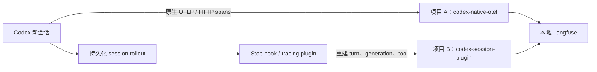

# Langfuse 本地搭建与 Codex 双路径接入行动计划

执行日期：2026-09-29。目标是启动可登录的 Langfuse，接入 Codex 原生 OTel trace 和官方 session tracing plugin，使用真实的新会话核对展示内容。千万级用户分析与本地验收分开，本机成功不能证明生产容量。

## 1. 执行范围和验收标准

| 工作 | 验收证据 |
| ---- | -------- |
| 本地服务 | Web、Worker、Postgres、ClickHouse、Redis、MinIO 启动，健康接口正常 |
| 初始化 | 自动创建本地管理员、组织和两个项目，API keys 能访问各自项目 |
| 原生 OTel | 运行新的 Codex 会话，Langfuse 中出现对应的真实 spans |
| Session plugin | 同一新会话至少两轮，出现 `Codex Turn`、`LLM`、工具和 session 分组 |
| 展示核对 | 从 API 和 UI 检查内容、模型、token、状态、耗时及缺失项 |
| 可复现 | 保存启动、停止、检查和回滚方法，密钥置于仓库外 |

现有 Codex 的 logs 和 metrics exporter 指向 `127.0.0.1:4318`。本次只修改 `trace_exporter`；Langfuse 接收 OTLP traces，不能把其 LLM 分析指标当成通用 OTel logs/metrics 存储。官方接口支持 HTTP/JSON 和 HTTP/protobuf，当前不支持 gRPC。[OTel 接入说明](https://langfuse.com/integrations/native/opentelemetry)

## 2. 版本与本机条件

本机为 WSL2 Linux，Docker 29.1.3、Compose 2.40.3、Codex CLI 0.156.1、Node.js 24.21.0；约 15 GiB 内存、740 GiB 可用磁盘。当前用户的 Docker 组访问已获授权配置，旧进程需通过新的组会话使用 Docker。

Langfuse 固定使用 `4.46.0`；插件已安装 `@langfuse/codex-observability-plugin` `0.4.0`，marketplace 固定到提交 `f4be3a47ac2c9c43721223a8f2e5d13f12e676c7`。六个镜像均已按实际下载的 digest 固定在 Compose 中，包括 ClickHouse `25.12`。这里验证的是安装的 CLI `0.156.1`，不等于本仓库源码编译产物。

[官方 Compose 方案](https://langfuse.com/self-hosting/deployment/docker-compose)适合本地验证；高可用、扩容与备份需要另外设计。基础拓扑来自[官方自托管架构](https://langfuse.com/self-hosting)。

## 3. 两条接入路径



原生路径保留 Codex 自身插桩，用于解释运行边界和等待；插件路径读取 transcript，投影成适合查看对话与工具过程的对象。两个项目各自统计，不能把两边的 token 或费用相加。

插件使用持久化 rollout，不是前文的诊断 `RolloutTrace` bundle。两条路径不会自动形成同一棵 trace 树；可以利用 thread/session/turn 标识辅助对照，完整关联仍需要明确的上下文传播和适配。

## 4. 本地实施步骤

部署文件置于 [langfuse-local](langfuse-local/)，运行状态和密钥置于 `~/.local/share/codex-observability/langfuse-local/`。该目录权限为 `700`，凭据文件权限为 `600`。

1. 生成随机数据库、Redis、MinIO、会话加密与登录密钥。
2. 用独立 Compose project 启动六个组件。Web 使用 `127.0.0.1:3035`，MinIO 媒体入口使用 `127.0.0.1:9095`；数据库不暴露宿主机端口。
3. 用[官方 headless initialization](https://langfuse.com/self-hosting/administration/headless-initialization)创建组织、管理员和原生 OTel 项目，再初始化插件项目。
4. 备份 `~/.codex/config.toml`，更新 trace exporter 的 HTTP endpoint、Basic Auth 和 `x-langfuse-ingestion-version: 4`。这个版本标头用于走 v4 数据路径。
5. 启用 `features.hooks` 和插件；将插件项目 credentials 写入 `~/.codex/langfuse.json`。保留现有模型、权限及其他插件配置。
6. 审阅已经安装的插件 hook，通过 Codex 的 hook trust 机制启用它。现有会话无法热加载，新会话用于验收。
7. 在独立演示目录运行两轮真实 Codex 请求：读取固定文件、运行成功命令和可控失败命令，再继续会话核对结果。
8. 核对 API 入库和 UI 展示，记录真实 trace/session 链接；样例数据与真实运行证据明确区分。

插件会上传 prompt、工具输入输出等 transcript 内容，原生 `otel.log_user_prompt = false` 不能控制插件的内容上传。这里将新演示数据送往本机，既有历史会话不批量导入。[官方 Codex 插件说明](https://langfuse.com/integrations/developer-tools/codex)

## 5. Langfuse 能展示哪些东西

下表结合接入机制与本次实测。未覆盖的功能明确标注，插件支持不等于当前演示已经覆盖所有情况。

| 内容 | 原生 OTel 路径 | Session plugin 路径 |
| ---- | ------------- | ------------------- |
| Trace 树、时间区间 | Codex runtime spans 与父子关系 | 重建的 turn、generation、tool 层级 |
| 用户消息和最终回答 | 本次 input/output 均为空 | 已看到 transcript 中的 prompt、assistant 消息 |
| 模型输入与系统指令 | 不能由函数 spans 自动还原 | 插件按可用 transcript 重建输入和系统指令 |
| 模型和 reasoning effort | 多层 spans 的 `model` 被识别，可能形成重复 generation | 已展示 generation 模型和参数 `reasoning_effort=high` |
| Token | 已有 `gen_ai.usage.*`，挂载在响应处理 span | 按 transcript 的 usage 投影到 generation |
| 费用 | 还需要模型识别和价格匹配 | 支持价格匹配后的估算，不能视为订阅账单 |
| 工具参数、输出和失败 | runtime 调用边界；失败需检查具体属性与返回值 | 已展示代码模式 `exec` 的源码和返回；嵌套命令失败未使外层变为 ERROR |
| 多轮 session | 不会仅凭接收 OTLP 自动补齐 | 用共同 session ID 分组 |
| 图片、子 Agent、skills | 不能由通用 spans 自动补齐 | 插件有支持，需分别增加覆盖案例 |
| Reasoning | 仅能看到实际记录的属性或摘要 | 支持记录的 summary；本次四个 LLM output 均无 reasoning，不能推断完整隐式推理 |
| 日志、通用 OTel metrics | 此接入不接收 | 不提供通用日志/指标后端 |
| checkpoint、完整运行语义图 | 不能替代 rollout 或 RolloutTrace | 不保留 RolloutTrace 全部运行对象与边 |
| 任务成功、评分、评测 | 需要业务定义和额外写入 | 有评分/评测功能，但插件不自动证明任务成功 |

Langfuse 另有 dashboards、users、scores、evaluators、human annotation、datasets、experiments、prompts 和 playground。本次已看到 token/费用看板与用户聚合；评分、任务成功率、评测样本和 prompt 版本关联需要额外配置或写入，Codex 插件不会自动完成它们。

## 6. 实际执行记录

2026-09-29 已完成部署、双项目初始化、管理员登录、两轮真实运行、API 分页读取和 UI 核对。测试文件为 `{"experiment":"codex-langfuse-local","values":[3,5,8]}`；第一轮读取、求和并执行退出码 7 的预期失败命令，第二轮继续核对数量、最大值和上一轮结果。未导入既有历史会话。

| 检查项 | 当前状态 | 证据 |
| ------ | -------- | ---- |
| Docker / 服务健康 | 通过 | 六个服务运行；Web 与四个存储组件 healthy；`/api/public/health` 返回 OK / 4.46.0 |
| 双项目与登录 | 通过 | 两组 key 分别能读项目，浏览器登录后看到两个项目 |
| 插件与 hook | 通过 | `0.4.0`；持久化 hook trust；两次 Stop hook spans 耗时约 172 / 141 ms |
| 原生 trace | 通过 | 两个 turn 对应 traces 共 2,423 条 observations：2,402 SPAN、21 GENERATION |
| 插件 session | 通过 | 同一 session 下两条 trace，共 2 AGENT、4 GENERATION、2 TOOL |
| Token 对账 | 通过 | 两路各四条 usage 的 total 合计均为 72,952；两路不得相加 |
| 估算费用 | 已展示 | 插件项目合计 $0.0311104；来自本地 Langfuse 模型价格匹配，非 ChatGPT 订阅账单 |
| 评分、图片、skills、子 Agent | 未覆盖 | 不用这次简单演示证明这些能力已被验证 |

直接打开：[第一轮插件 trace](http://127.0.0.1:3035/project/codex-session-plugin/traces/a2dc5ce318b9ebb9e1fd09f836a1fdb8)、[两轮 session](http://127.0.0.1:3035/project/codex-session-plugin/sessions/01a0e931-70f6-7d23-a63a-df6f1248f78e)、[第一轮原生 trace](http://127.0.0.1:3035/project/codex-native-otel/traces/bc6c0bb6372f1cb10b5e0cccde3e5156)。登录与启停命令见[运行说明](langfuse-local/README.md)。

实测限制比“OTLP 能接收”更重要：

- **Generation 标签不等于模型调用次数。** 原生路径的 `built_tools`、`get_model_info`、`session_task.turn` 等也被标为 GENERATION；同一次调用有多层记录。四条 usage 留在 `handle_responses` SPAN 上，该 observation 的 model 为空，未形成费用；带 model 的 generation 又没有 usage。需要语义映射才能可靠统计调用和成本。
- **退出码不等于 observation 状态。** 第一轮三条命令被代码模式合在一次 `exec` 中，输出明确包含 `exit_code=7`，但 `exec` 正常返回，因此插件 TOOL 的 level 仍为 DEFAULT；原生对应 traces 也没有 ERROR observation。需要解析内层结果并区分预期失败、工具失败和任务失败。
- **插件重建时间不等于推理端到端时间。** 第二轮最终回答的插件 LLM 为 41 ms，同一步原生 `run_sampling_request` 为 2.656 s；插件 `parse.ts` 的 `ensureStep` 由 transcript 事件首次出现建 step，`trace.ts` 的 `generationEnd` 用事件边界结束，缺少请求前等待。不能直接将其作为端到端 LLM 延迟或 TTFT。
- **缓存与 reasoning 是子集。** 例如插件第一步 total=17,932，Langfuse 归一化后 input=5,398、cached=12,288、output=246；原始 input_tokens=17,686 已包含 cached。不能在原始 input 上再次加 cached；本次 reasoning_output_tokens 为 0。
- **内容是重建视图。** 插件 generation input 有系统、developer、环境上下文与历史，约 36.8–39.9 千字符；这不是证明每条均为原始 API wire body。两个项目的 trace ID 不同，原生 sessionId 为空，可用 metadata 中的 turn ID 对照，未自动合并。

真实演示截图：[插件 trace](assets/langfuse-plugin-trace.png)、[模型输入与工具调用](assets/langfuse-plugin-generation.png)、[多轮 session](assets/langfuse-plugin-session.png)、[原生 trace](assets/langfuse-native-trace.png)。截图来自独立测试会话；原始 JSON、CLI 输出、配置备份和 credentials 留在仓库外的私有状态目录中。

部署修正了 Web 的 `HOSTNAME=0.0.0.0`，并让 Worker 等待 Web 健康，避免第一次数据库迁移尚未结束便消费任务；后台迁移保持启用，最终日志显示无待执行迁移。[官方连接排查](https://langfuse.com/faq/all/debug-docker-deployment)说明监听地址要求。再次执行 `up` 已验证幂等，未重建已有数据。

## 7. 千万级用户：先把用户数转成负载

“千万用户”不能直接换算成机器数量。至少要明确注册数、DAU、每人每日 turn、每 turn observations、完整内容大小、峰均比、保留天数和评测比例。

以下为规划假设，不是 Langfuse benchmark：注册用户 1,000 万，DAU 比例 10%，每个 DAU 每天 10 个 turn，每 turn 30 个 observations，峰均比 10，暂不计图片和评测。

```text
turns/day = 10,000,000 × 10% × 10 = 10,000,000
observations/day = 10,000,000 × 30 = 300,000,000
平均 observations/s ≈ 3,472
峰值 observations/s ≈ 34,722
```

| 每 observation 原始大小 | 每天原始数据 | 30 天原始数据 |
| ----------------------- | ------------ | ------------- |
| 2 KiB | 约 614 GB | 约 18.4 TB |
| 20 KiB | 约 6.14 TB | 约 184 TB |

这不是最终磁盘报价：还要计算压缩、索引、复制、对象存储、重复版本、系统日志、备份和网络。若 1,000 万人都是 DAU，上述吞吐和数据量再乘 10。较长 prompt 被每次模型调用重复保存时，平均 payload 可能远超 2 KiB。

本次原生 trace 平均约 **1,212 observations/turn**，是示例假设 30 的约 40 倍；按同样千万 turn/日外推约 121 亿 observations/日、平均 14 万/秒，尚未计峰值。插件平均 4 observations/turn，但本次 API JSON 平均约 25 KB/observation，系统上下文重复占据较大部分。这些仅是小样例，不是通用容量结论；API JSON 大小也不是 OTLP 摄取量或 ClickHouse 实际磁盘量。生产选型必须用实际采集层级与 payload 分布压测。

## 8. 规模扩大后的主要问题

| 问题 | 触发条件与影响 | 需要的处理 |
| ---- | -------------- | ---------- |
| 摄取与 UI 争用 | 高频上报使 Web CPU、内存和连接饱和，详情页也变慢 | 将 ingestion 与 UI/API 流量部署分开，独立扩容 |
| 队列积压 | 入队速度长期超过消费速度，200/202 不代表已可查询 | 监控积压年龄、消费率、DLQ 与可见延迟，按负载扩 worker |
| ClickHouse 写入与查询争用 | 海量 insert、merge 与跨时间搜索同时运行 | 限制时间范围，按 project/time 查询，扩计算与存储并验证副本/分片策略 |
| Redis 热点与故障 | 单实例吞吐和内存受限，队列恢复影响延迟 | 高可用、容量告警、持久化；按具体版本验证 cluster 与 queue sharding |
| 内容膨胀 | 全量 prompt、工具输出、图片及重复上下文 | 内容分级、限长或外置对象存储，明确保留政策与缺失标记 |
| 端侧插件开销 | 每 turn 启动 Node，读取越来越长的 transcript；网络失败会重试 | 测长会话 CPU/内存和上报延迟；服务端自研 Agent 应使用直接埋点和异步队列 |
| 丢失与重复 | hook timeout、进程退出、SDK flush、sidecar 状态不一致 | 持久化投递、稳定 observation ID、可重放与幂等；监测摄取损失 |
| 数据关联不一致 | 原生与插件产生不同 trace ID，局部属性缺失 | 固定 session/turn/step ID 语义，在所有 observations 传播可查询维度 |
| 指标口径重复 | 两路采集同一 token，缓存/reasoning 再次相加 | 选唯一计量来源，分项目或明确来源筛选；估算费用与真实结算分开 |
| 租户隔离与密钥暴露 | 把共享项目写入密钥放入大量不可信客户端 | 自有摄取网关、租户认证/授权、限流配额；不要把 Langfuse 当终端用户认证系统 |
| 全量评测费用 | 对千万级 turn 全量调用 LLM judge | 分层抽样、离线评测、预算与并发限制，保留完整评测来源 |
| 删除与备份 | ClickHouse、对象存储、Postgres 中有关联数据 | 一致的生命周期、可恢复备份与删除验证，不能只清理某一个 bucket |

官方扩容文档提供 ingestion/UI 分离、worker 扩容、Redis queue sharding 和存储压力处理方法，但没有给这台本机或任意部署提供“千万用户容量保证”。[Scaling](https://langfuse.com/self-hosting/configuration/scaling)

## 9. 大规模自研 Agent 的采用建议

把 Langfuse 作为研发与运营分析面。自研 harness 直接发出有稳定 ID 的 agent/generation/tool observations；Codex session plugin 用来研究 Codex 的记录与展示方式，不宜直接当作所有生产 Agent 的投递层。

业务请求先由自己的鉴权网关验证租户与采集权限，再进入异步摄取链路。完整行为事实可以保存在自己的事件流和对象存储，Langfuse 接收适合查询与评测的投影。观测失败应能被检测、重试和追补，不能无限阻塞 Agent 执行。

采样应以整条 trace 或明确任务边界为单位，保留错误、慢请求、版本回归和指定调试样本；只给样本随机丢弃单个 tool span 会破坏轨迹。Langfuse SDK 提供采样能力；本次插件 `0.4.0` 的 config 未暴露采样率，`instrumentation.ts` 使用独立 NodeTracerProvider 且 `shouldExportSpan: () => true`，不能假定设置 `LANGFUSE_SAMPLE_RATE` 会生效。[Sampling](https://langfuse.com/docs/observability/features/sampling)

成本与成功率需有全量、低体积的独立计量渠道；采样后的 trace 不宜直接作为账单或真实成功率的分母。价格未匹配应标为未知，不能用零成本表示免费。[Token 与费用](https://langfuse.com/docs/observability/features/token-and-cost-tracking)

## 10. 压测、许可与上线门槛

本次不对本机执行千万用户压测。生产验证需按真实 payload 分布逐级增加吞吐，测试冷启动、峰值持续、worker/Redis/ClickHouse 故障和恢复，以及大租户与小租户并存时的公平性。

至少报告：摄取成功率、入库可见延迟 p50/p95/p99、积压年龄、重复率/丢失率、UI/API 查询延迟、CPU/内存、存储增速和单位 turn 运维成本。吞吐合格且最终可见、查询可用、成本可接受，才能决定规模方案。

确认当前版本的 OSS/Enterprise 能力边界，尤其是保留策略、组织管理、SSO、权限与支持。生产预算包括基础设施和可能的企业许可，不能把“开源”理解为所有管理能力与运营成本都为零。[自托管许可](https://langfuse.com/self-hosting/license-key)、[Data retention](https://langfuse.com/docs/administration/data-retention)
