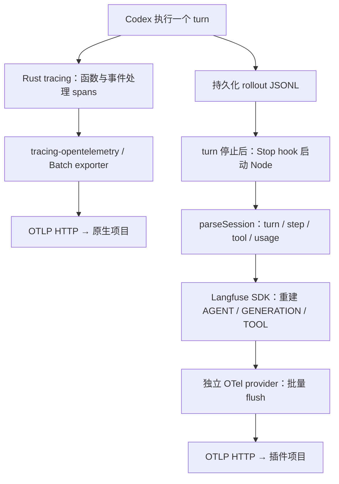

# 用 Langfuse 看懂 Codex：Session Plugin、原生 Trace 与实战阅读

核对日期：2026-09-29。本文结合本机真实数据、Codex 源码和 Langfuse 官方插件源码，回答两个实际问题：为什么 trace 很长，以及 attributes 为什么看起来没用。部署步骤见[本地接入记录](langfuse-local-action-plan.md)，埋点设计原则见[最佳实践中文译文](langfuse-best-practices.zh-CN.md)。

## 1. 先按问题选择入口

**看 Agent 怎样完成任务，先看 Session Plugin；查运行时为什么慢、卡住或断链，再看原生 trace。** 两者都写入 Langfuse，但采集对象、时间边界和信息损失不同。

| 要回答的问题                                 | 首选证据                                      | 阅读重点                                   |
| -------------------------------------------- | --------------------------------------------- | ------------------------------------------ |
| 用户要什么，最后给了什么？                   | 插件根 `AGENT`                                | Input、Output、是否中断；再检查交付物      |
| 模型为什么选这个工具，下一步是否利用了结果？ | 插件 `GENERATION` 和 `TOOL`                   | 每一步输出、调用参数、工具结果、下一步输入 |
| 哪个工具使上下文变大？                       | 插件逐步 usage 和 Input                       | 输入增长、缓存比例、大块工具返回           |
| 一轮为什么花了几分钟？                       | 原生任务和 sampling spans                     | 起止边界、父子关系、等待、工具与重试       |
| 请求、MCP、子进程在哪个边界出问题？          | 原生 trace 加日志                             | 错误、连接、取消、底层生命周期             |
| 任务质量有没有变好？                         | 结果验证、反馈、scores、datasets、experiments | 成功标准和跨样本对比；trace 本身不提供答案 |

Langfuse 是存储、查询和分析后端；Session Plugin 是把 Codex 历史转换为语义 observations 的采集器；CLI 是查询接口；Agent skill 是指导助手正确查询和使用平台的工作说明。安装 CLI 或 skill 本身不会新增运行埋点。[官方 Agent skill](https://langfuse.com/docs/api-and-data-platform/features/agent-skill)

### 有插件后，还需要原生 trace 吗？

仅复盘个人编码过程、查看模型用量时，可以主要保留插件数据。开发 Codex harness、排查服务可靠性、研究并发与恢复时，原生 trace 仍然有价值。插件没有记录原生 `receiving`、连接建立和函数等待等全部过程，也不能从最终 transcript 补回这些事实。

适合本机的组合是：插件作为日常入口，原生作为工程调查入口，分别进入两个项目。生产环境再按任务采样、错误与慢请求保留策略和存储预算设计采集范围。没有必要让每个人每次都展开所有内部 spans。

### 与 SkyWalking 的比较应怎样理解？

本次比较的是**两条采集路径**，不是两个后端的性能竞赛。把同一批细粒度 spans 换一个后端展示，业务语义缺失的问题仍然存在。

| 维度                   | 本次 Langfuse 路线                                                  | SkyWalking 调研入口                                                  |
| ---------------------- | ------------------------------------------------------------------- | -------------------------------------------------------------------- |
| 应用与基础设施运行状况 | 原生 spans 作为补充；本次未搭建完整基础设施监控                     | 服务拓扑、metrics、logs、profiling、告警是其核心体系                 |
| Agent 行为与模型用量   | Codex 插件提供 turn、generation、tool；连接平台的评测与 prompt 功能 | 当前也有 GenAI 网关监控和 AI Sessionizer，会话回放应作为独立能力调研 |
| 对我们是否已经可用     | 本机 Codex 插件和 CLI 已实测                                        | 本次只核对官方资料，未验证本机 Codex 兼容性或部署                    |

不能继续用“SkyWalking 只有传统 APM、不能看 AI 会话”的绝对分类。2026-09-29 核对的官方首页已经介绍 AI Sessionizer 和模型/MCP 网关监控；具体适配、质量评测闭环与容量需要另做实验。[SkyWalking 概念](https://skywalking.apache.org/docs/main/v10.4.0/en/concepts-and-designs/overview/)、[当前 AI 能力入口](https://skywalking.apache.org/)

## 2. 两条路径的技术机制



两条路线最终都使用 OTel spans；区别在于 spans 是运行时产生，还是根据历史材料事后构造。它们并非“OTel 与非 OTel”的对立。

| 机制         | 原生 OTel                                                        | Session Plugin `0.4.0`                                            |
| ------------ | ---------------------------------------------------------------- | ----------------------------------------------------------------- |
| 事实来源     | 运行中的 `tracing::Span`、属性记录和上下文                       | 持久化 rollout 的 `session_meta`、`response_item`、`event_msg` 等 |
| 采集时机     | span 结束后进入 batch exporter，执行中也能陆续上报               | 每轮 Stop hook 读取 transcript；通常结束后可见                    |
| 节点边界     | 插桩函数、流事件处理、工具和任务等运行边界                       | 解析出的 turn、模型 step、工具调用                                |
| 输入输出     | `skip_all` 的函数 span 通常没有业务内容，不能自动恢复完整 prompt | 组合系统指令、已有历史、当前用户输入及前面 steps 的结果           |
| 时间         | 实际 span 生命周期；父 span 可包含工具与其他等待                 | 由 rollout 时间戳推导，未必包含模型请求开始前后的完整等待         |
| 属性         | 代码位置、target、版本、turn ID、usage 等                        | step index、模型、usage、system prompt 字符数、tool call ID 等    |
| 可靠性边界   | batch 未 flush、进程中断等仍可能丢数据                           | 未触发 hook、缺少 transcript、上传失败等也可能缺数据              |
| 费用与调用数 | 必须核对 usage/model 的归属与语义映射                            | 模型 steps 更容易读，但仍需要核对归一化 usage 和价格              |

### 原生：从插桩到 Langfuse

Codex 使用 `#[instrument]` 和显式 `trace_span!` 创建 spans，`tracing-opentelemetry` 将它们转成 OTel 数据，provider 的 batch exporter 通过 OTLP/HTTP 上报。本机端点为 `/api/public/otel/v1/traces`。父子关系来自 tracing/OTel 上下文，不是 Langfuse 通过时间接近自动猜出来的。

RPC span、后台 turn task、模型 streaming 与工具执行有不同结束边界。`turn/start` 受理结束不等于整轮任务结束。`run_sampling_request` 包含 prompt 准备、模型流处理及下层工具 drain，不能把它的时长直接命名为“纯模型推理耗时”。

### 插件：从 rollout 重建语义轨迹

官方插件的 `hooks/hooks.json` 在 Stop 触发 `node "${PLUGIN_ROOT}/dist/index.mjs"`，此版本超时预算为 30 秒。`runHook` 从 stdin 读取 `transcript_path`、`turn_id`，加载配置，再调用 `convertRollout`。

`parseSession` 将 rollout 解析为 turn、step、工具调用与 token usage；`emitTurn` 为每轮创建 `Codex Turn` AGENT，为每个 step 创建 `LLM` GENERATION，再创建 TOOL。当前实现中 generation 和 tool 都直接以 turn AGENT 为父，工具不是 generation 的子节点；先后关系还要结合时间、`codex.call_id` 和 generation 中的 `tool_calls` 阅读。

`generationInput` 将可见系统片段、历史前缀、当前用户输入和此前 steps 重新拼接为消息，工具返回也进入后续输入。该视图有助于审查行为，但不是原始 API wire body。历史裁剪、compaction、增量传输或未持久化内容是否完整，需要另外核对。

`setupInstrumentation` 创建独立 `NodeTracerProvider` 和 `LangfuseSpanProcessor`，使用批量导出。结束时 `forceFlush`、shutdown，成功后才把 turn ID 写到 `<rolloutFile>.langfuse` sidecar。未标记的 turn 可在后续 hook 重试；sidecar 是尽力写入，因此不能把它描述为严格 exactly-once。默认上传错误不会阻断 Codex。[固定版本插件源码](https://github.com/langfuse/codex-observability-plugin/tree/f4be3a47ac2c9c43721223a8f2e5d13f12e676c7/plugins/tracing/src)

插件采集范围由自己的配置控制。原生 `otel.log_user_prompt = false` 不会关闭插件的 prompt/工具内容上传。本机两条路线的采样和过滤也相互独立。

### session、turn 与 trace ID 如何关联？

`session` 是多轮对话的逻辑分组；`trace` 是一轮工作；`observation` 是其中一个步骤。插件以 Codex thread ID 填 `sessionId`，根 observation 的 `codex.turn_id` 标识本轮。原生则可以从 sampling 的 `attributes.turn_id` 对照。

本机两个项目的 trace ID 不同。通过 turn ID 匹配两个视角，不能按 trace ID 直接 join，也不能因为任务相同就把两边 token、费用和请求量相加。插件支持通过 `LANGFUSE_CODEX_TRACEPARENT` 或专用 parent trace/span 环境变量接入外部父 span，但本次未使用或验收此模式；统一父上下文还需要明确的传播设计。[父上下文实现](https://github.com/langfuse/codex-observability-plugin/blob/f4be3a47ac2c9c43721223a8f2e5d13f12e676c7/plugins/tracing/src/parent-context.ts)

## 3. 原生 trace 的噪音合理吗？

**这些节点有工程来源，但全部放在日常 Agent 复盘首页并不合适。** 细粒度采集适合定位流事件、持久化和异步等待；大规模全量保留与默认展开是否合理，取决于问题与预算。

在本次样本中，`receiving` 和 `handle_responses` 各出现 6,656 次。源码在流式循环中为每次 `stream.next()` 创建接收 span，并创建该事件的处理 span。短消息片段、reasoning、工具参数增量等都会增加事件数；它们不是 6,656 次模型调用。

另有 `append_items` 1,128 次、`persist_rollout_items` 564 次。它们帮助解释持久化行为，但看 Agent 是否正确选工具时，信息收益通常很低。

建议按三个层次处理，以下是设计建议，尚未修改本机采集配置：

1. **阅读层**：默认从插件 turn 或原生任务/sampling/工具边界开始；内部流事件按问题展开。列表按 name/type 聚合，先确认主要组成。
2. **采集层**：常规语义 trace 保留 turn、实际模型请求、工具、关键重试与错误。逐 delta 的成功事件可以转成聚合指标或调试日志；需要时开启详细诊断。丢弃中间 span 前须处理子节点的父关系，避免断树。
3. **保留层**：按完整任务采样，保留选定的错误、慢任务和调试会话。降低跨度数量和保留时间分别解决不同成本问题；过滤已有数据的显示不会减少历史摄取量。

不要把 `RUST_LOG=info` 当作已经验证的 OTel 降噪方案。本仓库 `app-server/src/lib.rs` 的 `EnvFilter` 应用于 stderr 格式层，OTel trace 层有自己的 `trace_export_filter`；当前 span 过滤主要排除 `h2` 导出自循环，而没有按 info/trace 级别过滤所有业务 spans。是否生效须对具体版本测量。

插件 `0.4.0` 也不能靠猜一个采样环境变量来降量：它的 config 没暴露采样率，独立 provider 的 `shouldExportSpan` 返回 true。应核对 provider/collector 的实际采样行为，再设计实现。[现有采样边界记录](langfuse-local-action-plan.md)

## 4. 实战：从这一轮安装任务读出什么？

样本用户输入为“安装 cli + agent skill，学会使用langfuse”。这是**同一 session 中的一轮已完成任务**，此前对话已进入上下文，不是从空白 prompt 开始的独立请求。

| 项目                | 值                                                                                                                      |
| ------------------- | ----------------------------------------------------------------------------------------------------------------------- |
| 本轮时间            | UTC `02:33:20.884–02:39:07.416`，北京时间 `10:33:20.884–10:39:07.416`                                                   |
| Turn ID             | `01a0eb02-70de-7c13-9ae5-884152c9fe77`                                                                                  |
| Session / thread ID | `01a0eaf7-f025-7001-a324-36b75305ce83`                                                                                  |
| 插件 trace          | [打开 34 个节点的语义轨迹](http://127.0.0.1:3035/project/codex-session-plugin/traces/bcbcd917bfbfa99a965d33cd0af1d08c)  |
| 原生 trace          | [打开 16,586 个节点的运行轨迹](http://127.0.0.1:3035/project/codex-native-otel/traces/89221ded6ae171c8c258d2b2877fedf2) |
| 离线证据            | [有界查询的统计与字段摘要](assets/langfuse-install-turn-evidence.json)，不含原始 prompt、工具正文或密钥                 |

### 第一步：先读根节点，再确定成功标准

插件根 AGENT 的时长是 **346.532 秒**。先看用户输入与最终回答，确定用户期望是安装并学会查询，不是只拿到一段安装说明。

对应的验证应包括 CLI 可执行、skill 文件可读、本地项目认证成功、查询正确返回记录。`codex.aborted=false` 只表明本轮未被中断；没有 ERROR 也不证明安装或查询成功。最终质量仍需要交付物与工具结果验证。

### 第二步：看轨迹结构，不逐行翻 attributes

插件这一轮是 **1 AGENT、15 GENERATION、18 TOOL**。工具节点分布为 `exec` 8、`web_search` 4，以及三个 `skill:*` 名称各 2。

这说明该任务包含多轮查询与处理，但不能把 18 直接解释成 18 个 shell 进程。代码 cell 可调用多个内层工具；`skill:*` 是插件识别并重命名的工具活动，未必存在同名的独立底层工具。

正确的阅读单位是：**这一代输出要求做什么 → 工具实际返回什么 → 下一代有没有据此修正。** 同一个工具出现多次，可能是正常验证，也可能是首次查询失败后的纠正，要看输入输出才能区分。

本轮有一个有价值的实际错误：我第一次分析 CLI JSON 时从顶层读取 `data`，而正确位置是 `body.data`，于是 HTTP 200 被误读成空列表。后续查看响应结构并修正，最终重新查询得到记录。这个例子说明：进程退出码正常、TOOL level 为 DEFAULT，都可能掩盖应用逻辑错误；工具输出与下一步行为才是证据。

### 第三步：找上下文增长最大的地方

| 字段                                 | 第一个 generation，step 0 | 最后一个 generation，step 14 |
| ------------------------------------ | ------------------------: | ---------------------------: |
| 归一化 `input`，不含缓存部分         |                     1,548 |                          986 |
| `input_cached_tokens`                |                    84,352 |                      142,848 |
| 完整输入 token，以上两项相加         |                **85,900** |                  **143,834** |
| 归一化 `output`，不含 reasoning 部分 |                       350 |                          195 |
| `output_reasoning_tokens`            |                         0 |                          375 |
| `total`                              |                    86,250 |                      144,404 |
| 插件重建 Input 的 JSON 字符数        |                   268,371 |                      487,304 |

本实例把 cached 和 reasoning 拆成独立桶，因此 `total = input + cached + output + reasoning`。原始 rollout 的 `input_tokens` 已包含 cached，`output_tokens` 已包含 reasoning；读原始字段时不能再次加子集。归一化行为以实例和数据格式为准，不能套到所有来源。

这里能确认：任务推进时输入上下文增长约 **57,934 tokens**；首末步骤缓存占输入均超过 98%；最后一个 step 的新输入并不大。15 个 step 的完整输入累计为 1,797,094 tokens，其中大量历史被反复读取，这不是 179 万个不同的新 token。

回到 step 6 的 Input，前面的一个 `skill:skill-creator` 工具结果有 **44,276 字符**，含 schema 内容；step 11 前还有一个 **24,100 字符**的 `exec` 结果。结合相邻步骤可以定位大块文档/接口说明进入上下文的位置。这些是“优先缩小查询和打印范围”的候选证据，不是证明所有增长由某一条结果单独造成；字符数也不能直接当 token 数。

可以改进的具体做法是：先发现资源与字段，再读单个 action 的帮助；聚合统计在服务端完成；只按问题取需要的 Input/Output 片段。应保留足够证据回答问题，避免反复把完整 schema 带回模型。

15 个 generation 的 Langfuse 估算费用合计约 **$0.5710552**。这是本实例模型价格配置的计算结果，不是订阅账单或提供商正式计费证明，也不能再加上原生项目的 usage 当作另一笔消耗。

### 第四步：查慢在哪，再回原生 trace

原生 16,586 个 observations 中，13,312 个是接收/处理流事件，约占 **80.26%**。先按名称计数能解释“为什么树很长”，无需手动展开上万个节点。

这轮原生有 15 个 `run_sampling_request`，其中最长三个为：

| Span ID            | 生命周期，秒 | busy，毫秒 | idle，毫秒 |
| ------------------ | -----------: | ---------: | ---------: |
| `ff0432d7af82271e` |       48.432 |    145.093 | 48,287.399 |
| `a79a603e773432f4` |       40.931 |    106.605 | 40,823.596 |
| `ebfd92d263c6c2c9` |       37.780 |     83.943 | 37,695.756 |

这些记录表明 span 生命周期的大部分时间未处于 entered 状态，与大量异步等待相符。`busy_ns` 不是 CPU profiler 的 CPU time，`idle_ns` 也不是提供商模型计算时间；网络、工具及其他 await 都可能贡献等待。下一步应查它们的子边界、模型 streaming 和工具时段，而不能据此断言是模型服务器慢。

15 个 sampling span 的 inclusive 时长合计 346.249 秒，与根 turn 的 346.532 秒接近。这是本样本的覆盖关系，不能把 sampling 加上其子 spans 再当作任务总耗时；并行步骤同样可能重叠。

插件的 15 个 generation 中有 **11 个 startTime == endTime**，API latency 为 null；其余四个记录为 8.827、7.476、23.933 和 0.219 秒。源码 `ensureStep` 在首次出现可解析事件时创建 step，`generationEnd` 又以最早工具调用等事件边界推导结束时间，所以缺少真正请求开始边界时，会低估或得到零时长。**不能据此算真实模型延迟分位数或 TTFT。**

### 第五步：区分采集缺失、映射问题和真实异常

| 看到的现象                              | 能支持的结论                  | 接下来查什么                                                                         |
| --------------------------------------- | ----------------------------- | ------------------------------------------------------------------------------------ |
| 原生 `built_tools` 也显示为 GENERATION  | type 标签不等于实际推理调用   | name、请求边界与父子关系；本轮原生 GENERATION 共 63 个                               |
| 原生 GENERATION 没有 usage/cost         | 不能据此说免费或零消耗        | `record_responses` 把 usage 记在 Completed 事件的处理 SPAN 上；检查 model/usage 归属 |
| 插件独立 `web_search` 的 Output 为 null | 这 4 个节点不足以评价检索质量 | 外层 exec 返回、相关历史消息和可用原始 rollout；不能推断所有检索正文均丢失           |
| Attribute 只有代码位置、线程和 target   | 当前节点描述的是运行位置      | 回到业务父节点的 Input/Output，再按问题选择属性                                      |
| 没有 scores 或任务成功字段              | 尚未记录对应质量信号          | 定义成功标准，并验证结果或添加评分流程                                               |

## 5. Attributes 应该怎样看？

先写下要回答的问题，再选择字段。无目的地把每个 attribute 看一遍，通常无法形成结论。

| 问题                        | 先看字段                                                | 能得出的信息与限制                                                                          |
| --------------------------- | ------------------------------------------------------- | ------------------------------------------------------------------------------------------- |
| 两个项目是否为同一轮？      | 根 `codex.turn_id`、原生 `attributes.turn_id`、时间窗口 | 跨路径关联；不能用不同 trace ID 判定为不同业务请求                                          |
| 用了哪个模型和推理设置？    | generation model、`reasoning_effort`                    | 配置上下文；不是质量保证                                                                    |
| prompt 为什么大？           | usage、Input、`codex.system_prompt.*`                   | 本轮系统片段共 62,892 字符，包含 3 条 developer 与 1 个注入上下文；不是精确 token/wire 预算 |
| 哪一段代码创建了这个 span？ | `code.file.path`、`code.line.number`、target            | 回源定位；行号要匹配实际编译版本                                                            |
| 是等待还是持续执行？        | start/end、busy/idle、子 span                           | 生命周期分析；不能替代 profiler 或服务端时延指标                                            |
| 工具失败了没有？            | Input/Output、statusMessage、内层 exit_code/HTTP status | 聚合工具正常返回仍可包含内层错误                                                            |
| 哪些用户、版本更容易失败？  | userId、environment、release、metadata、scores          | 需要稳定、可过滤的维度和质量信号                                                            |

## 6. CLI：先聚合，再有界展开

本机已安装官方 `@langfuse/cli` `1.2.4`，命令为 `langfuse`。凭据保存在仓库外两个 profile 中，直接传文件路径即可。下面使用本样本固定的时间和 trace ID；看新任务时替换这些值。[官方 CLI](https://github.com/langfuse/langfuse-cli)

### 查询插件的一轮，先不拉完整正文

```bash
langfuse --env ~/.config/langfuse/session.env api observations list \
  --trace-id bcbcd917bfbfa99a965d33cd0af1d08c \
  --from-start-time 2026-09-29T02:33:20Z \
  --to-start-time 2026-09-29T02:40:00Z \
  --fields core,basic,model,usage,metrics,metadata \
  --all --max-items 100 --json
```

CLI JSON 是 HTTP 响应封装：记录在 `body.data`，不是顶层 `data`。单页游标在 `body.meta.cursor`；`--all` 的结果还要检查 `body.meta.truncated`。本样本返回 34 条且未截断。先看 ID、type、name、usage，再对已知节点缩小范围请求 `io`；必要时用 `--parent-observation-id` 查询其子节点。

输入输出字段在本实例是 JSON 字符串，需另做 `json.loads` 才能结构化读取。默认仅有 `core,basic`，没有请求 `usage` 或 `io` 时字段缺失不代表采集缺失。

### 查询原生组成，统计在服务端完成

```bash
langfuse --env ~/.config/langfuse/native.env api metrics get --query '{
  "view": "observations",
  "metrics": [{"measure": "count", "aggregation": "count"}],
  "dimensions": [{"field": "name"}, {"field": "type"}],
  "filters": [{"column": "traceId", "operator": "=",
    "value": "89221ded6ae171c8c258d2b2877fedf2", "type": "string"}],
  "fromTimestamp": "2026-09-29T02:33:20Z",
  "toTimestamp": "2026-09-29T02:40:00Z",
  "orderBy": [{"field": "count_count", "direction": "desc"}],
  "config": {"row_limit": 100}
}' --json
```

返回 93 个 name/type 分组，少于 100 的行数上限；`body.data` 的 `count_count` 求和为 16,586。若返回分组达到上限，需要核对是否被截断，不能直接当全量总数。高基数 trace ID 在这里用作过滤条件，不是统计 dimension。

### 只展开 sampling 边界

```bash
langfuse --env ~/.config/langfuse/native.env api observations list \
  --trace-id 89221ded6ae171c8c258d2b2877fedf2 \
  --name run_sampling_request \
  --from-start-time 2026-09-29T02:33:20Z \
  --to-start-time 2026-09-29T02:40:00Z \
  --fields core,basic,metrics,metadata \
  --all --max-items 100 --json
```

这个查询返回 15 条且未截断，足够定位上面的最长三个 span。Observation 的 latency 单位是秒，Metrics API 聚合 latency 的单位是毫秒，合并分析时要转换。这两个单位已从[本实例 OpenAPI](http://127.0.0.1:3035/api/openapi.yaml)核对；统计功能说明见 [Metrics API](https://langfuse.com/docs/metrics/features/metrics-api)。

本机用 Observations v2、Metrics v2；旧 `/api/public/traces` 返回 404。优先看命令 `--help` 和[本实例 API 文档](http://127.0.0.1:3035/api/docs)。若使用结构化 `--filter`，它优先于单独筛选参数，时间等必要条件也要放进 filter；每次查询均应有时间窗口和条数上限。[Public API 字段与分页](https://langfuse.com/docs/api-and-data-platform/features/public-api)

## 7. 怎样把这次发现用到日常工作？

每次先写三个短句：任务应该产生什么结果、出现了什么异常、需要哪条证据。然后从插件 session 中选择具体 turn，读根 Input/Output，依次检查 generation → tool → 下一代 Input。发现时延或底层执行异常，再带 turn ID 回到原生项目。

本轮值得优先处理的是：大块 schema/文档输出扩大上下文、CLI envelope 误读造成查询返工、generation 时间边界不完整，以及原生逐流事件导致展示和摄取量增长。这四项分别对应查询范围、工具结果校验、埋点边界与采集层级改进。

建议先定义一个最小成功检查，例如“正确安装，认证可用，能返回指定项目的一条 observation”，再将真实失败归类为 scores 或进入 dataset。对同类任务比较工具轮数、上下文增长、费用估算和成功率；单看 observation 数变少不能证明 Agent 变好。评分和 dataset 写入尚未在本轮执行。

可以用本样本做四个自测：说明为什么原生 63 个 GENERATION 不是 63 次模型调用；算出末步完整输入 143,834；找到 44,276 字符工具结果进入下一代的位置；解释最长 sampling 的 idle 为什么不能直接当服务器推理时间。答案分别在第 4 节的第二至第五步。

## 8. 源码阅读路线与版本边界

本轮真实数据记录的 Codex 版本是 `0.155.0-alpha.16.3`，与前篇独立验收所用的 `0.156.1` 不同。本地源码核对的 HEAD 为 `47d47812d51490934be5b0c34da3dfcf72d524e2`；函数机制以本地代码为证据，不能假定所有行号与该历史二进制完全一致。Langfuse 为 `4.46.0`，插件为 `0.4.0`，插件源码固定到 `f4be3a47ac2c9c43721223a8f2e5d13f12e676c7`。

先打开 [app_server_tracing.rs](../../codex-rs/app-server/src/app_server_tracing.rs)，看 `request_span`、`typed_request_span` 怎样建立 RPC 上下文。再读 [tasks/mod.rs](../../codex-rs/core/src/tasks/mod.rs) 的 `Session::start_task`，确认任务拥有的 turn span 为什么在提交返回后仍保持打开。到任务生命周期边界就先停下，不必进入每种 task。

接着打开 [session/turn.rs](../../codex-rs/core/src/session/turn.rs)，从 `run_sampling_request` 跟到 `try_run_sampling_request`，重点看 `receiving_stream`、循环里的 `handle_responses` 与 `receiving`，然后看末尾 `drain_in_flight`。这条路线足以解释事件数量和 sampling 包含工具等待；先不追所有响应分支。

在 [session_telemetry.rs](../../codex-rs/otel/src/events/session_telemetry.rs) 的 `SessionTelemetry::record_responses`，观察 Completed 的 token usage 记录到哪个 span。再读 [provider.rs](../../codex-rs/otel/src/provider.rs) 的 `tracing_layer`、`trace_export_filter` 与 trace provider 构建，结合 [app-server/lib.rs](../../codex-rs/app-server/src/lib.rs) 的 subscriber 配置理解过滤层。到 exporter 边界即可停止，暂不追 HTTP 库内部。

最后在[固定版本插件源码目录](https://github.com/langfuse/codex-observability-plugin/tree/f4be3a47ac2c9c43721223a8f2e5d13f12e676c7/plugins/tracing)依次打开 `hooks/hooks.json`、`src/index.ts`、`src/parse.ts`、`src/trace.ts` 和 `src/instrumentation.ts`。沿 `runHook → convertRollout → parseSession → emitTurn` 阅读，在 `generationInput`、`generationEnd` 和 `toUsageDetails` 停下来与本样本对照；再看 `sidecar.ts` 的 flush 后标记机制。此时不需要进入 SDK 的打包依赖。

本次证据只覆盖一轮任务和上述有界查询，不代表生产容量、所有子 Agent 情形或完整质量评测。已有部署截图属于前篇的独立小样本，不能拿它们的节点数替代本文统计。
