# Rollout Trace：从 Codex 生成到 Langfuse 导入

[返回专项索引](README.md)

本教程沿一次“读取文件并回答”的任务，用流程图解释 Codex 如何记录执行、怎样保存文件、插件如何重建 trace，以及怎样确认 Langfuse 收到了正确的数据。先看图理解内容流向，再用第 8 节的最小样例练习导入；理解正文不需要先读 Rust 或 TypeScript。源码依据集中在文末，供需要核对实现时查阅。

核对日期：2026-09-29。Codex 源码提交为 `b05a64b24b3c6f905aac62e1b9896fb0ca292794`；本机安装的 CLI 为 `0.156.1`，与源码构建产物不同。Langfuse 服务为 `4.46.0`，查询 CLI 为 `@langfuse/cli 1.2.4`。本文核对已安装的 tracing 插件 `0.4.0`，源码固定在 [`f4be3a47…`](https://github.com/langfuse/codex-observability-plugin/tree/f4be3a47ac2c9c43721223a8f2e5d13f12e676c7/plugins/tracing)，便于复现现有环境，不代表未来版本的行为。本机插件仓库已 clone 到 `~/code/codex-observability-plugin`，并切到该提交；在线文档可能描述更新版本，树结构和解析规则以本文固定版本为准。

## 1. 先辨认你手里的文件

**Codex 的诊断 Rollout Trace bundle 与持久化会话 rollout JSONL 是两种格式。官方 Langfuse 插件导入的是后者。**

| 数据               | 典型文件                                          | 产生方式                                   | 后续消费方式                                 |
| ------------------ | ------------------------------------------------- | ------------------------------------------ | -------------------------------------------- |
| 持久化会话 rollout | `$CODEX_HOME/sessions/YYYY/MM/DD/rollout-….jsonl` | thread store / `RolloutRecorder` 保存历史  | resume；Langfuse tracing 插件读取 transcript |
| 诊断 Rollout Trace | `manifest.json`、`trace.jsonl`、`payloads/`       | 显式设置 `CODEX_ROLLOUT_TRACE_ROOT` 后记录 | reducer 生成 `state.json`；本地 Trace Viewer |
| 原生 OTel trace    | exporter 发送的 OTLP spans                        | Rust `tracing` 与 OTel provider            | Langfuse 等 OTel 后端接收                    |

`CODEX_HOME` 默认是 `~/.codex`；归档、压缩、revert 等操作可能改变会话 rollout 的位置或文件名。hook 给出的 `transcript_path` 比按文件名猜测更可靠。

三种数据可以来自同一次工作，但各自有格式与身份。诊断 bundle 不会因启用 Langfuse 插件就被上传；原生 OTel exporter 也不会自动读取 JSONL。[诊断格式契约](../../codex-rs/rollout-trace/README.md)、[Langfuse Codex 集成说明](https://langfuse.com/integrations/developer-tools/codex)

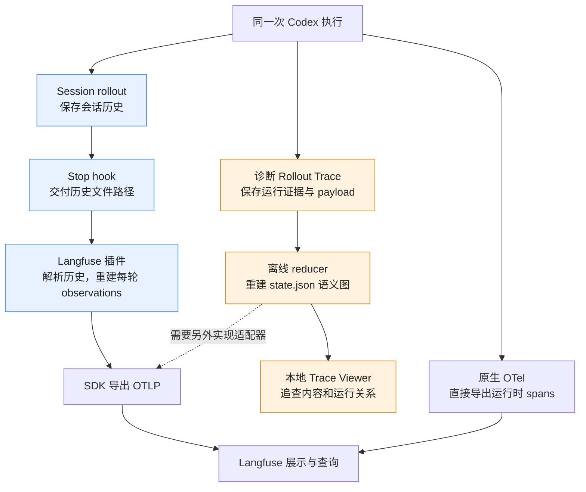

实线是现有路径。虚线是诊断 bundle 接入 Langfuse 时需要补充的适配边界，第 9 节说明如何设计。

## 2. 先看一次任务，以及 session 和 thread 的关系

把任务想成下面的过程：用户输入 → 构造模型请求 → 模型要求读文件 → 执行工具 → 把工具结果放入历史 → 再次请求模型 → 最终回答。一次 turn 可以包含多次模型请求，也可以包含并行工具。

### 2.1 一次 turn 可以有多次模型调用

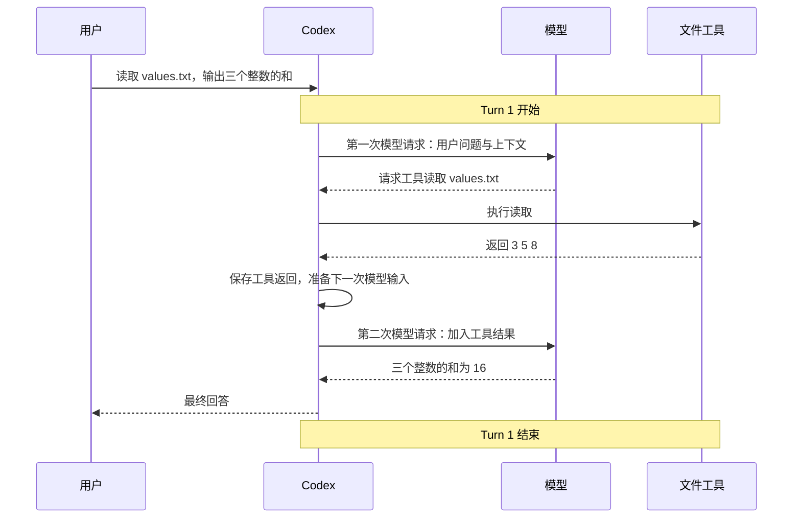

这里是一轮用户任务、两次模型调用、一次工具调用。如果一次请求失败后重试，网络层还会有多个 attempt。插件从历史推导出的 step 与诊断 trace 记录的具体 attempt 并不是同一种计数。

会话历史保存消息、调用与结果，以及上下文、用量和恢复标记；诊断路径另外记录请求、工具分发、JS code cell、终端和压缩边界。同一个协议事件也可能分别交给这两个出口，再交付给客户端。诊断 trace 从运行过程采集，不是事后把 session JSONL 转换出来的。

### 2.2 Session 对象绑定 thread；session_id 标识根会话

当前 Codex 实现中，一个运行时 `Session` 管理一个 thread。每个 thread 有自己的历史和 turns；根 thread 与其子 Agent 的 `session_id` 可以相同。

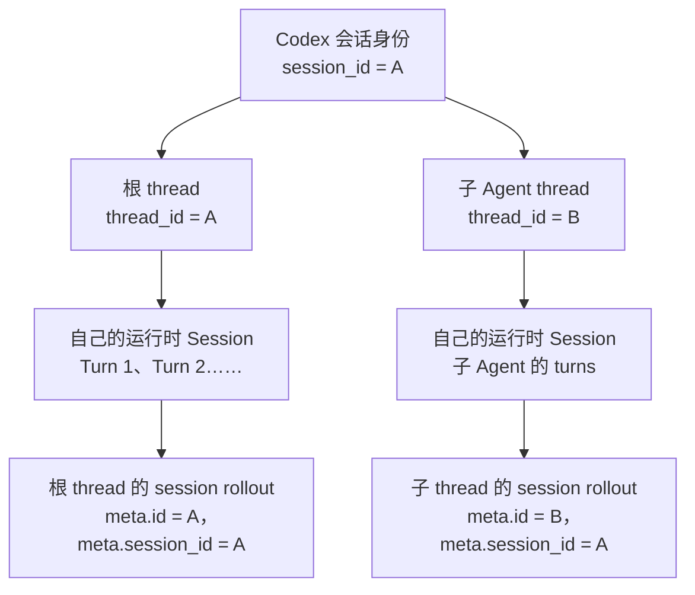

resume 会重新建立运行时对象，并恢复原 thread 的历史与会话身份。运行时对象的生命周期和持久化会话的生命周期因此不同。fork 出新的根 thread 则建立新的会话身份。

还有一个容易混淆的命名：**插件 `0.4.0` 的 `sessionMeta.sessionId` 读取的是 JSONL 的 `session_meta.payload.id`，也就是 thread ID，并非同一条元数据里的 `session_id` 字段。** 普通根 thread 的两个值相同，容易掩盖这个区别。正常从根 transcript 导出时，插件以根 thread ID 分组，并将发现的子 Agent turns 嵌套在根 turn 下；单独导出子 transcript 时，不能假定插件会自动按 Codex 的根 `session_id` 分组。

## 3. 诊断 Rollout Trace 如何生成？

### 3.1 显式启用后，运行边界开始记录

可以把 `ThreadTraceContext` 理解为跟随 thread 的记录入口：它告诉 writer 这条观察来自哪个 thread、哪轮运行。

未设置 `CODEX_ROLLOUT_TRACE_ROOT` 时，这些记录调用不写文件；设置后，根 thread 创建本地 bundle。同一根 rollout 的新建子 thread 共享 writer，使一个 bundle 可以容纳多个 Agent。已恢复的子 thread 有单独规则，不能概括成“所有子 thread 永远并入一个 bundle”。

初始化和写入失败采取尽力处理，诊断故障不应让正常会话失败。trace ID 标识本次诊断产物；thread / rollout 身份用来关联被观察的会话，两者不能混用。

### 3.2 writer 先写证据，再写引用

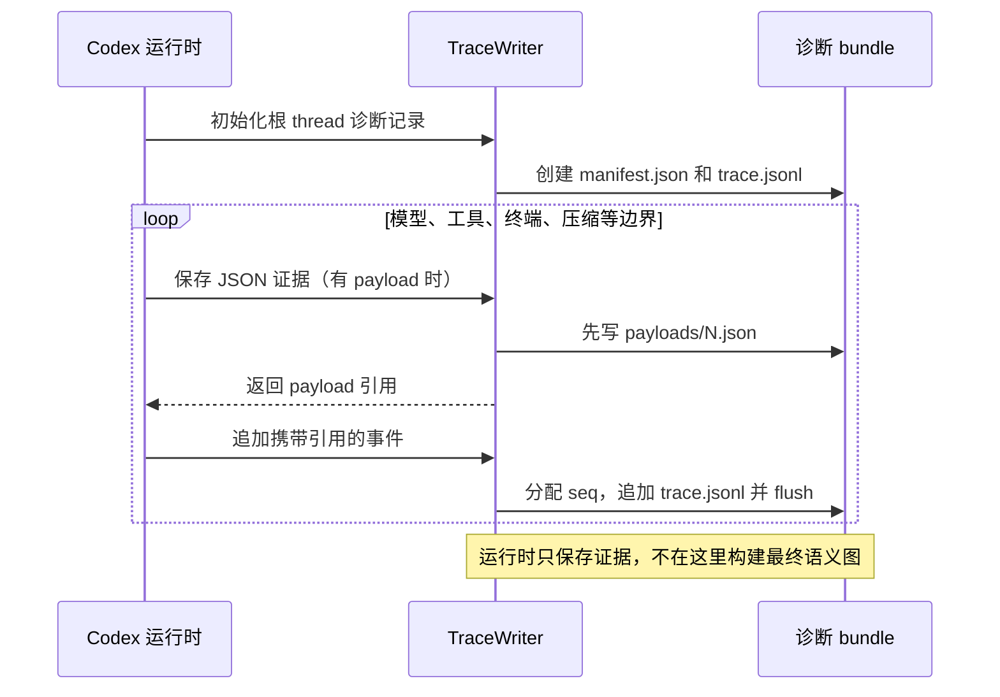

payload 文件先于引用它的事件写入，这是 reducer 能追溯原始证据的基础。这里的 flush 是文件缓冲刷新，不应据此声称所有内容已经经过断电安全的磁盘同步。

`trace.jsonl` 像一份带编号的事件目录：每行有 `seq`、时间、rollout 身份、可选的 thread / turn 身份及事件内容，大正文则通过引用放在 payload 文件中。`seq` 表达 writer 的记录顺序；毫秒时间戳用于时间展示，不能代替顺序和因果关联。

最先关注这些事件即可：

| 事件族                                      | 解释什么                         |
| ------------------------------------------- | -------------------------------- |
| `rollout_started` / `thread_started`        | bundle 与 thread 身份            |
| `codex_turn_started` / `codex_turn_ended`   | 一次运行 activation 的范围       |
| `inference_started` / `inference_completed` | 某次具体上游请求及其响应         |
| `inference_failed` / `inference_cancelled`  | 未成功结束的请求与可用的部分输出 |
| `tool_call_started` / `tool_call_ended`     | 调用方看到的工具边界             |
| code cell、terminal、compaction 事件        | 工具内部运行、进程与历史替换     |

模型响应证据保存响应身份、上游 request ID、可用 token usage 与已完成的 output items，并没有保存每个文字 delta。因此“raw evidence”指采集边界观察到的原始材料，不等于完整网络抓包。

### 3.3 reducer 从证据恢复语义图

reducer 是证据解释器。它读取 manifest、事件日志及被引用的 payload，重建对象和关系；CLI 再将结果写成 `state.json`。

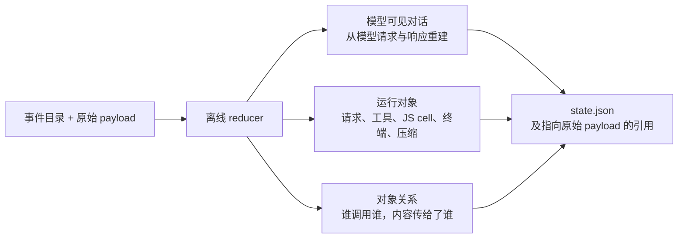

`state.json` 中的 `threads`、`codex_turns`、`inference_calls`、`tool_calls`、`conversation_items` 等是按 ID 索引的对象集合。原始大正文通常仍在 payload 文件中；只拿 `state.json` 不一定足够还原内容。

一些工具运行事件可能先于证明其来源的完整模型响应被写入。reducer 会暂存这些观察，等对应证据出现后再建立关系。这是“先观察、后解释”的原因之一。

此时应能区分三件事：

- terminal 采集边界保留的输出；
- JavaScript code cell 收到的工具返回；
- 后续模型请求中出现的 tool output。

例如 JS 收到很长的输出后，只执行 `text(result.output.slice(0, 100))`，模型可见的就是外层工具返回的内容。不能把 terminal payload 全文直接标成“模型看到了这些”。reducer replay 重建证据图，不会重新调用模型或重跑工具。

### 3.4 本地录制与查看练习

需要包含该功能的 Codex 构建。先用自己的二进制检查：

```bash
codex debug trace-reduce --help
```

**2026-09-29 本机实测：npm 安装的 `codex-cli 0.156.1` 和 VS Code 附带的 `0.155.0-alpha.16.3` 均支持此命令。** CLI 的真实样例也已生成诊断 bundle，并通过 reducer 与 Viewer 验证。其他环境应对实际二进制检查帮助和录制结果；版本号或设置环境变量成功都不足以证明已经生成 bundle。需要源码构建时，按仓库开发说明执行，并明确所用二进制路径。

在包含功能的构建下，新开终端运行：

```bash
export CODEX_ROLLOUT_TRACE_ROOT="${XDG_STATE_HOME:-$HOME/.local/state}/codex/rollout-traces"
mkdir -p "$CODEX_ROLLOUT_TRACE_ROOT"
codex
```

提交“读取 values.txt，输出三个整数的和”，结束会话后，在 trace root 中选本次新增的 bundle。把真实目录填入下面变量：

```bash
BUNDLE='/absolute/path/to/the-new-bundle'
codex debug trace-reduce "$BUNDLE"
```

默认生成 `$BUNDLE/state.json`。在 [Trace Viewer](../../tools/codex-trace-viewer/README.md) 目录按 README 安装依赖后打开：

```bash
npm run serve -- --bundle "$BUNDLE" --port 0
```

先找本轮的 inference，再沿 request payload → response output → tool → 下一次 request 检查内容流向。最后核对 code cell / terminal 对象，暂时不要展开所有 protocol breadcrumbs。bundle 可能保存 prompt、文件内容和路径；这一步在本地完成。

## 4. Session rollout 怎样写入，截断发生在哪里？

### 4.1 会话条目经过后台 writer 写入 JSONL

当前本地实现中，Session 把历史条目交给 thread store，后者选择需要保留的记录，再经 recorder 的有界队列交给后台 writer。

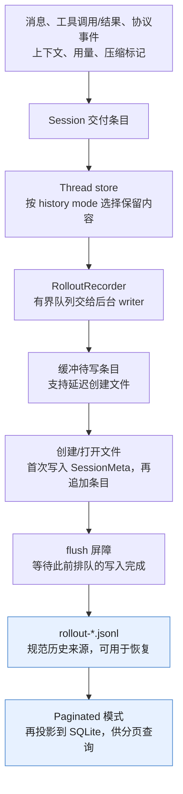

这条本地 append 路径会先入队，再等待 flush。SQLite 是可重建的查询视图：只能在 JSONL 写入完成后更新，投影失败时可以落后于 JSONL。文件写入失败会保留未写条目，尝试重开文件重试；刷新缓冲与断电安全的磁盘同步仍是两个概念。

每个 JSONL 条目带 UTC `timestamp`，还可能带 `ordinal`。下面是简化形状，根 thread 的两个 ID 都为 A：

```jsonl
{"timestamp":"…","type":"session_meta","payload":{"id":"A","session_id":"A"}}
{"timestamp":"…","type":"event_msg","payload":{"type":"task_started","turn_id":"turn-id"}}
{"timestamp":"…","type":"turn_context","payload":{"model":"…","effort":"high"}}
{"timestamp":"…","type":"response_item","payload":{"type":"function_call","call_id":"call-id","name":"…","arguments":"…"}}
{"timestamp":"…","type":"response_item","payload":{"type":"function_call_output","call_id":"call-id","output":"…"}}
```

这里 `type` 是外层记录类别，`payload.type` 才是具体 response item / event 类别。Rust 的 `TurnStarted` / `TurnComplete` 在线上编码中沿用 `task_started` / `task_complete`，插件按这些 wire 名称解析。

持久化策略会丢弃部分临时事件；Legacy 与 Paginated 保留的 event 类型也不同。session JSONL 的时间主要反映条目写入时间，不能直接解释为模型请求发出的时间。完整逻辑请求、传输增量与保存的历史材料也不能直接画等号。

### 4.2 Session rollout 也可能保存历史截断前的工具返回

**不能简单理解成“session rollout 只有截断后的结果，而诊断 trace 有全集”。** 工具处理输出和内存历史截断是不同阶段。当前实现会保留工具返回的原条目及历史截断预算元数据，在内存历史的副本上应用截断，再用历史构造模型输入。

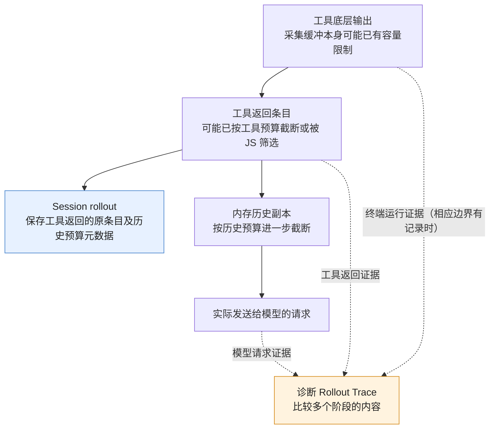

用两个示意例子区分，字数只表达内容长度，不代表实际 token 配置：

| 情况                                                        | Session rollout 能保留什么                        | 模型后续实际收到什么           | 诊断 trace 的额外价值                          |
| ----------------------------------------------------------- | ------------------------------------------------- | ------------------------------ | ---------------------------------------------- |
| 工具返回 10,000 字，内存历史将其截到 2,000 字               | 10,000 字的原工具返回及预算元数据                 | 截断后的历史内容               | 对照工具返回与模型请求，确认最终进入请求的内容 |
| JS 收到工具结果后只执行 `text(result.output.slice(0, 100))` | 外层 `exec` 返回的内容，可能只有 100 字及相关封装 | 外层输出经历史处理后留下的内容 | 区分内层工具返回、外层 JS 输出和模型输入       |

诊断录制必须已启用，并且相关采集点成功写入，才能做上述对照。终端保留缓冲会在容量上限后丢弃部分内容；模型响应也没有逐个保存流式 delta。已经在采集前丢失的内容，不能靠后续 trace 补回。

两条路径是有交集的不同记录：session rollout 保存恢复和查询所需的历史材料，诊断 trace 保存更多运行边界的证据与关联。它们各有保留规则，不能当作严格的子集与全集。

### 4.3 实测：session 留着中间内容，下一次模型请求已经删掉

2026-09-29 用本机 CLI `0.156.1` 和 `gpt-6-sol` 实际运行了一轮任务：读取临时 `sample.txt`，然后回答开头、中间、结尾三个标记的值。这轮包含 **2 次模型调用、1 次 JS cell、1 次内层 `exec_command`**，同时写出了 session JSONL 和诊断 bundle。模型请求真实发出，shell 真实执行；下图的数字来自这次记录。

文件有 2,403 行、110,458 字节，三个标记分别是 `HEAD_RECORD=alpha`、`MIDDLE_RECORD=bravo`、`TAIL_RECORD=charlie`。JS 将 `cat sample.txt` 的结果完整交给 `text(result.output)`；内外两层都请求了 40,000 的输出预算。实际保存的历史预算元数据为 `fallback_token_limit_override: 12000`。运行目录是临时目录，shell 使用只读沙箱。

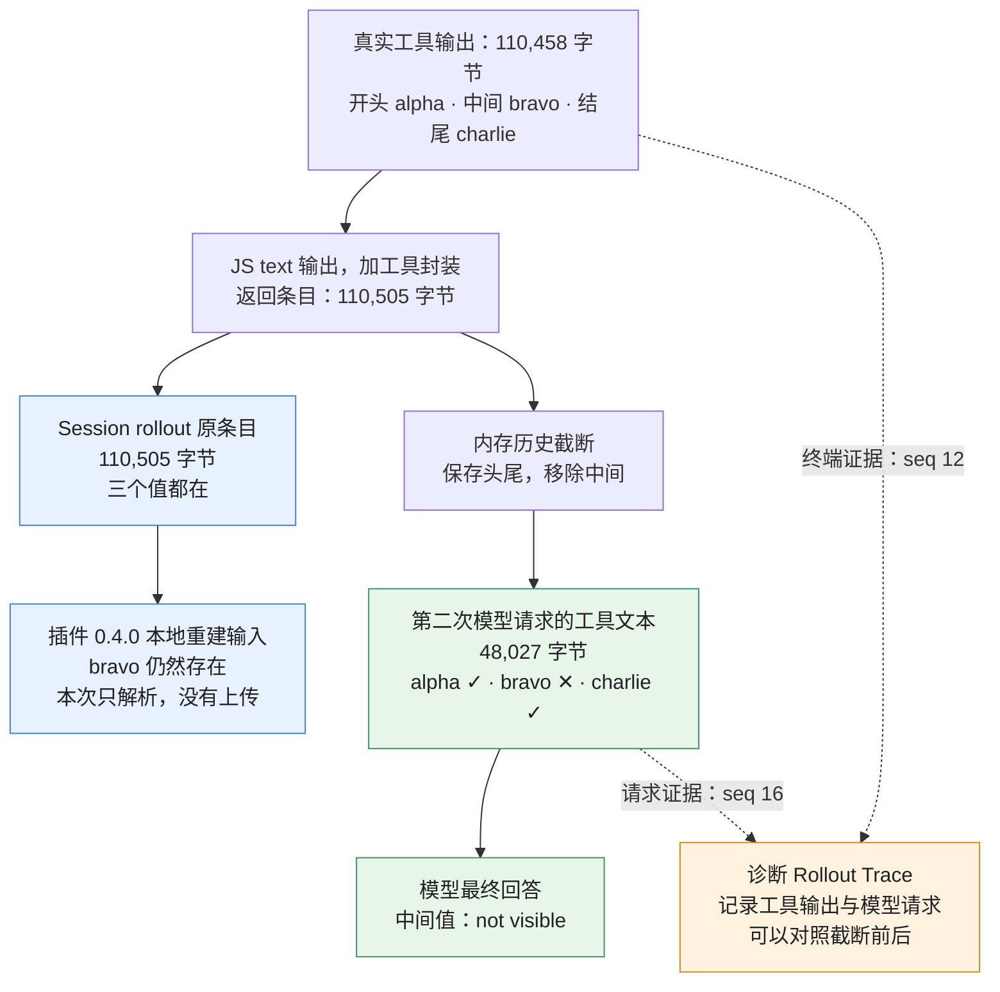

实线表示内容经过的处理，虚线表示诊断录制。可直接查看[实测对照图](assets/rollout-comparison.real.png)和[证据摘要](assets/rollout-comparison.real.json)，不需要先打开源码。

| 本次实际记录的位置                              | 工具文本的 UTF-8 字节数 | 开头 / 中间 / 结尾 | 能说明什么                                              |
| ----------------------------------------------- | ----------------------: | ------------------ | ------------------------------------------------------- |
| 诊断 `payloads/9.json` 的 `stdout`              |                 110,458 | 有 / 有 / 有       | 终端采集点保留了整个测试文件                            |
| 诊断 `payloads/10.json` 的 `value.output`       |                 110,458 | 有 / 有 / 有       | 内层工具没有先裁掉中间标记                              |
| 诊断 `payloads/11.json` 的 cell 文本            |                 110,458 | 有 / 有 / 有       | JS 把完整文本输出了                                     |
| Session JSONL 第 16 行 `payload.output`         |                 110,505 | 有 / 有 / 有       | 保存的是原返回条目，额外 47 字节是执行封装              |
| 诊断 `payloads/13.json` 的 `input[0].output`    |                  48,027 | 有 / **无** / 有   | 下一次请求中的工具文本已经截断                          |
| 插件本地重建的第二次 generation 的 tool message |                 112,976 | 有 / **有** / 有   | 从 session 重建仍带着中间值；此处 JSON 序列化增加了长度 |

字节数只统计相应文本，不是整个 JSON 文件大小，也不是计费 token 数。第二次请求的文本含有 `15627 tokens truncated` 提示；这是截断提示里的估算值。模型最终回答为：

```text
HEAD_RECORD=alpha
MIDDLE_RECORD=not visible
TAIL_RECORD=charlie
```

关键证据是**请求里的中间值确实缺失**，模型回答只是进一步印证。第二次请求使用 WebSocket 增量传输，带有 `previous_response_id`，其 `input` 只有这次新增的工具返回。完整逻辑上下文需结合第一次请求与响应恢复；本次比较针对工具返回本身，三个值此前没有进入请求或模型响应。

这次同时回答了两个问题：**session 原条目可能比模型随后收到的工具文本更长；插件重建的 generation input 也可能包含模型这次没收到的内容。** Langfuse 展示这类重建输入时，仅凭中间值出现在页面上，不能证明它进入过模型请求。要核验，必须有对应请求边界的证据。

本次关闭了 hooks 和插件自动上传；只对真实 session 运行固定版本的 `parseSession`、`generationInput` 等函数，确认重建内容，没有向 Langfuse 发送数据。原始 session 和 bundle 的绝对路径、事件序号、SHA-256 与标记附近的摘录保存在证据摘要中。bundle 位于临时目录，可能被系统清理；摘要和图保留在仓库，未复制全局提示词或客户端元数据。这次小实验的终端输出完整，不意味着所有诊断 trace 都能无损记录所有输出。

## 5. Stop hook 怎样把文件交给插件？

当当前步骤不再需要后续模型调用时，Codex 可以运行 Stop hook。hook 收到会话身份、turn 身份和历史文件路径；插件随后从磁盘读取 transcript。

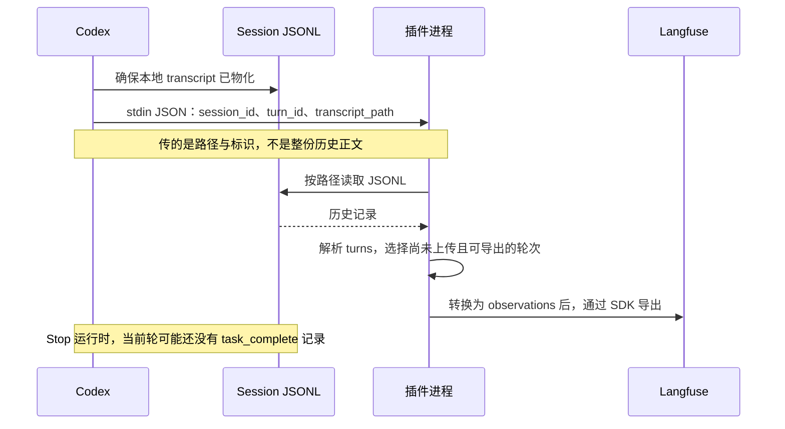

**Stop hook 可以早于 `task_complete` 的持久化。** 插件因此同时使用 hook 的 `turn_id` 判断当前轮是否可以导出，而不是只寻找文件里的完成标记。

固定版本的 Stop hook 启动 `node "${PLUGIN_ROOT}/dist/index.mjs"`，超时预算为 30 秒。插件的处理步骤是：

1. 读 stdin，解析配置。
2. 未启用、缺 key 或缺 `transcript_path` 时跳过。
3. 初始化 instrumentation，调用 `convertRollout`。
4. flush / shutdown，随后记录已上传的 turn ID。

配置优先级为默认值 → `~/.codex/langfuse.json` → 当前目录 `.codex/langfuse.json` → 环境变量。`LANGFUSE_CODEX_*` 凭据优先于对应 `LANGFUSE_*`。

## 6. JSONL 怎样变成 Langfuse trace？

### 6.1 先解析 session、turn、step 和工具

解析器按记录类型识别事实，再用 ID 配对。可以把它理解为将按行保存的历史整理成“哪一轮、哪一步、哪个工具”的结构：

| JSONL 证据                           | 解析结果                                        |
| ------------------------------------ | ----------------------------------------------- |
| `session_meta.payload.id`            | `sessionMeta.sessionId`，也就是 Codex thread ID |
| `task_started`                       | 创建 turn，保存 `turn_id`                       |
| `turn_context`                       | 模型、reasoning effort、调用上下文              |
| 用户 message / user event            | 用户输入；部分注入内容归入系统上下文            |
| assistant message / reasoning        | 当前 step 的文本和可用推理摘要                  |
| `function_call` / `custom_tool_call` | 创建 tool，用 `call_id` 建索引                  |
| 对应 `*_output`                      | 按 `call_id` 回填输出和结束时间                 |
| `token_count.info.last_token_usage`  | 关闭 step，记录该步 usage                       |
| `task_complete` / `turn_aborted`     | 结束 turn，确定最终输出与中断状态               |

例如下列两条记录靠相同的 `call_id` 配成一次工具执行，而不是靠相邻位置猜测：

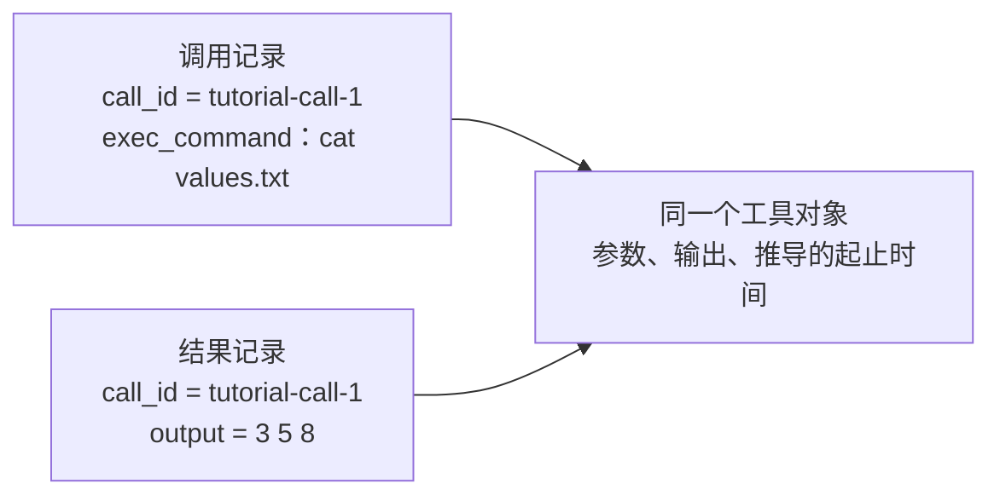

本版本不会消费所有 rollout 类型。尤其不能看到 `compacted`、`token_usage_record` 等记录，就假定插件完整重放了 Codex 的 compaction 或全部计费事实。新 history mode 能否正确导入，需要用实际样例核对支持范围。

解析器在首次遇到相关 transcript 条目时创建 step。因此插件的 step 是从历史重建的模型步骤，并非网络层每次 attempt 的精确记录。

### 6.2 再创建 observations

解析完后，插件为普通根 thread 的一轮创建以下 observations。以下结构对应固定的 `0.4.0` 版本：

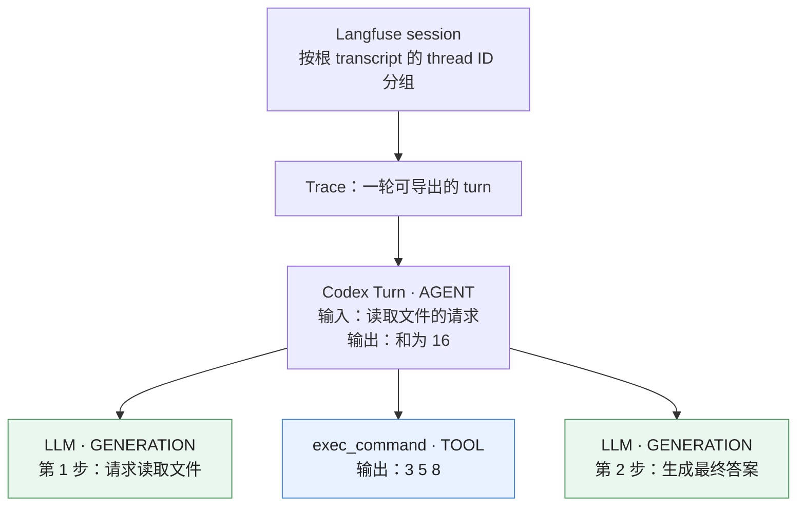

上方的 session / trace 是分组层级；AGENT 到三个子 observation 的实线才表示这里的父子关系。**generation 和 tool 是 turn 的同级子节点。** 工具为何执行，要对照 generation output 中的 `tool_calls` 与 TOOL 的 `codex.call_id`，不能仅从 parent observation 推断。

根 AGENT 的 input / output 是本轮用户输入与最终回答；generation 保存该步模型、参数、usage 和生成内容；TOOL 保存参数、输出及可识别错误。session、user、tags 等通过 `propagateAttributes` 传播。

插件还会寻找子 Agent 的独立 rollout，将其 turns 嵌套到发起工作的根 turn 下，并尝试排除从祖先继承的历史。它使用 thread 身份、父子关系及历史线索恢复归属，没有导入诊断 bundle 的完整 `interaction_edges`。

### 6.3 generation input 是怎样重建的？

插件根据历史自行拼接输入：系统上下文 + 此前 turns + 当前用户输入 + 本轮已经结束的 steps。工具结果只能在工具返回之后加入后续步骤的输入。

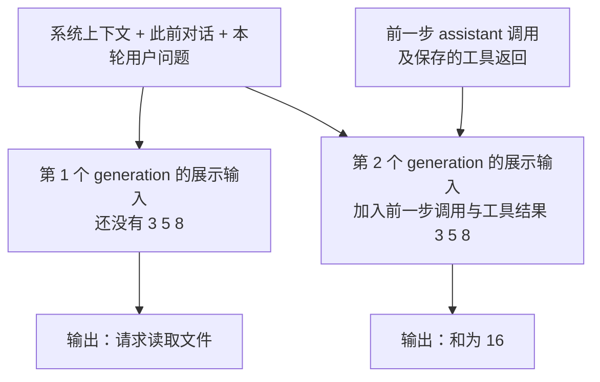

这个差异能帮助理解 Agent 的工作过程。**Langfuse 中的 generation input 是插件重建的 ChatML 视图，不是抓取到的原始 Responses API 请求。** 固定版本直接拼接已解析的工具输出，不会按 Codex 的历史截断预算元数据重放截断。

因此第 4.2 节的 10,000 字工具返回，可能完整出现在插件重建的 input 中，即使 Codex 的实际请求只含截断后的 2,000 字。看到 Langfuse 展示了某段内容，不能据此断言模型实际看到了它。确认精确输入需要对照诊断 trace 的请求证据；历史压缩、请求增量和仅运行时可见的内容也有同样的核对边界。

code mode 中，模型可能只调用外层 `exec`，里面再调用多个工具。插件主要沿 transcript 配对外层调用；需要逐条查看内层工具和终端操作时，回到诊断 Rollout Trace 或原生运行 trace。

### 6.4 时间与 token 的解释

插件将模型步骤的结束时间限制在第一个工具调用或 step 结束处，但开始时间仍由 transcript 推导。这样的 latency 不能当作模型端到端延迟或首 token 延迟（TTFT）。

转换 usage 时，插件验证 `total = input + output`，并检查 cached / reasoning 不超过对应总数。用教学样例的第一步计算：

```text
input_tokens = 100，其中 cached_input_tokens = 80
output_tokens = 20，其中 reasoning_output_tokens = 10
total_tokens = 120

若展示为互斥桶：普通 input 20 + cached 80 + 普通 output 10 + reasoning 10 = 120
```

不能算成 `100 + 80 + 20 + 10`。也不要把累计 `total_token_usage` 每次重新加一遍。费用还取决于模型价格匹配；教学模型 `tutorial-model` 没有真实价格，不能用它验收成本。[Token 与费用说明](https://langfuse.com/docs/observability/features/token-and-cost-tracking)

## 7. 上传发生在哪里，如何避免反复上传？

插件将创建的 observations 交给独立的 OTel provider 与 `LangfuseSpanProcessor`，以批次导出，并在退出前刷新缓冲、关闭 provider。

这一步才是从内存 observations 到 HTTP 导出的边界。原 JSONL 不会作为附件整份上传，插件将解析得到的语义对象编码成 OTel spans。

Langfuse 的接收边界是 OTLP/HTTP；基础路径为 `/api/public/otel`，trace 专用路径为 `/api/public/otel/v1/traces`，通过项目 key 的 Basic Auth 验证。直接配置 OTel exporter 时，v4 接入还要核对 `x-langfuse-ingestion-version: 4`。插件由其内置 SDK 管理导出，无需手动把这个 endpoint 拼进 `base_url`。[OTel 接收契约](https://langfuse.com/integrations/native/opentelemetry)

本机 `0.4.0` 打包 SDK 的模拟请求没有自动带上述 v4 标头；已验证可通过 `OTEL_EXPORTER_OTLP_TRACES_HEADERS` 补充，见下一节。不带该标头时，v2 查询可能延迟显示新数据，不能只凭即时空列表判断导入失败。

`base_url` 应是 `http://127.0.0.1:3035` 或相应云区域的站点地址。不要把 JSONL 原样 POST 到 OTLP endpoint，它要求 OTel 的数据编码。新的 trace 接入使用 OTLP；旧 `/api/public/ingestion` 路径已弃用。[Public API](https://langfuse.com/docs/api-and-data-platform/features/public-api)

`<rolloutFile>.langfuse` 是上传 turn ID 的本地列表，称为 sidecar。下一次 hook 会读取相同 transcript，并跳过已标记的 turns。可导出条件除了已完成 / 已中断，还包括已被后续 turn 取代或匹配当前 Stop 的 turn ID。

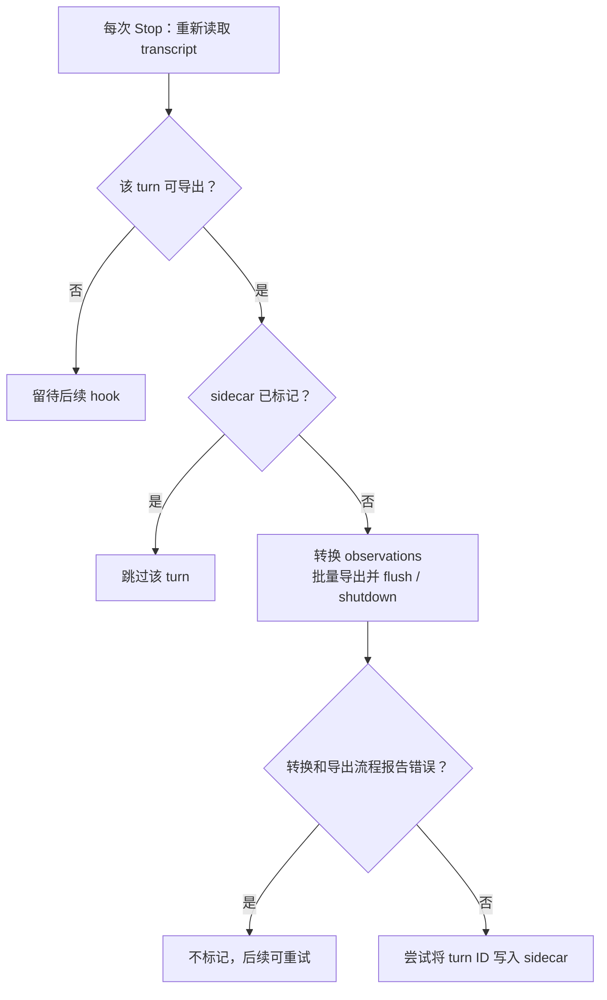

flush / shutdown 没有报告错误后才写 sidecar；sidecar 写入自身是尽力处理。因此它是重试与去重辅助，不是严格 exactly-once 协议，也不是服务端读取验收。默认上传错误不阻断 Codex；调试时可设置 `LANGFUSE_CODEX_DEBUG=true` 和 `LANGFUSE_CODEX_FAIL_ON_ERROR=true`。

插件按 session / turn seed 生成稳定身份，但输入、遍历顺序、配置或版本变化仍可能影响重放结果。不要把重复导入和删 sidecar 当作无条件幂等操作。

## 8. 做一次可核对的导入实验

### 8.1 准备已安装插件与本地项目

本机已有 `0.4.0` 插件与 Langfuse 项目。部署、安装和 hook trust 的完整步骤见[本地运行说明](langfuse-local/README.md)；首次搭建按该说明执行即可。这里只教导入，不需要重新初始化现有项目。

如果走自动采集，确认插件、`features.hooks` 与 Stop hook 已启用，再重启 Codex，新开一轮“读取文件并回答”，下一轮追问上一轮结果。查看 session 是否出现两轮记录。原生 `otel.log_user_prompt=false` 不控制插件的 transcript 内容上传，插件配置需要单独核对。[官方安装与配置说明](https://langfuse.com/integrations/developer-tools/codex)

### 8.2 用最小 JSONL 理解手动导入

配套文件 [rollout-to-langfuse.synthetic.jsonl](assets/rollout-to-langfuse.synthetic.jsonl) 是**人工构造的教学数据**，含一轮、两步模型输出、一次直接工具调用和示意 token。它不是真实 API 请求或真实性能样本；里面的命令不会因导入而执行。

这份数据描述的是第 2.1 节的任务：用户问 → 模型请求读取 → 工具返回 `3 5 8` → 模型回答“和为 16”。预计导出第 6.2 节图中的 4 个 observations：1 AGENT、2 GENERATION、1 TOOL。第二步展示输入应包含 `3 5 8`。

在仓库根目录，复制到独立临时 session 树中，避免把 sidecar 写入源码目录。下面使用 Bash / WSL；其他平台保持同样的 stdin JSON 与 Node 调用即可：

```bash
IMPORT_DIR=$(mktemp -d)
mkdir -p "$IMPORT_DIR/sessions/2026/09/29"
ROLLOUT="$IMPORT_DIR/sessions/2026/09/29/rollout-tutorial.jsonl"
cp learning/codex-observability/assets/rollout-to-langfuse.synthetic.jsonl "$ROLLOUT"
PLUGIN_ROOT="$HOME/.codex/plugins/cache/codex-observability-plugin/tracing/0.4.0"
export ROLLOUT
```

这个日期目录结构让子 Agent 索引只扫描本实验的 sessions 树。`PLUGIN_ROOT` 是本机已核对的安装位置；其他机器先从实际安装目录确认路径。

将本机查询 profile 的凭据导出到环境，并开启插件。此段应在自己的终端执行，配置文件位于仓库外；不要显示其中的 key：

```bash
set -a
source "$HOME/.config/langfuse/session.env"
set +a
export TRACE_TO_LANGFUSE=true
export LANGFUSE_CODEX_BASE_URL=http://127.0.0.1:3035
export LANGFUSE_CODEX_PUBLIC_KEY="$LANGFUSE_PUBLIC_KEY"
export LANGFUSE_CODEX_SECRET_KEY="$LANGFUSE_SECRET_KEY"
export LANGFUSE_CODEX_USER_ID=rollout-tutorial
export LANGFUSE_CODEX_TAGS=tutorial,synthetic
export LANGFUSE_CODEX_DEBUG=true
export LANGFUSE_CODEX_FAIL_ON_ERROR=true
export OTEL_EXPORTER_OTLP_TRACES_HEADERS=x-langfuse-ingestion-version=4
```

如果已有其他 OTLP trace headers，将这个键合并进原有逗号分隔列表。其他机器没有该 profile 时，用自己的项目 key 配置等价环境变量。手动运行实际 hook 入口：

```bash
python3 - <<'PY' | node "$PLUGIN_ROOT/dist/index.mjs"
import json
import os

print(json.dumps({
    "hook_event_name": "Stop",
    "session_id": "tutorial-synthetic-session",
    "turn_id": "tutorial-synthetic-turn",
    "transcript_path": os.environ["ROLLOUT"],
}))
PY
```

执行此命令会向所选项目上传教学内容，并在临时 rollout 旁写 `.langfuse`。这不是插件公开承诺的批量迁移 CLI，而是根据固定版本 `runHook` 的 stdin 契约调用现有入口。导入真实历史时，将路径换成明确选定的完整会话文件；保留 sidecar，避免扫描整份私有历史。

hook 会读完整文件并导出所有尚未标记且可导出的根 turns。传入 `turn_id` 不是“只导入这一轮”的筛选器；它只参与当前轮终结判断。也不要把仍在增长的真实会话当作稳定离线样本。

### 8.3 从 Langfuse 查询并对账

先确认 CLI 契约，再有界查询：

```bash
langfuse api observations list --help
langfuse --env ~/.config/langfuse/session.env api observations list \
  --session-id tutorial-synthetic-session \
  --from-start-time 2026-09-29T08:00:00Z \
  --to-start-time 2026-09-29T08:01:00Z \
  --fields core,basic,model,usage,metadata \
  --limit 20 --json
```

离线导入保留源时间，不会因为现在上传就出现在“最近几分钟”的时间筛选中。本机 CLI 返回 HTTP 封装，记录在 `body.data`，分页游标在 `body.meta.cursor`。

从根 AGENT 取到 `traceId` 后，再查询该 trace 的 `io`，同时保留上述时间窗和条数上限。验收以下内容：

| 检查       | 教学样例预期                                            |
| ---------- | ------------------------------------------------------- |
| 类型与数量 | 1 AGENT + 2 GENERATION + 1 TOOL                         |
| 分组       | `sessionId=tutorial-synthetic-session`，同一个 trace ID |
| 树结构     | 两个 LLM 与 TOOL 的 parent 都指向根 AGENT               |
| 工具关联   | `codex.call_id=tutorial-call-1`，output 为 `3 5 8`      |
| 下一步输入 | 第二个 LLM input 含工具结果                             |
| Token      | 两步原始 total 为 120 与 190，合计 310                  |
| 根输入输出 | 用户读文件请求；最终“和为 16”                           |

未请求 `io`、`model` 或 `usage` 时，缺失这些字段不能证明没有采集。`body.meta.cursor` 有值时还需要分页；一次列表不是项目总量。v4 查询使用 Observations v2，按 `traceId` 聚合还原 trace；本实例旧 traces API 返回 404。[有界查询与版本契约](https://langfuse.com/docs/api-and-data-platform/features/public-api)

真实样例可打开[已有插件 trace](http://127.0.0.1:3035/project/codex-session-plugin/traces/bcbcd917bfbfa99a965d33cd0af1d08c)，或阅读[离线证据](assets/langfuse-install-turn-evidence.json)。本教程编写时按该文件时间窗重新查询，确认 34 个 observations：1 AGENT、15 GENERATION、18 TOOL，分页游标为空。它与 4 节点教学样例分开，完整解释见[Langfuse 阅读实战](langfuse-trace-reading-guide.md)。

本文的教学 JSONL 通过本地模拟 OTLP 接收器验证了 4 节点转换、共同 trace ID、父子关系、第二步输入、usage、sidecar 与重复调用不再发送，也验证了补充 v4 标头的实际请求。未由编写教程这一操作导入真实 Langfuse 项目；上面的命令供读者执行真实入库练习。

## 9. 如果要把诊断 bundle 本身导入 Langfuse

当前仓库 reducer、Viewer 与官方插件没有形成 `bundle → Langfuse` 的直接导入链。第 8 节完成的是 session JSONL 导入。诊断 bundle 接入需要新增适配器，以下是依据当前类型与接收契约给出的设计，不是已有命令。

建议从 `replay_bundle` 的语义对象投影，而不是把每个 raw event 都创建成一个 span：

| reducer 数据                       | Langfuse 投影建议                    | 内容证据                                                 |
| ---------------------------------- | ------------------------------------ | -------------------------------------------------------- |
| `CodexTurn`                        | 根 AGENT；默认一轮一个 trace         | 对应用户输入、回答及 execution window                    |
| `InferenceCall`                    | GENERATION；保留每个具体 attempt     | 请求 payload、完成或部分 response payload、model / usage |
| `ToolCall`                         | TOOL；跟随实际 requester 组织        | invocation / result refs、model-visible 与 runtime IDs   |
| `CodeCell`                         | 表达 JS 运行生命周期的 SPAN          | source、嵌套 tool、yield / wait、execution window        |
| `TerminalOperation`                | 按诊断需求保留的子 SPAN              | exec / write / poll 边界、退出码与运行输出               |
| `CompactionRequest` / `Compaction` | 请求跨度与 checkpoint 分开           | input / replacement item IDs 与 payload refs             |
| `InteractionEdge`                  | links 或关联 metadata / 外部证据引用 | 跨 Agent 信息流；不能强行改成树的父子关系                |

投影前先明确根、turn 和子 Agent 的范围，并保留 `capture_trace_id`、`rollout_id`、`thread_id`、`codex_turn_id` 等来源身份。OTel trace ID 是 32 位十六进制，span ID 是 16 位十六进制；不要把诊断 UUID 或 reducer 对象 ID 原样当成这些 ID。

对 input / output 标明证据边界：逻辑模型输入、实际传输请求、runtime tool 结果分别保留。重试、取消、缺失 payload 和仍运行对象也要保留状态；没有结束证据时，不要拿上传时间冒充执行结束。

导出链可以复用支持的 Langfuse SDK / OTel exporter，向 `/api/public/otel/v1/traces` 发送带 Langfuse 类型、模型、usage 与分组属性的 spans。自定义 OTel exporter 还应传播 session / tags 等属性到相关 observations，具体字段以[官方映射表](https://langfuse.com/integrations/native/opentelemetry)为准。

适配器的验收至少需要“普通模型与工具”“一次失败重试”“code mode 的内层结果与模型可见结果不同”“一次 compaction”四种证据。对齐来源 ID、数量、输入输出与 token 后，才能说明诊断数据已正确接入。现有 session 插件的入库不能替代这个验收。

## 10. 遇到问题时，沿哪个边界查？

| 现象                                    | 优先检查                                                                    |
| --------------------------------------- | --------------------------------------------------------------------------- |
| 没有诊断 bundle                         | 所用二进制是否含功能；启动进程是否继承 trace root；目录写入是否失败         |
| reducer 失败                            | bundle 是否完整；payload 是否存在；原始事件与 schema 是否匹配               |
| 没有插件 trace                          | tracing 是否启用；hook 是否信任并执行；`transcript_path` 与项目配置是否正确 |
| 旧会话导入后“看不到”                    | 源时间筛选、所选项目、sidecar 是否跳过、是否真正识别 turn ID                |
| 有 trace 但 input / usage 为空          | 查询 fields；parser 对当前 rollout 格式的支持；源记录是否包含内容           |
| LLM latency 异常短                      | transcript 的首次相关记录时间；不能据此推断真实请求延迟                     |
| Langfuse input 比模型实际请求更长       | 插件拼接了保存的原工具返回，但没有重放 Codex 的历史截断；对照诊断请求证据   |
| exec 内命令退出非零，但 TOOL 不是 ERROR | 外层调用是否成功返回；parser 是否识别该内层错误                             |
| Token 或费用翻倍                        | 累计用量重复求和、cached/reasoning 子集、原生与插件两路重复统计             |
| 缺少内层工具或跨 thread 因果关系        | 该事实是否只在诊断 bundle 中；插件没有导入完整 runtime graph                |

排查时沿第 1 节的数据流定位：Codex 是否保存了历史 → hook 是否交付了正确路径 → 插件是否识别了轮次 → exporter 是否成功发送 → 服务端查询是否选对了项目、源时间和字段。需要进一步确认模型可见内容和工具内部数据流时，使用诊断 bundle 的请求证据、reducer 与 Viewer。

## 11. 自测

1. 指着两个目录解释：哪一个能直接交给官方插件，哪一个需要 reducer？
2. 用第 2.1 节的任务解释 turn、模型 step 和网络 attempt 为什么数量可能不同。
3. 在 JSONL 中用同一个 `call_id` 找到工具调用与输出，再在 Langfuse 对上 TOOL。
4. 解释为什么第二个 generation input 有工具结果，而第一个没有。
5. 用第一步 token 算出 120，并解释 cached 与 reasoning 的子集关系。
6. 解释为什么 `.langfuse` sidecar 不足以证明服务端入库，以及 Stop 时为什么可能还没有 `task_complete`。
7. 如果只拿到 `state.json`，指出还需要哪些 payload 才能证明“模型看到了什么”。
8. 根 thread A 与子 thread B 的 `id` 和 `session_id` 分别是什么？插件 `0.4.0` 读取哪个字段作为分组身份？
9. 工具返回 10,000 字、历史截断到 2,000 字时，session JSONL、实际请求和插件展示的 input 为什么可能不同？

## 12. 可选：图中机制的源码依据

下面是实现核对入口，正文中的图与例子已经解释了主要行为。本机 Codex 位于 `~/code/codex`，插件位于 `~/code/codex-observability-plugin`；插件链接固定到 `0.4.0` 的提交，避免未来版本改变后读到不同实现。

| 对应图或问题                       | 核对位置与关系                                                                                                                                                                                                                                                                                                                                                                                                                   |
| ---------------------------------- | -------------------------------------------------------------------------------------------------------------------------------------------------------------------------------------------------------------------------------------------------------------------------------------------------------------------------------------------------------------------------------------------------------------------------------- |
| Session、thread 与根会话身份       | [session/session.rs](../../codex-rs/core/src/session/session.rs) 中 `Session.thread_id` 与初始化时的 `session_id` 选择；[SessionMeta](../../codex-rs/protocol/src/protocol.rs) 同时保存 `id` 与 `session_id`。读到 resume 和子 Agent 的身份选择即可。                                                                                                                                                                            |
| 运行过程分别交付历史与诊断出口     | [session/mod.rs](../../codex-rs/core/src/session/mod.rs) 的 `record_conversation_items` 保存历史，`send_event_raw_with_persistence` 先交付持久化，再调用诊断 context，最后交付客户端。                                                                                                                                                                                                                                           |
| 模型请求与具体 attempt 的诊断采集  | [session/turn.rs](../../codex-rs/core/src/session/turn.rs) 的 `try_run_sampling_request` 把诊断 context 交给 [client.rs](../../codex-rs/core/src/client.rs)；后者记录 attempt 的开始、完成、失败或取消。                                                                                                                                                                                                                         |
| 诊断开关、payload 先于引用事件写入 | [thread.rs](../../codex-rs/rollout-trace/src/thread.rs) 创建或禁用记录入口；[writer.rs](../../codex-rs/rollout-trace/src/writer.rs) 的 `write_json_payload` 写正文，`append_with_context` 分配 `seq` 并追加事件。                                                                                                                                                                                                                |
| reducer 重建对话和运行关系         | [reducer/mod.rs](../../codex-rs/rollout-trace/src/reducer/mod.rs) 的 `replay_bundle` 重放事件；[conversation.rs](../../codex-rs/rollout-trace/src/reducer/conversation.rs) 从请求与响应重建模型可见对话，[code_cell.rs](../../codex-rs/rollout-trace/src/reducer/code_cell.rs) 处理 JS 运行对象。                                                                                                                                |
| session JSONL 先写、SQLite 后投影  | [local/live_writer.rs](../../codex-rs/thread-store/src/local/live_writer.rs) 的 `write_and_project` 过滤条目，再进入 [recorder.rs](../../codex-rs/rollout/src/recorder.rs) 的队列、`rollout_writer` 与 flush 屏障。                                                                                                                                                                                                              |
| 原工具返回与历史截断副本分离       | [context_manager/history.rs](../../codex-rs/core/src/context_manager/history.rs) 的 `record_annotated_items` 保留原 envelope，`record_item_with_metadata` 在克隆副本上截断；[head_tail_buffer.rs](../../codex-rs/core/src/unified_exec/head_tail_buffer.rs) 展示底层输出缓冲的容量限制。                                                                                                                                         |
| Stop 交付文件路径，插件读取文件    | [hook_runtime.rs](../../codex-rs/core/src/hook_runtime.rs) 构造 Stop 请求；插件 [hooks.json](https://github.com/langfuse/codex-observability-plugin/blob/f4be3a47ac2c9c43721223a8f2e5d13f12e676c7/plugins/tracing/hooks/hooks.json) 启动入口，[index.ts](https://github.com/langfuse/codex-observability-plugin/blob/f4be3a47ac2c9c43721223a8f2e5d13f12e676c7/plugins/tracing/src/index.ts) 的 `runHook` 解析 stdin 并调用转换。 |
| 插件分组 ID、工具配对与 step 重建  | 插件 [parse.ts](https://github.com/langfuse/codex-observability-plugin/blob/f4be3a47ac2c9c43721223a8f2e5d13f12e676c7/plugins/tracing/src/parse.ts) 的 `sessionMetaFrom` 读取 `p.id`，`parseSession` 以 `call_id` 配对输出，并用 `ensureStep` 建立模型步骤。                                                                                                                                                                      |
| 插件树结构、重建输入和子 Agent     | 插件 [trace.ts](https://github.com/langfuse/codex-observability-plugin/blob/f4be3a47ac2c9c43721223a8f2e5d13f12e676c7/plugins/tracing/src/trace.ts) 的 `emitTurn` 设置 observation 的父节点，`generationInput` 拼接历史；`convertRollout` 与 `buildSubagentIndex` 组织根 turns 和子 Agent。                                                                                                                                       |
| 导出完成后才尝试写本地标记         | 插件 [instrumentation.ts](https://github.com/langfuse/codex-observability-plugin/blob/f4be3a47ac2c9c43721223a8f2e5d13f12e676c7/plugins/tracing/src/instrumentation.ts) 刷新 SDK 缓冲；`runHook` 随后通过 [sidecar.ts](https://github.com/langfuse/codex-observability-plugin/blob/f4be3a47ac2c9c43721223a8f2e5d13f12e676c7/plugins/tracing/src/sidecar.ts) 标记 turns。读到导出与标记之间的顺序即可。                            |
