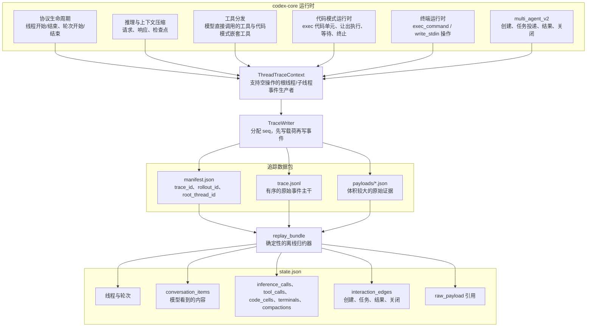
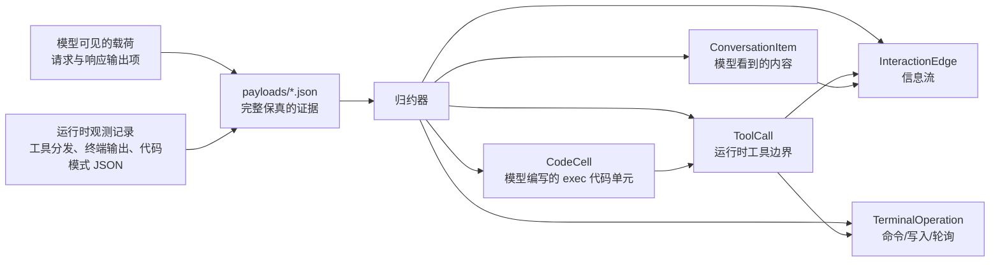
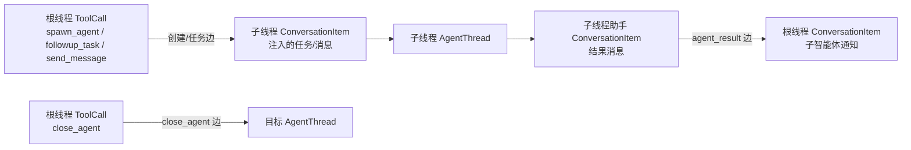

# Rollout Trace：中文译文

本文是仓库内 [Rollout Trace README](../../codex-rs/rollout-trace/README.md) 的完整中文译文，用于研究与学习。翻译核对日期：2026-09-29；源码基线：`b05a64b24b3c6f905aac62e1b9896fb0ca292794`；原文最近一次修改提交：`6ddb747e7687e9e6e3a2482631028c07ddc89cb6`（2026-06-01）。

正文保留原文全部章节、命令、类型名、字段名及三张 Mermaid 图的结构，图中文字译为中文。以下内容描述该版本的设计与契约，后续行为应结合所用源码版本核对。

---

# Rollout 追踪

> **隐私：** Rollout 追踪不属于遥测。Codex **不会**上传或上报这些追踪数据；只有设置了 `CODEX_ROLLOUT_TRACE_ROOT` 时，才会写入本地数据包。这些数据包可能包含提示词、响应、工具输入与输出、终端输出以及路径，因此请将它们视为敏感数据。

Rollout 追踪是一种需要主动启用的诊断机制，用于了解 Codex 会话期间发生了什么。它将原始运行时证据记录到磁盘上的本地数据包中，再通过回放将数据包转换成语义图，供调试器或 UI 检查。

核心设计原则是：**先观察，后解释**。

在会话运行期间，Codex 的关键执行路径不会尝试构建最终的图，而是写入有序的原始事件和载荷引用。离线归约器随后判断哪些事件构成了模型可见的对话、哪些事件属于运行时操作，以及信息如何在线程、工具、代码单元和终端会话之间流动。

## 它能带来什么

当常规对话记录不足以解释故障时，Rollout 追踪能帮助调试。它保留了足够的证据，可以回答以下问题：

- 哪次模型请求产生了这个工具调用？
- 这段输出来自模型可见的对话记录、代码模式中的运行时值、终端操作，还是智能体通知？
- 哪个代码模式的 `exec` 代码单元发起了嵌套工具调用？
- 哪次终端操作创建或复用了一个正在运行的进程？
- 哪次 multi-agent v2 工具调用创建了子线程、向其发送消息、接收其结果，或关闭了它？

归约后的 `state.json` 被有意设计为不止是一份对话记录。它是一张图，既包含模型可见的对话，也包含能够解释 Codex 如何形成这些对话的运行时对象。

## 系统结构



线程上下文被刻意设计得很精简，并支持空操作。根会话根据 `CODEX_ROLLOUT_TRACE_ROOT` 初始化一个上下文；新创建的子线程从父线程上下文派生出自己的上下文，让整棵 rollout 树共享同一个写入器。未启用追踪的上下文接受相同的调用，但不记录任何内容。

追踪的启动和写入都采用尽力而为的方式。诊断记录失败绝不能导致 Codex 会话失败。Core 负责产生原始观测记录；本 crate 负责数据包结构、追踪上下文 API、写入器和归约器。

## 数据包布局

一个追踪数据包包含：

- `manifest.json`：追踪标识与数据包元数据。
- `trace.jsonl`：仅追加的原始事件，按写入器分配的 `seq` 排序。
- `payloads/*.json`：原始请求、响应、工具输入与结果、运行时事件、终端输出、上下文压缩数据以及协议快照。
- `state.json`：可选的归约器输出，由 `codex debug trace-reduce` 写入。

`trace_id` 标识这份诊断产物。`rollout_id` 标识被观测的 Codex rollout／会话。将两者分开，可以让我们分析已存储的追踪数据，而不会将其与产品层面的会话标识混淆。

要对数据包执行归约：

```bash
codex debug trace-reduce <trace-bundle>
```

默认情况下，这会写入 `<trace-bundle>/state.json`。Rust 调用方也可以直接调用 `codex_rollout_trace::replay_bundle`。

## 原始证据与归约后的图



正是这种区分，使得数据模型同时包含原始载荷引用和语义对象。例如，代码模式中的嵌套工具调用，在 JavaScript 运行时边界上具有 JSON 输入和输出，但模型可见的对话记录只包含包裹它的 `exec` 自定义工具调用及其最终输出。

归约器将这些事实分别记录：

- `ConversationItem` 记录面向模型的请求与响应中出现的内容。
- `ToolCall`、`CodeCell`、`TerminalOperation`、`InferenceCall` 和 `Compaction` 记录运行时与调试边界。
- `InteractionEdge` 记录对象之间的信息流，例如一次 `spawn_agent` 工具调用将任务投递到子线程。
- 当查看器需要比归约图内嵌内容更详细的信息时，`RawPayloadRef` 可以指向原始证据。

## Multi-Agent v2

Multi-agent v2 的子线程共享根线程的追踪写入器。这意味着，一个根数据包会被归约成一张图，其中包含父线程、子线程以及它们之间的边。



顶层的独立线程仍各自拥有独立的数据包。创建出来的子线程则属于同一棵 rollout 树，因此应归入同一份原始事件日志、载荷目录和归约后的 `state.json`。

## 归约器不变量

对于原始证据应当保持内部一致性的地方，归约器会严格执行以下规则：

- 按 `seq` 顺序回放原始事件；
- 事件引用载荷文件之前，文件必须已经存在；
- 归约对象的 ID 在一次回放中保持稳定；
- 运行时事件可以暂存于队列中，直到观测到模型可见的来源或投递目标；
- 模型可见的对话从面向模型的载荷中派生，而不是从运行时为了方便处理而产生的输出中派生；
- 运行时载荷是证据，但不能证明模型看到了完全相同的字节内容。

这些不变量让归约后的图保持精简，同时保留通往原始证据的路径，以便调试器解释某个对象或某条边为何存在。
