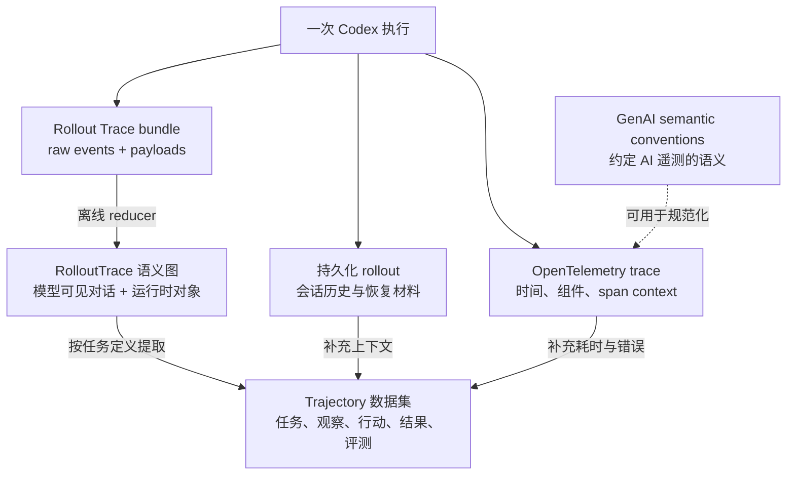
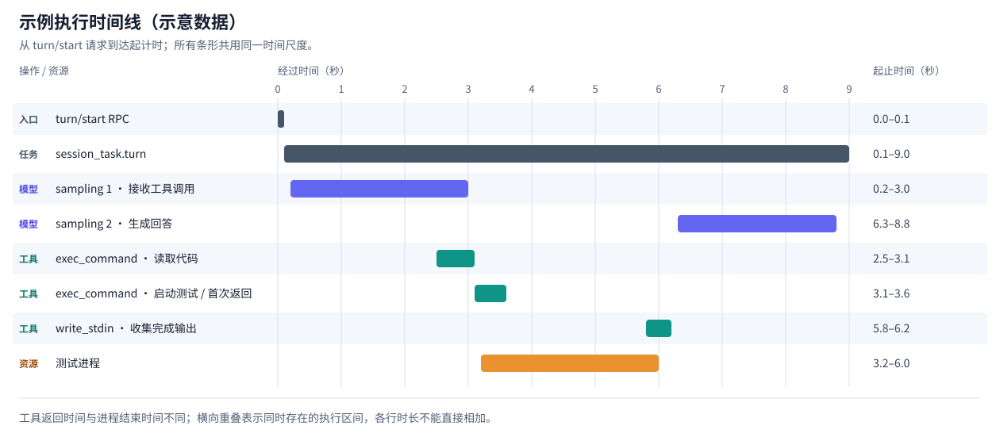
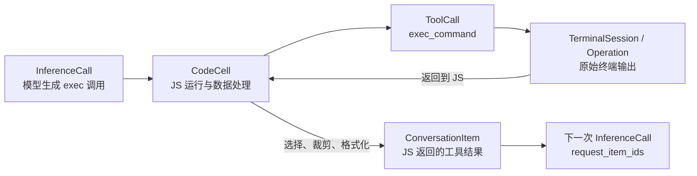

# Codex 的 Trace、OpenTelemetry GenAI、Rollout 与 Trajectory

[返回专项索引](README.md)

本文解释四件事：Codex 如何追踪执行过程，OpenTelemetry GenAI 规范约定什么，当前 Codex 实现采用了哪些约定，以及 trace、rollout、trajectory 为什么会记录同一次执行却不能互相替代。

GenAI 是 Generative AI（生成式 AI）的简称。本文讨论的 GenAI 语义规范，其目的在于让不同 Agent、模型 SDK 和观测平台用共同的含义描述模型调用、工具执行、耗时、token 与错误。具体收益和采用边界见第 4 节。

**结论：当前 Codex 支持 OpenTelemetry trace，并采用了四个 GenAI token 属性；对照本文固定的规范版本，它尚未形成完整的 GenAI 语义约定实现。Rollout Trace 是独立的本地诊断证据和语义图，trajectory 则是用于分析、评测或训练的行动轨迹表达。三者存在信息交集，但对象边界、关联方式和保存目标不同。**

## 1. 阅读基线

本文在 2026-09-29 核对以下两个仓库：

| 对象                         | 固定版本                                                                                                          | 本地位置                                        |
| ---------------------------- | ----------------------------------------------------------------------------------------------------------------- | ----------------------------------------------- |
| 当前 Codex 分支              | `47d47812d51490934be5b0c34da3dfcf72d524e2`，已 rebase 到 upstream/main `4fd5745e8486d655a0c7e7d762741465b986130b` | `/home/goulei1/code/codex`                      |
| OpenTelemetry GenAI 语义规范 | `e57c543b4889619eb2a05702471937db5119165d`，提交时间 2026-09-24                                                   | `/home/goulei1/code/semantic-conventions-genai` |

GenAI 语义规范已迁入独立的 [semantic-conventions-genai 仓库](https://github.com/open-telemetry/semantic-conventions-genai)。OpenTelemetry 网站的[原 GenAI 入口](https://opentelemetry.io/docs/specs/semconv/gen-ai/)明确提示旧位置不再维护。本文引用固定 commit，避免把不同年代的字段混在一起。

本文涉及的 inference、agent 和 token metrics 等规范仍标记为 **Development**。因此，“是否遵守”必须说明所比较的版本、信号类型和操作范围；不能把它理解为已经通过某种统一认证。安装 OpenTelemetry SDK，也不会自动获得某一版本的 GenAI 语义约定。

文中将“源码已经实现”“规范的要求或建议”“可能的设计方案”分别标明。示意数据和时间线不是一次真实运行的测量结果。

## 2. 先区分五个容易混淆的名字

| 名字                                     | 主要对象                                          | 主要回答的问题                                             |
| ---------------------------------------- | ------------------------------------------------- | ---------------------------------------------------------- |
| OpenTelemetry trace                      | 带父子关系、时间和属性的 spans                    | 一次操作跨哪些组件，在哪里等待或失败？                     |
| OpenTelemetry GenAI semantic conventions | 对 AI 相关 spans、metrics、events 的语义约定      | 不同 AI 系统怎样使用同一套字段和操作含义？                 |
| Codex 持久化 rollout                     | 会话历史、上下文和相关持久化记录                  | 怎样恢复已有会话，重建后续模型所需的历史？                 |
| Codex Rollout Trace                      | 本地 raw events、payloads，以及归约后的运行语义图 | 模型看到了什么，哪次推理产生了哪个工具调用，数据如何流转？ |
| Trajectory                               | 围绕任务组织的观察、行动、结果序列或图            | Agent 怎样解决任务，哪些决策有效，怎样评测或训练？         |

其中最需要纠正的是：**持久化 rollout 和 Rollout Trace 是两个机制。** 两者都涉及执行历史，但前者参与产品的会话恢复，后者是需要显式开启的诊断录制路径。



图中的 trajectory 提取和规范化是概念上的数据处理关系；当前 Codex 并没有因为存在这些记录，就自动导出一份统一的 trajectory 数据集。

## 3. OpenTelemetry trace 是什么

一个 trace 将相关操作关联起来，每段操作由一个 span 表示。Span 通常含有开始和结束时间、名称、属性、状态、span events，以及用于关联的 trace ID 和 span ID。父子关系表达调用归属；span links 可以表达其他关联，不必把所有关系都塞进一棵调用树。[OpenTelemetry trace 概念](https://opentelemetry.io/docs/concepts/signals/traces/)

在 Codex 中，它尤其适合观察 app-server 请求、turn task、模型连接与流式接收、工具分发、MCP 请求和远程 exec-server 请求。它提供的是执行过程的观测视角，是否覆盖全部过程取决于插桩、上下文传播、过滤和导出。

### 3.1 Trace 不等于日志，不等于逐 token 录像

同一个 span 内可以有多个 event。独立的 OTel log 是另一种信号，即使携带相同 trace ID，也不会因此变成一个 span。Metrics 又是聚合信号，例如调用次数、耗时分布和 token 消耗。

完整 prompt、工具输出或模型内容可以通过受控的内容采集方式关联到 trace，但基础 trace 数据结构不会自动保存这些内容。一个瀑布图展示了调用耗时，并不证明它保存了足够的会话材料。

### 3.2 Context 传播解决跨组件关联

Codex 的 [trace_context.rs](../../codex-rs/otel/src/trace_context.rs)提供 W3C `traceparent`、`tracestate` 的提取和注入，以及设置远程父上下文的辅助方法。典型 `traceparent` 的结构是：

```text
00-4bf92f3577b34da6a3ce929d0e0e4736-00f067aa0ba902b7-01
版本-              trace_id             -     span_id    -标志
```

接收方继续使用这个上下文，且双方都正确插桩、导出，观测平台才有机会显示一条跨进程链路。客户端发出了上下文，不意味着你就能看到模型服务内部的排队、GPU 推理或服务端工具执行 spans；还需要服务端的观测数据和访问权限。

父 span 已结束，异步子任务仍可能继续运行。尤其是 `turn/start` 这种异步 RPC，“请求已受理”的耗时不能直接当作“Agent 已完成任务”的耗时。

## 4. OpenTelemetry GenAI 规范与普通 OTel 的关系

OTel 提供遥测数据结构、SDK、上下文传播和导出机制。GenAI 语义约定在这套基础上，统一 AI 操作的名称、属性和统计口径。

可以把 OTLP 理解为“数据怎样传过去”，把 GenAI semantic conventions 理解为“传过去的 AI 字段分别意味着什么”。OTLP 接收成功，只证明数据可以被接收，不能证明接收方能自动识别模型、Agent、工具、token 和成本。

### 4.1 目的：让不同系统的 AI 观测数据能够被共同理解

如果每个 Agent 自己定义观测字段，数据即使都能通过 OTLP 传输，接收方仍然要逐个理解。下面是两个假想系统，字段不是当前 Codex 的实际输出：

| 同一个事实 | Agent A 的自定义记录 | Agent B 的自定义记录 | 采用共同约定后 |
| --- | --- | --- | --- |
| 操作类型 | span 名为 `call_model` | span 名为 `generate` | 用 `gen_ai.operation.name` 说明操作 |
| 请求模型 | `model` | `llm_name` | 使用 `gen_ai.request.model` |
| 输入 token | `prompt_tokens` | `tokens_in` | 使用 `gen_ai.usage.input_tokens`，并遵循其统计口径 |
| 模型耗时 | 只计建立连接，用毫秒 | 计到流结束，用秒 | 按完整逻辑操作定义 span，标准耗时指标使用约定单位 |

接收方需要的不只是同名字段，还要知道字段含义、单位和操作边界一致。OpenTelemetry 对 semantic conventions 的总体目的，就是让代码、库和平台共享操作与数据的命名和含义；GenAI 将这一做法扩展到 AI 操作。[Semantic conventions 的目的](https://opentelemetry.io/docs/concepts/semantic-conventions/)

### 4.2 实际用途：减少适配，提高可比性

以下是采用共同约定后的工程收益；它们依赖采集方与接收方对同一版本、同一操作的实际支持，并非安装 SDK 后自动获得的功能：

| 使用者 | 实际用途 | 仍需自行完成什么 |
| --- | --- | --- |
| Agent / SDK 开发者 | 按共同契约记录模型、Agent 和工具操作，减少各团队重复定义字段 | 找准插桩边界，采集真实 usage、错误和关联标识 |
| 观测平台或 Viewer | 用一套规则识别模型调用和工具执行，显示及聚合共同属性 | 实现对应版本的映射、查询和界面 |
| 多 Agent 平台团队 | 比较不同框架、provider 或语言的调用耗时、失败率和 token 使用 | 核对模型、配置、任务与 workload 是否具有可比性 |
| 运维与排障人员 | 用共同操作和错误语义组织查询、指标及告警 | 设置阈值，保留系统日志和更细的 transport 证据 |
| 接入或迁移平台的人 | 复用已有 OTel 采集链路，减少接入每个后端时的专有适配 | 检查后端兼容性、版本差异和未映射的内容 |

比如平台查询“所有模型调用的耗时”，共同约定可以减少逐个解析 `call_model`、`generate`、`sampling_request` 的工作。但这些操作必须确实覆盖相同生命周期；给连接 span 换个标准名字，不会使它变成完整推理耗时。

成本分析可以利用统一的 model 和 usage 字段，但还需要模型价格、缓存计费与 provider-specific 信息。任务质量则需要成功标准、验证或评分，不能从符合 GenAI 约定直接得到。

### 4.3 对 Codex 的价值与采用边界

对当前 Codex，采用这套约定的直接价值是：让外部平台更容易识别 inference、Agent 和 tool 操作，以及正确聚合相应数据。Langfuse 已提供 [OTel 到其数据模型的属性映射](https://langfuse.com/integrations/native/opentelemetry)，但仍要检查其支持的字段、版本和 observation 类型；不能假定最新 GenAI 字段全部自动展示。

Codex 专有信息仍然可以保留，例如 code cell、terminal session、compaction checkpoint 和跨 thread 信息流。规范定义的是 AI 遥测的公共表达，不提供整个 harness 的内部状态模型，也不会自动创建 Rollout Trace 语义图、恢复会话或提取 trajectory。

完整 prompt 内容也不是采用规范的前提。它可以作为独立的 opt-in 内容采集能力，按实际需求与 trace 关联。

因此，学习 harness 时可以先明确自己的业务对象、生命周期和原始证据，再将共同部分映射到一个固定版本的 GenAI 约定。这里的规范仍处于 Development，采用收益是降低互操作成本；“是否符合”应落实到具体操作和字段，而不是作为判断 Agent 优劣的单一指标。

### 4.4 它关心业务操作边界

对于 inference，规范建议一个 span 覆盖调用方观察到的完整逻辑操作：发起请求，到响应接收完毕，或者因错误、取消而结束；自动重试也应包含在这个逻辑操作内。通常使用 `CLIENT` kind，本进程模型可以使用 `INTERNAL`。名称通常按操作和模型组织。[固定版本的 GenAI spans](https://github.com/open-telemetry/semantic-conventions-genai/blob/e57c543b4889619eb2a05702471937db5119165d/docs/gen-ai/gen-ai-spans.md)

这与“在 HTTP 函数、stream setup、每个流事件处理函数上分别建立 span”属于不同抽象层次。后者有助于诊断内部实现；前者让不同框架能比较同一类 AI 操作。

Agent 规范还分别定义远程调用和进程内执行的 `invoke_agent` span；工具执行有 `execute_tool` 语义。调用 Agent、进行一次模型推理和执行工具，是可以嵌套但不应混同的边界。[Agent spans](https://github.com/open-telemetry/semantic-conventions-genai/blob/e57c543b4889619eb2a05702471937db5119165d/docs/gen-ai/gen-ai-agent-spans.md)

### 4.5 它统一字段，不要求采集所有内容

Inference 的核心必填语义包括 `gen_ai.operation.name` 和 `gen_ai.provider.name`；请求模型在可获得时属于条件必填。Token usage 是推荐属性，完整输入、输出和 system instructions 等内容属性属于显式选择采集的范围。属性的详细含义见[字段注册表](https://github.com/open-telemetry/semantic-conventions-genai/blob/e57c543b4889619eb2a05702471937db5119165d/docs/registry/attributes/gen-ai.md)。

所以，未采集完整 prompt 本身不是不符合规范的证据。相反，缺少某个操作的必填语义、采用不同的操作边界、或者把字段放在其他对象上，才需要认真检查。

规范允许额外的系统专用属性。Codex 可以保留 `codex.*`，也可以保留用于内部诊断的普通 Rust 函数 spans；并不是每个 span 都必须改成 `gen_ai.*`。

### 4.6 它也约定 metrics，不能只看 span 属性

固定版本中的客户端耗时指标包括 `gen_ai.client.operation.duration`，单位为秒；流式调用还可以记录 `gen_ai.client.operation.time_to_first_chunk`。[GenAI metrics](https://github.com/open-telemetry/semantic-conventions-genai/blob/e57c543b4889619eb2a05702471937db5119165d/docs/gen-ai/gen-ai-metrics.md)

Token 指标区分两类：`gen_ai.client.inference.usage.*` counters 用于累计消耗，`gen_ai.client.inference.operation.*` histograms 用于单次操作的 token 分布。缓存输入是输入 token 的子集，reasoning 输出是输出 token 的子集，计算总量时不能再次相加。Usage counters 还要求 token modality 维度；无法可靠区分时应使用 `unknown`。[Token metrics](https://github.com/open-telemetry/semantic-conventions-genai/blob/e57c543b4889619eb2a05702471937db5119165d/docs/gen-ai/gen-ai-token-metrics.md)

不能从旧教程照搬 `gen_ai.system` 或 `gen_ai.client.token.usage`，再与本文的规范版本一起判断符合程度；字段和指标口径需要按版本比较。

## 5. 当前 Codex 到底遵守了多少

这里的判断针对本仓库自带的插桩和 exporter。部署方可以在 collector 中转换数据或添加额外插桩，那属于另一个实现范围。

### 5.1 三个层次的结论

| 层次                                          | 当前结论     | 依据                                                                              |
| --------------------------------------------- | ------------ | --------------------------------------------------------------------------------- |
| OTel 基础设施与传输                           | 已支持       | 使用 OTel SDK、Rust tracing bridge、OTLP HTTP/gRPC 和 W3C trace context           |
| GenAI 字段采用                                | 部分采用     | 在响应处理 span 上写入四个 `gen_ai.usage.*` token 属性                            |
| GenAI 操作语义、必填属性和 metrics 的整体采用 | 对照固定规范版本，未完整采用 | 模型、Agent、工具采用 Codex 自身的 span 边界和属性，metrics 主要是 Codex 自有命名 |

支持 OTel 和完整遵守 GenAI 语义约定，是两个分别需要验证的事实。这里也没有把 Development 规范当作所有 Codex 版本必须满足的产品承诺。

### 5.2 源码对照矩阵

| 对照项               | 固定版本的约定                                                 | Codex 当前实现                                                                            | 判断                             |
| -------------------- | -------------------------------------------------------------- | ----------------------------------------------------------------------------------------- | -------------------------------- |
| 遥测传输             | 采用 OTel 的 signals 和 exporter 机制                          | [provider.rs](../../codex-rs/otel/src/provider.rs)建立 providers，桥接 tracing，支持 OTLP | 基础能力具备                     |
| Inference 操作标识   | `gen_ai.operation.name`、`gen_ai.provider.name` 为必填属性     | 模型调用和响应处理使用 `model`、`provider` 等自身字段，相关 span 未写这两个 GenAI 属性    | 缺少关键语义                     |
| 请求模型与会话关联   | `gen_ai.request.model`、适用条件下的 `gen_ai.conversation.id`  | 已有 `model`、`thread.id`、`conversation.id` 等信息，但未统一写为相应 GenAI 属性          | 信息存在，schema 不同            |
| Inference span 边界  | 建议覆盖完整逻辑操作，包括流式接收和自动重试                   | 分为 client、sampling、stream setup、receiving、逐事件处理等多个 spans                    | 不能直接认定为标准逻辑操作 span  |
| 输入输出 token       | 推荐 `gen_ai.usage.input_tokens`、`gen_ai.usage.output_tokens` | `ResponseEvent::Completed` 时写到对应响应处理 span                                        | 已采用字段；挂载对象需要注意     |
| 缓存 token           | 推荐 cache read/write input token 属性                         | 写入 `gen_ai.usage.cache_read.input_tokens`、`gen_ai.usage.cache_write.input_tokens`      | 已采用字段                       |
| Reasoning token      | 对应 `gen_ai.usage.reasoning.output_tokens`                    | 使用 `codex.usage.reasoning_output_tokens`                                                | 自有字段，未采用该标准字段       |
| Agent invocation     | `invoke_agent` 及对应 Agent 属性                               | turn task 通常使用 `session_task.turn`，带 thread、turn、model 等字段                     | 未统一到 Agent 语义              |
| Tool execution       | `execute_tool`、`gen_ai.tool.name` 等语义                      | 分发 span 动态使用工具名，MCP span 使用 `mcp.tools.call` 和 RPC/MCP 属性                  | 未统一到 GenAI tool 语义         |
| 客户端耗时指标       | 标准 operation 指标，单位秒                                    | 常见指标为 `codex.api_request.duration_ms`、`codex.turn.e2e_duration_ms`                  | 名称、单位、操作口径不同         |
| Token metrics        | 标准 inference usage counters 和 operation histograms          | 使用 `codex.turn.token_usage` 等 turn 级指标                                              | 不是标准 inference token metrics |
| Prompt/response 内容 | 内容属性可显式选择采集                                         | OTel 内容日志有独立开关，Rollout Trace 可录制本地 payload                                 | 未采集内容不构成单独的符合性缺陷 |

上述“未写入”是对相关源码路径的检查结果，不是对所有托管环境、未来版本或外部插件的保证。

### 5.3 四个标准字段究竟写在哪里

[turn.rs](../../codex-rs/core/src/session/turn.rs)中的 `try_run_sampling_request` 为响应流建立 `receiving_stream`，随后循环创建 `handle_responses` span。这些 span 预先声明 token 字段，之后由 [SessionTelemetry::record_responses](../../codex-rs/otel/src/events/session_telemetry.rs)写入。

遇到 `ResponseEvent::Completed` 且包含 token usage 时，代码记录：

```text
gen_ai.usage.input_tokens
gen_ai.usage.cache_read.input_tokens
gen_ai.usage.cache_write.input_tokens
gen_ai.usage.output_tokens
codex.usage.reasoning_output_tokens
codex.usage.total_tokens
```

`otel.name` 还会根据响应事件改成 `completed`、`text_delta`、`function_call` 等名称。因此，你可能在一个响应事件处理 span 上看到 token 总量，而不是在一个标准命名的 inference span 上看到它。

这意味着“平台能找到标准 token 属性”与“平台能正确计算每次逻辑模型调用的消耗”之间仍有差距。重复导出、重试、turn 汇总和 completion 属性也必须避免重复计数。

### 5.4 只做字段重命名为什么不够

假设 collector 将 `model` 重命名为 `gen_ai.request.model`，这能改善字段查询，但不能修复操作边界。将一个短暂的 `completed` 处理 span 改名为 `chat <model>`，也不会让它的时间范围自动覆盖整次流式推理。

同样，turn 可能包含多次模型调用、多个工具和等待审批。把 `codex.turn.e2e_duration_ms` 换算为秒后叫作 inference duration，会把不同操作混在一起。

完整采用需要同时处理：逻辑操作的开始与结束、重试与传输尝试、属性挂载位置、错误和取消语义、单位、指标类型，以及内容采集策略。这个判断来自以上源码边界与规范的对照。

### 5.5 Codex 是否计划完整采用：实现事实与公开计划分开看

上面的差异矩阵是针对固定版本的实现对照，不是 Codex 团队的 roadmap，也不表示这些差异已经被列为待完成事项。公开资料核查日期为 2026-09-29。

最直接的采用证据是已合并的 [PR #19432：Add token usage to turn tracing spans](https://github.com/openai/codex/pull/19432)，对应提交 `de2ccf94735a3d8a2a7077e6a5292026413867cf`，合并时间为 2026-04-28。其说明明确将目标放在排查慢 turn：在 trace 本身看到 token 用量，省去与独立 analytics 数据关联的步骤。该改动引入 input、cache-read 和 output 三个 GenAI usage 属性，同时保留 reasoning、total 和 turn 汇总等 `codex.*` 属性；本文固定的后续源码还包含 cache-write 属性。

[官方可观测性文档](https://learn.chatgpt.com/docs/config-file/config-advanced#observability-and-telemetry)说明了 OTel 导出能力，公开的指标目录主要使用 `codex.*` 名称。该 PR 的说明及公开讨论、所核查的官方文档和相关 issue 中，没有找到完整采用某个 GenAI 规范版本的明确承诺、时间表或整体迁移方案。这是本次检索的结果，不能据此推断团队内部没有计划。

| 问题 | 可支持的结论 |
| ---- | ------------ |
| Codex 是否使用 GenAI 约定？ | 已部分采用，有具体代码和已合并 PR 为证据 |
| Codex 是否公开承诺完整遵循？ | 本次核查未找到，计划状态尚不明确 |
| 怎样理解目前的工程做法？ | 可以解读为按诊断需求采用部分通用字段，并保留 Codex 自身的观测模型；这是实现观察，不是官方立场声明 |

因此，不能把“支持 OTel”“采用部分 GenAI 字段”“承诺完整采用 GenAI”合并成同一个判断，也不能仅凭差异矩阵推断 Codex 对规范持反对态度。

## 6. Codex 当前插了哪些 spans

下面列出适合理解主链路的插桩，不是全仓库 spans 的穷尽清单。实际出现哪些节点取决于入口、transport、工具和运行分支。

| 层次               | 代表性 span 名称                                                                                                    | 源码入口与用途                                                                                                                   |
| ------------------ | ------------------------------------------------------------------------------------------------------------------- | -------------------------------------------------------------------------------------------------------------------------------- |
| App-server RPC     | `app_server.request`，导出名称按方法改为 `turn/start` 等                                                            | [app_server_tracing.rs](../../codex-rs/app-server/src/app_server_tracing.rs)：RPC 元数据和远程父上下文                           |
| Submission         | `submission_dispatch`，导出名称为 `op.dispatch.*`                                                                   | [handlers.rs](../../codex-rs/core/src/session/handlers.rs)：操作分发                                                             |
| Turn task          | `session_task.turn`、`session_task.run`、`run_turn`                                                                 | [tasks/mod.rs](../../codex-rs/core/src/tasks/mod.rs)、[regular.rs](../../codex-rs/core/src/tasks/regular.rs)：异步 turn 生命周期 |
| Prompt 与 sampling | `build_prompt`、`run_sampling_request`、`try_run_sampling_request`                                                  | [turn.rs](../../codex-rs/core/src/session/turn.rs)：模型调用编排                                                                 |
| 模型 transport     | `model_client.websocket_connection`、`model_client.stream_responses_api`、`model_client.stream_responses_websocket` | [client.rs](../../codex-rs/core/src/client.rs)：连接和不同传输路径                                                               |
| 流式处理           | `stream_request`、`receiving_stream`、动态命名的响应处理 spans                                                      | [turn.rs](../../codex-rs/core/src/session/turn.rs)：建立流、等待和处理事件                                                       |
| 工具分发           | `dispatch_tool_call_with_code_mode_result`，导出名称动态使用工具名                                                  | [parallel.rs](../../codex-rs/core/src/tools/parallel.rs)：工具生命周期和并行控制                                                 |
| MCP 请求           | `mcp.tools.call`                                                                                                    | [mcp_tool_call.rs](../../codex-rs/core/src/mcp_tool_call.rs)：RPC、server、tool 和调用 ID                                        |
| Code mode          | `code_mode.runtime.invoke_tool`                                                                                     | [service.rs](../../codex-rs/code-mode-runtime/src/service.rs)：JS cell 内调用工具                                                |
| 终端操作           | `unified_exec.exec_command`、`unified_exec.write_stdin`、`unified_exec.open_session`、`unified_exec.collect_output` | [process_manager.rs](../../codex-rs/core/src/unified_exec/process_manager.rs)：启动、写入和收集进程输出                          |
| 远程执行           | `codex.exec_server.request` 及服务端请求/进程 spans                                                                 | [rpc.rs](../../codex-rs/exec-server/src/rpc.rs)、[telemetry.rs](../../codex-rs/exec-server/src/telemetry.rs)：跨进程执行         |

注意 Rust span 的声明名称与通过 `otel.name` 覆盖后的导出名称可能不同。看代码时找到 `info_span!` 或 `trace_span!`，还需要检查后续是否动态记录 `otel.name`。

[OtelProvider::trace_export_filter](../../codex-rs/otel/src/provider.rs)通常允许 spans 进入 trace 出口，但过滤 `h2` transport 自身的 spans，以免 OTLP 导出造成递归；对普通 tracing events 则仅允许 trace-safe target。一个 event 出现在本地日志中，不保证它也在远端 trace 中。

## 7. 瀑布图该怎样读

下面是一次“读取代码 → 执行测试 → 给出回答”的假想时间线，以 `turn/start` 请求到达为 `t = 0`，单位为秒。名称压缩了若干内部 spans，不表示实际代码必定生成同样的树。所有条形共用同一时间尺度，操作名称与条形分列显示。



可[打开原图](assets/example-execution-timeline.svg)放大查看，具体时间如下：

| 操作或资源 | 开始（秒） | 结束（秒） | 时长（秒） |
| ---------- | ---------- | ---------- | ---------- |
| `turn/start` RPC | 0.0 | 0.1 | 0.1 |
| `session_task.turn` | 0.1 | 9.0 | 8.9 |
| sampling 1：接收工具调用 | 0.2 | 3.0 | 2.8 |
| sampling 2：生成回答 | 6.3 | 8.8 | 2.5 |
| `exec_command`：读取代码 | 2.5 | 3.1 | 0.6 |
| `exec_command`：启动测试并首次返回 | 3.1 | 3.6 | 0.5 |
| `write_stdin`：收集完成输出 | 5.8 | 6.2 | 0.4 |
| 测试进程 | 3.2 | 6.0 | 2.8 |

读图时有四个关键点：

1. `turn/start` RPC 很快返回，turn task 仍继续执行。观察总任务耗时要选对应的任务边界。
2. 工具可能在响应流仍接收时启动，时间重叠不一定是错误。
3. `exec_command` 返回一个运行中的 session，底层进程可能继续运行；后续通过 `write_stdin` 获取输出。工具调用时间不等于进程存活时间。
4. 各条 bar 的时长不能直接相加。它们存在嵌套和并行，端到端延迟要按依赖路径分析。

`receiving` span 的一段长等待，通常表示等待下一条流事件，但可能涉及网络、服务端处理和本地调度；不能直接称为 GPU 推理时间。同样，工具分发 span 可能包含并行锁、审批或其他等待，不能全算作命令执行 CPU 时间。

Grafana/Tempo 一类 OTel UI 主要按 spans 展示瀑布图。本分支的 [Codex Trace Viewer](../../tools/codex-trace-viewer/README.md)消费 Rollout Trace 的 `state.json` 与 payload 引用，当前业务 timeline 是事件/对象视图，不能直接等同于 Tempo 的 span 瀑布图。

## 8. 持久化 rollout：会话恢复材料

[RolloutRecorder](../../codex-rs/rollout/src/recorder.rs)负责将会话记录写入 rollout 文件。它的目标包括保存会话历史，让已有会话能够继续；具体保留内容与落盘行为受配置和记录策略影响，不应假定永远保存全部运行时证据。

恢复主线在 [Session::reconstruct_history_from_rollout](../../codex-rs/core/src/session/rollout_reconstruction.rs)。它利用历史记录和 compaction checkpoint 重建适用于继续对话的历史。

这里的“恢复”是恢复 Agent 的会话上下文。它不会因为历史里出现过一次 shell 调用，就再次自动执行那条 shell 命令，也不等于把整个文件系统和外部服务回滚到过去。

要排查 resume 后丢失了什么上下文，先看这条持久化与重建主线。要解释嵌套工具、进程和代码 cell 的数据流，再补充下面的 Rollout Trace。

## 9. Rollout Trace：原始证据与运行语义图

[Rollout Trace README](../../codex-rs/rollout-trace/README.md)将它定义为可选的本地诊断路径：开启后先写入运行观察，之后离线解释为语义图。该机制本身不上传这些 bundles。

### 9.1 两种形态

```text
一个 trace bundle/
├── manifest.json       # 诊断录制的标识和元数据
├── trace.jsonl         # raw events，writer 分配连续 seq
├── payloads/*.json     # 请求、响应、工具与运行时的较大证据
└── state.json          # 可选：离线 reducer 输出的语义图
```

[RawTraceEvent](../../codex-rs/rollout-trace/src/raw_event.rs)封装 schema version、seq、墙钟时间、rollout/thread/turn ID 和具体事件。事件包括推理开始/完成/失败/取消、工具与代码 cell 生命周期、compaction、Agent 结果观察和协议事件。

[TraceWriter](../../codex-rs/rollout-trace/src/writer.rs)控制同一 bundle 的写入顺序；`seq` 表示录制器观察到的顺序。它不能单独证明跨并行任务的全部因果关系，墙钟时间也不是高精度的分布式时钟。

[RolloutTrace](../../codex-rs/rollout-trace/src/model/mod.rs)则是归约后的数据图：包含 threads、codex turns、conversation items、inference calls、tool calls、code cells、terminal sessions/operations、compactions 和 interaction edges。

### 9.2 它重点区分“运行时发生”与“模型看见”

假设模型生成一个 `exec` JavaScript cell，里面调用 `exec_command`。命令产生了 100 KB 输出，但 JS 只返回一句“测试失败，错误在第 42 行”。



在这个例子里，模型通过下一次请求看见的工具结果，与命令原始输出不同。仅有一个 `exec_command` span 和 duration，解释不了这个差别；仅有最终聊天记录，也容易漏掉 JS 内部调用。

[conversation.rs](../../codex-rs/rollout-trace/src/model/conversation.rs)保存模型可见 item 和 inference 的输入输出 item 引用；[runtime.rs](../../codex-rs/rollout-trace/src/model/runtime.rs)保存 runtime tool、cell 和 terminal 对象。两者通过图关系关联，而不是把所有运行数据都塞进对话。

### 9.3 增量输入、compaction 和子 Agent

[reduce_inference_request](../../codex-rs/rollout-trace/src/reducer/conversation.rs)会处理携带 `previous_response_id` 的增量请求：找到对应的前一次请求与响应，再连接新增输入，重建逻辑上的模型输入 item 序列。缺失前序响应时，reducer 不能凭空补齐这段上下文。

因此，reducer 所呈现的完整逻辑输入，不保证与某一次传输的 JSON 字节完全相同。[InferenceTraceAttempt::record_started](../../codex-rs/rollout-trace/src/inference.rs)也明确允许某些 transport 记录逻辑请求，以表达被连接复用省略的上下文。

Compaction 的模型调用和安装后的历史 checkpoint 是两个不同事实。子 Agent 新建 thread 时可以继承父 trace writer，使一个 bundle 包含多 thread 与消息交互边；独立顶层 thread 则有独立录制。具体恢复、缺失和部分录制情况仍须按捕获范围分析。

### 9.4 它的“回放”有明确边界

`codex debug trace-reduce` 的 replay 是“再次读取保存的证据，构建语义图”。它不重新调用模型，不重跑工具，不重建过去的仓库、网络响应或进程状态。

录制本身是 best-effort。未结束的会话、写入失败、缺失 payload、流中断等情况可能留下部分证据。[inference.rs](../../codex-rs/rollout-trace/src/inference.rs)收集响应 output items、usage 和相关标识，也不能据此假定保存了每个 token delta 或模型内部的完整隐式推理。

## 10. Trajectory：围绕任务解释行动轨迹

Trajectory 不是 OTel signal 类型，也不是一个所有 Agent 共用的文件格式。在 Agent 工程中，它通常表示解决某个任务的经历，例如：

```text
任务与初始环境
    → 观察代码
    → 选择工具与参数
    → 获得工具结果
    → 修改代码
    → 运行验证
    → 最终结果与评测
```

有些系统采用 observation/action/result，有些评测数据还带 reward、score、done 或环境状态。SWE-agent 的 [trajectory 文档](https://swe-agent.com/latest/usage/trajectories/)展示了其 `.traj` 文件及 thought/action/observation 等信息；这是具体项目的格式示例，不是 Codex 自动兼容的通用 schema。

### 10.1 任务 trajectory 不等于一轮对话

一个用户目标可能跨多个 turn、多次 compaction、会话恢复和多个子 Agent。反过来，一个长 turn 也可能包含许多 inference/tool steps。

定义 trajectory 时必须先回答：一个样本对应一个目标、一个 issue、一个 thread，还是一个 turn？一个 step 对应一次模型调用、一个工具调用，还是一段工作阶段？这些选择决定评测和训练的数据含义。

### 10.2 从 Codex 数据提取 trajectory 的合理流程

下面是数据工程方案，**不是当前仓库已经提供的统一 exporter**：

1. 固定任务边界、仓库 commit、运行配置、工具定义和环境信息。
2. 从 RolloutTrace 图选择根 thread 及相关子 thread，保留信息流关联。
3. 以 inference 的 `request_item_ids` 与 `response_item_ids` 为模型决策边界。
4. 连接工具调用、结果进入下一次模型输入的关系，以及 compaction checkpoint。
5. 记录终态、产物和外部评测结果；按明确标准区分成功、失败、取消与未完成。
6. 根据训练或评测目标生成数据投影，保留来源引用和缺失标记。

“把所有输出按时间排序，拼成聊天 JSON”不足以完成这些步骤。这样容易把模型没看见的 runtime output 误当作 observation，把并行子 Agent 行为误当成串行主 Agent 决策，还会丢失 compaction 后的实际输入边界。

### 10.3 不同任务使用不同投影

| 使用目标     | 更需要保留什么                                             |
| ------------ | ---------------------------------------------------------- |
| 行为评测     | 目标、工具决策、执行结果、最终产物、评测标准               |
| Prompt 调试  | 每次请求的实际逻辑上下文、工具 schema、compaction 替换历史 |
| 工具使用训练 | 可用工具、调用参数、模型可见结果、前后文和有效性筛选       |
| 性能分析     | OTel spans、请求尝试、等待和并行依赖                       |
| 故障复盘     | 原始 payload、取消/失败记录、版本和关联 ID                 |

Reasoning summary、记录到的 thought 文本或 assistant 消息，不应被解释为模型内部完整推理状态。Trajectory 能表达的是实际可观察、可记录的行为证据。

## 11. 三者重叠在哪里，不能替代在哪里

| 信息或能力                  | OTel trace                         | Rollout Trace                              | Trajectory                           |
| --------------------------- | ---------------------------------- | ------------------------------------------ | ------------------------------------ |
| 模型调用与工具顺序          | 通过 spans 和关联可部分观察        | 明确的 inference/tool 对象与关系           | 按样本定义选择 step                  |
| 耗时、等待、跨服务路径      | 核心用途                           | 有事件时间和生命周期证据，粒度与 OTel 不同 | 可以附带耗时，但不是必备能力         |
| 模型实际可见上下文          | 需要内容采集与正确关联             | reducer 的重点之一                         | 良好评测/训练投影需要保留或引用      |
| JS 内嵌套工具和终端 session | 取决于插桩                         | 有专门 runtime 对象                        | 可展开，也可按明确规则聚合           |
| 跨 thread 信息流            | 父子 spans 或 links 可表达部分关系 | 有 interaction edges                       | 多 Agent trajectory 需要保留这类关系 |
| 任务成功与评分              | 可以自定义属性或评价事件           | 终态不自动等于任务成功                     | 通常需要任务评测信息                 |
| 会话 resume                 | 单靠 spans 不够                    | 诊断 bundle 不是 resume 存储接口           | 一般不是产品恢复格式                 |
| 再执行得到同样结果          | 不保证                             | reducer 可重建已录制的图，不保证环境重演   | 还需要环境快照、工具与模型等条件     |

同一次 inference 可以同时产生 OTel spans、Rollout Trace 的 `InferenceCall`，并成为 trajectory 中的一步。它们记录同一个事实的不同投影，但不保证存在一对一关系。

例如，一次逻辑 inference 自动重试两次，GenAI 语义建议用一个逻辑操作 span 包含重试；Rollout Trace 可能记录多个具体 outbound inference attempts。一次模型工具调用可能进入 code mode，再产生多个 runtime tools 和 terminal operations；trajectory 则可能将它定义为一个或多个行动步骤。

这里的关系更接近“多个视角通过标识和边界关联”，不能概括为“Rollout Trace 完全包含 OTel”或“trajectory 只是 trace 改个名字”。

## 12. ID 应该怎样关联

| 标识                                 | 所属对象                     | 注意事项                                                         |
| ------------------------------------ | ---------------------------- | ---------------------------------------------------------------- |
| OTel `trace_id`                      | 一组分布式 spans             | 不等于会话 ID；同一 thread 的不同操作可能属于不同 traces         |
| OTel `span_id`                       | 一段被观测的操作             | 不等于工具调用 ID                                                |
| Bundle `trace_id`                    | 一次 Rollout Trace 诊断录制  | 独立生成的诊断 artifact ID，不是 OTel trace ID                   |
| `rollout_id`、`thread_id`            | 产品会话/运行与 thread       | 区分根会话与子 thread，不能把它们当作 span ID                    |
| `codex_turn_id`                      | 运行时 submission/activation | 在类型注释中明确不等于一轮聊天的所有语义                         |
| `inference_call_id`                  | 本地 outbound inference 请求 | 使用独立 ID，可通过 `x-codex-inference-call-id` header 关联      |
| `response_id`、`upstream_request_id` | Provider 响应与传输请求      | 不是同一标识；前者还可能用于 `previous_response_id`              |
| Model `call_id`                      | 模型输出中的工具调用         | 与 reducer tool ID、JS runtime tool ID、MCP backend call ID 分开 |
| `cell_id`、terminal session ID       | 代码运行与进程资源           | 一次工具调用可能返回后仍继续存在                                 |

这些区别在 [Rollout Trace model 的 ID 类型注释](../../codex-rs/rollout-trace/src/model/mod.rs)中有明确说明。

`x-codex-inference-call-id` 用于 Rollout Trace 的请求关联，`traceparent` 用于 OTel 上下文传播。两者可以同时出现在一次请求的关联机制中，但含义不同。

当前不能直接拿 bundle 的 `trace_id` 去 Tempo 搜同名 OTel trace。实际关联要利用已有的 thread/turn/tool/request 属性，并检查哪些路径确实记录了它们；如果要稳定互跳，还需显式设计映射。

一种可选方案是在 inference 或 tool 边界保存 OTel trace/span ID 与诊断对象 ID 的关联，保留多对多关系。这是改进建议，本文没有修改 Codex 插桩或 bundle schema。

## 13. 如果要让 Codex 更完整采用 GenAI 约定

这部分是设计讨论，不是已经实现的功能。

首先建立明确定义的 inference 逻辑 span，覆盖流式接收、终止和自动重试；保留底层请求尝试、连接和响应处理 spans 作为诊断细节。然后在逻辑边界上记录 operation、provider、model、适用的 conversation、response、usage 和错误信息。

Agent/task 边界可以对照进程内 `invoke_agent`；模型发起的工具执行可以对照 `execute_tool`。MCP transport 自身继续保留 RPC/MCP spans。Agent 调用、工具执行和远程 backend 请求是不同层次，可以分别观测。

下面仅是一个**拟议的逻辑 inference span 摘要**，不表示当前 Codex 的实际导出格式，也不是完整 OTLP JSON：

```json
{
  "name": "chat example-model",
  "kind": "CLIENT",
  "attributes": {
    "gen_ai.operation.name": "chat",
    "gen_ai.provider.name": "openai",
    "gen_ai.request.model": "example-model",
    "gen_ai.conversation.id": "example-thread",
    "gen_ai.request.stream": true,
    "gen_ai.usage.input_tokens": 1200,
    "gen_ai.usage.cache_read.input_tokens": 800,
    "gen_ai.usage.output_tokens": 200,
    "gen_ai.usage.reasoning.output_tokens": 50
  }
}
```

具体 operation 值和 provider 扩展还要对照对应 API 的约定，例如 [OpenAI client conventions](https://github.com/open-telemetry/semantic-conventions-genai/blob/e57c543b4889619eb2a05702471937db5119165d/docs/gen-ai/openai.md)。此示例输入总数为 1200，输出总数为 200；800 个缓存输入和 50 个 reasoning 输出已经包含在相应总量中。

Metrics 则需要另外实现标准计数器和直方图，处理秒与毫秒、inference 与 turn、累计消耗与单次分布的区别。只改 span attributes，不能完成 metrics 的采用。

内容采集可以独立选择：性能观测通常只需元数据；需要 prompt 调试时，再按明确的数据策略保存内容或外部引用。本地 Rollout Trace 可以继续承担更详细的运行证据保存，使用共同关联键连接两个视角。

## 14. 怎样实际查看这两类 trace

### 14.1 OTel：配置出口，使用观测后端

Codex 的 [OtelConfig](../../codex-rs/config/src/types.rs)将 logs、traces、metrics exporter 分开配置。默认 trace exporter 为 `none`，启用日志 exporter 不会自动启用 traces。[官方配置参考](https://learn.chatgpt.com/docs/config-file/config-reference)

当前分支已有 [本地 Grafana OTEL LGTM 配置](../../tools/observability/README.md)。使用它时，在 `~/.codex/config.toml` 配置 trace 出口的示例是：

```toml
[otel]
environment = "dev"
trace_exporter = { otlp-http = { endpoint = "http://127.0.0.1:4318/v1/traces", protocol = "binary" } }
log_user_prompt = false
```

接收端需要已经启动；使用该目录的 compose 后，可在 `http://localhost:3000` 的 Grafana Explore 中选择 Tempo，检查当前运行的 service、span 名称和 trace。本文没有启动 Docker，也没有改动你的全局配置。

`log_user_prompt = false` 控制 OTel 用户 prompt 日志，不是 Rollout Trace 的内容开关。不同 recorder 的配置范围需要分别理解。[官方可观测性说明](https://learn.chatgpt.com/docs/config-file/config-advanced#observability-and-telemetry)

### 14.2 Rollout Trace：开启本地录制，再做归约

对于支持此功能的 Codex 二进制，可以在一次进程启动时指定：

```bash
CODEX_ROLLOUT_TRACE_ROOT="$HOME/.codex/rollout-traces" codex
```

对生成的具体 bundle 执行：

```bash
codex debug trace-reduce /path/to/trace-bundle
```

这会默认生成该 bundle 下的 `state.json`。本分支的 [Trace Viewer](../../tools/codex-trace-viewer/README.md)可继续展示这份语义图与 raw payload。工具位置和示例均针对当前学习分支，不能假定所有发行版都带有此 Viewer。

Bundles 可能包含 prompt、响应、工具输出和路径。这里的“本地诊断不上传”描述的是 Rollout Trace 自身的行为，不代表其他 telemetry、feedback 或外部工具也共享同一数据策略。

## 15. 对照源码与规范的阅读路线

### 第一站：确认 OTel 出口与上下文

打开 [provider.rs](../../codex-rs/otel/src/provider.rs)，读 `OtelProvider::try_new`、`tracing_layer` 和 `trace_export_filter`，理解 tracing 如何桥接到 OTel、哪些 events 会导出。接着读 [trace_context.rs](../../codex-rs/otel/src/trace_context.rs)，区分本地 span context 与远程父上下文。到这里先停，不必进入 SDK transport 的全部内部实现。

### 第二站：沿模型调用边界核对 GenAI 字段

打开 [turn.rs](../../codex-rs/core/src/session/turn.rs)的 `try_run_sampling_request`，观察建立 stream、创建 `receiving_stream`、处理响应和启动工具的顺序。接着打开 [SessionTelemetry::record_responses](../../codex-rs/otel/src/events/session_telemetry.rs)，核对 token 属性具体写在哪个 span。

然后读 [client.rs](../../codex-rs/core/src/client.rs)的 HTTP/WebSocket 调用边界，对照规范仓库的 `docs/gen-ai/gen-ai-spans.md` 中 Inference 一节。此时重点判断逻辑操作与 transport/事件边界，不必继续深入每个 SSE parser。

### 第三站：比较工具与资源生命周期

读 [parallel.rs](../../codex-rs/core/src/tools/parallel.rs)的工具分发，随后选择 MCP 或 unified exec 一条分支。MCP 看 [mcp_tool_call.rs](../../codex-rs/core/src/mcp_tool_call.rs)的 `mcp.tools.call`；终端看 [process_manager.rs](../../codex-rs/core/src/unified_exec/process_manager.rs)的 `exec_command` 和 `write_stdin`。确认“工具返回”与“进程结束”不同之后，先停在这个边界。

### 第四站：比较会话恢复与诊断归约

先读 [RolloutRecorder](../../codex-rs/rollout/src/recorder.rs)和 [reconstruct_history_from_rollout](../../codex-rs/core/src/session/rollout_reconstruction.rs)，理解产品历史恢复。再读 [Rollout Trace README](../../codex-rs/rollout-trace/README.md)、[raw_event.rs](../../codex-rs/rollout-trace/src/raw_event.rs)和 [model/mod.rs](../../codex-rs/rollout-trace/src/model/mod.rs)，理解另一条诊断路径的输入与输出。

最后到 [reducer/conversation.rs](../../codex-rs/rollout-trace/src/reducer/conversation.rs)，看 `previous_response_id` 如何重建逻辑输入。此时再考虑 trajectory 提取，才能分清模型可见观察和运行时原始数据。

### 第五站：在 GenAI 仓库中核对语义版本

打开本地 `/home/goulei1/code/semantic-conventions-genai/docs/gen-ai/README.md`，从 `gen-ai-spans.md` 的 Inference 与 Execute tool 开始，再看 `gen-ai-agent-spans.md` 的两类 Invoke agent。最后读 `gen-ai-metrics.md` 与 `gen-ai-token-metrics.md`，重点比较单位、instrument 类型和统计边界。

字段细节在该仓库的 `docs/registry/attributes/gen-ai.md`。使用 OpenAI provider 时补充 `docs/gen-ai/openai.md`；若主要观察 MCP，再补充 `docs/gen-ai/mcp.md`。先完成这几个对应关系，再进入生成器、schema 或提案讨论。

## 16. 常见判断误区

| 判断                                                    | 应怎样核对                                              |
| ------------------------------------------------------- | ------------------------------------------------------- |
| “有 OTLP exporter，所以完整遵守 GenAI”                  | 分别核对传输、span 边界、必填属性和 metrics             |
| “有 `gen_ai.usage.*`，所以 AI dashboard 会自动完整识别” | 检查属性挂载对象和 operation/provider/model 语义        |
| “所有 trace 都是同一个 trace ID”                        | 分清 OTel ID、bundle ID、会话 ID 和请求 ID              |
| “有 trace 就能恢复会话”                                 | 恢复走持久化 rollout 与历史重建机制                     |
| “离线 replay 就是重跑 Agent”                            | 区分数据归约、会话继续与环境重演                        |
| “最终 transcript 就是模型每一步的实际上下文”            | 检查增量请求、compaction、工具输出过滤和子 Agent 信息流 |
| “Reasoning summary 就是完整内部推理”                    | 只将其视为已观察到的内容                                |
| “各 span 时长相加就是总延迟”                            | 先识别嵌套、并发、等待和资源生命周期                    |

需要跨服务延迟定位时看 OTel；需要解释模型输入、嵌套工具和数据流时看 Rollout Trace；需要恢复已有会话时看持久化 rollout；需要评测或训练 Agent 行为时，先定义 trajectory 的任务与步骤边界，再选择证据来源。
