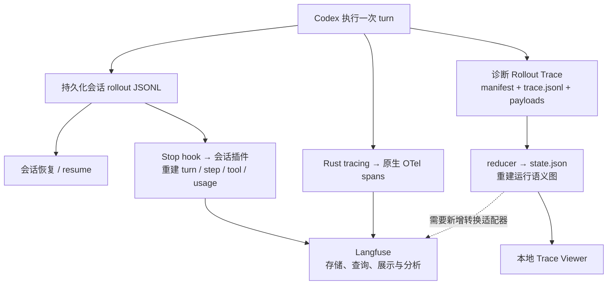

# Codex 四种 Trace：定位、必要性与不可替代的价值

[返回专项索引](README.md)

Codex 的几条记录路径可以按四个职责理解：**会话 rollout 保存可恢复的历史，Langfuse 会话插件组织 Agent 行为，诊断 Rollout Trace 保存运行证据，原生 OTel 观察程序执行链路。** 它们观察同一次工作，覆盖范围有重叠，消费方式和证据边界各有侧重。

本文回答三个问题：遇到问题应该先看哪条路径；为什么需要保留多种记录；哪些价值来自执行当时留下的证据，哪些能力可以换一种实现提供。具体录制、导入和对账步骤见[生成与导入教程](rollout-to-langfuse-tutorial.md)。

核对日期：2026-09-29。源码基于 Codex 提交 `b05a64b24b3c6f905aac62e1b9896fb0ca292794`。插件分析固定为本机安装的 tracing `0.4.0`，对应[插件源码提交 `f4be3a47…`](https://github.com/langfuse/codex-observability-plugin/tree/f4be3a47ac2c9c43721223a8f2e5d13f12e676c7/plugins/tracing)。本机 CLI 为 `0.156.1`，VS Code 附带的 Codex 为 `0.155.0-alpha.16.3`，均与仓库源码版本分别核对。Langfuse 服务为 `4.46.0`。文中的能力边界以这些实现为准；示意案例、已有实测和设计建议分别标明。

## 1. 先把来源、转换和平台分开

这里有三类采集来源：持久化会话记录、诊断运行证据、原生运行 spans。Langfuse 会话插件消费第一类材料，将其投影为便于阅读的 Agent 轨迹；Langfuse 接收和展示转换后的数据。



实线表示当前路径。诊断 bundle 接入 Langfuse 的虚线表示尚需实现的转换边界。插件和原生路径最终都能导出 OTel spans；二者的区别在于运行时采集与根据 transcript 事后重建。Langfuse 可以接收[外部 OTel 数据](https://langfuse.com/integrations/native/opentelemetry)，其展示深度取决于输入数据和语义映射。

| 名称                     | 定位与记录内容                                                                  | 主要作用                                                 | 当前边界                                                                |
| ------------------------ | ------------------------------------------------------------------------------- | -------------------------------------------------------- | ----------------------------------------------------------------------- |
| 持久化会话 rollout JSONL | 会话历史、上下文、工具调用与输出，以及选定的协议事件                            | 恢复和继续会话；为复盘、插件和其他解析器提供材料         | 保存内容受历史模式与持久化策略影响，不覆盖全部内部运行事件              |
| Langfuse 会话插件 trace  | 从 JSONL 重建 turn、模型 step、工具、usage 和子 Agent                           | 浏览行为、比较会话、分析模型用量与估算费用、准备评测材料 | 模型输入经过重建；时间来自 transcript；未消费全部记录类型               |
| 诊断 Rollout Trace       | 客户端请求与可用响应、具体 attempt、code cell、终端操作、compaction、Agent 关联 | 核对实际请求，追踪内容来源与流转，定位 harness 行为问题  | 显式开启；内容较多；覆盖范围取决于已有录制点和 payload 完整性           |
| 原生 OTel trace          | 函数、任务、请求、流事件处理等运行 spans，附带时间和属性                        | 定位延迟、错误、阶段边界；关联已传播上下文的组件         | 业务正文和语义标签需要专门记录，默认函数 span 通常不足以恢复完整 prompt |

## 2. “不可替代”具体指什么？

判断一种记录的价值，可以先问：**拿走它，损失的是一条执行事实，还是一种组织与展示能力？** 执行事实缺失后，通常无法可靠补回；已有材料的解析、查询和展示可以用其他实现提供。

### 2.1 会话 rollout：保存可继续工作的历史

会话持久化首先服务于 Codex 的连续工作。恢复流程利用会话记录重建历史、保留上下文和恢复相关元数据，再继续新的 turn。相关契约见 [RolloutRecorder](../../codex-rs/rollout/src/recorder.rs) 和[历史重建](../../codex-rs/core/src/session/rollout_reconstruction.rs)。

去掉这条路径，会损失当前恢复流程依赖的持久化材料。Langfuse observations 和诊断 reducer 输出都没有提供当前的会话恢复接口。它们可以辅助理解历史，恢复逻辑仍需要符合 Codex 的持久化契约。

它的存储形式可以演进，其他存储也可以承担同样职责。需要持续保留的是足够的历史与恢复元数据，而具体的文件布局或 JSONL 编码可以更换。

### 2.2 会话插件：把历史组织成可分析的 Agent 轨迹

插件将 transcript 里的记录组织为 `Codex Turn`、`LLM` 和工具 observations，并传播 session、模型和 usage 等属性。这样可以直接读一轮工作、对照工具与后续输入、比较不同会话，也更容易提取评测材料。[官方集成说明](https://langfuse.com/integrations/developer-tools/codex)

去掉插件，原始 JSONL 仍在，但需要另写解析器来建立这些视图。它的主要价值是降低阅读和分析成本；它可以由其他转换器或观测平台替代。

当前 `0.4.0` 的 `generationInput` 组合系统片段、历史前缀、当前输入和此前工具结果，得到重建的消息视图。这个视图有助于检查行为；需要证明实际发送内容时，还要对照请求证据。`ensureStep` 和 `generationEnd` 根据 transcript 时间建立步骤边界，因此模型 latency 也要另行核对。[固定版本解析实现](https://github.com/langfuse/codex-observability-plugin/blob/f4be3a47ac2c9c43721223a8f2e5d13f12e676c7/plugins/tracing/src/parse.ts)、[转换实现](https://github.com/langfuse/codex-observability-plugin/blob/f4be3a47ac2c9c43721223a8f2e5d13f12e676c7/plugins/tracing/src/trace.ts)

### 2.3 诊断 Rollout Trace：保留内容来源与执行关联

诊断录制在执行时写入事件和 payload 引用，reducer 再将它们归约为推理、工具、code cell、终端、compaction 和跨 Agent 关联等对象。它专门保留解释运行过程所需的证据。[设计与格式契约](../../codex-rs/rollout-trace/README.md)

去掉这条路径，普通 transcript 可能仍有最终工具结果，却缺少内层原始结果、运行对象身份或请求 attempt 等证据。这些缺失事实通常无法从最终回答推回去。

它最有价值的问题包括：哪次请求产生了哪个工具调用；终端结果经过怎样的处理进入下一次请求；compaction 安装了什么历史；子 Agent 的信息怎样流转。查看时需要同时对照语义图和原始 payload，保留缺失、失败和仍运行等状态。

请求 payload 也有边界：HTTP 与 WebSocket 路径、增量输入与完整逻辑上下文需要分别解释。诊断录制没有承诺保存所有网络字节或全部流 delta；模型输入的证明范围应以具体客户端请求、关联历史和可用 payload 为准。

其他采集方式可以保存相同证据。例如，为 OTel 增加请求 payload 和运行对象关联后，也能承担部分诊断职责。迁移时需要逐项验证这些证据仍然存在，不能仅凭“也有 spans”认定已经覆盖。

### 2.4 原生 OTel：保留程序运行边界和时间关系

原生 trace 来自运行中的 Rust `tracing` spans，经 provider 导出。它更靠近程序的任务、函数、流接收与事件处理边界，可关联代码位置和已有的 trace context。[codex-otel](../../codex-rs/otel/README.md)

去掉运行时的时间与上下文采集，就很难从会话文本重建内部阶段耗时、异步等待和跨组件调用关系。它最有价值的问题是：延迟增加发生在哪个阶段；错误经过哪些运行边界；调用链在哪里断开。

它的覆盖程度取决于埋点和传播。span 的 inclusive 时长可能包含工具、网络和其他等待；`busy` / `idle` 需要按 tracing 的语义解释；CPU 分析和服务端模型推理耗时仍需要对应证据。原生 OTel 与诊断录制存在交集，二者没有固定的“哪个永远更完整”的关系。

## 3. 按问题选择证据

下表按当前实现给出阅读入口。“优先”表示先从哪里缩小范围，复杂问题仍可能需要组合证据。

| 要回答的问题                                 | 优先入口                                 | 进一步核对什么                                       |
| -------------------------------------------- | ---------------------------------------- | ---------------------------------------------------- |
| 关闭程序后怎样继续工作？                     | 会话 rollout 与恢复流程                  | 当前历史模式、checkpoint、恢复元数据                 |
| 用户问了什么，Agent 调了哪些工具，怎样回答？ | 会话插件                                 | 工具输出、后续 generation 的重建输入                 |
| 哪类任务 Token 或估算费用更高？              | 会话插件与 Langfuse 聚合                 | usage 归一化、模型价格配置、查询范围                 |
| 某次调用实际发送了什么，是否重试？           | 诊断 inference attempt 与 payload        | 传输路径、请求增量、完成 / 失败 / 取消状态           |
| `exec` 内部发生了什么，哪些结果被交给模型？  | 诊断 code cell、tool、terminal 与请求    | 原始结果、运行时返回、外层输出和下一次请求之间的关联 |
| 上下文压缩后，模型依据的历史怎样变化？       | 诊断 compaction 与 request；会话恢复材料 | replacement history、checkpoint 与后续输入           |
| 某阶段为什么变慢，错误发生在哪层？           | 原生 OTel                                | span 边界、子调用、日志和对应指标                    |
| 子 Agent 怎样影响父 Agent？                  | 插件的子 Agent 视图，再到诊断关联图      | thread 身份、任务交付、返回结果与实际输入            |
| UI 显示的流程与保存的材料是否一致？          | 协议事件与 session 持久化出口            | 具体事件如何被保存和交付；必要时补查运行 trace       |

原生 span 被后端显示为 `GENERATION`，仍需检查 name、边界和属性，才能判断它是否代表真实模型请求。插件的模型 step 与诊断中的具体网络 attempt 也需要区分。

## 4. 同一问题的三个观察角度

以下是示意案例，假设一轮任务读取长文件，回答漏掉关键信息，整轮耗时 40 秒。假设 JS 收到的 `result.output` 有约 1 万字，随后只输出前 100 字：

```js
const result = await tools.exec_command({ cmd: "cat large.txt" });
text(result.output.slice(0, 100));
```

### 4.1 会话插件：先检查模型能利用的材料

插件通常可以显示外层 `exec` 的源码、输出的 100 字，以及后续 generation 的重建输入。读者可以先判断：插件展示的后续输入里是否包含关键内容，回答是否与这些材料相符。

代码中的 `slice(0, 100)` 提供了内容裁剪的线索。内层调用究竟返回了什么、是否已经被更早的边界截断，还需要对应的运行证据。

### 4.2 诊断 Trace：追踪内容怎样流转

沿 terminal payload、JS 工具返回、外层工具输出和下一次请求阅读，可以核对各个边界分别有什么内容。原始文件、终端输出、JS 收到的返回值、模型收到的工具结果，分别以各自的证据确定。

由此可以区分几种原因：读取范围就没有覆盖关键内容；运行时返回已裁剪；JS 再次裁剪；后续历史处理改变了输入；请求确实包含关键内容但回答仍遗漏。诊断图和 payload 帮助把问题定位到可核对的边界。

### 4.3 原生 OTel：检查 40 秒分布在哪里

沿请求准备、模型流接收、工具执行、事件处理与持久化 spans 阅读，确定哪段生命周期较长，再结合日志和对应指标检查原因。

一个 sampling span 可能同时覆盖模型流与工具等待。父子 span 和并行步骤的时间会重叠，计算整轮耗时时需要保持计量边界一致。

这段会话的 JSONL 继续承担历史保存与恢复职责。分析行为、核对内容来源、检查运行耗时，则分别从上述三个入口展开。

## 5. 已有实测说明了什么？

[Langfuse 阅读实战](langfuse-trace-reading-guide.md)保存了一轮安装任务的[离线证据摘要](assets/langfuse-install-turn-evidence.json)：插件有 34 个 observations，原生项目有 16,586 个 observations。原生中的 `receiving` 与 `handle_responses` 各有 6,656 个，反映了流接收与处理的细粒度埋点。

这个样本说明两条路径的阅读成本和节点边界差异很大。插件用少量节点组织了 Agent 行为，原生记录了大量内部步骤。节点数量不能直接代表模型调用数量，也不能据此判断哪条路径在所有问题上都更完整。

该样本还发现，插件 15 个 generation 中有 11 个开始与结束时间相同。因此，根据 transcript 重建的步骤时间需要核对，不能直接用于计算真实模型延迟分位数或 TTFT。这些数字属于该固定版本与任务，后续实现应重新测量。

2026-09-29 的本机诊断录制另有实际验证：CLI 的“读取文件并求和”样例生成了两次模型请求、一次工具调用、一个 code cell 和一次终端操作，并通过 reducer 与 Viewer 验证；VS Code 重启后，其 Codex 进程继承了 trace root，在恢复的现有会话中开始录制后续运行。

本机目录采用 `${XDG_STATE_HOME:-$HOME/.local/state}/codex/rollout-traces`，默认落在 `~/.local/state/codex/rollout-traces/`，独立于插件与学习文档目录。这符合 [XDG state 目录保存运行历史的用途](https://specifications.freedesktop.org/basedir/latest/)。目录中有 bundle 表明本地录制产生了文件；Langfuse 入库需要另查服务端 observations。重启后的诊断录制覆盖后续执行，恢复的旧历史也可能出现在新请求的输入中。

## 6. 从源码读到职责边界

### 6.1 会话持久化与恢复

先打开 [session/mod.rs](../../codex-rs/core/src/session/mod.rs)，读 `record_conversation_items`、`persist_rollout_items` 和 `send_event_raw_with_persistence`。观察对话条目与协议事件怎样进入持久化出口，再进入 [rollout/recorder.rs](../../codex-rs/rollout/src/recorder.rs) 的 `RolloutRecorder`，确认历史材料怎样保存。

随后打开 [rollout_reconstruction.rs](../../codex-rs/core/src/session/rollout_reconstruction.rs)，读 `RolloutReconstruction` 和 `Session::reconstruct_history_from_rollout`，理解恢复历史与元数据的关系。读到 checkpoint 和恢复结果即可停下，暂不扩展所有存储实现。

### 6.2 会话插件的投影

在 [session/turn.rs](../../codex-rs/core/src/session/turn.rs) 找到 Stop hook 的调用，再到 [hook_runtime.rs](../../codex-rs/core/src/hook_runtime.rs) 的 `run_turn_stop_hooks`，确认插件得到的是 `transcript_path` 与 turn 身份。

打开固定版本插件的 [parse.ts](https://github.com/langfuse/codex-observability-plugin/blob/f4be3a47ac2c9c43721223a8f2e5d13f12e676c7/plugins/tracing/src/parse.ts)，从 `parseSession` 看 turn、step 与工具怎样配对；再到 [trace.ts](https://github.com/langfuse/codex-observability-plugin/blob/f4be3a47ac2c9c43721223a8f2e5d13f12e676c7/plugins/tracing/src/trace.ts)，读 `emitTurn`、`generationInput`、`generationEnd` 与 `emitToolCall`。读到输入、时间和节点关系的来源即可停下，先不追 SDK 的 HTTP 实现。

### 6.3 诊断运行证据与归约

打开 [thread.rs](../../codex-rs/rollout-trace/src/thread.rs)，从 `ThreadTraceContext::start_root_or_disabled` 确认录制开关，再到 [client.rs](../../codex-rs/core/src/client.rs) 的 `start_attempt`、`record_started` 与各终结路径，确认请求证据的边界。

接着读 [writer.rs](../../codex-rs/rollout-trace/src/writer.rs) 的 payload 与事件写入顺序、[payload.rs](../../codex-rs/rollout-trace/src/payload.rs) 的 `RawPayloadKind`，最后进入 [reducer/mod.rs](../../codex-rs/rollout-trace/src/reducer/mod.rs) 的 `replay_bundle`。按问题选择 conversation、code cell 或 compaction 的归约代码；能从语义对象回到原始 payload 后即可暂停。

### 6.4 原生 spans 与导出

打开 [app_server_tracing.rs](../../codex-rs/app-server/src/app_server_tracing.rs)，读 RPC 的 span 入口，再到 [tasks/mod.rs](../../codex-rs/core/src/tasks/mod.rs) 和 [session/turn.rs](../../codex-rs/core/src/session/turn.rs)，观察 turn、sampling、流接收与事件处理的生命周期。

最后读 [provider.rs](../../codex-rs/otel/src/provider.rs) 的 `tracing_layer` 与 `trace_export_filter`，理解 spans 怎样进入导出层。读到 exporter 边界即可停下；只有排查具体的导出失败时，再追传输实现。

## 7. 使用与演进建议

以下是按当前职责给出的建议，不代表已经修改采样或保留策略。

- 日常复盘先进入会话插件，检查输入、工具、回答和 usage；把有疑问的具体 turn 作为继续调查的范围。
- 核对实际请求、code mode 内部结果、compaction 或跨 Agent 信息流时，保留诊断 bundle 的事件、payload 和版本，继续检查证据图。
- 处理延迟、错误或跨组件链路问题时，转到原生 OTel 的运行边界，并结合日志与相应指标。
- 会话恢复按 Codex 的持久化契约处理；诊断 reducer 用于重建数据图。
- 详细诊断和细粒度 spans 的长期保留范围应根据用途选择。完整任务采样、错误或慢任务保留、显示折叠分别影响不同环节；折叠 UI 本身不会减少摄取数据。

关联不同路径时优先使用 thread/session ID、turn ID、tool call ID 与时间范围。同一次执行可能对应不同 trace ID；请求 step、网络 attempt、父子 span 的计量粒度也不同，Token、费用、调用数与耗时需要在明确的来源和边界内统计。

如果未来把诊断 bundle 接入 Langfuse，应验证请求与运行对象身份、缺失和取消状态、原始 payload 引用、跨 Agent 关联以及计量边界。普通模型与工具、失败重试、code mode 内容裁剪、compaction 应各有样例。已有插件入库可以作为行为视图，新增接入仍需证明诊断证据保留完整。
