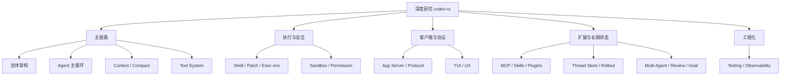

# codex-rs 深度研究覆盖矩阵

本文检查 `learning/` 是否覆盖了深度研究 `codex-rs` 应掌握的 12 个主题。结论是：主线已经覆盖，且 12 个主题都已有独立深度研究报告；后续重点是继续补更细的逐函数代码走查和提交级演进证据。

## 总体结论

| 结论 | 说明 |
| --- | --- |
| 主链路覆盖 | 已覆盖。`production-coding-agent-overview.md`、`query-processing-flow.md`、agent course 前 6 课能串起用户请求、turn、tool、context、安全和 MCP。 |
| 演进历史覆盖 | 已覆盖。`codex-rs-evolution-history.md` 从 Git 历史解释 Rust CLI、app-server、sandbox、skills、plugins、remote env、多 agent 的演进。 |
| 深度主题覆盖 | 已覆盖。12 个主题都有独立专题报告，并补充源码入口、实现路径、设计原理、演进线索和验证方法。 |
| 主要缺口 | 不再是主题缺口，而是精度缺口：后续可以继续补 commit/PR 证据、逐函数走查和练习验收标准。 |

## 覆盖矩阵

| # | 深度研究主题 | 覆盖状态 | 主要材料 | 证据与说明 |
| --- | --- | --- | --- | --- |
| 1 | 总体架构与演进 | 已覆盖 | [生产级 Coding Agent 学习总览](production-coding-agent-overview.md)、[codex-rs 项目演进史](codex-rs-evolution-history.md) | 总览有五层架构和项目价值地图；演进史按 2025-04 到 2026-06 梳理阶段、图和功能表。 |
| 2 | Agent 主循环 | 已覆盖 | [01 Agent Loop](agent-course/01-agent-loop.md)、[Codex Query 处理流程](query-processing-flow.md)、[生产级 Coding Agent 学习总览](production-coding-agent-overview.md) | 覆盖用户 query、模型请求、tool call、tool result、final answer 的闭环。 |
| 3 | Context 构建与压缩 | 已覆盖 | [04 Context、Memory 与 RAG](agent-course/04-context-memory-rag.md)、[08 RAG 深挖](agent-course/08-rag-deep-dive.md)、[生产级 Coding Agent 学习总览](production-coding-agent-overview.md) | 覆盖 context fragments、context manager、compact、memory/RAG 边界。 |
| 4 | Tool System | 已覆盖 | [03 Tool System](agent-course/03-tool-system.md)、[06 MCP、Skills 与 Plugins](agent-course/06-mcp-skills-plugins.md)、[主题学习指南](agent-topic-guide.md) | 覆盖工具 schema、registry、routing、执行、返回结果、MCP/skills/plugins。 |
| 5 | Shell、Patch 与执行环境 | 已覆盖 | [Shell、Patch 与执行环境](deep-research/05-shell-patch-exec-env.md)、[05 Sandbox 与 Permission](agent-course/05-sandbox-permission.md)、[15 Shell 与进程生命周期](agent-course/15-shell-process-lifecycle.md)、[生产级 Coding Agent 学习总览](production-coding-agent-overview.md) | 深度报告解释执行主路径和执行环境；第 15 课进一步覆盖一次性与交互式命令、进程所有权、stdin/TTY、输出排空、取消以及本地/远程执行。 |
| 6 | Sandbox、Permission 与安全策略 | 已覆盖 | [05 Sandbox 与 Permission](agent-course/05-sandbox-permission.md)、[07 Production Agent Patterns](agent-course/07-production-agent-patterns.md)、[主题学习指南](agent-topic-guide.md) | 覆盖审批、沙箱、权限、网络、Guardian/Review。 |
| 7 | App Server 与协议 | 已覆盖 | [App Server 与协议](deep-research/07-app-server-protocol.md)、[生产级 Coding Agent 学习总览](production-coding-agent-overview.md)、[Codex Query 处理流程](query-processing-flow.md) | 已补独立报告，覆盖 `message_processor`、request processors、thread listener、event mapping 和 protocol schema。 |
| 8 | TUI 与用户交互 | 已覆盖 | [TUI 与用户交互](deep-research/08-tui-user-experience.md)、[生产级 Coding Agent 学习总览](production-coding-agent-overview.md)、[codex-rs 项目演进史](codex-rs-evolution-history.md) | 已补独立报告，覆盖 composer、history cell、approval UI、diff rendering、streaming 和 snapshot tests。 |
| 9 | MCP、Skills、Plugins、Connectors | 已覆盖 | [06 MCP、Skills 与 Plugins](agent-course/06-mcp-skills-plugins.md)、[主题学习指南](agent-topic-guide.md)、[codex-rs 项目演进史](codex-rs-evolution-history.md) | 覆盖 MCP、skills、plugins、connectors/apps 的边界、演进和源码入口。 |
| 10 | Thread Store、Rollout 与恢复 | 已覆盖 | [02 Session / Thread / Turn](agent-course/02-session-thread-turn.md)、[生产级 Coding Agent 学习总览](production-coding-agent-overview.md)、[codex-rs 项目演进史](codex-rs-evolution-history.md) | 覆盖 thread/session/turn、resume/fork/archive、rollout、thread-store、state DB。 |
| 11 | Multi-Agent、Review、Guardian、Goal | 已覆盖 | [07 Production Agent Patterns](agent-course/07-production-agent-patterns.md)、[12 Multi-Agent 编排](agent-course/12-multi-agent-orchestration.md)、[生产级 Coding Agent 学习总览](production-coding-agent-overview.md) | 覆盖 multi-agent、review、guardian、eval；goal 在总览和演进史中覆盖，但还不是单独课程。 |
| 12 | 工程化、测试、可观测性 | 已覆盖 | [工程化、测试与可观测性](deep-research/12-engineering-testing-observability.md)、[07 Production Agent Patterns](agent-course/07-production-agent-patterns.md)、[10 Production AI System Design](agent-course/10-production-ai-system-design.md) | 已补独立报告，覆盖 core suite、app-server tests、TUI snapshots、schema fixtures、Bazel/Cargo、OTEL 和 rollout trace。 |

## 覆盖热力图

图例：

- 所有主题现在都有明确材料、源码阅读入口和独立深度研究报告。

## 与现有学习材料的关系

### 已经形成主线的材料

| 材料 | 覆盖重点 |
| --- | --- |
| [Agent 开发系列教程](agent-course/README.md) | 从运行、agent loop、session、tool、context、安全、MCP、multi-agent、Shell 进程生命周期到系统设计的课程主线。 |
| [Codex 生产级 Coding Agent 学习总览](production-coding-agent-overview.md) | `codex-rs` 当前架构地图，覆盖 runtime、app-server、tools、安全、状态、远程、realtime、测试。 |
| [Codex Query 处理流程](query-processing-flow.md) | 一条用户 query 如何从入口走到模型、工具、日志和持久化。 |
| [Agent 开发主题学习指南](agent-topic-guide.md) | 按 Agent 工程主题列源码入口和练习产出。 |
| [codex-rs 项目演进史](codex-rs-evolution-history.md) | 从 Git 历史理解为什么当前架构长成这样。 |

### 已落地的深挖专题

为了让 `learning/` 对“深度研究 codex-rs”从覆盖变成系统训练，已新增独立专题目录：[codex-rs 深度研究专题](deep-research/README.md)。

| 专题 | 覆盖内容 |
| --- | --- |
| [App Server 与协议](deep-research/07-app-server-protocol.md) | `initialize`、`thread/start`、`turn/start`、request processor、thread listener、event mapping、schema fixtures。 |
| [Shell、Patch 与执行环境](deep-research/05-shell-patch-exec-env.md) | shell command、unified exec、apply_patch、exec-server、executor filesystem、PathUri、stdout/stderr 截断。 |
| [TUI 与用户交互](deep-research/08-tui-user-experience.md) | composer、slash command、history cell、diff rendering、approval UI、snapshot tests。 |
| [工程化、测试与可观测性](deep-research/12-engineering-testing-observability.md) | core suite、app-server tests、TUI snapshots、Bazel/Cargo、OTEL、rollout trace、schema generation。 |

## 如果只做一次系统复习

推荐顺序：

1. 读 [codex-rs 项目演进史](codex-rs-evolution-history.md)，先知道项目为什么这么复杂。
2. 读 [Codex 生产级 Coding Agent 学习总览](production-coding-agent-overview.md)，建立当前架构地图。
3. 读 [Codex Query 处理流程](query-processing-flow.md)，跟一条请求跑完主链路。
4. 按 [Agent 开发系列教程](agent-course/README.md) 的 00 到 07 课补齐主循环、工具、上下文、安全和 MCP。
5. 读 12 课补 Multi-Agent，读 15 课补 Shell 长进程管理，再读 10 课补生产系统设计。
6. 进入 [codex-rs 深度研究专题](deep-research/README.md)，按 12 个专题逐篇做源码走查。

## 最终判断

`learning/` 现在已经能支撑 `codex-rs` 深度研究的系统学习：主链路、上下文、工具、安全、MCP、skills/plugins、多 agent、rollout、app-server、TUI、执行环境、测试观测和演进历史都已有专题材料。

下一步可以把这些专题继续升级为“带练习和验收标准”的课程，但作为深度研究报告集，12 个主题已经形成闭环。
