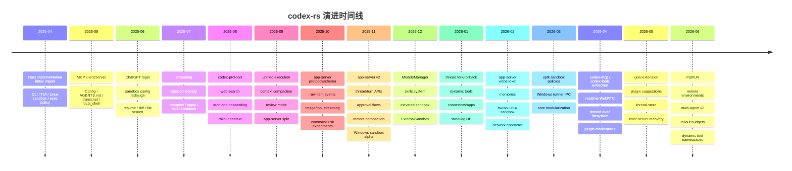
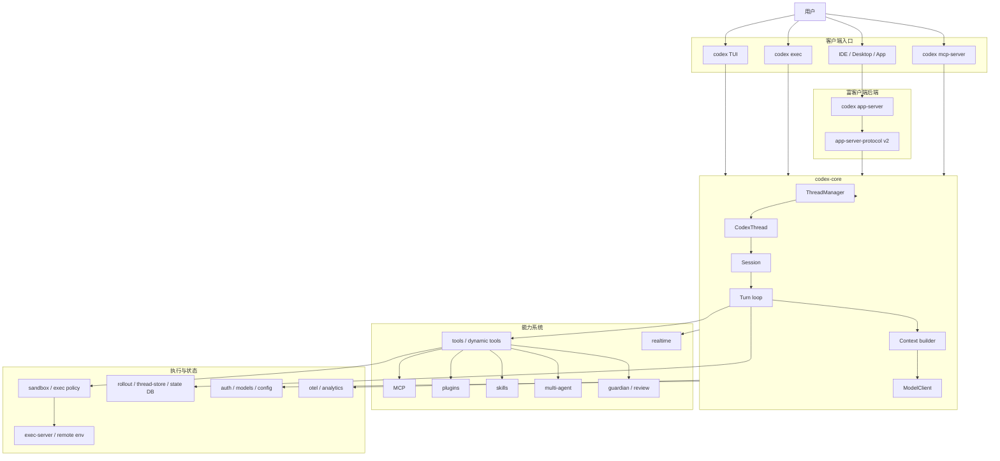
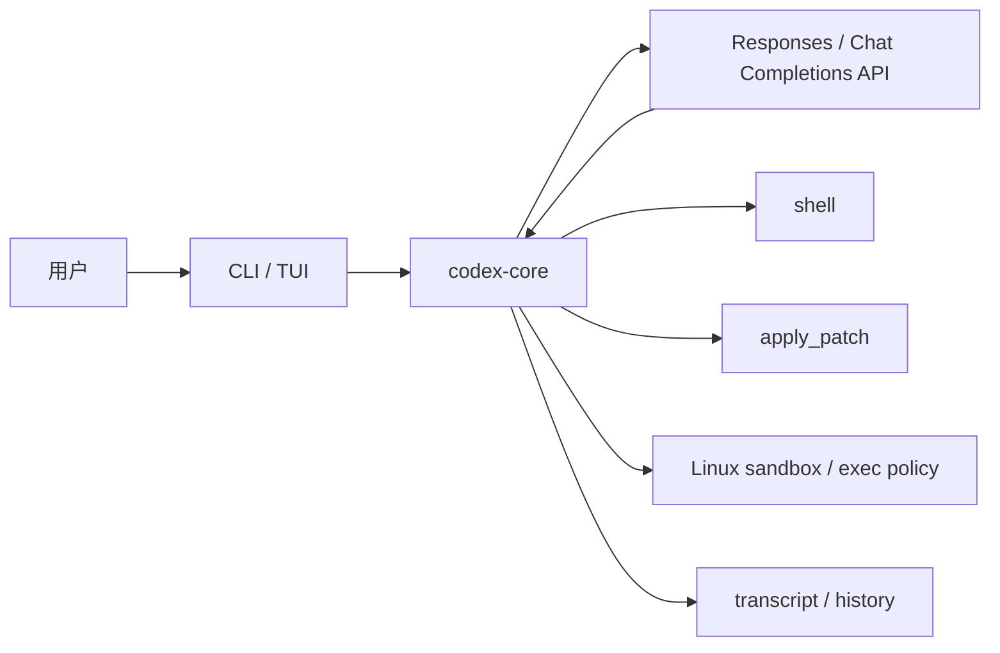
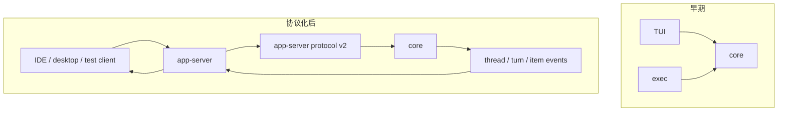
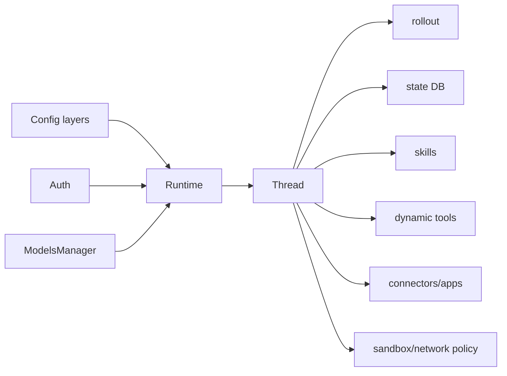
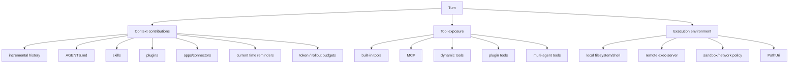
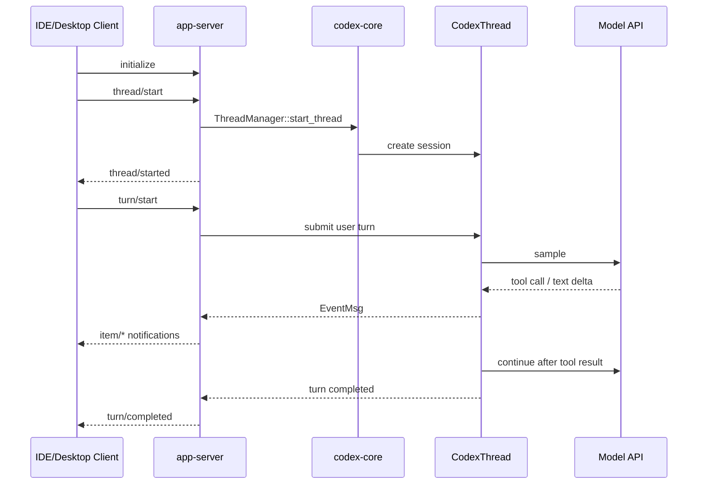
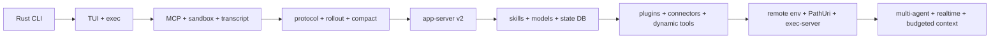

# codex-rs 项目演进史

本文基于 `upstream/main` 的完整 Git 历史整理，面向想读懂 `codex-rs` 的人。它不是逐条提交记录，而是一张人类可读的演进地图：项目从 Rust 版 CLI 起步，如何一步步长成支持 TUI、app-server、MCP、skills、plugins、多 agent、远程执行和多客户端的生产级 agent runtime。

## 一句话结论

`codex-rs` 的主线不是“写了一个聊天 CLI”，而是把 coding agent 的核心循环逐步产品化：

1. 先把本地 CLI/TUI、模型调用、shell、patch、sandbox 跑通。
2. 再把会话、历史、MCP、审批、配置和协议稳定下来。
3. 然后抽象出 app-server，让 IDE、桌面端和其它客户端共用同一个 agent runtime。
4. 最后围绕多环境、插件/skills、多 agent、远程执行、上下文治理和企业策略做平台化。

## 当前项目形态

截至当前历史，`codex-rs` 已经是一个大型 Rust workspace。按提交活跃度看，最核心的目录是：

| 子系统 | 大致职责 | 历史活跃度 |
| --- | --- | ---: |
| `codex-rs/core` | agent runtime、thread/session/turn、上下文、模型、工具编排 | 最高 |
| `codex-rs/tui` | 终端交互、渲染、审批、resume、插件/skills UI | 很高 |
| `codex-rs/app-server` | IDE/桌面/富客户端后端，JSON-RPC runtime 包装层 | 很高 |
| `codex-rs/app-server-protocol` | app-server v1/v2 协议、TS/schema 生成 | 高 |
| `codex-rs/protocol` | core 与客户端之间的事件/操作协议 | 高 |
| `codex-rs/exec` | 非交互执行入口 `codex exec` | 中高 |
| `codex-rs/mcp-server`、`codex-rs/codex-mcp` | MCP server/client、外部工具接入 | 中高 |
| `codex-rs/sandboxing`、`linux-sandbox`、`windows-sandbox-rs` | 安全执行、隔离、网络和文件系统策略 | 高 |
| `codex-rs/thread-store`、`rollout`、`state` | 会话持久化、resume/fork/archive/search | 中高 |
| `codex-rs/tools`、`plugin`、`skills`、`core-plugins`、`core-skills` | 动态工具、插件市场、skills 加载和注入 | 中高 |
| `codex-rs/exec-server` | 远程/独立执行服务、环境注册、进程/文件操作 | 中 |

当前架构可以这样理解：

## 阶段 1：Rust 版 CLI 初始导入

时间：2025-04 到 2025-05

代表提交：

| 提交 | 说明 |
| --- | --- |
| `31d0d7a305` | 初始导入 Rust 版 Codex CLI |
| `b34ed2ab83` | Linux sandbox flag 细化 |
| `58f0e5ab74` | 引入 `codex_execpolicy`，定义 safe commands |
| `cca1122ddc` | Rust TUI 成为默认 interactive CLI |
| `83961e0299`、`21cd953dbd` | 引入 MCP types 和 MCP server |
| `2b122da087` | 支持 `AGENTS.md` |
| `f48dd99f22` | 支持 OpenAI `local_shell` tool |

这一阶段的目标是把 agent 的基础骨架搬到 Rust：

- TUI 可以交互。
- `codex exec` 可以非交互执行。
- core 能调用模型、处理 shell/patch。
- Linux sandbox 和 exec policy 开始出现。
- MCP 的第一版 client/server 打通。
- 配置、cwd、日志、transcript、`AGENTS.md` 进入运行时。

此时的系统可以简化成：

## 阶段 2：从可运行到可日常使用

时间：2025-06 到 2025-08

代表提交：

| 提交 | 说明 |
| --- | --- |
| `515b6331bd` | ChatGPT 登录 |
| `0776d78357` | sandbox config 重设计 |
| `a339a7bcce` | 支持恢复被 Ctrl+C 终止的 session |
| `fa0e17f83a` | `/diff` 命令 |
| `5a0f236ca4` | `@` 文件搜索 |
| `bfeb8c92a5` | `codex apply` |
| `643ab1f582` | exec 和 TUI streaming |
| `e2c994e32a` | `/compact` |
| `d262244725` | 引入 `codex-protocol` crate |
| `363636f5eb` | web search tool |

这一阶段开始关注真实使用体验：

- 登录和 onboarding 更完整。
- 文件搜索、diff、compact、apply、resume 让 coding agent 更像日常工具。
- streaming 让 TUI/exec 的反馈更及时。
- MCP elicitation、interrupt、auth 让外部工具协议更像可用协议，而不是 demo。
- `codex-protocol` 独立出来，说明事件/操作协议开始成为系统边界。

核心变化是：系统不再只是“模型调用 + 工具执行”，而是开始有稳定会话、交互状态和协议事件。

## 阶段 3：协议化，app-server 出现

时间：2025-09 到 2025-11

代表提交：

| 提交 | 说明 |
| --- | --- |
| `c09ed74a16` | unified execution |
| `ea225df22e` | context compaction |
| `90a0fd342f` | Review Mode core |
| `d9dbf48828` | 分离 `codex mcp-server` 和 `codex app-server` |
| `846960ae3d` | 生成 app-server protocol JSON schema |
| `cdc3df3790` | app-server API 拆成 v1/v2 |
| `2ab1650d4d` | app-server v2 Thread APIs |
| `6582554926` | app-server v2 Turn APIs |
| `cecbd5b021` | v2 command approval flow |
| `d6c30ed25e` | v2 apply_patch approval flow |
| `838531d3e4` | remote compaction |
| `87cce88f48` | Windows Sandbox alpha |

这是第一个大转折：Codex 不再只是 CLI 程序，而是开始把 core 包装成可被富客户端驱动的后端。

app-server 的出现带来几个长期影响：

- 客户端不用重写 agent loop，只需发 `thread/start`、`turn/start` 等 RPC。
- 所有 UI 都可以消费统一的 item delta、approval、error、turn completed 事件。
- 协议 schema 和 TypeScript 类型成为客户端集成契约。
- core 的事件结构被迫更清晰：thread、turn、item、raw item、reasoning delta、agent message delta。

## 阶段 4：模型、skills、state、sandbox 生产化

时间：2025-12 到 2026-02

代表提交：

| 提交 | 说明 |
| --- | --- |
| `00cc00ead8` | 引入 `ModelsManager` |
| `b36ecb6c32` | 显式提及时注入 `SKILL.md` |
| `5d77d4db6b` | 用 `SkillsManager + skills/list` 重做 skills loading |
| `da3869eeb6` | system skills |
| `4897efcced` | public skills 和 repo skill discovery |
| `3878c3dc7c` | SQLite state DB 起步 |
| `7151387474` | dynamic tools 持久化到 rollout |
| `8b7ec31ba7` | app-server thread rollback API |
| `41a317321d` | fork conversation/thread |
| `d594693d1a` | dynamic tools injection |
| `a2c829a808` | connectors part 1 |
| `f956cc2a02`、`ae4de43ccc` | Linux bubblewrap / bwrap sandbox |
| `b527ee2890` | network approval plumbing |

这一阶段在补生产系统的基本盘：

- 模型目录、模型缓存、远程模型刷新。
- skills 作为上下文和行为扩展机制。
- state DB 和 log DB 支撑 thread list、metadata、dynamic tools。
- app-server 支持 rollback、fork、read、list、archive、filter。
- connectors/apps 让外部能力开始进入产品层。
- sandbox 不再只是本地限制，还包括 Windows elevated sandbox、Linux bwrap、network approvals、proxy-aware routing。

功能之间的关系可以这样看：

## 阶段 5：core 解耦，远程化和扩展体系爆发

时间：2026-03 到 2026-04

代表提交：

| 提交 | 说明 |
| --- | --- |
| `59b68f5519` | MCP 抽到 `codex-mcp` crate |
| `d1068e057a` | tool-suggest wire helpers 抽到 `codex-tools` |
| `828b837235` | tool registry planning 抽到 `codex-tools` |
| `3c7f013f97` | native async `ToolHandler`，显著降低 core 编译时间 |
| `7a3eec6fdb` | native async `SessionTask` |
| `73dab2046f` | app-server remote control transport |
| `e9702411ab`、`600c3e49e0` | apply_patch 迁移到 executor filesystem |
| `fb3dcfde1d` | realtime WebRTC transport |
| `49677ec71f` | top-level exec-server subcommand |
| `48cf3ed7b0` | plugin loading 和 marketplace 逻辑抽到 `core-plugins` |
| `dae56994da` | ThreadStore interface |
| `6e72f0dbfd` | remote thread store implementation |
| `95dafbc7b5` | `/side` conversations |

这一阶段的关键词是“拆”和“远程”。

拆，是为了让 `codex-core` 不再无限膨胀：

- MCP 拆出。
- tools 拆出。
- plugins 拆出。
- connectors 拆出。
- thread-store 拆出。
- session 模块继续细分。

远程，是为了让 agent 不局限在本机：

- remote control。
- executor filesystem。
- exec-server。
- remote thread store。
- remote cwd。
- app-server 作为富客户端和远程 runtime 的连接点。

## 阶段 6：多环境、多 Agent、插件/skills 成熟

时间：2026-05 到 2026-06

代表提交方向：

| 方向 | 代表性变化 |
| --- | --- |
| goal extension | goal store、continuation、budget、TUI goal 支持 |
| plugins | remote plugin catalog、marketplace fallback、plugin MCP、plugin skill namespace、tool suggestion cache |
| skills | `SkillsService`、per-turn catalog、remote resource tools、orchestrator skills |
| multi-agent v2 | per-thread runtime、typed envelopes、join key、per-turn multi-agent mode |
| remote env | exec-server reconnect、Noise relay/rendezvous、environment registry、remote cwd/shell |
| PathUri | 统一本地/远程/Windows/Unix path 表达 |
| context/history | incremental thread history、response item IDs、turn-scoped context、rollout token budget |
| realtime | AVAS/WebRTC、handoff、assistant realtime append text |
| app-server | 更多 RPC、remote control、plugin/skill/app/config/auth/process/fs 能力 |

这一阶段已经不是单点功能开发，而是在解决生产级 agent 的复杂性：

- 一个 thread 可能绑定不同 execution environment。
- 一个 tool 可能来自 MCP、plugin、skill、connector、built-in 或 direct model namespace。
- 一个 app-server 连接可能来自 IDE、desktop、test client 或 remote control。
- 一个上下文窗口需要 history、compaction、rollout budget、current-time reminder、skills、plugins、AGENTS.md 共同参与。
- 一个用户动作可能衍生出 parent thread、side conversation、subagent、guardian review 和 remote exec。

## 功能演进总表

| 功能 | 早期形态 | 中期变化 | 当前形态 |
| --- | --- | --- | --- |
| CLI/TUI | 本地交互入口 | streaming、slash commands、resume、diff、compact | 富交互客户端，部分能力经 app-server 路由 |
| `codex exec` | 非交互执行 | JSON 输出、stdin prompt、streaming、review | 可用于自动化和 CI 场景 |
| Core loop | session + model + shell/patch | protocol、turn、item、compaction、review | thread/session/turn runtime，支持多工具、多上下文、多任务 |
| App Server | 无 | 从 MCP/server 中拆出，v1/v2 协议 | IDE/desktop/test client 的富客户端后端 |
| MCP | 初始 types/client/server | elicitation、auth、resources、tool result images | 独立 `codex-mcp`，与 plugins/apps/skills 结合 |
| Skills | 无或简单注入 | `SKILL.md`、system/public/admin/personal skills | `SkillsService`、remote resources、per-turn catalog |
| Plugins | 初始 marketplace/manifest | local/remote marketplace、tool suggestion | plugin MCP、remote catalog、capability/auth filtering |
| Sandbox | Linux sandbox + exec policy | Windows sandbox、elevated sandbox、bwrap | 跨平台、网络策略、remote env、PathUri |
| Session/history | transcript | rollout、resume、fork、archive、compact | thread-store/state DB、incremental history、budget |
| Models/auth | API key / built-in model | ChatGPT login、ModelsManager、remote models | 多 provider、model catalog、auth manager、agent identity |
| Multi-agent | collab/subagent 实验 | thread fork、side conversations、agent tasks | multi-agent v2 runtime、typed envelopes、per-turn mode |
| Realtime | 无 | WebRTC 实验 | AVAS/WebRTC、handoff、realtime append |
| Review/Guardian | review mode | detached review、guardian | auto-review、approval reviewer、isolated review context |

## 推荐阅读路径

如果目标是理解项目，而不是马上改代码，可以按这个顺序读。

### 1. 先建立主循环

- `codex-rs/docs/protocol_v1.md`
- `codex-rs/core/src/thread_manager.rs`
- `codex-rs/core/src/codex_thread.rs`
- `codex-rs/core/src/session/session.rs`
- `codex-rs/core/src/session/turn.rs`

关注问题：

- 用户输入如何变成一个 turn？
- 模型输出如何触发工具？
- 工具结果如何回到模型？
- session、thread、turn、item 的边界在哪里？

### 2. 再看客户端外壳

- `codex-rs/cli/src/main.rs`
- `codex-rs/tui/src/`
- `codex-rs/exec/src/`
- `codex-rs/app-server/ARCHITECTURE.zh-CN.md`
- `codex-rs/app-server/src/message_processor.rs`
- `codex-rs/app-server-protocol/src/protocol/v2.rs`

关注问题：

- TUI、exec、app-server 分别负责什么？
- app-server 为什么是富客户端后端，而不是简单 HTTP wrapper？
- v2 协议为什么围绕 thread/turn/item 设计？

### 3. 然后看工具与安全

- `codex-rs/tools/src/`
- `codex-rs/core/src/mcp.rs`
- `codex-rs/codex-mcp/src/`
- `codex-rs/core/src/exec.rs`
- `codex-rs/sandboxing/`
- `codex-rs/linux-sandbox/`
- `codex-rs/windows-sandbox-rs/`
- `codex-rs/execpolicy/`

关注问题：

- shell、patch、MCP、dynamic tools 如何统一暴露给模型？
- approval、guardian、sandbox、network policy 分别解决什么风险？
- 本地执行和远程执行如何共享同一套抽象？

### 4. 最后看扩展和长期状态

- `codex-rs/rollout/`
- `codex-rs/thread-store/`
- `codex-rs/state/`
- `codex-rs/core/src/skills.rs`
- `codex-rs/core-plugins/`
- `codex-rs/plugin/`
- `codex-rs/ext/`
- `codex-rs/core/src/agent/`

关注问题：

- 会话如何 resume/fork/archive/search？
- compaction 如何改变后续上下文？
- skills/plugins/apps/connectors 是如何进入 prompt 和 tool exposure 的？
- 多 agent 是新进程、新 session，还是 thread tree？

## 读代码时的几个判断标准

### 看见 `core`，先问它是不是主循环

`codex-core` 历史上非常容易变大。很多新功能最初会塞到 core，后来又拆到独立 crate。读 core 时要区分：

- 主循环必需：thread/session/turn/context/model/tool orchestration。
- 可拆扩展：MCP、plugins、skills、memories、guardian、realtime、tools schema。

### 看见 app-server，先按 RPC 流程理解

app-server 的代码量大，但核心模式相对固定：

先找 request processor，再找它调用的 core API，最后看 bespoke event handling 如何把 core event 翻译成 app-server notification。

### 看见 PathUri，要想到远程和跨平台

近期大量 PathUri 迁移不是形式主义。它解决的是：

- Windows path 与 Unix path 不同。
- 模型生成 path、app-server API path、executor path、remote filesystem path 可能不是同一种语义。
- 远程环境的 cwd 不一定能用本机 `PathBuf` 表示。

所以凡是涉及 filesystem、sandbox、apply_patch、exec-server、AGENTS.md、MCP file upload，都要留意 PathUri。

## 版本演进背后的设计趋势

### 趋势 1：从单客户端到多客户端

早期：TUI 和 exec 直接驱动 core。

后来：app-server 成为 IDE/desktop/test client 的统一后端。

结果：协议、事件、schema、thread state、listener、server-initiated request 都变成一等公民。

### 趋势 2：从本地执行到环境抽象

早期：本地 shell + sandbox。

后来：executor filesystem、exec-server、remote cwd、remote shell、environment registry、PathUri。

结果：工具执行不再假设“当前机器就是目标机器”。

### 趋势 3：从静态工具到动态能力市场

早期：内置 shell/patch/MCP。

后来：dynamic tools、tool search、plugins、skills、apps/connectors、remote plugin catalog。

结果：模型可用工具取决于 thread、auth、capability、selected plugin、environment 和 app-server session。

### 趋势 4：从完整历史到上下文治理

早期：transcript 和 rollout。

后来：context compaction、remote compaction、incremental history、response item IDs、turn-scoped context、token budget、current-time reminders。

结果：模型看到什么成为一个被严格管理的系统，而不是简单拼接字符串。

### 趋势 5：从普通 agent 到多 agent runtime

早期：单 session 单 task。

后来：subagents、side conversations、agent tasks、multi-agent v2、join key、typed envelopes、per-turn multi-agent mode。

结果：agent runtime 开始管理一棵 thread/agent 关系，而不只是一个聊天窗口。

## 记忆口诀

如果只记一张图，可以记这条演进链：

这条链路背后的本质是：把一次 coding agent 的模型回合，做成可嵌入、可恢复、可审计、可扩展、可远程运行的生产系统。
