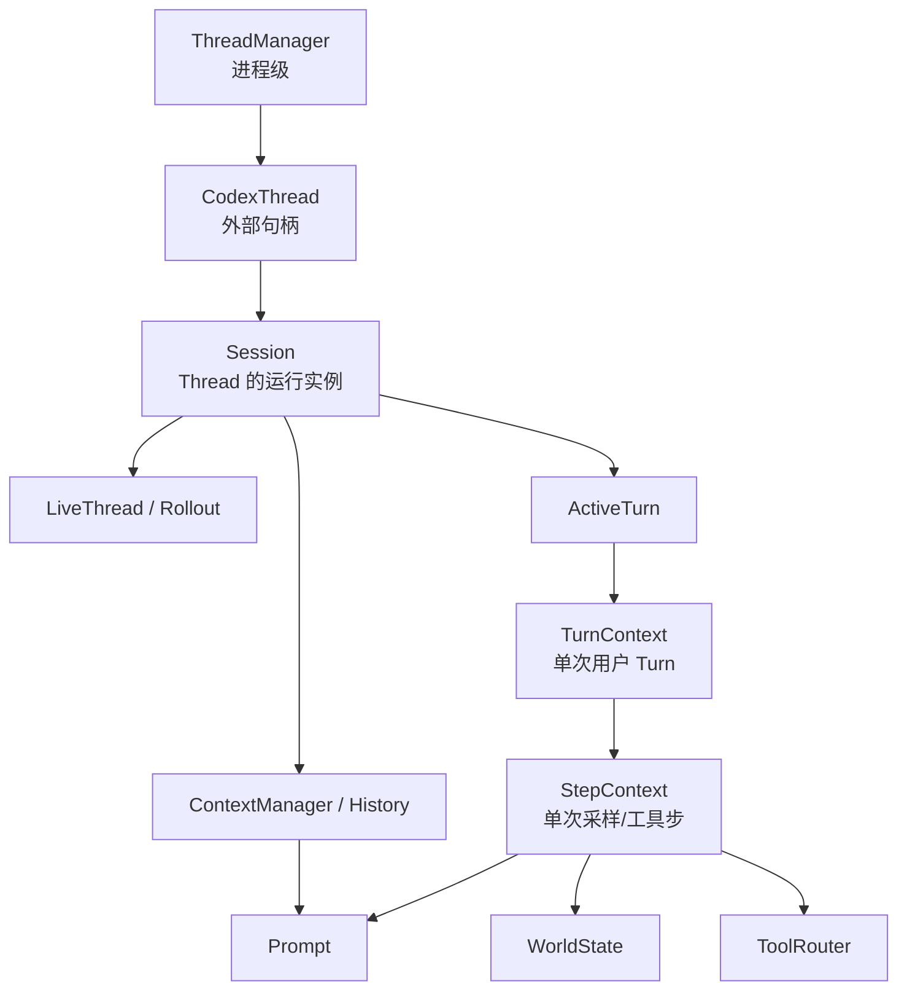

# 2. 核心概念与所有权

这一章先建立对象关系。Codex 源码里 “thread”“session”“turn”“step” 有时在产品语义和实现语义之间交叠；最稳妥的办法是看谁拥有状态、活多久、在哪个边界被重建。

## 2.1 总览

## 2.2 Thread

Thread 是用户可恢复、可 fork 的对话身份。它有稳定的 `ThreadId`，也是 app-server 对外暴露的主要资源。`ThreadManager` 在进程内按 id 保存活跃的 [`CodexThread`](../../../codex-rs/core/src/thread_manager.rs#L195)；持久化后，即使旧 Session 已退出，同一个逻辑 Thread 仍可从 Rollout 恢复。

容易误解之处：Thread 不等于一个 Tokio task，也不等于一个模型请求。一个 Thread 包含多个 Turn，一个 Turn 又可能包含多次模型采样和多次工具执行。

## 2.3 CodexThread

[`CodexThread`](../../../codex-rs/core/src/codex_thread.rs#L193) 是 Thread 的进程内控制句柄，内部持有 `Arc<Session>` 和 Session I/O。它允许多个调用位置共享句柄，但并不复制 Session 状态。

生命周期从 `ThreadManager` 完成 spawn 开始，到 shutdown 或进程退出结束。对调用者而言，它的核心能力是：提交 `Op`，以及读取按 submission id 关联的 `Event`。

## 2.4 Session

[`Session`](../../../codex-rs/core/src/session/session.rs#L34) 是 core 的运行中枢。它拥有或共享：

- `SessionState`：配置、`ContextManager`、token 信息、上下文基线等可变状态；
- submission/event channels；
- 当前 `ActiveTurn` 和排队输入；
- 模型客户端、MCP 管理、工具服务、hooks、extensions、thread store 等服务；
- Rollout 对应的 `LiveThread`。

Session 注释强调同一时刻最多运行一个 task。新任务会替换或中止旧任务；工具内部仍可按规则并发。这是“一个 Thread 内 Turn 串行、一个 Step 内工具可受控并行”的基础。

实现里 Session id 与 thread id 当前紧密对应，但概念上应区分：Thread 是可恢复身份，Session 是这次进程内运行实例。恢复会创建新的运行实例并重建 Thread 上下文。

## 2.5 Turn

Turn 是一次用户请求驱动的 Agent 工作周期。它从 `TurnStarted` 开始，可能经历多次模型采样和工具调用，最后以 `TurnComplete`、`TurnAborted` 或错误结束。

[`RegularTask::run`](../../../codex-rs/core/src/tasks/regular.rs#L38) 建立 Turn 生命周期，[`run_turn`](../../../codex-rs/core/src/session/turn.rs#L151) 执行主体。用户在 Turn 运行中继续输入时，输入可以被 steer 或排队，而不是必然创建一个并行 Turn。

## 2.6 TurnContext

[`TurnContext`](../../../codex-rs/core/src/session/turn_context.rs#L127) 是一次 Turn 的配置快照。它包含模型、provider、推理设置、审批策略、sandbox policy、developer instructions、personality、`final_output_json_schema`、动态工具、环境选择、扩展数据和 turn metadata。

所有权上，它通常以 `Arc<TurnContext>` 传给采样、工具和事件代码。其意义是：Turn 开始后，相关调用使用一致的设置，而不是在执行中随意读取一份不断变化的全局配置。

## 2.7 Step 与 StepContext

源码没有一个与 Turn 对称的持久化 `Step` 实体；“Step”主要体现为 [`StepContext`](../../../codex-rs/core/src/session/step_context.rs#L11)。它是**一次采样请求及其产生的工具调用**所使用的请求级快照，包含：

- `Arc<TurnContext>`；
- 当前环境和 capability roots；
- 这一次确切的 MCP binding；
- 已最终确定的 `ToolRouter`；
- 此时加载的 AGENTS.md。

为什么不能只用 `TurnContext`？因为一个 Turn 可能在工具调用后继续采样，而 MCP 工具目录、环境就绪状态、AGENTS.md 或可用工具可能已变化。`Session::capture_step_context` 会为采样刷新这些状态。尤其重要的是，模型看见某一版工具定义后，返回的调用必须由**同一个 StepContext 的 router**执行，避免“广告的是 A 版工具、执行时却切到 B 版”。

## 2.8 Prompt

[`Prompt`](../../../codex-rs/core/src/client_common.rs#L16) 是一次模型采样的请求模型，包含：

- `input: Vec<ResponseItem>`：规范化后的完整模型历史；
- `tools: Vec<ToolSpec>`：该 Step 的工具规格；
- 是否允许 parallel tool calls；
- `base_instructions`；
- 可选 output schema 和 strict 标志。

Prompt 不是整个 Session 的永久对象，也不等同于某个 Markdown 文件。它在每次采样前从 History、TurnContext 和 StepContext 重新组装。

## 2.9 ContextManager 与 History

[`ContextManager`](../../../codex-rs/core/src/context_manager/history.rs#L41) 保存按时间排序的 `ResponseItem`，以及 token 使用、history version、TurnContext 参考基线和 WorldState 基线。它是“下一次发给模型什么”的内存真相来源。

`record_items` 会筛选并截断适合 API 的项；`for_prompt` 克隆快照后做规范化，确保 tool call/output 成对，并剥离模型不支持的图像或音频。History 可以因 compaction 或 rollback 被重写，因此并非不可变日志。

## 2.10 WorldState

[`WorldState`](../../../codex-rs/core/src/context/world_state/mod.rs#L268) 是可比较、可持久化的“当前世界配置”。每个 [`WorldStateSection`](../../../codex-rs/core/src/context/world_state/mod.rs#L209) 有稳定 id、snapshot 和差量渲染逻辑。当前构建过程位于 [`session/world_state.rs`](../../../codex-rs/core/src/session/world_state.rs#L24)，内容可包括模型/personality、AGENTS.md、权限、协作模式、环境、应用/插件/工具、extensions 和多 Agent 信息。

它不是聊天 History 的替代品。WorldState 的作用是：首轮完整注入，后续只把相对基线的变化渲染成模型可见消息，同时把 full snapshot 或 merge patch 写入 Rollout。

## 2.11 Rollout

Rollout 是可重放的持久化记录。协议枚举 [`RolloutItem`](../../../codex-rs/protocol/src/protocol.rs#L3211) 包含 Session metadata、模型 `ResponseItem`、compaction checkpoint、TurnContext、WorldState 和 `EventMsg` 等。

它与 History 的区别是：

| History | Rollout |
| --- | --- |
| 为下一次模型请求服务 | 为审计、事件回放和恢复服务 |
| 只保留模型可见/可规范化项 | 还记录事件和恢复元数据 |
| compaction 后被替换 | 追加 `Compacted` checkpoint，不简单抹掉旧记录 |
| 位于 SessionState | 由 `LiveThread` / thread store 持久化 |

## 2.12 ToolRouter

[`ToolRouter`](../../../codex-rs/core/src/tools/router.rs#L85) 把两件事绑定在一起：给模型看的 `ToolSpec`，以及收到调用后使用的 `ToolRegistry`。`build_tool_call` 解析 Responses API 的 function/custom/tool-search item；`dispatch_tool_call` 将其变成 `ToolInvocation` 并交给注册的 handler。

Router 的生命周期是 Step 级，不是整个 Session 永久固定。内建工具、MCP 工具、extension 工具和动态工具会在 [`build_tool_router`](../../../codex-rs/core/src/tools/spec_plan.rs#L119) 中汇合。

## 2.13 本章阅读停点

先读 `TurnContext` 和 `StepContext` 的字段，不要跟入每个字段类型。然后打开 [`ContextManager::for_prompt`](../../../codex-rs/core/src/context_manager/history.rs#L141) 和 [`ToolRouter::build_tool_call`](../../../codex-rs/core/src/tools/router.rs#L154)。理解“Turn 固定策略、Step 固定当前工具、History 提供请求输入”后即可停下。下一章再看这些对象何时创建。
