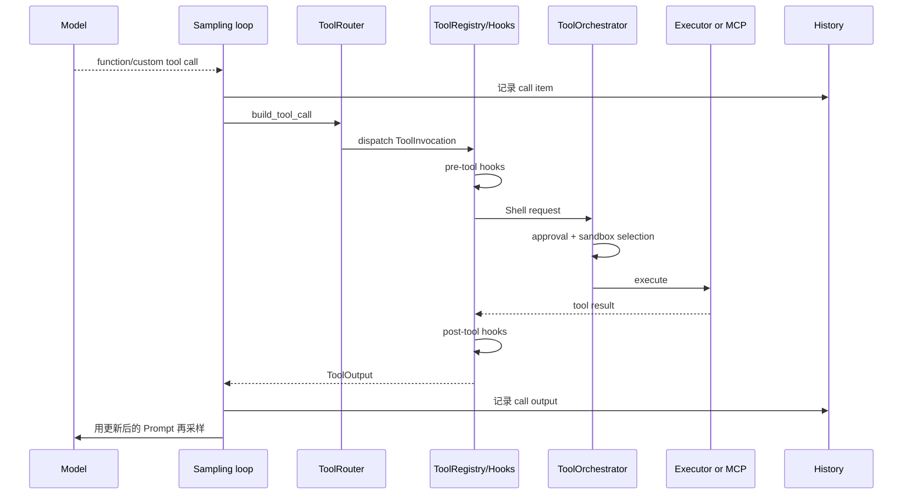

# 6. 工具调用、审批与沙箱

本章从模型已经输出一个 tool call 开始。主例是 Shell，因为它完整展示审批与沙箱；MCP 用来对照“同一个 Router，不同执行后端”。

## 6.1 工具循环总览



MCP 分支不使用 Shell 的 `ToolOrchestrator`，而是由 MCP handler 调用当前 binding；它仍经过 Router、Registry、通用 hooks、History 回填和再次采样。

## 6.2 从模型 item 到 ToolInvocation

[`handle_output_item_done`](../../../codex-rs/core/src/stream_events_utils.rs#L288) 先使用 [`ToolRouter::build_tool_call`](../../../codex-rs/core/src/tools/router.rs#L154) 解析 `FunctionCall`、`CustomToolCall` 或 client tool-search call。成功后：

1. 立即记录模型产生的 call item；
2. 标记 `needs_follow_up`；
3. 交给 `ToolCallRuntime`，得到可排队的 future。

无法解析或策略拒绝但可反馈给模型的错误，会直接变成 tool output，仍触发下一次采样。这样模型有机会修正参数，而不是让整个 Turn 崩溃。

## 6.3 为什么 ToolCallRuntime 保留 StepContext

[`ToolCallRuntime`](../../../codex-rs/core/src/tools/parallel.rs#L41) 持有产生该工具定义时的 `Arc<StepContext>`。它用该 Step 的 router dispatch，因此工具目录刷新不会改变已经发给模型的调用语义。

它还控制并发：支持 parallel 的工具共享读锁，不支持的工具取得写锁。这个锁约束的是同一 sampling response 产生的工具 future；Session 层“最多一个活跃 task”的约束并未因此失效。

## 6.4 Router 与 Registry 的分工

[`ToolRouter`](../../../codex-rs/core/src/tools/router.rs#L85) 负责协议解析和按名字定位；[`ToolRegistry::dispatch_any_with_terminal_outcome`](../../../codex-rs/core/src/tools/registry.rs#L456) 才进入执行生命周期：

1. 校验 tool 是否注册、payload 是否匹配；
2. 等待 runtime ready（MCP 可在此等待 server）；
3. 运行 pre-tool-use hooks，hooks 可拒绝或重写输入；
4. 调用具体 handler；
5. 运行 post-tool-use hooks；
6. 统一 telemetry 和错误到 `ToolOutput`。

首读 Registry 到 handler 调用返回即可停；hook payload 的每个变体属于扩展专题。

## 6.5 Shell 主路径

打开 [`run_exec_like`](../../../codex-rs/core/src/tools/handlers/shell.rs#L63)。它把 shell/exec 工具的参数转换为统一执行请求：

1. 规范化 additional permissions；
2. 检查显式 escalation 是否被 policy 禁止；
3. 识别是否应转交 apply-patch handler；
4. 计算 `ExecApprovalRequirement`；
5. 构造 `ShellRequest`；
6. 调用 [`ToolOrchestrator::run`](../../../codex-rs/core/src/tools/orchestrator.rs#L134)；
7. 把执行结果变成模型可见 tool output，并发出工具完成事件。

Shell handler 不应自己散落实现审批和 sandbox retry；这些策略集中在 orchestrator。

## 6.6 审批插入在哪里

[`ToolOrchestrator`](../../../codex-rs/core/src/tools/orchestrator.rs#L38) 的顺序是：审批 → 选择 sandbox → 首次尝试 → 必要时升级重试。

当 `ApprovalPolicy` 与工具给出的 `ExecApprovalRequirement` 要求用户确认时，Session 发出 approval request event，并在 active turn 中登记一个 oneshot sender。外部 UI 返回 `Op::ExecApproval` 等决定后，[`Session::notify_approval`](../../../codex-rs/core/src/session/mod.rs#L2891) 找到 pending approval 并唤醒工具 future。

审批发生在实际执行前，但它不是 Prompt 构建的一部分。Prompt 只公开工具；是否批准某次具体参数，在 call 已返回后决定。

## 6.7 Sandbox 插入在哪里

审批通过或无需审批后，orchestrator 根据 `SandboxPolicy`、环境能力、请求权限和工具偏好选择 sandbox。随后执行第一次 attempt。如果失败被判定为 sandbox denial，策略允许时可以请求/使用 escalated 权限重试。

应区分三件事：

- approval policy：是否需要人做决定；
- sandbox policy：进程能访问哪些系统资源；
- executor/environment：命令实际在哪个本地或远程环境运行。

它们常一起出现，但不是同一个开关。模型在 WorldState 中会看到相关权限说明，具体执行仍以 orchestrator 的策略对象为准。

## 6.8 MCP 对照路径

MCP 工具在 [`build_tool_router`](../../../codex-rs/core/src/tools/spec_plan.rs#L150) 中由当前 `McpBinding` 转成 Responses `ToolSpec` 并注册 [`McpHandler`](../../../codex-rs/core/src/tools/handlers/mcp.rs#L38)。

执行时：

1. `McpHandler::wait_until_ready` 等待目标 server；
2. `McpHandler::handle_call` 解析 function arguments；
3. 调用 [`handle_mcp_tool_call`](../../../codex-rs/core/src/mcp_tool_call.rs#L110)；
4. 通过 StepContext 中的 MCP binding 发起远程 tool call；
5. 把 MCP content、structured content 或错误包装为 `McpToolOutput`；
6. 回到通用 Registry post hook 和 sampling loop。

MCP 工具不进入 shell sandbox，因为它不是本机 shell 子进程。其权限、安全和超时边界来自 MCP 配置、server/connector 能力、hooks 与 MCP 调用策略。不要把 “所有工具都经 ToolOrchestrator” 当成不变量；不变量是“都经当前 Step 的 Router/Registry，并把结果写回 History”。

## 6.9 工具结果如何触发下一次采样

[`drain_in_flight`](../../../codex-rs/core/src/session/turn.rs#L2097) 按序取回工具结果，将其转换成对应 call id 的 `ResponseItem`，然后调用 `record_conversation_items`。下一次 `ContextManager::for_prompt` 会得到：

```text
assistant/function call
function call output
```

History normalization 还会补齐 call/output 配对不变量。`run_turn` 看到 `needs_follow_up` 后继续 sampling loop，模型据此决定继续调用工具还是给出最终回答。

## 6.10 事件与持久化

工具开始/结束、命令输出增量、审批请求等由 emitter/Session 变成 `EventMsg` 返回 UI。模型的 call item 与工具 output 走 `record_conversation_items`；事件本身走 `send_event_raw`。两类内容都可进入 Rollout，但只有适合 Responses API 的 `ResponseItem` 进入模型 History。

## 6.11 本章阅读停点

按 `handle_output_item_done -> ToolCallRuntime -> ToolRouter -> ToolRegistry -> ShellHandler -> ToolOrchestrator` 走一次。读到首个执行 attempt 返回即可，不要跟进每个 OS sandbox backend。然后用 `McpHandler::handle_call` 对照一次，确认它在哪一点离开 Shell 路径、又在哪一点回到通用循环。
