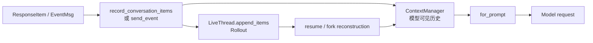

# 7. 上下文、持久化与恢复

这一章区分三个经常混在一起的词：History 是当前模型上下文，Rollout 是可重放持久化记录，Compaction 是用摘要重写 History 并在 Rollout 中建立 checkpoint。

## 7.1 两条同步的数据流

`record_conversation_items` 同时写 History、Rollout response item 和 raw-response 事件；`send_event_raw` 默认把 `EventMsg` 写 Rollout 后再送 event channel。不是每个 Event 都进入 History，也不是每个 RolloutItem 都发给模型。

## 7.2 ContextManager 的职责

打开 [`ContextManager`](</home/goulei1/code/codex/codex-rs/core/src/context_manager/history.rs:41>)。它保存：

- oldest-to-newest 的 `ResponseItem`；
- `history_version`，在 compaction/rollback 等重写时递增；
- 服务端返回或本地估算的 token info；
- 用于 Turn 设置差量的 reference context；
- 用于 WorldState 差量的 snapshot baseline。

`Arc<Vec<_>>` 让只读快照共享底层向量，修改时才 copy-on-write。这适合 sampling：在不长时间占有 SessionState 锁的情况下取得一致历史。

## 7.3 写入前处理与 Prompt 前规范化

[`record_conversation_items`](</home/goulei1/code/codex/codex-rs/core/src/session/mod.rs:2994>) 是 durable history boundary。写入前会准备图像/音频、补 turn id 和 response item id，再按模型 truncation policy 记录。

真正发送前，[`normalize_history`](</home/goulei1/code/codex/codex-rs/core/src/context_manager/history.rs:325>) 强制四个不变量：

1. 每个 function/custom call 有 output；
2. 每个 output 有 call；
3. 不支持 image 的模型不收到 image；
4. 不支持 audio 的模型不收到 audio。

这不是对 Rollout 的破坏性清洗，而是在 `for_prompt` 消费的 History 快照上进行。Rollout 仍保留恢复和审计所需记录。

## 7.4 Rollout 记录什么

[`RolloutItem`](</home/goulei1/code/codex/codex-rs/protocol/src/protocol.rs:3211>) 是恢复协议，而不只是聊天 JSON：

- `SessionMeta`：thread/session 配置和环境元数据；
- `ResponseItem`：模型上下文中的用户、assistant、tool call/output 等；
- `Compacted`：摘要和可选 replacement history checkpoint；
- `TurnContext`：恢复上一轮模型、context hash、realtime 等基线；
- `WorldState`：full snapshot 或 merge patch；
- `EventMsg`：Turn 生命周期、状态、token 等事件；
- inter-agent communication 兼容/专用记录。

[`persist_rollout_items`](</home/goulei1/code/codex/codex-rs/core/src/session/mod.rs:3629>) 将这些 item 追加到 `LiveThread`。具体文件/数据库物化策略由 thread-store 实现；core 不直接假设“永远就是某个裸 JSONL 文件”。调用者虽然常通过 rollout path 恢复，也应经 thread store 读取。

## 7.5 Token 统计与触发压缩

模型流的 `Completed` 事件携带 token usage，Session 更新 ContextManager 并向客户端发 token count。没有精确服务端数据时，[`ContextManager::estimate_token_count`](</home/goulei1/code/codex/codex-rs/core/src/context_manager/history.rs:163>) 使用基于字节的粗略估算；源码明确说明它不是 tokenizer 精确计数。

[`run_turn`](</home/goulei1/code/codex/codex-rs/core/src/session/turn.rs:423>) 在采样循环中检查 token pressure。自动压缩既可能发生在用户输入进入主采样前，也可能在某次采样完成后、继续工具循环前发生。它是主流程的条件分支，不是 Session 启动步骤。

## 7.6 自动 Compaction 的真实行为

打开 [`run_compact_task_inner_impl`](</home/goulei1/code/codex/codex-rs/core/src/compact.rs:235>)：

1. 克隆当前 History，并加入 compaction 请求输入；
2. 用相同 base instructions 发起一个专门的模型采样；
3. 取得模型生成的摘要；
4. 保留必要用户消息，构造 replacement history；
5. 如需要，在摘要前重新插入当前完整初始上下文；
6. 推进 context-window id；
7. 调用 [`replace_compacted_history`](</home/goulei1/code/codex/codex-rs/core/src/session/mod.rs:3263>)；
8. 重算 token usage。

`replace_compacted_history` 会：

- 原子替换 ContextManager 的 items/reference baseline；
- 向 Rollout 追加带 `replacement_history` 的 `CompactedItem`；
- 为新窗口追加 full WorldState baseline；
- 必要时追加 TurnContext baseline。

所以压缩不是“把最早几条直接删除”，也不是只保存一段摘要文本。它建立一个新的 History 窗口，并给恢复逻辑留下明确 checkpoint。

## 7.7 Resume 如何重建

`ThreadManager::resume_thread_from_rollout` 经 thread store 读取历史，形成 [`InitialHistory::Resumed`](</home/goulei1/code/codex/codex-rs/protocol/src/protocol.rs:2575>)。Session 启动末尾的 `record_initial_history` 调用 [`reconstruct_history_from_rollout`](</home/goulei1/code/codex/codex-rs/core/src/session/rollout_reconstruction.rs:113>)。

重建器从新到旧扫描，以便尽快找到：

- 最新仍有效的 replacement history checkpoint；
- 最近的 TurnContext 设置；
- WorldState full/patch 序列；
- rollback 后仍存活的 Turn；
- 当前 compaction window 标识。

找到基点后，它只正向重放仍有效的 suffix：ResponseItem 进入 ContextManager，`Compacted` 替换 History，rollback 删除最后 N 个用户 Turn。WorldState 记录则按时间顺序重放：full 建立基线，patch 应用 merge patch，compaction 清除旧窗口基线。

输出 [`RolloutReconstruction`](</home/goulei1/code/codex/codex-rs/core/src/session/rollout_reconstruction.rs:430>) 包含 History、上一轮设置、reference context、WorldState baseline 和 window ids。Session 再用最后的 token event 初始化 UI 可见 token 信息。

### 兼容分支

旧 Rollout 的 `CompactedItem` 可能没有 `replacement_history` 或 window number。重建器为其重新用用户消息与摘要构造 History，并清空部分 reference baseline，导致下个 Turn 完整重注入 canonical context。源码注释承认这种 prompt shape 只是临时兼容；理解当前主链时不要把它当成新格式设计。

## 7.8 Fork 如何重建

[`ThreadManager::fork_thread`](</home/goulei1/code/codex/codex-rs/core/src/thread_manager.rs:1031>) 先读取源 Thread，再按 `ForkSnapshot` 选择边界，最终以 `InitialHistory::Forked` 启动一个新 id。它复用与 resume 相同的 reconstruction 语义，但持久化有两种策略：

- `Copied`：把选定历史前缀复制到子 Thread 的本地 Rollout；
- `Referenced`：用 `history_base` 引用祖先记录，只把子 Thread 的有效设置与后续记录写到本地。

[`record_initial_history`](</home/goulei1/code/codex/codex-rs/core/src/session/mod.rs:1370>) 为 fork 补齐缺失 response ids、重建 History/token/baseline，再按策略持久化。Fork 的关键语义是“新 Thread id + 继承的模型上下文”，不是两个 Session 共享同一个可变 ContextManager。

## 7.9 取消、回滚与一致性

模型完成 item 会立即记录，而不是等待整个 response 完成；工具 call 与 output 也分别在发生时持久化。这样取消后 Rollout 可能包含中断 Turn，但不会让已交付给 UI 的完成 item 完全消失。

History normalization 负责下一次请求的 call/output 配对；rollback event 则在重建时删除对应用户 Turn。`history_version` 让依赖历史快照的增量机制发现重写。这里的重要不变量不是“Rollout 总是只含完整成功 Turn”，而是“Rollout 足以判定哪些记录在恢复后仍有效”。

## 7.10 本章阅读停点

按以下顺序读：`record_conversation_items` → `ContextManager::for_prompt` → `RolloutItem` → `replace_compacted_history` → `reconstruct_history_from_rollout`。在重建器中读到最终 `RolloutReconstruction` 即停；reverse replay 的每个 legacy edge case 可在实际修复恢复 bug 时再看。
