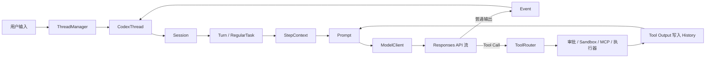

# codex-core 源码阅读指南

这组教程面向第一次接触 Codex、已经具备 Rust 基础的开发者。它不按目录逐个介绍文件，而是围绕一个问题组织源码：**一次 Codex 用户请求究竟如何在 core 中运行？**

本文依据当前工作区源码编写。行号用于帮助第一次定位；源码继续演进后，应以链接中的类型和函数名为准。

## 一句话结论

`codex-core` 是 Codex 的有状态 Agent 运行时。调用者把命令提交给 `CodexThread`，`Session` 将其变成一个 Turn；每次模型采样前生成固定的 `TurnContext` 和请求级的 `StepContext`，再把历史、运行环境和工具组合成 `Prompt`。模型若返回工具调用，core 执行工具、把结果追加到历史并再次采样；最终文本和生命周期事件通过事件通道返回调用者，同时写入 Rollout 以供恢复。

## 总体架构



图中最重要的环不是“输入到输出”，而是 `Prompt → Responses API → Tool Call → History → Prompt`。一个用户 Turn 可以包含多次模型采样；源码把每次采样所依赖的可变运行状态单独收敛为 `StepContext`。

## 教程目录

1. [项目定位与边界](01-position-and-boundaries.md)：core 解决什么问题，谁调用它，公开 API 到哪里为止。
2. [核心概念与所有权](02-runtime-concepts.md)：Thread、Session、Turn、Step、History、WorldState、Prompt、Rollout、ToolRouter 的关系。
3. [启动流程](03-startup.md)：从 `ThreadManager::start_thread` 跟到 Session 初始化、MCP 和 Skills 预热。
4. [单轮请求主链路](04-turn-lifecycle.md)：从 app-server 的 `turn/start` 跟到流式响应、工具循环和 `TurnComplete`。
5. [Prompt 与上下文](05-prompt-and-context.md)：各类指令如何组合，以及如何映射到 Responses API。
6. [工具、审批与沙箱](06-tools-approval-sandbox.md)：以 Shell 为主例、MCP 为对照，解释工具循环的安全边界。
7. [History、Rollout 与恢复](07-history-rollout-recovery.md)：规范化、token、压缩、resume 和 fork。
8. [扩展点、阅读路线与心智模型](08-extensions-and-reading-paths.md)：MCP、Skills、Plugins、Hooks、Extensions、多 Agent 的接入位置，以及三条阅读路线。

## 主链路、条件分支与兼容代码

阅读时先使用下面的分类，不要把所有模块看成同等重要：

| 分类 | 先关注 | 暂时跳过 |
| --- | --- | --- |
| 主链路 | `ThreadManager`、`CodexThread`、`Session`、`RegularTask`、`run_turn`、`Prompt`、`ModelClientSession` | 各工具的业务细节 |
| 常见条件分支 | 工具调用、审批、沙箱、自动压缩、MCP | realtime、guardian、远程执行器细节 |
| 扩展支线 | Skills、Plugins、Hooks、Extensions、多 Agent | 每种扩展的发现与安装实现 |
| 兼容路径 | legacy rollout compaction、Responses Lite、旧协议事件 | 首轮不要深挖 |
| 测试代码 | `core/tests/suite` 集成测试、模块的 `*_tests.rs` | 理解主链路前不要从 mock 倒推设计 |

## 建议的第一次阅读方式

先打开 [`thread_manager.rs`](</home/goulei1/code/codex/codex-rs/core/src/thread_manager.rs:807>) 的 `start_thread`，确认外部调用者拿到的是 `CodexThread`；然后跳到 [`session/handlers.rs`](</home/goulei1/code/codex/codex-rs/core/src/session/handlers.rs:703>) 的 `submission_loop`，再到 [`session/turn.rs`](</home/goulei1/code/codex/codex-rs/core/src/session/turn.rs:151>) 的 `run_turn`。当你能在 `run_turn` 中指出“历史在哪里取出、Prompt 在哪里构建、工具结果在哪里让循环继续”时，再进入 Prompt 和持久化专题。

第一次阅读无需理解 `core/src` 的所有模块。能解释这条链已经足够建立骨架：

```text
start_thread
  -> Session::spawn / Session::new
  -> submission_loop
  -> user_input_or_turn
  -> RegularTask::run
  -> run_turn
  -> run_sampling_request
  -> try_run_sampling_request
  -> ToolRouter / Event
```
