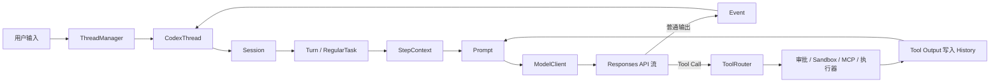

# codex-core 源码阅读指南

这组教程面向第一次接触 Codex、已经具备 Rust 基础的开发者。它不按目录逐个介绍文件，而是围绕一个问题组织源码：**一次 Codex 用户请求究竟如何在 core 中运行？**

本文依据当前工作区源码编写。行号用于帮助第一次定位；源码继续演进后，应以链接中的类型和函数名为准。

## 一句话结论

`codex-core` 是 Codex 的有状态 Agent 运行时。调用者把命令提交给 `CodexThread`，`Session` 将其变成一个 Turn；每次模型采样前生成固定的 `TurnContext` 和请求级的 `StepContext`，再把历史、运行环境和工具组合成 `Prompt`。模型若返回工具调用，core 执行工具、把结果追加到历史并再次采样；最终文本和生命周期事件通过事件通道返回调用者，同时写入 Rollout 以供恢复。

## 总体架构



图中最重要的环不是“输入到输出”，而是 `Prompt → Responses API → Tool Call → History → Prompt`。一个用户 Turn 可以包含多次模型采样；源码把每次采样所依赖的可变运行状态单独收敛为 `StepContext`。

## 教程目录

1. [项目定位与边界](01-position-and-boundaries.md)：core 解决什么问题，谁调用它，公开 API 到哪里为止。
2. [核心概念与所有权](02-runtime-concepts.md)：Thread、Session、Turn、Step、History、WorldState、Prompt、Rollout、ToolRouter 的关系。
3. [启动流程](03-startup.md)：从 `ThreadManager::start_thread` 跟到 Session 初始化、MCP 和 Skills 预热。
4. [单轮请求主链路](04-turn-lifecycle.md)：从 app-server 的 `turn/start` 跟到流式响应、工具循环和 `TurnComplete`。
5. [Prompt 与上下文](05-prompt-and-context.md)：各类指令如何组合，以及如何映射到 Responses API。
6. [工具、审批与沙箱](06-tools-approval-sandbox.md)：以 Shell 为主例、MCP 为对照，解释工具循环的安全边界。
7. [History、Rollout 与恢复](07-history-rollout-recovery.md)：规范化、token、压缩、resume 和 fork。
8. [扩展点、阅读路线与心智模型](08-extensions-and-reading-paths.md)：MCP、Skills、Plugins、Hooks、Extensions、多 Agent 的接入位置，以及三条阅读路线。

## 主链路、条件分支与兼容代码

阅读时先使用下面的分类，不要把所有模块看成同等重要：

| 分类 | 先关注 | 暂时跳过 |
| --- | --- | --- |
| 主链路 | `ThreadManager`、`CodexThread`、`Session`、`RegularTask`、`run_turn`、`Prompt`、`ModelClientSession` | 各工具的业务细节 |
| 常见条件分支 | 工具调用、审批、沙箱、自动压缩、MCP | realtime、guardian、远程执行器细节 |
| 扩展支线 | Skills、Plugins、Hooks、Extensions、多 Agent | 每种扩展的发现与安装实现 |
| 兼容路径 | legacy rollout compaction、Responses Lite、旧协议事件 | 首轮不要深挖 |
| 测试代码 | `core/tests/suite` 集成测试、模块的 `*_tests.rs` | 理解主链路前不要从 mock 倒推设计 |

## 建议的第一次阅读方式

先打开 [`thread_manager.rs`](../../../codex-rs/core/src/thread_manager.rs#L845) 的 `start_thread`，确认外部调用者拿到的是 `CodexThread`；然后跳到 [`session/handlers.rs`](../../../codex-rs/core/src/session/handlers.rs#L706) 的 `submission_loop`，再到 [`session/turn.rs`](../../../codex-rs/core/src/session/turn.rs#L153) 的 `run_turn`。当你能在 `run_turn` 中指出“历史在哪里取出、Prompt 在哪里构建、工具结果在哪里让循环继续”时，再进入 Prompt 和持久化专题。

### 不迷路版：一条普通文本请求实际经过什么

下面按当前源码的函数边界展开。缩进表示调用或异步任务的归属；方括号表示分支，而不是每次都会发生的调用。首次阅读只沿着标有“主线”的那一列向下走。

```text
ThreadManager::start_thread                         主线：创建长期存活的 Thread
  -> start_thread_inner
  -> ThreadManagerState::spawn_thread
  -> Session::spawn                                 建立 Session、submission channel、event channel
       -> tokio::spawn(submission_loop(...))         此时还没有用户 Turn；循环等待 Submission
  -> NewThread { CodexThread, ... }

CodexThread::submit(Op::UserInput)                  主线：一次用户提交
  -> SessionIo::submit
  -> tx_sub.send(Submission { op, id, ... })
  -> submission_loop                                从 channel 收到 Submission，按 Op 分派
       -> user_input_or_turn
          -> user_input_or_turn_inner
             -> Session::new_turn_with_sub_id       将本轮 settings 固化成 TurnContext
             -> Session::steer_input
                [已有 ActiveTurn] -> 把输入放入 input queue，当前 Turn 之后吸收它
                [没有 ActiveTurn] -> Session::spawn_task(RegularTask::new())
                   -> Session::start_task
                   -> tokio::spawn(SessionTask::run)
                      -> RegularTask::run            发 TurnStarted，并处理 startup prewarm
                         -> run_turn                  一个 Turn 的采样循环
```

`Session::spawn` 与 `Session::new` 不应被理解为一次用户请求的前后两步：在当前实现中，`Session::spawn` 负责构造 Session 并启动 `submission_loop`；新用户 Turn 由 `new_turn_with_sub_id` 创建 `TurnContext`。所以先把边界记成“**Thread/Session 只创建一次，Turn 可以创建很多次**”。

### `run_turn` 内部：每一次采样如何回来

`run_turn` 最容易让人迷路，因为它包含一个外层的“本轮继续吗”循环，而 `run_sampling_request` 又包含一个“流失败要重试吗”循环。先按下面的成功路径读：

```text
run_turn
  -> run_pre_sampling_compact                         [必要时]
  -> required_mcp_servers_for_input                   [用户明确提到 MCP/Plugin 时]
  -> capture_step_context...                          为本次采样冻结 StepContext
       -> built_tools -> ToolRouter                   生成“模型看见哪些工具、实际由谁执行”的快照
  -> record_context_updates... / run_hooks_and_record_inputs
       -> record_conversation_items                   把上下文、注入项、用户输入写入 History + Rollout

  -> loop {                                           每一轮 loop 最多得到一次模型 response stream
       -> clone_history().for_prompt(...)
       -> build_prompt(history, ToolRouter, ...)
       -> run_sampling_request
          -> loop {                                   只处理可重试的流错误
               -> try_run_sampling_request
                  -> ModelClientSession::stream(prompt, ...)
                  -> loop { ResponseEvent }           消费 Responses API 的流
                       -> OutputTextDelta / Reasoning... -> Session::send_event(...)
                       -> OutputItemDone(item)
                          -> handle_output_item_done(item)
                  }
          }
       -> [有 tool call 或待处理输入] -> 下一次外层 loop
       -> [没有] -> 返回最后一条 assistant message
     }
```

其中 `StepContext` 是“**一次采样**”的快照，`TurnContext` 是“**整个用户 Turn**”的快照。外层 loop 因工具结果、steer 输入、压缩等原因再次采样时，可能重新捕获 `StepContext`；不要把它和 `TurnContext` 当成同一个对象。

### 在 `OutputItemDone` 处分叉：文本结束还是工具闭环

`try_run_sampling_request` 收到完整 item 后进入 [`handle_output_item_done`](../../../codex-rs/core/src/stream_events_utils.rs#L288)。这正是“模型输出”转为“core 行为”的边界：

```text
OutputItemDone(item)
  -> ToolRouter::build_tool_call(item.clone())
     |
     +-- None：普通 message / reasoning
     |     -> parse/finalize TurnItem
     |     -> emit_turn_item_started / emit_turn_item_completed
     |     -> record_completed_response_item
     |          -> Session::record_conversation_items
     |             -> History + Rollout + raw item Event
     |
     +-- Some(call)：模型请求调用工具
           -> 先 record_completed_response_item(call)  保留模型发出的 tool call
           -> ToolCallRuntime::handle_tool_call(call)
              -> ToolRouter::dispatch_tool_call...     到 registry 中找到具体 handler
              -> approval / sandbox / MCP / shell ...  具体工具各自的执行支线
           -> future 放入 in_flight，needs_follow_up = true

ResponseEvent::Completed
  -> drain_in_flight
     -> tool future 的 ResponseInputItem
     -> record_conversation_items(tool output)         tool output 写回 History
  -> 返回 run_turn 的外层 loop
  -> 下一次 clone_history().for_prompt(...)           原 call + output 都已在 Prompt 中
```

因此，`ToolRouter` 不是“收到模型输出后直接发送 Event”的终点。它一方面在 `build_prompt` 时提供 model-visible tool specs，另一方面在工具调用时定位 runtime handler；工具结果回写 History 后，才促成下一次模型采样。普通文本则通过 `Session::send_event` 及 Turn-item 事件回到 `CodexThread::next_event`，最终由 app-server/UI 消费。

第一次跟读建议只设六个停点：`start_thread`（创建 Session）、`submission_loop`（收到 `Op::UserInput`）、`user_input_or_turn_inner`（创建 Turn）、`RegularTask::run`（启动 Turn）、`run_turn`（构造下一次 Prompt）、`handle_output_item_done`（文本与工具分叉）。每到一个停点，先回答“输入是什么、状态写到哪里、下一跳由谁启动”，再进入下一层。更完整的逐函数表和 StepContext 构造细节见[第 4 章](04-turn-lifecycle.md)。
