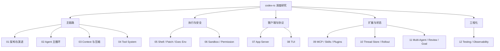

# codex-rs 深度研究专题

这个目录是 `codex-rs` 的专题研究报告集。它不是入门课程，也不是提交历史摘要，而是面向“我要系统读懂生产级 coding agent”的源码研究路径。

## 什么是深度研究

这里的“深度研究”不是把源码入口列出来，也不是把功能点复述一遍。一个合格的深度研究专题至少要覆盖六层内容：

| 层次 | 要回答的问题 | 证据形式 |
| --- | --- | --- |
| 问题定义 | 这个子系统解决什么工程问题，不解决什么问题？ | 设计边界、反例、失效场景。 |
| 演进历史 | 它为什么会演进成现在这样？哪些提交或阶段改变了架构？ | Git 历史、重构线索、旧方案被替代的原因。 |
| 核心模型 | 关键概念、状态机、数据结构是什么？ | struct/enum、协议类型、状态图。 |
| 实现路径 | 一次真实请求如何穿过这些模块？ | 调用链、sequence diagram、源码符号。 |
| 原理取舍 | 为什么这样设计，而不是更简单的方案？ | 约束、权衡、跨平台/安全/性能原因。 |
| 验证方法 | 如何证明自己真的理解了？ | 测试、日志、命令、可复现实验。 |

因此，演进历史当然是深度研究的一部分。它不是附录，而是解释“为什么现在代码这么复杂”的纵轴。每个专题都应该同时看两条线：

- 横向结构：现在由哪些模块协作完成一个功能。
- 纵向演进：这些模块为什么被拆出来、为什么引入协议、状态库、PathUri、sandbox 或 app-server。

如果一篇报告只写“看这些文件”和“这个流程大概这样”，那只能算源码导览；只有补上实现细节、设计原理、演进动因和验证实验，才算深度研究。

建议先读：

- [codex-rs 项目演进史](../codex-rs-evolution-history.md)
- [codex-rs 深度研究覆盖矩阵](../codex-rs-deep-research-coverage.md)
- [Codex 生产级 Coding Agent 学习总览](../production-coding-agent-overview.md)

然后按本目录的顺序逐篇研究。

## 专题目录

| 序号 | 报告 | 核心问题 |
| --- | --- | --- |
| 01 | [总体架构与演进](01-architecture-and-evolution.md) | `codex-rs` 为什么从 CLI 长成 agent runtime workspace？ |
| 02 | [Agent 主循环](02-agent-loop.md) | 一次用户请求如何变成模型回合、工具调用和最终回复？ |
| 03 | [Context 构建与压缩](03-context-and-compaction.md) | 模型到底看到了什么，长上下文如何治理？ |
| 04 | [Tool System](04-tool-system.md) | shell、patch、MCP、dynamic tools 如何统一成模型工具？ |
| 05 | [Shell、Patch 与执行环境](05-shell-patch-exec-env.md) | coding agent 如何安全可靠地执行命令和修改文件？ |
| 06 | [Sandbox、Permission 与安全策略](06-sandbox-permission-security.md) | 为什么不能裸跑 agent，权限/沙箱/网络/Guardian 如何组合？ |
| 07 | [App Server 与协议](07-app-server-protocol.md) | Codex 如何把 agent runtime 暴露给 IDE、桌面端和测试客户端？ |
| 08 | [TUI 与用户交互](08-tui-user-experience.md) | 终端 UI 如何呈现复杂 agent 状态、审批、diff 和多会话？ |
| 09 | [MCP、Skills、Plugins、Connectors](09-mcp-skills-plugins-connectors.md) | Codex 如何接入外部工具和可复用能力包？ |
| 10 | [Thread Store、Rollout 与恢复](10-thread-store-rollout-recovery.md) | 会话如何持久化、恢复、分叉、归档和压缩？ |
| 11 | [Multi-Agent、Review、Guardian、Goal](11-multi-agent-review-guardian-goal.md) | Codex 如何管理子 agent、审查工作流和长目标？ |
| 12 | [工程化、测试与可观测性](12-engineering-testing-observability.md) | 生产级 agent 如何测试、追踪、诊断和持续演进？ |

## 总体地图

## 机制级阅读索引

如果目标是理解“原理和算法”，不要只按专题顺序读。可以先看这些机制段落：

| 机制 | 入口 | 重点 |
| --- | --- | --- |
| 架构边界决策模型 | [01 总体架构与演进 - 架构边界决策模型](01-architecture-and-evolution.md#架构边界决策模型) | workspace 分层、新能力落点算法、实时 turn/状态恢复/能力暴露三条数据流。 |
| Turn 状态机 | [02 Agent 主循环 - Turn 状态机详解](02-agent-loop.md#turn-状态机详解) | `can_drain_pending_input`、`needs_follow_up`、sampling stream、stop hook、mid-turn compact。 |
| 压缩算法 | [03 Context 构建与压缩 - 压缩算法详解](03-context-and-compaction.md#压缩算法详解) | token pressure、BodyAfterPrefix、local Memento、remote compact、replacement history、initial context 重注入。 |
| 工具调度算法 | [04 Tool System - 工具调度算法](04-tool-system.md#工具调度算法) | ToolCall 归一化、读写锁并行控制、取消语义、错误转 tool output。 |
| Exec 执行算法 | [05 Shell、Patch 与执行环境 - Exec 执行算法](05-shell-patch-exec-env.md#exec-执行算法) | sandboxed request 转换、stdout/stderr 双通道、timeout/cancel、output cap、sandbox denial heuristic。 |
| apply_patch 应用算法 | [05 Shell、Patch 与执行环境 - apply_patch 应用算法](05-shell-patch-exec-env.md#apply_patch-应用算法) | patch safety、PathUri、ExecutorFileSystem、AppliedPatchDelta、部分失败精确性。 |
| 安全决策算法 | [06 Sandbox、Permission 与安全策略 - 安全决策算法](06-sandbox-permission-security.md#安全决策算法) | sandbox permission 校验、approval cache、additional permissions 合并、OS enforcement。 |
| App Server 协议状态机 | [07 App Server 与协议 - 协议状态机](07-app-server-protocol.md#协议状态机) | initialize gate、experimental API 检查、request serialization queue、outbound initialized。 |
| TUI Streaming 渲染机制 | [08 TUI 与用户交互 - Streaming 渲染机制](08-tui-user-experience.md#streaming-渲染机制) | active cell、stream tail、markdown consolidation、宽度重渲染、cwd hyperlink 稳定性。 |
| MCP Tool Exposure 算法 | [09 MCP、Skills、Plugins、Connectors - MCP Tool Exposure 算法](09-mcp-skills-plugins-connectors.md#mcp-tool-exposure-算法) | 直接暴露与 deferred 暴露、tool_search 索引、namespace spec、parallel/readOnlyHint。 |
| Rollout 重建算法 | [10 Thread Store、Rollout 与恢复 - Rollout 重建算法](10-thread-store-rollout-recovery.md#rollout-重建算法) | 反向扫描 segment、replacement history 基线、rollback 处理、正向 replay suffix。 |
| Multi-Agent 生命周期算法 | [11 Multi-Agent、Review、Guardian、Goal - Multi-Agent 生命周期算法](11-multi-agent-review-guardian-goal.md#multi-agent-生命周期算法) | spawn 隔离线程、delegate event forwarding、approval bridge、bounded wait。 |
| Agent 测试证据链 | [12 工程化、测试与可观测性 - Agent 测试证据链](12-engineering-testing-observability.md#agent-测试证据链) | SSE mock、request assertions、event waiters、schema fixture、snapshot、telemetry。 |

后续继续加深时，应该优先把每个专题都补成这种形态：不仅讲“流程经过哪里”，还要写清楚触发条件、状态变量、伪代码、边界情况和为什么这样做。

## 每篇报告的阅读方法

每篇报告应按类似结构组织：

1. 研究目标：先明确这块解决什么工程问题。
2. 源码地图：列出应该打开的关键文件。
3. 核心数据结构：列出关键 struct/enum/protocol item。
4. 关键流程：用图说明主路径。
5. 实现细节与原理：解释为什么这样设计。
6. 演进线索：说明这块功能如何逐步长出来。
7. 深挖问题：列出读源码时必须能回答的问题。
8. 实验建议：给出小规模验证方式。

不要只读报告。每读完一篇，至少打开对应源码入口，做一次“从入口追到出口”的源码走查。

## 当前状态说明

本目录已经从“源码导览骨架”升级为第一版深度研究报告集。第二轮已把每篇专题补上至少一个机制级入口，目前覆盖架构边界决策、turn 状态机、压缩算法、工具调度、exec/apply_patch、安全决策、app-server 协议状态机、TUI streaming 渲染、MCP tool exposure、rollout 重建、multi-agent 生命周期和测试证据链。

后续继续加深时，优先补两类内容：

- 更细的代码走查：针对一个真实 turn、一次 compact、一次 MCP 调用或一次 app-server `turn/start`，逐行追踪到具体函数。
- 更强的历史证据：为每条演进线索补对应 commit、PR 或重构前后代码对比。

## 完成标准

完成本专题后，应能做到：

- 画出 `codex-rs` 从客户端到 core、模型、工具、安全和状态的完整架构图。
- 解释 thread、session、turn、item、rollout、context fragment 的边界。
- 追踪一次 shell command 或 apply_patch 从模型 tool call 到执行结果回传的路径。
- 说明 app-server 如何把 core 事件翻译成客户端协议事件。
- 解释 MCP、skills、plugins、connectors 的区别和组合方式。
- 说明 sandbox、approval、network policy、Guardian 分别控制什么风险。
- 设计一个 mini coding agent，并指出它距离生产级 Codex 还缺哪些能力。
