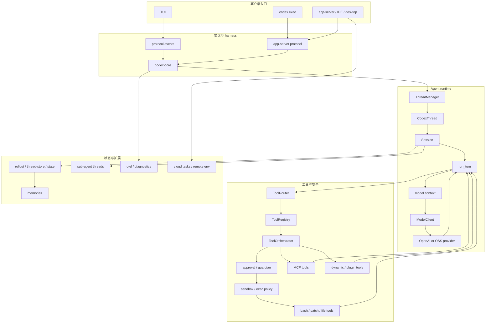

# Codex 生产级 Coding Agent 学习总览

本文面向想参与生产级 coding agent 开发的人。目标不是把整个仓库逐文件读完，而是先建立一张可导航的地图：主链路是什么，关键模块在哪里，为什么生产级 agent 会比教学版 agent 复杂。

## 学习目标

学完这条路线后，应能回答这些问题：

- 一个用户请求如何变成一次模型回合？
- 模型如何请求工具，工具结果如何回到模型上下文？
- shell、patch、MCP、动态工具如何统一进工具系统？
- 为什么需要审批、沙箱、网络策略和 exec policy？
- 会话如何保存、恢复、分支、压缩？
- 长期 memories 如何从历史会话中生成、整合、读取？
- 多 agent 如何 spawn、通信、等待、恢复？
- TUI、`codex exec`、app-server、IDE/desktop/web 如何共用同一个 harness？
- 生产级 agent 如何做配置、认证、模型选择、遥测、诊断和跨平台分发？

## 项目定位

Codex CLI 是一个本地运行的 coding agent。它不是一个最小 demo，而是一个生产级系统：支持多客户端入口、权限模型、沙箱执行、MCP、插件/skills、多 agent、会话持久化、上下文压缩、TUI 和 app-server 协议。

建议把仓库看成五层：

1. 产品入口：`codex-rs/cli`、`codex-rs/tui`、`codex-rs/exec`、`codex-rs/app-server`
2. 协议层：`codex-rs/protocol`、`codex-rs/app-server-protocol`
3. Agent 核心：`codex-rs/core`
4. 能力扩展：`codex-rs/tools`、`codex-rs/codex-mcp`、`codex-rs/skills`、`codex-rs/plugin`
5. 安全与状态：`codex-rs/sandboxing`、`codex-rs/execpolicy`、`codex-rs/thread-store`、`codex-rs/rollout`、`codex-rs/state`

## 项目价值地图

这个仓库最值得学的不是“怎么调一次模型”，而是如何把 agent loop 做成可复用、可控、可嵌入、可观测、可恢复的生产系统。

| 能力 | 学习价值 | 主要入口 |
| --- | --- | --- |
| Codex harness | 同一个 agent runtime 支撑 CLI、TUI、IDE、App、Web、第三方集成 | `codex-rs/core`、`codex-rs/app-server` |
| Agent loop | 用户输入、模型采样、工具调用、工具结果、继续采样的闭环 | `codex-rs/core/src/session/turn.rs` |
| Tool runtime | 把 shell、patch、MCP、动态工具、多 agent 工具统一成模型可调用工具 | `codex-rs/core/src/tools`、`codex-rs/tools` |
| 安全执行 | 权限、审批、沙箱、网络策略、命令策略、升级执行 | `codex-rs/sandboxing`、`codex-rs/execpolicy`、`codex-rs/network-proxy` |
| App Server | 把 harness 暴露成稳定的双向 JSON-RPC 协议 | `codex-rs/app-server`、`codex-rs/app-server-protocol` |
| Thread store | 持久会话、resume、fork、archive、metadata、冷/热 thread 管理 | `codex-rs/thread-store`、`codex-rs/rollout` |
| Memories | 从历史 rollouts 中提取长期记忆并在后续会话中使用 | `codex-rs/memories`、`codex-rs/ext/memories` |
| Multi-agent | 子 agent 线程树、fork history、mailbox、wait/resume/close | `codex-rs/core/src/agent` |
| Review mode | 把代码审查做成受限子 agent 工作流，而不是普通聊天提示词 | `codex-rs/core/src/tasks/review.rs`、`codex-rs/core/src/review_prompts.rs` |
| Guardian/auto-review | 用专门 reviewer 审核高风险审批请求，降低用户疲劳和误授权 | `codex-rs/core/src/guardian` |
| MCP/Plugins/Skills | 外部工具、应用连接器、能力包、按需上下文注入 | `codex-rs/codex-mcp`、`codex-rs/plugin`、`codex-rs/skills` |
| Auth/Models | ChatGPT/API key/agent identity、模型目录、provider 抽象 | `codex-rs/login`、`codex-rs/model-provider`、`codex-rs/models-manager` |
| Config | 多层配置、profile、feature flags、MCP/permissions/skills 配置 | `codex-rs/config`、`codex-rs/core/src/config`、`codex-rs/features` |
| Observability | tracing、OTEL、rollout trace、本地诊断、调试代理 | `codex-rs/otel`、`codex-rs/rollout-trace`、`codex-rs/debug-client` |
| Remote execution | app-server 命令、exec-server、远程 environment、PTY/process 控制 | `codex-rs/exec-server`、`codex-rs/app-server` |
| Cloud tasks | 把任务提交到云端环境运行，支持 list/status/diff/apply/best-of-N | `codex-rs/cloud-tasks`、`codex-rs/cloud-tasks-client` |
| Realtime/Voice | 实时语音/文本会话、handoff、音频流和后台 agent 协同 | `codex-rs/core/src/realtime_conversation.rs`、`codex-rs/realtime-webrtc` |
| Product UX | TUI 渲染、approval UI、diff、session resume、model/settings popups | `codex-rs/tui` |

## 总体架构

先不要把 Codex 想成“一坨 agent 代码”。更清楚的看法是：不同客户端共用同一个 agent runtime，runtime 负责把用户请求变成模型回合，再把模型要求的动作交给工具、安全、状态和扩展系统。

| 层 | 作用 | 主要入口 |
| --- | --- | --- |
| 客户端入口 | 接收用户输入，展示模型事件、diff、审批和状态 | `codex-rs/tui`、`codex-rs/exec`、`codex-rs/app-server` |
| 协议与 harness | 把不同入口统一成 thread/session 操作 | `codex-rs/protocol`、`codex-rs/app-server-protocol`、`codex-rs/core` |
| Agent runtime | 维护会话，构建上下文，调用模型，处理工具调用，推进回合 | `codex-rs/core/src/session` |
| 工具与安全 | 执行 shell、patch、MCP、动态工具，并经过审批、沙箱和网络策略 | `codex-rs/core/src/tools`、`codex-rs/tools`、`codex-rs/sandboxing`、`codex-rs/execpolicy` |
| 状态与扩展 | 保存会话、resume、memories、多 agent、插件、skills、遥测和云端任务 | `codex-rs/thread-store`、`codex-rs/rollout`、`codex-rs/memories`、`codex-rs/plugin` |



一次普通请求可以按这条主链路读：

1. 用户输入先进入 `tui`、`exec` 或 `app-server`。
2. 入口层把用户操作转换成协议事件或 app-server RPC。
3. `codex-core` 通过 `ThreadManager` 找到或创建 `CodexThread`。
4. `CodexThread` 把操作交给对应 `Session`。
5. `SessionTask` / `run_turn` 组装模型上下文：历史消息、instructions、`AGENTS.md`、skills、插件和 MCP 工具清单。
6. `ModelClient` 调用模型；如果模型要求工具调用，`ToolRouter` 找到工具，`ToolOrchestrator` 负责执行。
7. 工具执行前后可能经过审批、guardian、沙箱、exec policy 和网络策略。
8. 工具结果回到 `run_turn`，继续采样，直到模型产出最终答复；同时事件被写入 rollout / thread store，客户端收到增量展示。

图里其它能力不要一开始就当成主线：memories、多 agent、review、realtime、cloud tasks 和 telemetry 都是围绕这条 agent loop 增强出来的旁路系统。先读懂一次请求如何完成，再回头看这些能力如何插入主链路。

## 主链路阅读顺序

### 1. Thread 与 Session

先读：

- `codex-rs/core/src/thread_manager.rs`
- `codex-rs/core/src/codex_thread.rs`
- `codex-rs/core/src/session/session.rs`

重点理解：

- `ThreadManager` 负责创建、恢复、查找 thread。
- `CodexThread` 是对外的 thread handle。
- `Session` 是实际运行时，持有配置、状态、mailbox、模型客户端、MCP、插件、工具等服务。

### 2. Harness 与 App Server

继续读：

- `codex-rs/app-server/README.md`
- `codex-rs/app-server/src/message_processor.rs`
- `codex-rs/app-server/src/request_processors.rs`
- `codex-rs/app-server/src/thread_state.rs`
- `codex-rs/app-server-protocol/src/protocol/v2.rs`
- `codex-rs/app-server-protocol/src/protocol/common.rs`

重点理解：

- Codex harness 是复用在 CLI、TUI、IDE、App、Web 里的 agent runtime。
- App Server 把 harness 暴露成双向 JSON-RPC lite 协议，客户端不需要重写 agent loop。
- 协议核心 primitive 是 `Thread -> Turn -> Item`。
- 一个 `turn/start` 请求会产生很多 `item/started`、delta、`item/completed`、`turn/completed` 通知。
- server 也可以反向向 client 请求输入，例如审批、用户选择、MCP elicitation。

### 3. Task 与 Turn

继续读：

- `codex-rs/core/src/tasks/mod.rs`
- `codex-rs/core/src/tasks/regular.rs`
- `codex-rs/core/src/session/turn.rs`
- `codex-rs/core/src/session/turn_context.rs`

重点理解：

- `SessionTask` 把不同工作流统一成一个可运行任务，如普通对话、review、compact、user shell。
- `run_turn` 是核心 agent loop：准备上下文，调用模型，处理输出，执行工具，必要时继续下一轮模型调用。
- `TurnContext` 是单回合配置快照，包括模型、权限、cwd、工具配置、skills、MCP 状态等。

### 4. 模型、API 与 Auth

继续读：

- `codex-rs/codex-api/README.md`
- `codex-rs/codex-client/README.md`
- `codex-rs/core/src/client.rs`
- `codex-rs/core/src/client_common.rs`
- `codex-rs/login/src/auth/manager.rs`
- `codex-rs/model-provider/src/provider.rs`
- `codex-rs/models-manager/src/manager.rs`

重点理解：

- `codex-client` 是通用 HTTP/SSE/retry/stream transport，不关心 Codex 业务。
- `codex-api` 是 OpenAI/Codex API 的 typed client，负责 Responses、compact、memory summarize 等 wire-level 细节。
- `codex-core` 负责把业务上下文组装成 model request，并消费 `ResponseEvent` stream。
- `AuthManager` 支持 API key、ChatGPT auth tokens、Agent Identity、外部 bearer 等认证形态。
- `model-provider` 和 `models-manager` 把 OpenAI、OSS provider、模型目录、模型能力信号统一起来。

### 5. 配置、Feature 与运行时约束

继续读：

- `codex-rs/config/src/config_toml.rs`
- `codex-rs/config/src/state.rs`
- `codex-rs/config/src/mcp_types.rs`
- `codex-rs/config/src/permissions_toml.rs`
- `codex-rs/core/src/config/mod.rs`
- `codex-rs/core/src/session/config_lock.rs`
- `codex-rs/features/src/lib.rs`

重点理解：

- Codex 配置不是单个文件，而是 config layering：用户配置、profile、CLI overrides、managed/cloud requirements、feature flags。
- `config_lock` 会把运行时解析结果固化，避免 resume/replay 时因为外部配置变化导致行为漂移。
- feature flags 控制 apps、memories、multi-agent、network proxy、tool search 等能力。
- 权限配置最终会影响 file system sandbox、network sandbox、approval policy 和工具可见性。

### 6. 工具系统

继续读：

- `codex-rs/core/src/tools/router.rs`
- `codex-rs/core/src/tools/registry.rs`
- `codex-rs/core/src/tools/orchestrator.rs`
- `codex-rs/core/src/tools/sandboxing.rs`
- `codex-rs/tools/src/tool_spec.rs`
- `codex-rs/tools/src/responses_api.rs`

重点理解：

- `ToolRouter` 把模型输出的 function/custom/tool-search call 解析成内部 `ToolCall`。
- `ToolRegistry` 管理工具名到执行器的映射。
- `ToolOrchestrator` 是生产级工具执行的关键：审批、权限、沙箱、网络策略、失败重试都在这里收口。
- `codex-rs/tools` 正在承接可复用的 host-side tool models、schema、MCP/dynamic tool adapter，而 `codex-core` 仍保留依赖 session/turn 的 runtime orchestration。

### 7. 安全执行

继续读：

- `codex-rs/core/src/exec.rs`
- `codex-rs/core/src/exec_policy.rs`
- `codex-rs/core/src/safety.rs`
- `codex-rs/sandboxing`
- `codex-rs/execpolicy`
- `codex-rs/shell-escalation`
- `codex-rs/network-proxy/README.md`
- `codex-rs/process-hardening/README.md`

重点理解：

- 生产级 coding agent 不能直接裸跑 shell。
- Codex 会根据 permission profile、sandbox policy、approval policy 和 network policy 决定怎么运行工具。
- 失败后可能触发升级执行或审批，但要保证不会绕过用户授权。
- `network-proxy` 将网络访问从“进程能不能联网”细化成 allowlist、denylist、limited mode、local/private network 防护和 OTEL audit。
- `process-hardening` 在进程启动早期关闭 core dump、ptrace attach，并清理危险环境变量，是 agent 本地运行时的防御层。

### 8. MCP、Plugins、Skills

继续读：

- `codex-rs/codex-mcp/src/connection_manager.rs`
- `codex-rs/core/src/mcp.rs`
- `codex-rs/core/src/mcp_tool_call.rs`
- `codex-rs/core/src/skills.rs`
- `codex-rs/core/src/plugins/mod.rs`
- `codex-rs/core/src/context/available_skills_instructions.rs`

重点理解：

- MCP 是外部工具接入面。
- plugins/connectors/apps 会影响本轮模型能看到哪些工具和上下文。
- skills 本质上是按需注入的能力说明、资源和依赖约束。
- MCP 还涉及启动、OAuth、elicitation、resource/resource template、tool approval 和 memory pollution 判断。

### 9. 多 Agent

继续读：

- `codex-rs/core/src/agent/control.rs`
- `codex-rs/core/src/agent/registry.rs`
- `codex-rs/core/src/agent/mailbox.rs`
- `codex-rs/core/src/tools/handlers/multi_agents_v2/spawn.rs`
- `codex-rs/core/src/tools/handlers/multi_agents_v2/wait.rs`
- `codex-rs/core/src/tools/handlers/multi_agents/send_input.rs`

重点理解：

- `AgentControl` 是多 agent 控制面。
- 子 agent 本质上是新的 thread/session，可以 fork 父历史，也可以有自己的 role、模型和运行配置。
- agent 间通过 mailbox 和 thread registry 通信。

### 10. Goals、Plan 与长任务控制

继续读：

- `codex-rs/core/src/goals.rs`
- `codex-rs/core/src/tools/handlers/goal`
- `codex-rs/core/src/tools/handlers/plan.rs`
- `codex-rs/protocol/src/plan_tool.rs`
- `codex-rs/tui/src/goal_display.rs`

重点理解：

- 长任务不能只靠一次 prompt，生产级 agent 需要目标、预算、进度、继续/暂停/完成状态。
- goals 会和 turn lifecycle、tool completion、token usage、wall-clock accounting 交互。
- plan tool 是用户可见的任务分解和状态同步手段，和最终答案、工具执行是不同层次的输出。

### 11. Review 与 Auto Review

继续读：

- `codex-rs/core/src/tasks/review.rs`
- `codex-rs/core/src/session/review.rs`
- `codex-rs/core/src/review_prompts.rs`
- `codex-rs/core/src/review_format.rs`
- `codex-rs/core/src/guardian/mod.rs`
- `codex-rs/core/src/guardian/review.rs`
- `codex-rs/core/src/guardian/prompt.rs`
- `codex-rs/tui/src/chatwidget/review.rs`
- `codex-rs/tui/src/chatwidget/review_popups.rs`

重点理解：

- `/review` 不是简单把“请 review”拼进 prompt，而是一个 `SessionTask::Review`。
- Review task 会启动一个受限的子 Codex conversation：关闭 web search、collab、多 agent，并使用专门 review prompt 和 review model。
- review 输出会被解析成结构化 findings，再渲染成用户可读文本。
- guardian/auto-review 是另一类 reviewer：它不是 review 代码，而是 review “是否允许这次审批请求”，例如高风险 shell、network access、apply patch、MCP tool call。
- 这块很有生产价值：它体现了 agent 不只会执行任务，还要会审计自己的危险动作。

### 12. 记忆能力

继续读：

- `codex-rs/memories/README.md`
- `codex-rs/memories/read`
- `codex-rs/memories/write`
- `codex-rs/memories/mcp`
- `codex-rs/ext/memories`
- `codex-rs/rollout/src/policy.rs`
- `codex-rs/core/src/session/handlers.rs`

重点理解：

- Codex 的“记忆”不是一种东西，而是分层的：
  - 会话记忆：thread history、rollout、resume、fork、compact。
  - 项目记忆：`AGENTS.md` 和项目内显式规则。
  - 长期 memories：从历史 rollouts 中提取、整合并写入 `~/.codex/memories/` 的文件化记忆。
- memories pipeline 分成两阶段：
  - Phase 1 从近期 eligible rollouts 中提取 per-thread raw memory。
  - Phase 2 将 stage-1 输出整合成全局文件化 memory artifacts，并可通过专门的内部 consolidation agent 更新。
- 生产级记忆需要考虑污染和可控性：外部 MCP/web search 上下文可能污染长期记忆，因此有 memory mode、reset、禁用和 external context 相关保护。

### 13. 持久化、Rollout 与状态库

继续读：

- `codex-rs/thread-store/README.md`
- `codex-rs/rollout/src/recorder.rs`
- `codex-rs/rollout/src/policy.rs`
- `codex-rs/rollout/src/state_db.rs`
- `codex-rs/state`
- `codex-rs/core/src/state`
- `codex-rs/core/src/session/rollout_reconstruction.rs`

重点理解：

- `ThreadStore` 是 thread 存储边界，`LiveThread` 是活跃 session 的持久化 API。
- `LocalThreadStore` 用 JSONL rollout 保存 canonical history，用 SQLite 保存可查询 metadata。
- rollout policy 决定哪些事件进入持久历史、哪些进入 memories、哪些仅用于 UI/诊断。
- resume/fork/rollback/compact 都依赖历史重建的正确性。

### 14. Remote Execution 与环境管理

继续读：

- `codex-rs/exec-server/README.md`
- `codex-rs/exec-server/src/environment.rs`
- `codex-rs/exec-server/src/lib.rs`
- `codex-rs/app-server/src/command_exec.rs`
- `codex-rs/app-server/src/dynamic_tools.rs`
- `codex-rs/app-server/src/fs_watch.rs`

重点理解：

- App Server 不只驱动 agent turn，也提供命令、process、filesystem、watch 等能力给 rich clients。
- `exec-server` 是独立的 JSON-RPC subprocess/PTY/filesystem server，可用于远程 environment 和 executor relay。
- 远程执行把“本地 agent”扩展到 container/remote runner，但仍要保持协议、权限和生命周期清晰。

### 15. Cloud Tasks 与云端任务

继续读：

- `codex-rs/cloud-tasks/src/cli.rs`
- `codex-rs/cloud-tasks/src/lib.rs`
- `codex-rs/cloud-tasks/src/app.rs`
- `codex-rs/cloud-tasks/src/ui.rs`
- `codex-rs/cloud-tasks-client/src/api.rs`
- `codex-rs/cloud-tasks-client/src/http.rs`

重点理解：

- `codex cloud` 是云端 coding agent 入口，不是本地 agent loop 的替代品，而是把任务提交到云端 environment 执行。
- CLI 支持 `exec`、`list`、`status`、`diff`、`apply`，说明生产级 coding agent 的闭环不只在“生成代码”，还包括查看结果、比较 diff、把云端 patch 应用回本地。
- `CloudBackend` trait 抽象了后端能力：任务列表、任务详情、diff、messages、sibling attempts、preflight apply、apply、create task。
- `attempts`/best-of-N 体现了云端 agent 的一个重要方向：同一任务并行尝试多个解，再由用户选择或比较。
- `is_review` 说明云端任务和 review 任务会共用部分产品基础设施，但 UI 可以按任务类型过滤或区分。

### 16. Realtime 与 Voice

继续读：

- `codex-rs/core/src/realtime_conversation.rs`
- `codex-rs/core/src/realtime_context.rs`
- `codex-rs/core/src/realtime_prompt.rs`
- `codex-rs/realtime-webrtc/src/lib.rs`
- `codex-rs/realtime-webrtc/src/native.rs`
- `codex-rs/tui/src/voice.rs`
- `codex-rs/app-server/README.md` 中 `thread/realtime/*` API

重点理解：

- Realtime 不是主线 coding loop，但代表了 coding agent 的另一个产品形态：语音/文本实时协作。
- `RealtimeConversationManager` 管理 websocket/WebRTC 会话、音频输入队列、输出事件、handoff 状态和错误关闭。
- realtime 上下文有单独 token budget，会从当前 thread 构造启动上下文，但输出事件不等同于普通 `ThreadItem`。
- `thread/realtime/*` API 体现了 app-server 的设计边界：实时音频、transcript、handoff、closed/error notification 是临时传输事件，不污染常规 thread read/resume。
- 对生产级 coding agent 来说，这块价值在于“人机协作界面”会越来越多样，核心 harness 要能被 TUI、IDE、voice、app 复用。

### 17. 可观测性、诊断与调试

继续读：

- `codex-rs/otel/README.md`
- `codex-rs/rollout-trace/README.md`
- `codex-rs/debug-client/README.md`
- `codex-rs/responses-api-proxy/README.md`
- `codex-rs/core/src/turn_timing.rs`
- `codex-rs/core/src/tools/tool_dispatch_trace.rs`

重点理解：

- 生产级 agent 的 debug 难点在于：模型看到什么、工具实际做了什么、UI 展示了什么，三者不总是同一个边界。
- OTEL 负责 tracing/logs/metrics 和 session-scoped business events。
- rollout trace 是本地 opt-in 诊断，不上传；它先记录 raw evidence，再离线 reduce 成语义图。
- responses-api-proxy 可以抓模型请求/响应，适合定位 prompt、tool schema、stream 事件问题。

### 18. 客户端入口

最后读：

- `codex-rs/tui/src/app.rs`
- `codex-rs/tui/src/chatwidget.rs`
- `codex-rs/exec/src/lib.rs`
- `codex-rs/app-server/src/message_processor.rs`
- `codex-rs/app-server-protocol/src/protocol/v2.rs`

重点理解：

- TUI、exec、app-server 不是三套 agent，它们共享 core。
- 不同入口的差异主要在事件展示、请求封装、交互方式和协议边界。
- TUI 是学习产品交互的最好入口：approval UI、diff render、session resume、model/settings popup、MCP startup、multi-agent navigation 都在这里。

### 19. 测试体系与开发工具

继续读：

- `codex-rs/core/tests`
- `codex-rs/core/src/test_support.rs`
- `codex-rs/tui/src/chatwidget/tests`
- `codex-rs/app-server/tests`
- `codex-rs/mcp-server/tests`
- `tools/argument-comment-lint`
- `codex-rs/utils/cargo-bin`

重点理解：

- 生产级 agent 测试不只测函数，还要测 SSE/model events、工具调用、approval、snapshot UI、app-server protocol、sandbox skip 条件。
- TUI 使用 snapshot tests 校验渲染。
- core 集成测试使用 response mock 构造模型 SSE 事件，验证 agent loop 和工具输出。
- Bazel/argument-comment-lint/fixture schema 体现了跨平台 CI 和 API 稳定性要求。

## 生产级复杂性从哪里来

教学版 agent 常常只有：

```text
user -> model -> tool call -> tool result -> model -> answer
```

Codex 这样的生产级 coding agent 需要额外处理：

- 权限：哪些路径可读、可写、可执行？
- 审批：什么时候必须问用户？
- 沙箱：命令在 macOS/Linux/Windows 下如何隔离？
- 网络：默认禁网、按需申请、规则持久化。
- 认证：ChatGPT、API key、agent identity、外部 bearer token 都要统一。
- 配置：用户配置、profile、CLI overrides、managed requirements、feature flags 会叠加。
- 长会话：历史太长如何 compact？
- 长期记忆：什么可以沉淀为 memory，什么外部上下文会污染 memory？
- 自动审查：什么时候让 reviewer/guardian 替用户先看一遍风险？
- 恢复：退出后如何恢复 thread？
- 多客户端：TUI、exec、IDE/app-server/desktop/web 如何共享同一个 harness？
- 多 agent：如何 fork、等待、通信、关闭？
- 可观测性：日志、trace、token usage、工具时序。
- 远程执行：本地 shell、远程 container、exec-server、app-server command API 如何统一？
- 云端任务：长任务、并行尝试、远程环境、patch 回填如何形成闭环？
- 实时交互：语音、handoff、transcript 和普通 thread history 如何隔离？
- 扩展：MCP、plugins、skills、hooks 如何影响上下文和工具集？

## 实践任务

建议按下面的小任务推进，不要一开始就改大功能。

1. 从源码运行一次 `codex exec`
   - 命令：`cargo run --bin codex -- exec "summarize this repo"`
   - 目标：观察 exec 如何启动 app-server/thread/turn。

2. 给一个已有工具加一条测试
   - 推荐从 `codex-rs/core/src/tools/*_tests.rs` 开始。
   - 目标：熟悉工具注册、参数解析和输出。

3. 跟踪一次 shell 工具调用
   - 从 `ToolRouter::build_tool_call` 追到 `ToolOrchestrator::run`，再追到 exec 实现。
   - 目标：理解审批和沙箱为何在工具执行路径上。

4. 跟踪一次多 agent spawn
   - 从 `spawn_agent` tool handler 追到 `AgentControl::spawn_agent_with_metadata`。
   - 目标：理解子 agent 为什么是 thread，而不是普通后台任务。

5. 跟踪一次 TUI 事件
   - 从 core 发出的 `EventMsg` 追到 `tui/src/chatwidget.rs`。
   - 目标：理解 core 和 UI 如何解耦。

6. 跟踪一次 App Server turn
   - 从 `turn/start` 请求追到 app-server message processor，再追到 core `Session::submit`。
   - 目标：理解 harness 如何被不同客户端复用。

7. 跟踪一次 memory pipeline
   - 从 `codex-rs/memories/README.md` 开始，再看 rollout policy 和 memory read/write crates。
   - 目标：理解长期记忆为什么需要异步两阶段，而不是直接把历史塞进 prompt。

8. 跟踪一次网络访问
   - 从 tool approval 追到 network policy，再看 `codex-network-proxy` allow/deny。
   - 目标：理解生产级 agent 的“可联网”为什么必须细粒度治理。

9. 生成一次 rollout trace
   - 设置 `CODEX_ROLLOUT_TRACE_ROOT` 后运行一次短任务，再用 `codex debug trace-reduce`。
   - 目标：理解 raw evidence 和 reduced graph 的区别。

10. 跟踪一次 `/review`
   - 从 slash command 追到 `ReviewTask`，再看 review 子 agent 如何被限制工具能力。
   - 目标：理解“专用工作流”为什么比“多写一句 prompt”更可靠。

11. 跟踪一次 guardian auto-review
   - 从 approval request 追到 `codex-rs/core/src/guardian`。
   - 目标：理解生产级 agent 如何把危险动作变成可审计决策。

12. 跟踪一次 `codex cloud diff/apply`
   - 从 `cloud-tasks/src/cli.rs` 追到 `CloudBackend`。
   - 目标：理解云端 agent 结果如何回到本地工作树。

13. 跟踪一次 realtime start/stop
   - 从 app-server `thread/realtime/start` 追到 `RealtimeConversationManager`。
   - 目标：理解实时交互为什么要和普通 thread item 分层。

## 开发命令速查

在仓库根目录：

```bash
just codex "explain this codebase to me"
just exec "summarize this repo"
just fmt
```

在 `codex-rs` 目录：

```bash
cargo build
cargo run --bin codex -- "hello"
cargo run --bin codex -- exec "hello"
cargo test -p codex-core
cargo test -p codex-tui
```

如果装了 `cargo-nextest`：

```bash
just test
```

## 推荐心法

- 先读主链路，不要先读所有 crates。
- 遇到复杂实现时，先问它在生产环境解决什么风险。
- 学 `codex` 时可以用 `pi-mono` 作对照：`pi-mono` 给最小模型，`codex` 给生产答案。
- 每读完一个模块，做一个小实验或小测试，否则很容易停留在“看过但没掌握”。
